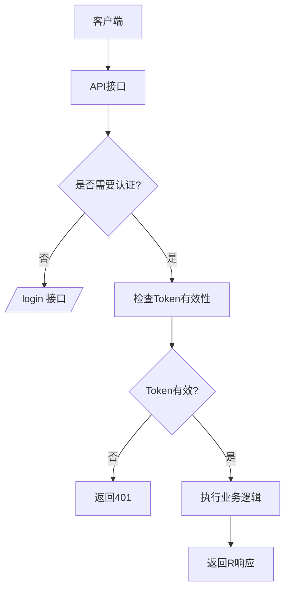
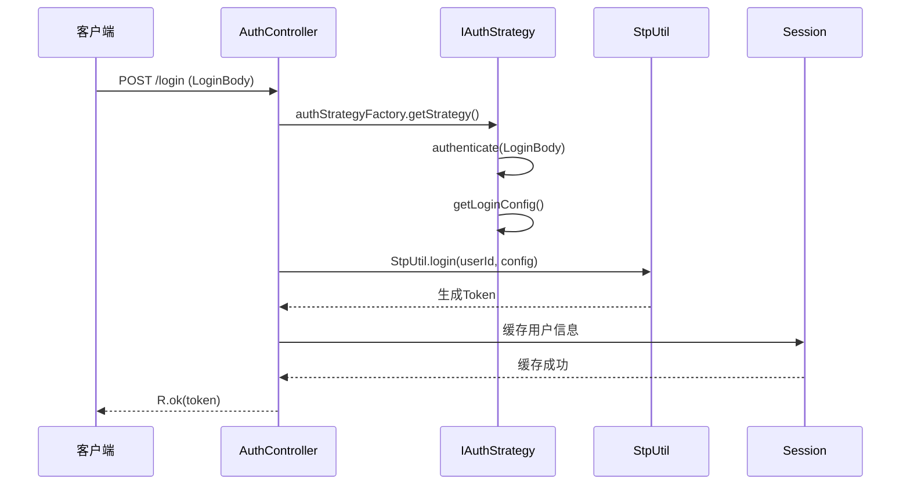
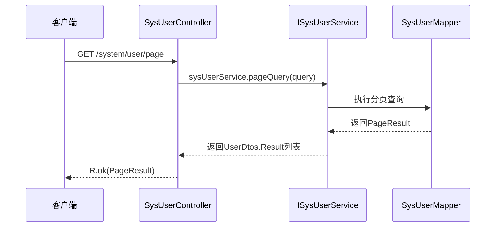

# API接口参考

<cite>
**本文档引用的文件**  
- [AuthController.java](file://verulia-admin/src/main/java/org/yann/verulia/controller/AuthController.java)
- [SysUserController.java](file://verulia-modules/verulia-system/src/main/java/org/yann/verulia/system/controller/SysUserController.java)
- [SysRoleController.java](file://verulia-modules/verulia-system/src/main/java/org/yann/verulia/system/controller/SysRoleController.java)
- [R.java](file://verulia-framework/verulia-framework-core/src/main/java/org/yann/verulia/framework/core/domain/R.java)
- [ResultCode.java](file://verulia-framework/verulia-framework-core/src/main/java/org/yann/verulia/framework/core/enums/ResultCode.java)
- [LoginBody.java](file://verulia-framework/verulia-framework-auth/src/main/java/org/yann/verulia/framework/auth/domain/LoginBody.java)
- [UserDtos.java](file://verulia-modules/verulia-system/src/main/java/org/yann/verulia/system/domain/dto/UserDtos.java)
- [RoleDtos.java](file://verulia-modules/verulia-system/src/main/java/org/yann/verulia/system/domain/dto/RoleDtos.java)
- [SecurityConfig.java](file://verulia-framework/verulia-framework-security/src/main/java/org/yann/verulia/framework/security/config/SecurityConfig.java)
- [StpInterfaceImpl.java](file://verulia-modules/verulia-system/src/main/java/org/yann/verulia/system/service/security/StpInterfaceImpl.java)
</cite>

## 目录
1. [简介](#简介)
2. [统一响应设计](#统一响应设计)
3. [认证接口](#认证接口)
4. [用户管理接口](#用户管理接口)
5. [角色管理接口](#角色管理接口)
6. [安全约束](#安全约束)
7. [调用示例](#调用示例)
8. [常见场景序列图](#常见场景序列图)

## 简介

Verulia系统提供了一套完整的公共API接口，用于支持系统的认证、用户管理和角色管理功能。本文档详细描述了`AuthController`、`SysUserController`和`SysRoleController`三个核心控制器所提供的所有公共API端点。

这些接口遵循RESTful设计原则，使用JSON作为数据交换格式，并通过统一的响应结构`R<T>`封装所有响应结果。所有接口均基于Sa-Token实现身份认证与权限控制。

**Section sources**
- [AuthController.java](file://verulia-admin/src/main/java/org/yann/verulia/controller/AuthController.java#L27-L66)
- [SysUserController.java](file://verulia-modules/verulia-system/src/main/java/org/yann/verulia/system/controller/SysUserController.java#L18-L64)
- [SysRoleController.java](file://verulia-modules/verulia-system/src/main/java/org/yann/verulia/system/controller/SysRoleController.java#L18-L64)

## 统一响应设计

Verulia系统采用`R<T>`类作为所有API接口的统一响应封装，确保前后端交互的一致性和可预测性。

### R<T> 响应结构

```java
public class R<T> implements Serializable {
    private Integer code;        // 状态码
    private String msg;          // 消息内容
    private T data;              // 数据对象
    private long timestamp;      // 时间戳
}
```

### 成功响应

通过静态方法 `R.ok()` 或 `R.ok(data)` 生成成功响应：

```java
// 无数据的成功响应
R.ok() → { "code": 200, "msg": "操作成功", "data": null, "timestamp": 1745000000000 }

// 带数据的成功响应
R.ok("token123") → { "code": 200, "msg": "操作成功", "data": "token123", "timestamp": 1745000000000 }
```

### 失败响应

通过静态方法 `R.fail()` 系列生成失败响应：

```java
// 自定义消息失败
R.fail("用户名或密码错误") → { "code": 400, "msg": "用户名或密码错误", "data": null, "timestamp": 1745000000000 }

// 使用枚举失败
R.fail(ResultCode.UN_AUTHORIZED) → { "code": 401, "msg": "请求未授权", "data": null, "timestamp": 1745000000000 }
```

### 状态码枚举

| 状态码 | 含义 | 说明 |
|--------|------|------|
| 200 | SUCCESS | 操作成功 |
| 400 | FAILURE | 业务异常 |
| 401 | UN_AUTHORIZED | 请求未授权 |
| 404 | NOT_FOUND | 接口未找到 |
| 500 | INTERNAL_SERVER_ERROR | 服务器内部错误 |

**Section sources**
- [R.java](file://verulia-framework/verulia-framework-core/src/main/java/org/yann/verulia/framework/core/domain/R.java#L17-L101)
- [ResultCode.java](file://verulia-framework/verulia-framework-core/src/main/java/org/yann/verulia/framework/core/enums/ResultCode.java#L13-L20)

## 认证接口

认证接口由`AuthController`提供，支持多种授权模式的登录。

### 登录接口

- **HTTP方法**: `POST`
- **URL路径**: `/login`
- **认证要求**: 无需Token（使用`@SaIgnore`注解忽略认证）
- **请求头**: `Content-Type: application/json`

#### 请求参数（Body）

| 参数名 | 类型 | 必填 | 说明 | 默认值 |
|--------|------|------|------|--------|
| grantType | String | 是 | 授权类型 | "password" |
| username | String | 否 | 用户名（密码模式） | - |
| password | String | 否 | 密码（密码模式） | - |
| code | String | 否 | 验证码（图形/短信） | - |
| uuid | String | 否 | 图形验证码UUID | - |
| phonenumber | String | 否 | 手机号（短信模式） | - |

#### 请求体示例

```json
{
  "grantType": "password",
  "username": "admin",
  "password": "123456"
}
```

#### 响应体格式

成功响应：
```json
{
  "code": 200,
  "msg": "操作成功",
  "data": "token字符串",
  "timestamp": 1745000000000
}
```

失败响应：
```json
{
  "code": 400,
  "msg": "用户名或密码错误",
  "data": null,
  "timestamp": 1745000000000
}
```

#### HTTP状态码

| 状态码 | 场景 |
|--------|------|
| 200 OK | 登录成功 |
| 400 Bad Request | 授权类型为空、用户名/密码错误等 |
| 500 Internal Server Error | 服务器内部异常 |

**Section sources**
- [AuthController.java](file://verulia-admin/src/main/java/org/yann/verulia/controller/AuthController.java#L37-L57)
- [LoginBody.java](file://verulia-framework/verulia-framework-auth/src/main/java/org/yann/verulia/framework/auth/domain/LoginBody.java#L15-L58)

### 登出接口

- **HTTP方法**: `POST`
- **URL路径**: `/logout`
- **认证要求**: 需要有效Token
- **请求头**: `Authorization: Bearer <token>`

#### 响应体格式

成功响应：
```json
{
  "code": 200,
  "msg": "操作成功",
  "data": null,
  "timestamp": 1745000000000
}
```

#### HTTP状态码

| 状态码 | 场景 |
|--------|------|
| 200 OK | 登出成功 |
| 401 Unauthorized | Token无效或已过期 |

**Section sources**
- [AuthController.java](file://verulia-admin/src/main/java/org/yann/verulia/controller/AuthController.java#L61-L65)

## 用户管理接口

用户管理接口由`SysUserController`提供，支持对系统用户的增删改查和分页查询。

### 分页查询用户列表

- **HTTP方法**: `GET`
- **URL路径**: `/system/user/page`
- **认证要求**: 需要有效Token
- **请求头**: `Authorization: Bearer <token>`

#### 请求参数（查询参数）

| 参数名 | 类型 | 必填 | 说明 |
|--------|------|------|------|
| pageNum | Integer | 否 | 页码（默认1） |
| pageSize | Integer | 否 | 每页数量（默认10） |
| username | String | 否 | 用户名模糊查询 |
| phone | String | 否 | 手机号查询 |
| status | Integer | 否 | 状态（0正常 1停用） |

#### 响应体格式

```json
{
  "code": 200,
  "msg": "操作成功",
  "data": {
    "list": [
      {
        "id": 1,
        "username": "admin",
        "nickname": "超级管理员",
        "email": "admin@verulia.com",
        "phone": "13800138000",
        "sex": 1,
        "status": 0,
        "createTime": "2025-01-01T00:00:00",
        "updateTime": "2025-01-01T00:00:00",
        "roleIds": [1, 2]
      }
    ],
    "total": 1,
    "pageNum": 1,
    "pageSize": 10
  },
  "timestamp": 1745000000000
}
```

#### HTTP状态码

| 状态码 | 场景 |
|--------|------|
| 200 OK | 查询成功 |
| 401 Unauthorized | 未授权访问 |
| 500 Internal Server Error | 查询失败 |

**Section sources**
- [SysUserController.java](file://verulia-modules/verulia-system/src/main/java/org/yann/verulia/system/controller/SysUserController.java#L25-L28)
- [UserDtos.java](file://verulia-modules/verulia-system/src/main/java/org/yann/verulia/system/domain/dto/UserDtos.java#L20-L26)

### 根据ID获取用户详情

- **HTTP方法**: `GET`
- **URL路径**: `/system/user/{id}`
- **认证要求**: 需要有效Token

#### 响应体格式

```json
{
  "code": 200,
  "msg": "操作成功",
  "data": {
    "id": 1,
    "username": "admin",
    "nickname": "超级管理员",
    "email": "admin@verulia.com",
    "phone": "13800138000",
    "sex": 1,
    "status": 0,
    "createTime": "2025-01-01T00:00:00",
    "updateTime": "2025-01-01T00:00:00",
    "roleIds": [1, 2]
  },
  "timestamp": 1745000000000
}
```

**Section sources**
- [SysUserController.java](file://verulia-modules/verulia-system/src/main/java/org/yann/verulia/system/controller/SysUserController.java#L33-L36)

### 新增用户

- **HTTP方法**: `POST`
- **URL路径**: `/system/user`
- **认证要求**: 需要有效Token

#### 请求体参数

| 参数名 | 类型 | 必填 | 说明 |
|--------|------|------|------|
| username | String | 是 | 用户名 |
| password | String | 是 | 密码 |
| nickname | String | 否 | 昵称 |
| email | String | 否 | 邮箱 |
| phone | String | 否 | 手机号 |
| sex | Integer | 否 | 性别（0女 1男） |
| status | Integer | 否 | 状态（0正常 1停用） |
| roleIds | List<Long> | 否 | 角色ID列表 |

#### 响应体格式

成功响应：
```json
{ "code": 200, "msg": "操作成功", "data": null, "timestamp": 1745000000000 }
```

**Section sources**
- [SysUserController.java](file://verulia-modules/verulia-system/src/main/java/org/yann/verulia/system/controller/SysUserController.java#L41-L45)
- [UserDtos.java](file://verulia-modules/verulia-system/src/main/java/org/yann/verulia/system/domain/dto/UserDtos.java#L31-L40)

### 修改用户

- **HTTP方法**: `PUT`
- **URL路径**: `/system/user`
- **认证要求**: 需要有效Token

#### 请求体参数

| 参数名 | 类型 | 必填 | 说明 |
|--------|------|------|------|
| id | Long | 是 | 用户ID |
| nickname | String | 否 | 昵称 |
| email | String | 否 | 邮箱 |
| phone | String | 否 | 手机号 |
| sex | Integer | 否 | 性别 |
| status | Integer | 否 | 状态 |
| roleIds | List<Long> | 否 | 角色ID列表 |

**Section sources**
- [SysUserController.java](file://verulia-modules/verulia-system/src/main/java/org/yann/verulia/system/controller/SysUserController.java#L50-L53)

### 删除用户

- **HTTP方法**: `DELETE`
- **URL路径**: `/system/user/{id}`
- **认证要求**: 需要有效Token

#### 响应体格式

```json
{ "code": 200, "msg": "操作成功", "data": null, "timestamp": 1745000000000 }
```

**Section sources**
- [SysUserController.java](file://verulia-modules/verulia-system/src/main/java/org/yann/verulia/system/controller/SysUserController.java#L59-L63)

## 角色管理接口

角色管理接口由`SysRoleController`提供，支持对系统角色的增删改查和分页查询。

### 分页查询角色列表

- **HTTP方法**: `GET`
- **URL路径**: `/system/role/page`
- **认证要求**: 需要有效Token

#### 请求参数（查询参数）

| 参数名 | 类型 | 必填 | 说明 |
|--------|------|------|------|
| pageNum | Integer | 否 | 页码 |
| pageSize | Integer | 否 | 每页数量 |
| roleName | String | 否 | 角色名称模糊查询 |
| roleKey | String | 否 | 权限字符查询 |
| status | Integer | 否 | 状态查询 |

#### 响应体格式

```json
{
  "code": 200,
  "msg": "操作成功",
  "data": {
    "list": [
      {
        "id": 1,
        "roleName": "管理员",
        "roleKey": "admin",
        "roleSort": 1,
        "status": 0,
        "createTime": "2025-01-01T00:00:00"
      }
    ],
    "total": 1,
    "pageNum": 1,
    "pageSize": 10
  },
  "timestamp": 1745000000000
}
```

**Section sources**
- [SysRoleController.java](file://verulia-modules/verulia-system/src/main/java/org/yann/verulia/system/controller/SysRoleController.java#L25-L28)
- [RoleDtos.java](file://verulia-modules/verulia-system/src/main/java/org/yann/verulia/system/domain/dto/RoleDtos.java#L18-L42)

### 根据ID获取角色详情

- **HTTP方法**: `GET`
- **URL路径**: `/system/role/{id}`
- **认证要求**: 需要有效Token

**Section sources**
- [SysRoleController.java](file://verulia-modules/verulia-system/src/main/java/org/yann/verulia/system/controller/SysRoleController.java#L33-L36)

### 新增角色

- **HTTP方法**: `POST`
- **URL路径**: `/system/role`
- **认证要求**: 需要有效Token

#### 请求体参数

| 参数名 | 类型 | 必填 | 说明 |
|--------|------|------|------|
| roleName | String | 是 | 角色名称 |
| roleKey | String | 是 | 权限字符 |
| roleSort | Integer | 否 | 显示顺序 |
| status | Integer | 否 | 状态（0正常 1停用） |

**Section sources**
- [SysRoleController.java](file://verulia-modules/verulia-system/src/main/java/org/yann/verulia/system/controller/SysRoleController.java#L41-L45)
- [RoleDtos.java](file://verulia-modules/verulia-system/src/main/java/org/yann/verulia/system/domain/dto/RoleDtos.java#L47-L52)

### 修改角色

- **HTTP方法**: `PUT`
- **URL路径**: `/system/role`
- **认证要求**: 需要有效Token

#### 请求体参数

| 参数名 | 类型 | 必填 | 说明 |
|--------|------|------|------|
| id | Long | 是 | 角色ID |
| roleName | String | 是 | 角色名称 |
| roleKey | String | 是 | 权限字符 |
| roleSort | Integer | 否 | 显示顺序 |
| status | Integer | 否 | 状态 |

**Section sources**
- [SysRoleController.java](file://verulia-modules/verulia-system/src/main/java/org/yann/verulia/system/controller/SysRoleController.java#L50-L53)

### 删除角色

- **HTTP方法**: `DELETE`
- **URL路径**: `/system/role/{id}`
- **认证要求**: 需要有效Token

**Section sources**
- [SysRoleController.java](file://verulia-modules/verulia-system/src/main/java/org/yann/verulia/system/controller/SysRoleController.java#L59-L63)

## 安全约束

Verulia系统使用Sa-Token框架实现全面的安全控制。

### 认证机制

- 所有接口默认需要Token认证（通过`SecurityConfig`全局拦截器实现）
- 仅`/login`接口通过`@SaIgnore`注解豁免认证
- Token通过`Authorization: Bearer <token>`头传递

### 权限控制

- 系统通过`StpInterfaceImpl`实现角色权限加载
- 用户角色通过`SysUserRole`关联表维护
- 角色权限字符（roleKey）作为Sa-Token的角色标识
- 未来可扩展基于`roleKey`的细粒度权限控制



**Diagram sources**
- [SecurityConfig.java](file://verulia-framework/verulia-framework-security/src/main/java/org/yann/verulia/framework/security/config/SecurityConfig.java#L24-L27)
- [StpInterfaceImpl.java](file://verulia-modules/verulia-system/src/main/java/org/yann/verulia/system/service/security/StpInterfaceImpl.java#L23-L70)

## 调用示例

### curl命令示例

#### 登录获取Token

```bash
curl -X POST http://localhost:8080/login \
  -H "Content-Type: application/json" \
  -d '{
    "grantType": "password",
    "username": "admin",
    "password": "123456"
  }'
```

#### 使用Token查询用户

```bash
curl -X GET http://localhost:8080/system/user/page \
  -H "Authorization: Bearer token123"
```

#### 新增用户

```bash
curl -X POST http://localhost:8080/system/user \
  -H "Authorization: Bearer token123" \
  -H "Content-Type: application/json" \
  -d '{
    "username": "test",
    "password": "123456",
    "nickname": "测试用户"
  }'
```

### Postman收藏集建议

建议创建以下文件夹结构：

```
Verulia API
├── 认证
│   ├── 用户登录
│   └── 用户登出
├── 用户管理
│   ├── 分页查询
│   ├── 获取详情
│   ├── 新增用户
│   ├── 修改用户
│   └── 删除用户
└── 角色管理
    ├── 分页查询
    ├── 获取详情
    ├── 新增角色
    ├── 修改角色
    └── 删除角色
```

为每个请求设置：
- 正确的HTTP方法和URL
- `Content-Type: application/json`头
- 认证Token（使用Postman环境变量）
- 示例请求体
- 预期响应说明

## 常见场景序列图

### 用户登录流程



**Diagram sources**
- [AuthController.java](file://verulia-admin/src/main/java/org/yann/verulia/controller/AuthController.java#L37-L57)

### 分页查询用户流程



**Diagram sources**
- [SysUserController.java](file://verulia-modules/verulia-system/src/main/java/org/yann/verulia/system/controller/SysUserController.java#L25-L28)