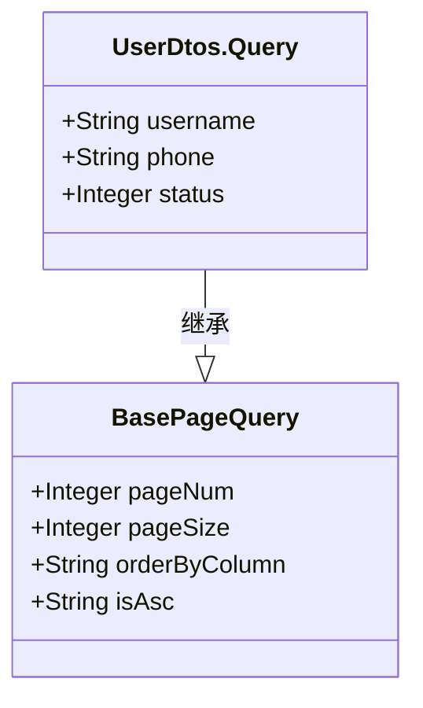
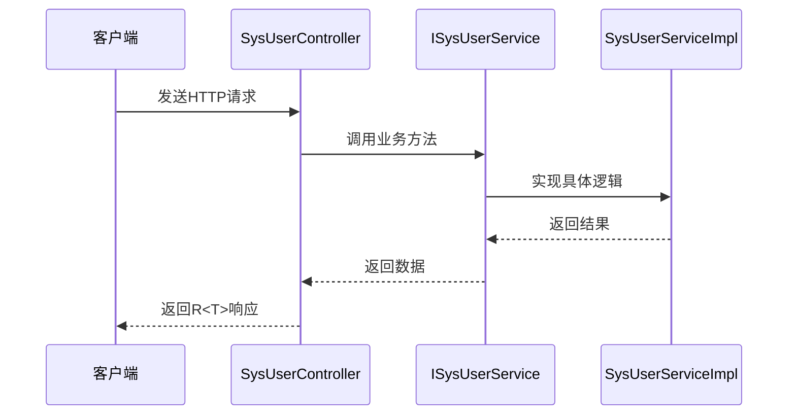

# 用户管理接口

<cite>
**本文档引用的文件**  
- [SysUserController.java](file://verulia-modules/verulia-system/src/main/java/org/yann/verulia/system/controller/SysUserController.java)
- [UserDtos.java](file://verulia-modules/verulia-system/src/main/java/org/yann/verulia/system/domain/dto/UserDtos.java)
- [R.java](file://verulia-framework/verulia-framework-core/src/main/java/org/yann/verulia/framework/core/domain/R.java)
- [BasePageQuery.java](file://verulia-framework/verulia-framework-core/src/main/java/org/yann/verulia/framework/core/domain/BasePageQuery.java)
- [PageResult.java](file://verulia-framework/verulia-framework-core/src/main/java/org/yann/verulia/framework/core/domain/PageResult.java)
- [ISysUserService.java](file://verulia-modules/verulia-system/src/main/java/org/yann/verulia/system/service/ISysUserService.java)
- [SysUserServiceImpl.java](file://verulia-modules/verulia-system/src/main/java/org/yann/verulia/system/service/impl/SysUserServiceImpl.java)
</cite>

## 目录
1. [简介](#简介)
2. [统一响应结构](#统一响应结构)
3. [分页查询用户](#分页查询用户)
4. [获取用户详情](#获取用户详情)
5. [新增用户](#新增用户)
6. [修改用户](#修改用户)
7. [删除用户](#删除用户)
8. [核心数据结构](#核心数据结构)
9. [依赖注入与服务调用流程](#依赖注入与服务调用流程)
10. [权限控制](#权限控制)
11. [常见业务异常](#常见业务异常)
12. [Postman请求示例](#postman请求示例)

## 简介
本文档详细描述了 `SysUserController` 中提供的用户管理接口，涵盖五个核心端点：分页查询、获取详情、新增、修改和删除用户。所有接口均采用统一响应结构 `R<T>`，并遵循 RESTful 设计规范。接口通过 `ISysUserService` 实现业务逻辑，支持分页、权限校验及数据一致性保障。

**Section sources**
- [SysUserController.java](file://verulia-modules/verulia-system/src/main/java/org/yann/verulia/system/controller/SysUserController.java#L1-L65)

## 统一响应结构
所有接口返回统一格式的响应体 `R<T>`，封装状态码、消息和数据，确保前端处理一致性。

```mermaid
classDiagram
class R<T> {
+Integer code
+String msg
+T data
+long timestamp
+static <T> R<T> ok()
+static <T> R<T> ok(T data)
+static <T> R<T> fail(String msg)
}
```

**Diagram sources**
- [R.java](file://verulia-framework/verulia-framework-core/src/main/java/org/yann/verulia/framework/core/domain/R.java#L1-L101)

## 分页查询用户
### 接口信息
- **HTTP方法**: `GET`
- **完整路径**: `/system/user/page`
- **权限要求**: 无需管理员权限

### 参数说明
| 类型 | 参数名 | 类型 | 必填 | 说明 |
|------|--------|------|------|------|
| 查询参数 | pageNum | Integer | 否 | 当前页码，默认为1 |
| 查询参数 | pageSize | Integer | 否 | 每页条数，默认为10 |
| 查询参数 | orderByColumn | String | 否 | 排序字段 |
| 查询参数 | isAsc | String | 否 | 排序方式（asc/desc） |
| 查询参数 | username | String | 否 | 用户名模糊匹配 |
| 查询参数 | phone | String | 否 | 手机号模糊匹配 |
| 查询参数 | status | Integer | 否 | 用户状态（0-停用，1-正常） |

### 请求示例
```
GET /system/user/page?pageNum=1&pageSize=10&username=admin
```

### 响应结构
```json
{
  "code": 200,
  "msg": "操作成功",
  "data": {
    "rows": [
      {
        "id": 1,
        "username": "admin",
        "nickname": "超级管理员",
        "email": "admin@example.com",
        "phone": "13800138000",
        "sex": 1,
        "status": 1,
        "createTime": "2024-01-01T00:00:00",
        "updateTime": "2024-01-01T00:00:00",
        "roleIds": [1, 2]
      }
    ],
    "total": 1
  },
  "timestamp": 1712345678901
}
```

**Section sources**
- [SysUserController.java](file://verulia-modules/verulia-system/src/main/java/org/yann/verulia/system/controller/SysUserController.java#L25-L28)
- [UserDtos.java](file://verulia-modules/verulia-system/src/main/java/org/yann/verulia/system/domain/dto/UserDtos.java#L20-L26)

## 获取用户详情
### 接口信息
- **HTTP方法**: `GET`
- **完整路径**: `/system/user/{id}`
- **权限要求**: 无需管理员权限

### 参数说明
| 类型 | 参数名 | 类型 | 必填 | 说明 |
|------|--------|------|------|------|
| 路径参数 | id | Long | 是 | 用户ID |

### 请求示例
```
GET /system/user/1
```

### 响应结构
```json
{
  "code": 200,
  "msg": "操作成功",
  "data": {
    "id": 1,
    "username": "admin",
    "nickname": "超级管理员",
    "email": "admin@example.com",
    "phone": "13800138000",
    "sex": 1,
    "status": 1,
    "createTime": "2024-01-01T00:00:00",
    "updateTime": "2024-01-01T00:00:00",
    "roleIds": [1, 2]
  },
  "timestamp": 1712345678901
}
```

**Section sources**
- [SysUserController.java](file://verulia-modules/verulia-system/src/main/java/org/yann/verulia/system/controller/SysUserController.java#L33-L36)
- [UserDtos.java](file://verulia-modules/verulia-system/src/main/java/org/yann/verulia/system/domain/dto/UserDtos.java#L58-L97)

## 新增用户
### 接口信息
- **HTTP方法**: `POST`
- **完整路径**: `/system/user`
- **权限要求**: 需管理员权限

### 请求体结构（UserDtos.Create）
| 字段 | 类型 | 必填 | 说明 |
|------|------|------|------|
| username | String | 是 | 用户名 |
| password | String | 是 | 密码 |
| nickname | String | 否 | 昵称 |
| email | String | 否 | 邮箱 |
| phone | String | 否 | 手机号 |
| sex | Integer | 否 | 性别（0-女，1-男） |
| status | Integer | 否 | 状态（0-停用，1-正常） |
| roleIds | List<Long> | 否 | 角色ID列表 |

### 请求示例
```json
{
  "username": "testuser",
  "password": "123456",
  "nickname": "测试用户",
  "email": "test@example.com",
  "phone": "13800138001",
  "sex": 1,
  "status": 1,
  "roleIds": [3]
}
```

### 响应结构
```json
{
  "code": 200,
  "msg": "操作成功",
  "data": null,
  "timestamp": 1712345678901
}
```

**Section sources**
- [SysUserController.java](file://verulia-modules/verulia-system/src/main/java/org/yann/verulia/system/controller/SysUserController.java#L41-L45)
- [UserDtos.java](file://verulia-modules/verulia-system/src/main/java/org/yann/verulia/system/domain/dto/UserDtos.java#L31-L40)

## 修改用户
### 接口信息
- **HTTP方法**: `PUT`
- **完整路径**: `/system/user`
- **权限要求**: 需管理员权限

### 请求体结构（UserDtos.Update）
| 字段 | 类型 | 必填 | 说明 |
|------|------|------|------|
| id | Long | 是 | 用户ID |
| nickname | String | 否 | 昵称 |
| email | String | 否 | 邮箱 |
| phone | String | 否 | 手机号 |
| sex | Integer | 否 | 性别（0-女，1-男） |
| status | Integer | 否 | 状态（0-停用，1-正常） |
| roleIds | List<Long> | 否 | 角色ID列表 |

### 请求示例
```json
{
  "id": 1,
  "nickname": "更新昵称",
  "email": "updated@example.com",
  "phone": "13800138002",
  "sex": 0,
  "status": 1,
  "roleIds": [1, 3]
}
```

### 响应结构
```json
{
  "code": 200,
  "msg": "操作成功",
  "data": null,
  "timestamp": 1712345678901
}
```

**Section sources**
- [SysUserController.java](file://verulia-modules/verulia-system/src/main/java/org/yann/verulia/system/controller/SysUserController.java#L50-L54)
- [UserDtos.java](file://verulia-modules/verulia-system/src/main/java/org/yann/verulia/system/domain/dto/UserDtos.java#L45-L53)

## 删除用户
### 接口信息
- **HTTP方法**: `DELETE`
- **完整路径**: `/system/user/{id}`
- **权限要求**: 需管理员权限

### 参数说明
| 类型 | 参数名 | 类型 | 必填 | 说明 |
|------|--------|------|------|------|
| 路径参数 | id | Long | 是 | 用户ID |

### 请求示例
```
DELETE /system/user/1
```

### 响应结构
```json
{
  "code": 200,
  "msg": "操作成功",
  "data": null,
  "timestamp": 1712345678901
}
```

**Section sources**
- [SysUserController.java](file://verulia-modules/verulia-system/src/main/java/org/yann/verulia/system/controller/SysUserController.java#L59-L63)

## 核心数据结构
### BasePageQuery 继承关系
`UserDtos.Query` 继承自 `BasePageQuery`，实现分页参数复用。



**Diagram sources**
- [BasePageQuery.java](file://verulia-framework/verulia-framework-core/src/main/java/org/yann/verulia/framework/core/domain/BasePageQuery.java#L1-L33)
- [UserDtos.java](file://verulia-modules/verulia-system/src/main/java/org/yann/verulia/system/domain/dto/UserDtos.java#L20-L26)

### PageResult 结构
通用分页响应对象，包含数据列表和总记录数。

```mermaid
classDiagram
class PageResult<T> {
+List<T> rows
+long total
+static <T> PageResult<T> empty()
+static <T> PageResult<T> of(List<T>, long)
}
```

**Diagram sources**
- [PageResult.java](file://verulia-framework/verulia-framework-core/src/main/java/org/yann/verulia/framework/core/domain/PageResult.java#L1-L36)

## 依赖注入与服务调用流程
控制器通过构造函数注入 `ISysUserService`，实现业务逻辑解耦。



**Diagram sources**
- [SysUserController.java](file://verulia-modules/verulia-system/src/main/java/org/yann/verulia/system/controller/SysUserController.java#L20-L21)
- [ISysUserService.java](file://verulia-modules/verulia-system/src/main/java/org/yann/verulia/system/service/ISysUserService.java)
- [SysUserServiceImpl.java](file://verulia-modules/verulia-system/src/main/java/org/yann/verulia/system/service/impl/SysUserServiceImpl.java)

## 权限控制
- **GET /system/user/page**: 无需管理员权限
- **GET /system/user/{id}**: 无需管理员权限
- **POST /system/user**: 需管理员权限
- **PUT /system/user**: 需管理员权限
- **DELETE /system/user/{id}**: 需管理员权限

权限由 Sa-Token 框架在 `SecurityConfig` 中统一配置，通过注解或拦截器实现。

**Section sources**
- [SysUserController.java](file://verulia-modules/verulia-system/src/main/java/org/yann/verulia/system/controller/SysUserController.java)
- [SecurityConfig.java](file://verulia-framework/verulia-framework-security/src/main/java/org/yann/verulia/framework/security/config/SecurityConfig.java)

## 常见业务异常
| 异常场景 | 错误码 | 错误消息 | 处理建议 |
|--------|--------|--------|--------|
| 用户已存在 | 500 | 用户名已存在 | 更换用户名重试 |
| 删除失败 | 500 | 删除用户失败 | 检查用户是否被引用 |
| 用户不存在 | 500 | 用户不存在 | 核对用户ID |
| 参数校验失败 | 400 | 请求参数错误 | 检查JSON格式和必填字段 |

异常由 `GlobalExceptionHandler` 统一捕获并返回 `R.fail()` 响应。

**Section sources**
- [GlobalExceptionHandler.java](file://verulia-framework/verulia-framework-web/src/main/java/org/yann/verulia/framework/web/handler/GlobalExceptionHandler.java)
- [BusinessException.java](file://verulia-framework/verulia-framework-core/src/main/java/org/yann/verulia/framework/core/exception/BusinessException.java)

## Postman请求示例
### 分页查询
```http
GET /system/user/page?pageNum=1&pageSize=10&username=admin HTTP/1.1
Host: localhost:8080
Content-Type: application/json
```

### 新增用户
```http
POST /system/user HTTP/1.1
Host: localhost:8080
Content-Type: application/json
Authorization: Bearer {token}

{
  "username": "newuser",
  "password": "123456",
  "nickname": "新用户",
  "email": "new@example.com",
  "phone": "13800138003",
  "sex": 1,
  "status": 1,
  "roleIds": [4]
}
```

**Section sources**
- [SysUserController.java](file://verulia-modules/verulia-system/src/main/java/org/yann/verulia/system/controller/SysUserController.java)
- [UserDtos.java](file://verulia-modules/verulia-system/src/main/java/org/yann/verulia/system/domain/dto/UserDtos.java)