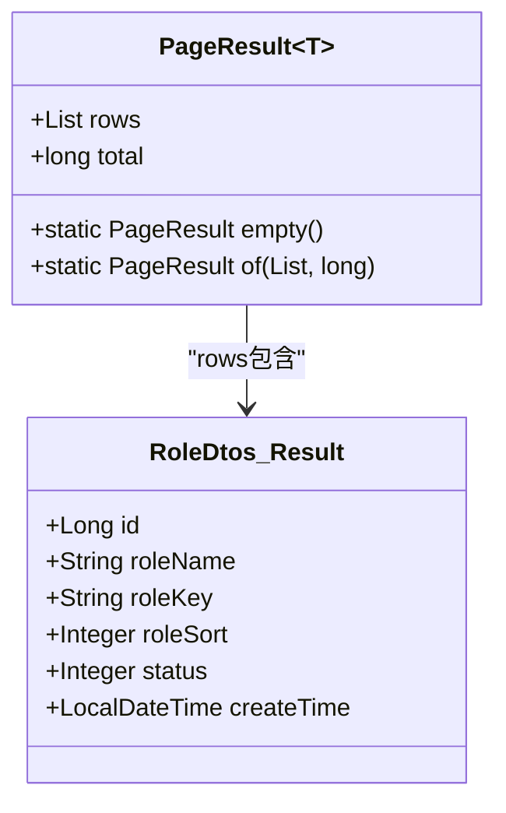
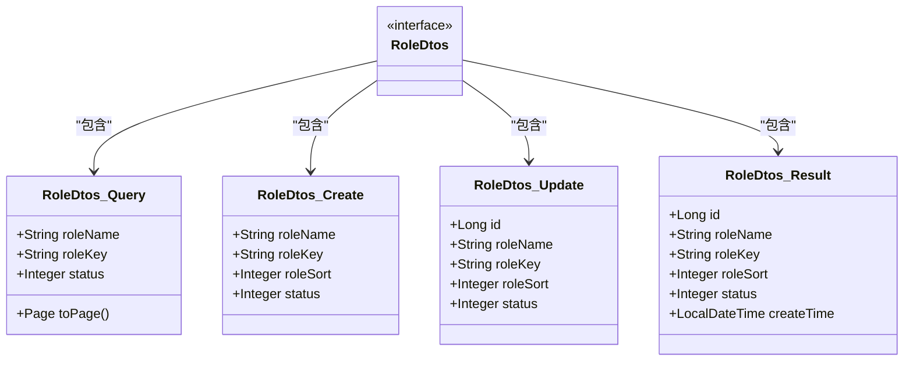
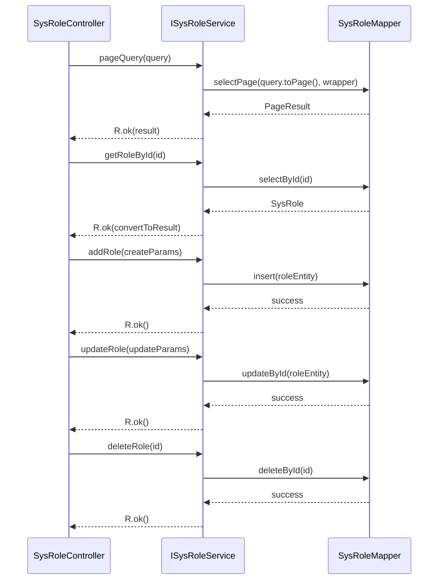

# 角色管理接口

<cite>
**本文档引用的文件**  
- [SysRoleController.java](file://verulia-modules/verulia-system/src/main/java/org/yann/verulia/system/controller/SysRoleController.java)
- [RoleDtos.java](file://verulia-modules/verulia-system/src/main/java/org/yann/verulia/system/domain/dto/RoleDtos.java)
- [ISysRoleService.java](file://verulia-modules/verulia-system/src/main/java/org/yann/verulia/system/service/ISysRoleService.java)
- [R.java](file://verulia-framework/verulia-framework-core/src/main/java/org/yann/verulia/framework/core/domain/R.java)
- [PageResult.java](file://verulia-framework/verulia-framework-core/src/main/java/org/yann/verulia/framework/core/domain/PageResult.java)
</cite>

## 目录
1. [简介](#简介)
2. [接口概览](#接口概览)
3. [统一响应结构](#统一响应结构)
4. [分页查询角色](#分页查询角色)
5. [获取角色详情](#获取角色详情)
6. [新增角色](#新增角色)
7. [修改角色](#修改角色)
8. [删除角色](#删除角色)
9. [DTO设计说明](#dto设计说明)
10. [服务层实现逻辑](#服务层实现逻辑)
11. [使用示例](#使用示例)
12. [权限与异常处理](#权限与异常处理)

## 简介
本API文档详细描述了系统角色管理模块提供的RESTful接口。所有接口均遵循统一的设计风格，使用`R<T>`作为统一响应封装，并通过`RoleDtos`中的数据传输对象（DTO）实现前后端数据隔离。控制器`SysRoleController`提供了完整的角色生命周期管理功能。

**Section sources**  
- [SysRoleController.java](file://verulia-modules/verulia-system/src/main/java/org/yann/verulia/system/controller/SysRoleController.java#L1-L65)

## 接口概览
角色管理模块提供以下核心接口：

| 接口名称 | HTTP方法 | URL路径 | 请求体 | 响应类型 |
|--------|--------|--------|--------|--------|
| 分页查询角色 | GET | `/system/role/page` | 无 | `R<PageResult<RoleDtos.Result>>` |
| 获取角色详情 | GET | `/system/role/{id}` | 无 | `R<RoleDtos.Result>` |
| 新增角色 | POST | `/system/role` | `RoleDtos.Create` | `R<Void>` |
| 修改角色 | PUT | `/system/role` | `RoleDtos.Update` | `R<Void>` |
| 删除角色 | DELETE | `/system/role/{id}` | 无 | `R<Void>` |

## 统一响应结构
所有接口均使用`R<T>`作为统一响应封装，确保前后端交互格式一致。

```mermaid
classDiagram
class R~T~ {
+Integer code
+String msg
+T data
+long timestamp
+static <T> R<T> ok()
+static <T> R<T> ok(T data)
+static <T> R<T> fail(String msg)
}
note right of R~T~
统一响应实体
code : 状态码
msg : 消息内容
data : 数据对象
timestamp : 时间戳
end note
```

**Diagram sources**  
- [R.java](file://verulia-framework/verulia-framework-core/src/main/java/org/yann/verulia/framework/core/domain/R.java#L1-L101)

**Section sources**  
- [R.java](file://verulia-framework/verulia-framework-core/src/main/java/org/yann/verulia/framework/core/domain/R.java#L1-L101)

## 分页查询角色
### 接口信息
- **HTTP方法**: GET
- **URL路径**: `/system/role/page`
- **权限要求**: 需具备角色管理权限

### 查询参数（Query Parameters）
| 参数名 | 类型 | 必填 | 说明 |
|-------|------|------|------|
| roleName | String | 否 | 角色名称，模糊匹配 |
| roleKey | String | 否 | 权限字符，精确匹配 |
| status | Integer | 否 | 状态（0:停用, 1:正常） |
| pageNum | Integer | 是 | 当前页码 |
| pageSize | Integer | 是 | 每页数量 |

### 响应数据
成功响应返回 `R<PageResult<RoleDtos.Result>>` 类型数据。



**Diagram sources**  
- [PageResult.java](file://verulia-framework/verulia-framework-core/src/main/java/org/yann/verulia/framework/core/domain/PageResult.java#L1-L36)
- [RoleDtos.java](file://verulia-modules/verulia-system/src/main/java/org/yann/verulia/system/domain/dto/RoleDtos.java#L68-L75)

**Section sources**  
- [SysRoleController.java](file://verulia-modules/verulia-system/src/main/java/org/yann/verulia/system/controller/SysRoleController.java#L25-L28)
- [RoleDtos.java](file://verulia-modules/verulia-system/src/main/java/org/yann/verulia/system/domain/dto/RoleDtos.java#L21-L42)
- [ISysRoleService.java](file://verulia-modules/verulia-system/src/main/java/org/yann/verulia/system/service/ISysRoleService.java#L21-L21)

## 获取角色详情
### 接口信息
- **HTTP方法**: GET
- **URL路径**: `/system/role/{id}`
- **权限要求**: 需具备角色管理权限

### 路径参数（Path Variables）
| 参数名 | 类型 | 必填 | 说明 |
|-------|------|------|------|
| id | Long | 是 | 角色ID |

### 响应数据
成功响应返回 `R<RoleDtos.Result>` 类型数据，包含角色完整信息。

**Section sources**  
- [SysRoleController.java](file://verulia-modules/verulia-system/src/main/java/org/yann/verulia/system/controller/SysRoleController.java#L33-L36)
- [ISysRoleService.java](file://verulia-modules/verulia-system/src/main/java/org/yann/verulia/system/service/ISysRoleService.java#L29-L29)

## 新增角色
### 接口信息
- **HTTP方法**: POST
- **URL路径**: `/system/role`
- **权限要求**: 需具备角色管理权限

### 请求体（Request Body）
请求体为 `RoleDtos.Create` 对象：

| 字段名 | 类型 | 必填 | 说明 |
|-------|------|------|------|
| roleName | String | 是 | 角色名称 |
| roleKey | String | 是 | 权限字符 |
| roleSort | Integer | 是 | 显示顺序 |
| status | Integer | 是 | 状态（0:停用, 1:正常） |

### 响应数据
成功响应返回 `R<Void>`，表示操作成功。

**Section sources**  
- [SysRoleController.java](file://verulia-modules/verulia-system/src/main/java/org/yann/verulia/system/controller/SysRoleController.java#L41-L45)
- [RoleDtos.java](file://verulia-modules/verulia-system/src/main/java/org/yann/verulia/system/domain/dto/RoleDtos.java#L47-L52)
- [ISysRoleService.java](file://verulia-modules/verulia-system/src/main/java/org/yann/verulia/system/service/ISysRoleService.java#L36-L36)

## 修改角色
### 接口信息
- **HTTP方法**: PUT
- **URL路径**: `/system/role`
- **权限要求**: 需具备角色管理权限

### 请求体（Request Body）
请求体为 `RoleDtos.Update` 对象：

| 字段名 | 类型 | 必填 | 说明 |
|-------|------|------|------|
| id | Long | 是 | 角色ID |
| roleName | String | 是 | 角色名称 |
| roleKey | String | 是 | 权限字符 |
| roleSort | Integer | 是 | 显示顺序 |
| status | Integer | 是 | 状态（0:停用, 1:正常） |

### 响应数据
成功响应返回 `R<Void>`，表示操作成功。

**Section sources**  
- [SysRoleController.java](file://verulia-modules/verulia-system/src/main/java/org/yann/verulia/system/controller/SysRoleController.java#L50-L54)
- [RoleDtos.java](file://verulia-modules/verulia-system/src/main/java/org/yann/verulia/system/domain/dto/RoleDtos.java#L57-L63)
- [ISysRoleService.java](file://verulia-modules/verulia-system/src/main/java/org/yann/verulia/system/service/ISysRoleService.java#L43-L43)

## 删除角色
### 接口信息
- **HTTP方法**: DELETE
- **URL路径**: `/system/role/{id}`
- **权限要求**: 需具备角色管理权限

### 路径参数（Path Variables）
| 参数名 | 类型 | 必填 | 说明 |
|-------|------|------|------|
| id | Long | 是 | 角色ID |

### 响应数据
成功响应返回 `R<Void>`，表示操作成功。

**Section sources**  
- [SysRoleController.java](file://verulia-modules/verulia-system/src/main/java/org/yann/verulia/system/controller/SysRoleController.java#L59-L63)
- [ISysRoleService.java](file://verulia-modules/verulia-system/src/main/java/org/yann/verulia/system/service/ISysRoleService.java#L50-L50)

## DTO设计说明
`RoleDtos`接口内嵌了多个record类，用于不同场景的数据传输：



**Diagram sources**  
- [RoleDtos.java](file://verulia-modules/verulia-system/src/main/java/org/yann/verulia/system/domain/dto/RoleDtos.java#L16-L76)

**Section sources**  
- [RoleDtos.java](file://verulia-modules/verulia-system/src/main/java/org/yann/verulia/system/domain/dto/RoleDtos.java#L16-L76)

## 服务层实现逻辑
`ISysRoleService`接口定义了角色管理的核心业务逻辑，其主要方法包括：



**Diagram sources**  
- [ISysRoleService.java](file://verulia-modules/verulia-system/src/main/java/org/yann/verulia/system/service/ISysRoleService.java#L13-L52)
- [SysRoleController.java](file://verulia-modules/verulia-system/src/main/java/org/yann/verulia/system/controller/SysRoleController.java#L20-L21)

**Section sources**  
- [ISysRoleService.java](file://verulia-modules/verulia-system/src/main/java/org/yann/verulia/system/service/ISysRoleService.java#L13-L52)

## 使用示例
### 分页查询角色（curl示例）
```bash
curl -X GET "http://localhost:8080/system/role/page?pageNum=1&pageSize=10&roleName=管理员" \
  -H "Authorization: Bearer your-token" \
  -H "Content-Type: application/json"
```

响应示例：
```json
{
  "code": 200,
  "msg": "操作成功",
  "data": {
    "rows": [
      {
        "id": 1,
        "roleName": "系统管理员",
        "roleKey": "admin",
        "roleSort": 1,
        "status": 1,
        "createTime": "2024-01-01T10:00:00"
      }
    ],
    "total": 1
  },
  "timestamp": 1704067200000
}
```

## 权限与异常处理
### 权限校验
所有角色管理接口均需通过SaToken权限框架进行校验，调用者必须具备相应的角色管理权限。

### 业务异常
- **删除角色时的关联约束**：若待删除角色已被用户绑定（存在`SysUserRole`关联记录），则删除操作会因外键约束或业务逻辑校验而失败，抛出`BusinessException`。
- **数据校验异常**：新增或修改角色时，若角色名称或权限字符已存在，会抛出数据重复异常。
- **参数校验异常**：请求参数不符合校验规则时，由`GlobalExceptionHandler`统一处理并返回400错误。

**Section sources**  
- [SysRoleController.java](file://verulia-modules/verulia-system/src/main/java/org/yann/verulia/system/controller/SysRoleController.java#L15-L17)
- [ISysRoleService.java](file://verulia-modules/verulia-system/src/main/java/org/yann/verulia/system/service/ISysRoleService.java#L50-L50)
- [GlobalExceptionHandler.java](file://verulia-framework/verulia-framework-web/src/main/java/org/yann/verulia/framework/web/handler/GlobalExceptionHandler.java)