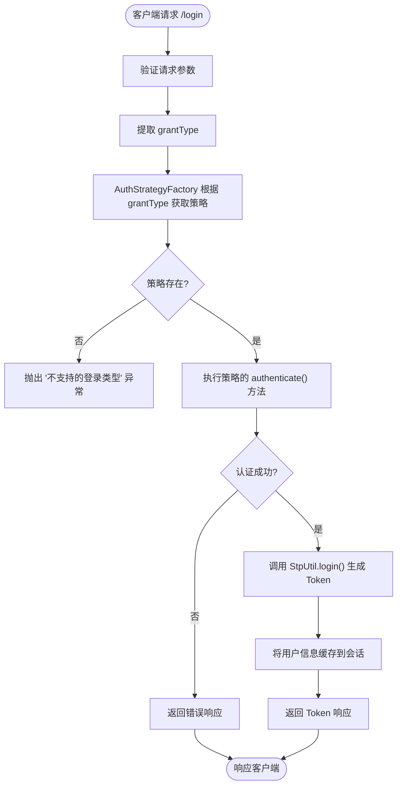
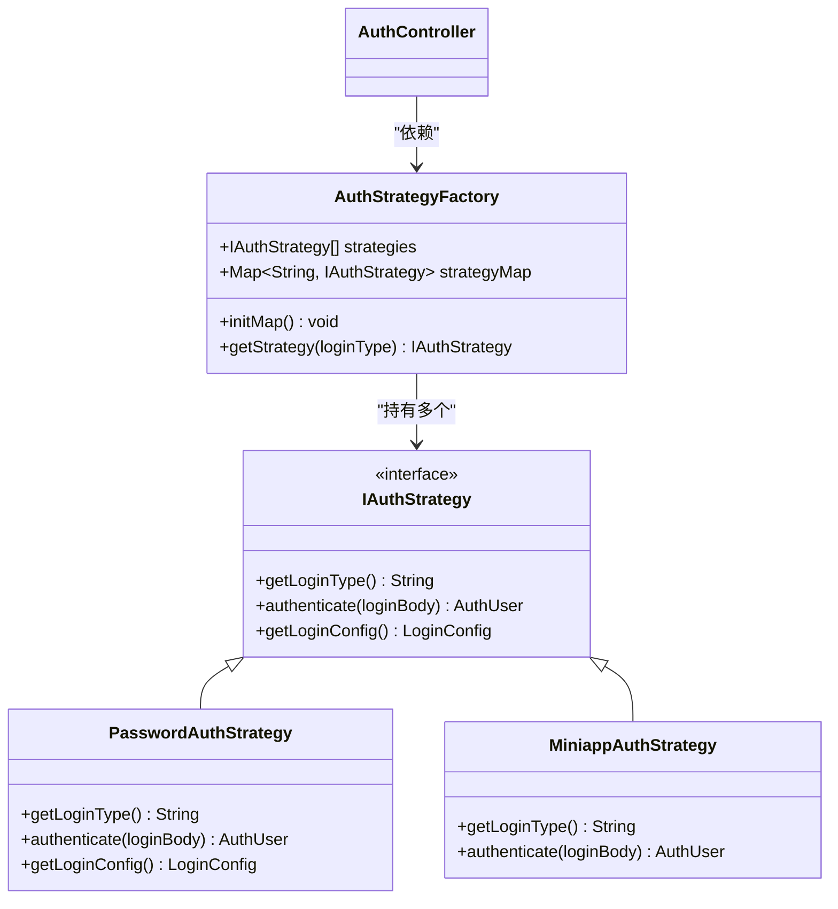
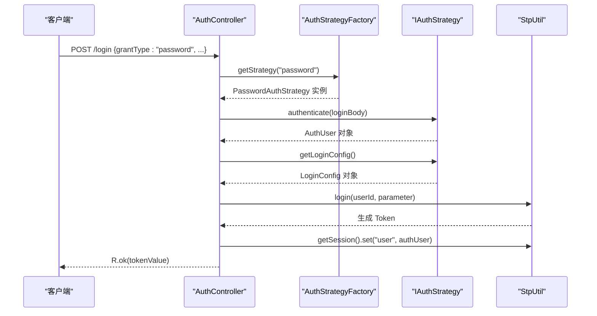

# 认证接口

<cite>
**本文档引用的文件**  
- [AuthController.java](file://verulia-admin/src/main/java/org/yann/verulia/controller/AuthController.java)
- [LoginBody.java](file://verulia-framework/verulia-framework-auth/src/main/java/org/yann/verulia/framework/auth/domain/LoginBody.java)
- [AuthStrategyFactory.java](file://verulia-framework/verulia-framework-auth/src/main/java/org/yann/verulia/framework/auth/strategy/AuthStrategyFactory.java)
- [IAuthStrategy.java](file://verulia-framework/verulia-framework-auth/src/main/java/org/yann/verulia/framework/auth/strategy/IAuthStrategy.java)
- [PasswordAuthStrategy.java](file://verulia-modules/verulia-system/src/main/java/org/yann/verulia/system/service/strategy/PasswordAuthStrategy.java)
- [MiniappAuthStrategy.java](file://verulia-modules/verulia-system/src/main/java/org/yann/verulia/system/service/strategy/MiniappAuthStrategy.java)
- [R.java](file://verulia-framework/verulia-framework-core/src/main/java/org/yann/verulia/framework/core/domain/R.java)
- [AuthUser.java](file://verulia-framework/verulia-framework-auth/src/main/java/org/yann/verulia/framework/auth/domain/AuthUser.java)
- [LoginConfig.java](file://verulia-framework/verulia-framework-auth/src/main/java/org/yann/verulia/framework/auth/domain/LoginConfig.java)
</cite>

## 目录
1. [简介](#简介)
2. [认证流程概览](#认证流程概览)
3. `/login` 接口详细说明
4. `/logout` 接口详细说明
5. 认证策略机制分析
6. 响应格式说明
7. 使用示例
8. 常见问题与错误处理

## 简介
本API文档详细说明了系统中的认证接口，重点介绍 `POST /login` 和 `POST /logout` 两个端点。文档涵盖请求结构、认证机制、响应格式及使用示例，帮助开发者理解并正确集成系统认证功能。

**Section sources**
- [AuthController.java](file://verulia-admin/src/main/java/org/yann/verulia/controller/AuthController.java#L27-L66)

## 认证流程概览
系统采用策略模式实现多方式认证，通过 `grantType` 参数动态选择认证策略。整体流程如下：



**Diagram sources**
- [AuthController.java](file://verulia-admin/src/main/java/org/yann/verulia/controller/AuthController.java#L37-L57)
- [AuthStrategyFactory.java](file://verulia-framework/verulia-framework-auth/src/main/java/org/yann/verulia/framework/auth/strategy/AuthStrategyFactory.java#L30-L49)

## /login 接口详细说明

### 基本信息
- **HTTP方法**: `POST`
- **URL路径**: `/login`
- **认证要求**: 无需Token（通过 `@SaIgnore` 注解实现）

### 请求参数
请求体为JSON格式，包含 `LoginBody` 对象，主要字段如下：

| 字段名 | 类型 | 是否必填 | 说明 |
|--------|------|----------|------|
| `grantType` | String | 是 | 授权类型，决定使用哪种认证策略 |
| `username` | String | 否 | 用户名，密码模式下必填 |
| `password` | String | 否 | 密码，密码模式下必填 |
| `code` | String | 否 | 验证码或小程序登录的code |
| `uuid` | String | 否 | 图形验证码的唯一标识 |
| `phonenumber` | String | 否 | 手机号，短信模式下使用 |

**Section sources**
- [LoginBody.java](file://verulia-framework/verulia-framework-auth/src/main/java/org/yann/verulia/framework/auth/domain/LoginBody.java#L24-L58)

### 请求体示例

#### 密码登录
```json
{
  "grantType": "password",
  "username": "admin",
  "password": "123456"
}
```

#### 小程序登录
```json
{
  "grantType": "miniapp",
  "code": "wx_login_code_from_miniprogram"
}
```

**Section sources**
- [LoginBody.java](file://verulia-framework/verulia-framework-auth/src/main/java/org/yann/verulia/framework/auth/domain/LoginBody.java#L24-L58)

## /logout 接口详细说明

### 基本信息
- **HTTP方法**: `POST`
- **URL路径**: `/logout`
- **认证要求**: 需要有效的Token（未使用 `@SaIgnore` 注解）

### 功能说明
该接口用于用户登出，调用 `StpUtil.logout()` 方法清除当前会话的登录状态。

### 响应
成功登出时返回统一的成功响应，数据体为空。

```json
{
  "code": 200,
  "msg": "操作成功",
  "data": null,
  "timestamp": 1745678901234
}
```

**Section sources**
- [AuthController.java](file://verulia-admin/src/main/java/org/yann/verulia/controller/AuthController.java#L60-L65)

## 认证策略机制分析

### 策略工厂模式
系统使用 `AuthStrategyFactory` 实现策略工厂模式，根据 `grantType` 动态选择认证策略。



**Diagram sources**
- [AuthStrategyFactory.java](file://verulia-framework/verulia-framework-auth/src/main/java/org/yann/verulia/framework/auth/strategy/AuthStrategyFactory.java#L22-L51)
- [IAuthStrategy.java](file://verulia-framework/verulia-framework-auth/src/main/java/org/yann/verulia/framework/auth/strategy/IAuthStrategy.java#L12-L36)

### 认证执行流程
当调用 `/login` 接口时，执行以下流程：



**Diagram sources**
- [AuthController.java](file://verulia-admin/src/main/java/org/yann/verulia/controller/AuthController.java#L37-L57)
- [PasswordAuthStrategy.java](file://verulia-modules/verulia-system/src/main/java/org/yann/verulia/system/service/strategy/PasswordAuthStrategy.java#L28-L82)

## 响应格式说明

### 统一响应结构
所有API响应均封装在 `R<T>` 泛型类中，结构如下：

| 字段名 | 类型 | 说明 |
|--------|------|------|
| `code` | Integer | 状态码 |
| `msg` | String | 消息内容 |
| `data` | T | 数据对象 |
| `timestamp` | Long | 时间戳 |

**Section sources**
- [R.java](file://verulia-framework/verulia-framework-core/src/main/java/org/yann/verulia/framework/core/domain/R.java#L17-L101)

### 成功响应
认证成功时，`/login` 接口返回 `R.ok()`，数据体为Token字符串。

```json
{
  "code": 200,
  "msg": "操作成功",
  "data": "sa-token-value-abc123",
  "timestamp": 1745678901234
}
```

### 失败响应
认证失败时，返回相应的错误码和消息。

```json
{
  "code": 500,
  "msg": "用户不存在或密码错误",
  "data": null,
  "timestamp": 1745678901234
}
```

## 使用示例

### 密码登录 curl 命令
```bash
curl -X POST http://localhost:8080/login \
  -H "Content-Type: application/json" \
  -d '{
    "grantType": "password",
    "username": "admin",
    "password": "123456"
  }'
```

### 代码中使用 R.ok()
在业务代码中，可以使用 `R.ok()` 方法创建成功响应：

```java
// 返回成功响应，无数据
return R.ok();

// 返回成功响应，包含数据
return R.ok("token-string");

// 返回成功响应，自定义消息
return R.ok().setMsg("登录成功");
```

**Section sources**
- [R.java](file://verulia-framework/verulia-framework-core/src/main/java/org/yann/verulia/framework/core/domain/R.java#L48-L58)
- [AuthController.java](file://verulia-admin/src/main/java/org/yann/verulia/controller/AuthController.java#L56)

## 常见问题与错误处理

### 常见错误场景

| 错误场景 | 错误消息 | 原因分析 |
|---------|--------|--------|
| 不支持的授权类型 | 不支持的登录类型: [type] | `grantType` 值未注册到 `AuthStrategyFactory` |
| 用户名或密码为空 | 用户名或密码不能为空 | 密码模式下未提供 `username` 或 `password` |
| 用户不存在或密码错误 | 用户不存在或密码错误 | 用户名不存在或密码不匹配 |
| 账号已停用 | 账号已停用 | 用户状态为停用（status=0） |
| 微信登录失败 | 微信登录失败: [error] | 调用微信API失败或未能获取OpenID |
| 认证Code为空 | 认证Code不能为空 | 小程序登录未提供 `code` 参数 |

### 错误处理机制
- `AuthStrategyFactory` 在找不到策略时抛出 `IllegalArgumentException`
- 各 `IAuthStrategy` 实现类在认证失败时抛出 `AuthException`
- 系统全局异常处理器捕获异常并返回统一的错误响应

**Section sources**
- [AuthStrategyFactory.java](file://verulia-framework/verulia-framework-auth/src/main/java/org/yann/verulia/framework/auth/strategy/AuthStrategyFactory.java#L45-L47)
- [PasswordAuthStrategy.java](file://verulia-modules/verulia-system/src/main/java/org/yann/verulia/system/service/strategy/PasswordAuthStrategy.java#L44-L63)
- [MiniappAuthStrategy.java](file://verulia-modules/verulia-system/src/main/java/org/yann/verulia/system/service/strategy/MiniappAuthStrategy.java#L51-L65)