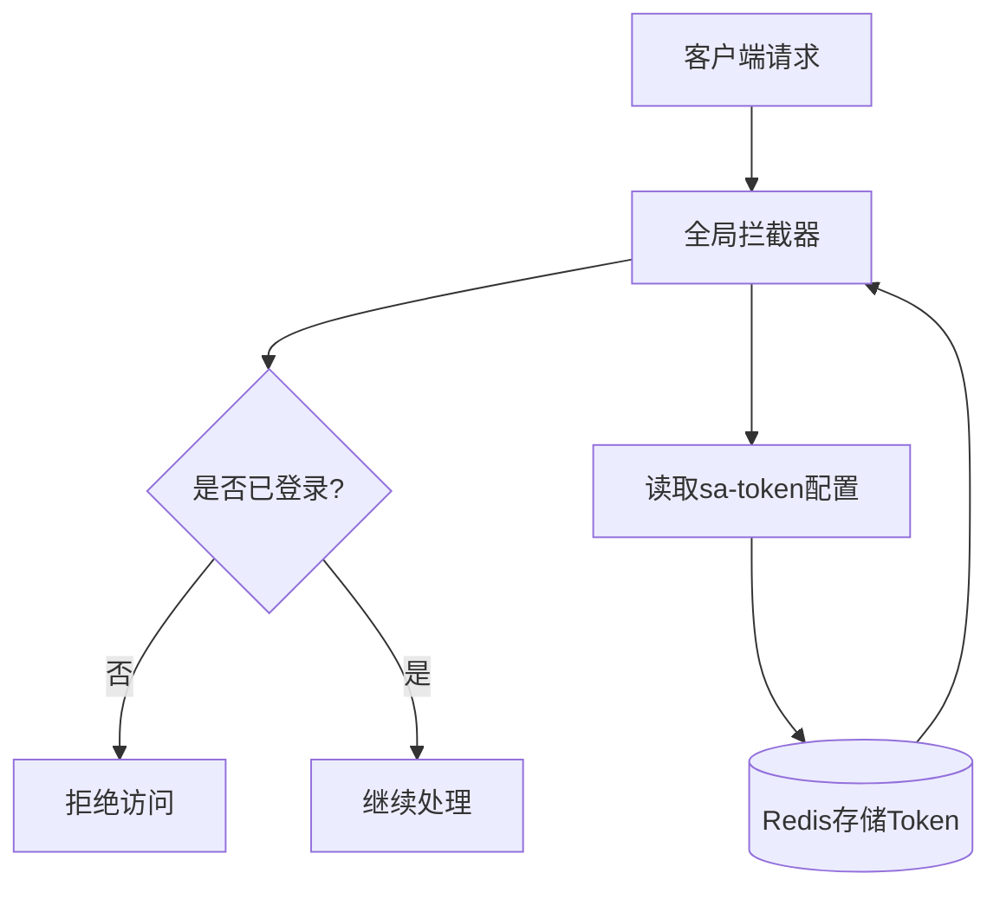
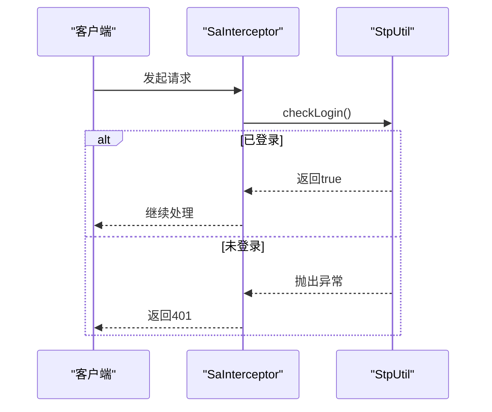
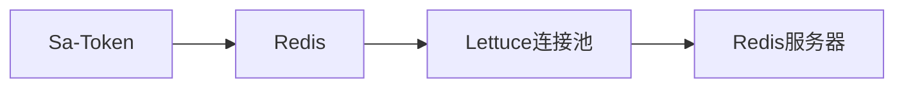

# Sa-Token配置

<cite>
**本文档引用的文件**   
- [application.yml](file://verulia-admin/src/main/resources/application.yml)
- [SecurityConfig.java](file://verulia-framework/verulia-framework-security/src/main/java/org/yann/verulia/framework/security/config/SecurityConfig.java)
- [SaTokenSecurityContext.java](file://verulia-framework/verulia-framework-security/src/main/java/org/yann/verulia/framework/security/service/SaTokenSecurityContext.java)
</cite>

## 目录
1. [简介](#简介)
2. [项目结构](#项目结构)
3. [核心组件](#核心组件)
4. [架构概述](#架构概述)
5. [详细组件分析](#详细组件分析)
6. [依赖分析](#依赖分析)
7. [性能考虑](#性能考虑)
8. [故障排除指南](#故障排除指南)
9. [结论](#结论)

## 简介
本文档详细说明了Sa-Token在Verulia系统中的配置机制。基于`application.yml`文件中`sa-token`命名空间下的配置项，结合`SecurityConfig.java`中的拦截器实现，全面解析认证令牌的管理策略、安全校验流程及最佳实践建议。

## 项目结构
Verulia系统采用模块化设计，Sa-Token相关配置主要分布在`verulia-admin`和`verulia-framework-security`两个模块中。核心配置文件位于`verulia-admin`模块的资源目录下，而安全拦截逻辑则封装在`verulia-framework-security`模块中。

```mermaid
graph TB
subgraph "verulia-admin"
app_yml["application.yml"]
app_dev_yml["application-dev.yml"]
end
subgraph "verulia-framework-security"
SecurityConfig["SecurityConfig.java"]
SaTokenSecurityContext["SaTokenSecurityContext.java"]
end
app_yml --> SecurityConfig : "提供配置参数"
SecurityConfig --> SaTokenSecurityContext : "实现安全上下文"
```

**图示来源**
- [application.yml](file://verulia-admin/src/main/resources/application.yml#L50-L69)
- [SecurityConfig.java](file://verulia-framework/verulia-framework-security/src/main/java/org/yann/verulia/framework/security/config/SecurityConfig.java#L1-L36)

**本节来源**
- [application.yml](file://verulia-admin/src/main/resources/application.yml#L50-L94)
- [SecurityConfig.java](file://verulia-framework/verulia-framework-security/src/main/java/org/yann/verulia/framework/security/config/SecurityConfig.java#L1-L36)

## 核心组件
Sa-Token的核心配置通过`application.yml`文件进行声明式定义，包括令牌名称、有效期、并发策略等关键参数。安全校验机制通过`SecurityConfig`类中的`SaInterceptor`全局拦截器实现，确保所有请求均经过登录状态验证。

**本节来源**
- [application.yml](file://verulia-admin/src/main/resources/application.yml#L50-L69)
- [SecurityConfig.java](file://verulia-framework/verulia-framework-security/src/main/java/org/yann/verulia/framework/security/config/SecurityConfig.java#L24-L28)

## 架构概述
Sa-Token在Verulia系统中作为统一的权限认证框架，通过配置驱动的方式实现灵活的令牌管理策略。系统启动时加载`sa-token`命名空间下的配置项，结合Redis作为Token存储介质，实现分布式环境下的会话一致性。



**图示来源**
- [SecurityConfig.java](file://verulia-framework/verulia-framework-security/src/main/java/org/yann/verulia/framework/security/config/SecurityConfig.java#L24-L28)
- [application.yml](file://verulia-admin/src/main/resources/application.yml#L50-L69)

## 详细组件分析

### Sa-Token配置项分析
Verulia系统通过`application.yml`文件中的`sa-token`命名空间配置认证参数：

| 配置项 | 说明 | 当前值 |
|-------|------|-------|
| **token-name** | 认证令牌的参数名或Cookie名称 | satoken |
| **token-prefix** | 令牌前缀（如Bearer） | Bearer |
| **timeout** | Token有效期（单位：秒），默认30天，-1为永久有效 | 2592000（30天） |
| **active-timeout** | 最低活跃频率，控制不活跃Token的冻结 | -1（永不冻结） |
| **is-concurrent** | 是否允许多地同时登录 | true（允许多地登录） |
| **is-share** | 多端登录时是否共享Token | false（每次登录新建Token） |
| **token-style** | Token生成策略 | uuid |
| **is-log** | 是否开启操作日志记录 | true（开启日志） |

**本节来源**
- [application.yml](file://verulia-admin/src/main/resources/application.yml#L50-L69)

### 安全拦截机制分析
`SecurityConfig`类实现了`WebMvcConfigurer`接口，通过`addInterceptors`方法注册`SaInterceptor`拦截器，对所有请求路径（`/**`）执行登录校验。



**图示来源**
- [SecurityConfig.java](file://verulia-framework/verulia-framework-security/src/main/java/org/yann/verulia/framework/security/config/SecurityConfig.java#L24-L28)
- [SaTokenSecurityContext.java](file://verulia-framework/verulia-framework-security/src/main/java/org/yann/verulia/framework/security/service/SaTokenSecurityContext.java#L1-L27)

**本节来源**
- [SecurityConfig.java](file://verulia-framework/verulia-framework-security/src/main/java/org/yann/verulia/framework/security/config/SecurityConfig.java#L24-L28)

## 依赖分析
Sa-Token的正常运行依赖于Redis作为分布式会话存储，其配置在`application.yml`的`spring.data.redis`部分定义。系统使用Lettuce连接池管理Redis连接，确保高并发场景下的性能稳定。



**图示来源**
- [application.yml](file://verulia-admin/src/main/resources/application.yml#L26-L48)
- [SecurityConfig.java](file://verulia-framework/verulia-framework-security/src/main/java/org/yann/verulia/framework/security/config/SecurityConfig.java#L4-L5)

**本节来源**
- [application.yml](file://verulia-admin/src/main/resources/application.yml#L26-L48)

## 性能考虑
- **虚拟线程兼容性**：系统已启用Spring虚拟线程（`spring.threads.virtual.enabled=true`），与Sa-Token的阻塞调用兼容良好
- **连接池配置**：Redis连接池最大活跃连接数设为200，确保高并发下的连接可用性
- **Token有效期**：30天的有效期平衡了用户体验与安全风险
- **日志输出**：生产环境中建议关闭`is-log`以减少I/O开销

## 故障排除指南
- **Token失效问题**：检查`timeout`和`active-timeout`配置是否合理
- **多端登录异常**：确认`is-concurrent`和`is-share`设置符合业务需求
- **Redis连接失败**：验证Redis主机、端口、密码配置的正确性
- **拦截器不生效**：确保`SecurityConfig`类被正确扫描并加载

**本节来源**
- [application.yml](file://verulia-admin/src/main/resources/application.yml#L50-L69)
- [SecurityConfig.java](file://verulia-framework/verulia-framework-security/src/main/java/org/yann/verulia/framework/security/config/SecurityConfig.java#L24-L28)

## 结论
Verulia系统通过Sa-Token实现了灵活、安全的认证机制。合理的配置策略结合全局拦截器，确保了系统的安全性与可用性。建议在生产环境中根据实际需求调整超时时间、关闭调试输出，并确保Redis集群的高可用性以支持Token共享。