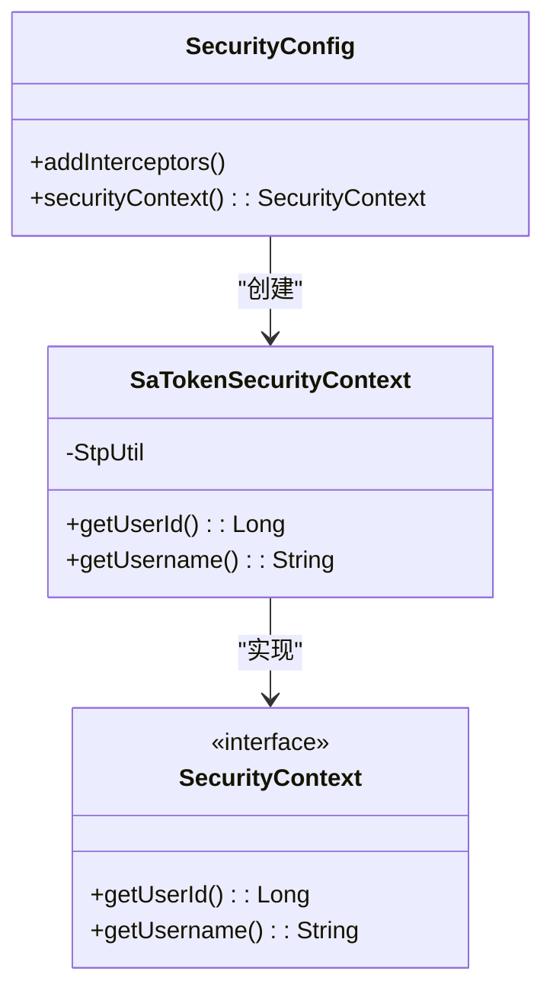
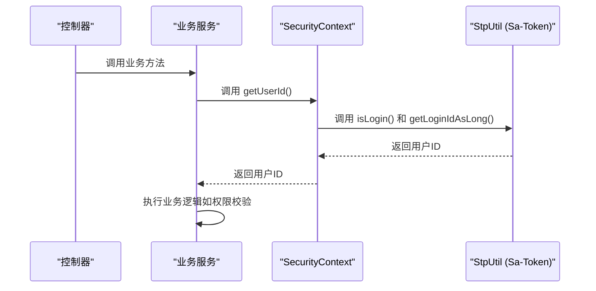

# 安全上下文管理

<cite>
**本文档引用文件**  
- [SecurityContext.java](file://verulia-framework/verulia-framework-core/src/main/java/org/yann/verulia/framework/core/service/SecurityContext.java)
- [SecurityConfig.java](file://verulia-framework/verulia-framework-security/src/main/java/org/yann/verulia/framework/security/config/SecurityConfig.java)
- [SaTokenSecurityContext.java](file://verulia-framework/verulia-framework-security/src/main/java/org/yann/verulia/framework/security/service/SaTokenSecurityContext.java)
- [SysLoginServiceImpl.java](file://verulia-modules/verulia-system/src/main/java/org/yann/verulia/system/service/impl/SysLoginServiceImpl.java)
- [AuthController.java](file://verulia-admin/src/main/java/org/yann/verulia/controller/AuthController.java)
</cite>

## 目录
1. [引言](#引言)
2. [核心组件分析](#核心组件分析)
3. [安全上下文注入机制](#安全上下文注入机制)
4. [适配层设计与实现](#适配层设计与实现)
5. [接口抽象与解耦优势](#接口抽象与解耦优势)
6. [业务层典型使用模式](#业务层典型使用模式)
7. [可测试性与单元测试建议](#可测试性与单元测试建议)
8. [总结](#总结)

## 引言
Verulia系统采用安全上下文管理机制，旨在为业务层提供统一、可扩展的安全服务访问接口。该机制通过Spring的依赖注入容器，将具体的安全框架实现（Sa-Token）进行封装，对外暴露抽象的`SecurityContext`接口，从而实现认证体系与业务逻辑的完全解耦。本文档深入分析其设计原理与实现细节。

## 核心组件分析

**图示来源**  
- [SecurityContext.java](file://verulia-framework/verulia-framework-core/src/main/java/org/yann/verulia/framework/core/service/SecurityContext.java#L9-L20)
- [SaTokenSecurityContext.java](file://verulia-framework/verulia-framework-security/src/main/java/org/yann/verulia/framework/security/service/SaTokenSecurityContext.java#L12-L27)
- [SecurityConfig.java](file://verulia-framework/verulia-framework-security/src/main/java/org/yann/verulia/framework/security/config/SecurityConfig.java#L22-L35)

**本节来源**  
- [SecurityContext.java](file://verulia-framework/verulia-framework-core/src/main/java/org/yann/verulia/framework/core/service/SecurityContext.java#L1-L21)
- [SaTokenSecurityContext.java](file://verulia-framework/verulia-framework-security/src/main/java/org/yann/verulia/framework/security/service/SaTokenSecurityContext.java#L1-L27)
- [SecurityConfig.java](file://verulia-framework/verulia-framework-security/src/main/java/org/yann/verulia/framework/security/config/SecurityConfig.java#L1-L36)

## 安全上下文注入机制

`SecurityConfig`类中的`securityContext()`方法通过`@Bean`注解将`SaTokenSecurityContext`实例注册到Spring应用上下文中。此方法返回一个实现了`SecurityContext`接口的具体对象，使得任何需要访问安全上下文信息的组件都可以通过`@Autowired`注入该接口，而无需感知底层认证框架的具体实现。

该配置类同时实现了`WebMvcConfigurer`，注册了Sa-Token的拦截器以实现全局登录校验，确保所有请求路径（除白名单外）均经过身份验证。

**本节来源**  
- [SecurityConfig.java](file://verulia-framework/verulia-framework-security/src/main/java/org/yann/verulia/framework/security/config/SecurityConfig.java#L22-L35)

## 适配层设计与实现

`SaTokenSecurityContext`作为适配层，封装了对Sa-Token框架API的直接调用。例如，`getUserId()`方法内部调用`StpUtil.getLoginIdAsLong()`获取当前登录用户的ID，并通过`StpUtil.isLogin()`确保用户已登录。这种封装屏蔽了第三方框架的API细节，向业务层提供简洁、语义清晰的方法。

尽管当前`getUsername()`方法暂未实现（返回空字符串），但其设计预留了扩展空间，未来可通过`StpUtil.getExtra()`或其他方式从会话中提取用户名信息。

**本节来源**  
- [SaTokenSecurityContext.java](file://verulia-framework/verulia-framework-security/src/main/java/org/yann/verulia/framework/security/service/SaTokenSecurityContext.java#L14-L26)

## 接口抽象与解耦优势

通过定义`SecurityContext`接口，Verulia系统实现了认证框架的完全解耦。业务代码仅依赖于该抽象接口，而非具体的`SaTokenSecurityContext`实现。这意味着未来若需替换为Spring Security、Shiro或其他认证方案，只需提供一个新的`SecurityContext`实现类，并在配置中替换Bean定义，而无需修改任何业务逻辑代码。

此设计遵循“依赖倒置原则”，提升了系统的可维护性和技术演进的灵活性。

**本节来源**  
- [SecurityContext.java](file://verulia-framework/verulia-framework-core/src/main/java/org/yann/verulia/framework/core/service/SecurityContext.java#L9-L20)
- [SaTokenSecurityContext.java](file://verulia-framework/verulia-framework-security/src/main/java/org/yann/verulia/framework/security/service/SaTokenSecurityContext.java#L12-L27)

## 业务层典型使用模式

在Service或Controller中，开发者可通过`@Autowired`直接注入`SecurityContext`接口，以获取当前登录用户的信息。例如，在需要记录操作日志或进行数据权限校验的场景中，可调用`securityContext.getUserId()`获取用户ID。

虽然在当前代码示例中未直接展示`SecurityContext`的注入使用（部分服务仍直接调用`StpUtil`，如`SysLoginServiceImpl`中使用`StpUtil.getTokenValue()`），但该抽象接口的设计为未来的代码重构和统一访问模式奠定了基础。

**图示来源**  
- [SecurityContext.java](file://verulia-framework/verulia-framework-core/src/main/java/org/yann/verulia/framework/core/service/SecurityContext.java#L14-L19)
- [SaTokenSecurityContext.java](file://verulia-framework/verulia-framework-security/src/main/java/org/yann/verulia/framework/security/service/SaTokenSecurityContext.java#L16-L18)
- [SysLoginServiceImpl.java](file://verulia-modules/verulia-system/src/main/java/org/yann/verulia/system/service/impl/SysLoginServiceImpl.java#L66)

## 可测试性与单元测试建议

该设计极大地提升了代码的可测试性。在单元测试中，可以轻松地通过Mock框架（如Mockito）创建`SecurityContext`的模拟实现，从而隔离认证逻辑，专注于业务逻辑的验证。

**建议的测试方案：**
1. 使用`@MockBean`注解在Spring测试上下文中替换`SecurityContext` Bean。
2. 预设`getUserId()`方法的返回值，以模拟不同用户身份的场景。
3. 验证业务逻辑是否根据不同的用户ID产生预期的行为。

这种方式避免了在测试中启动完整的认证流程，使测试更快速、更可靠。

**本节来源**  
- [SecurityContext.java](file://verulia-framework/verulia-framework-core/src/main/java/org/yann/verulia/framework/core/service/SecurityContext.java#L14-L19)

## 总结

Verulia系统的安全上下文管理机制通过接口抽象和Spring依赖注入，成功实现了业务逻辑与认证框架的解耦。`SecurityConfig`负责将`SaTokenSecurityContext`注入容器，后者作为适配层封装了Sa-Token的具体API。尽管当前部分代码仍直接依赖Sa-Token，但`SecurityContext`接口的引入为构建统一、可测试且易于维护的安全访问层提供了坚实的基础。未来应推广使用该接口，以充分发挥其架构优势。