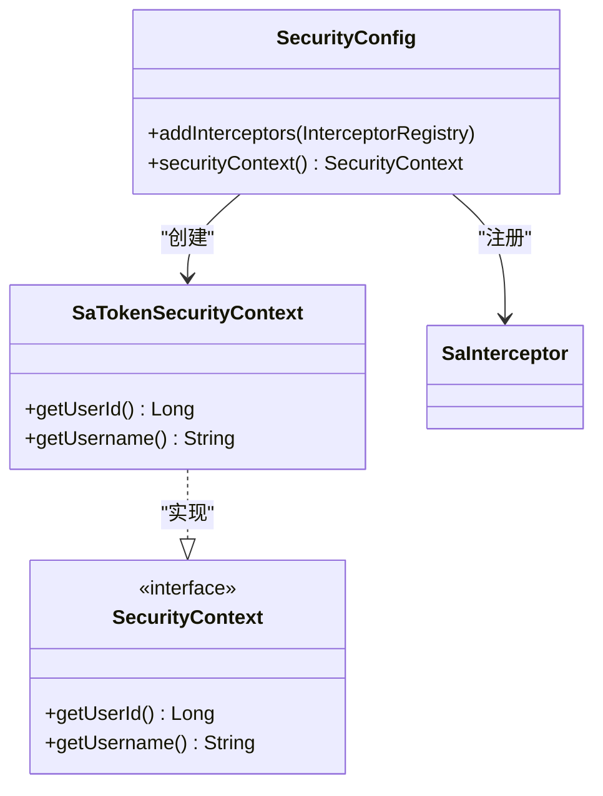
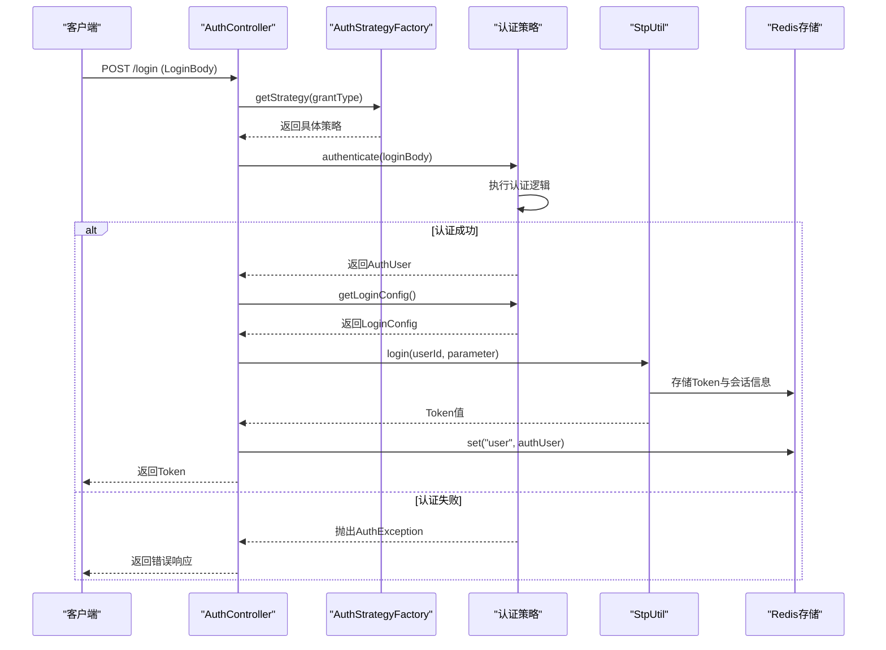
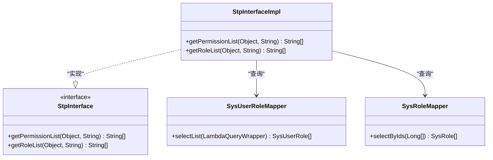
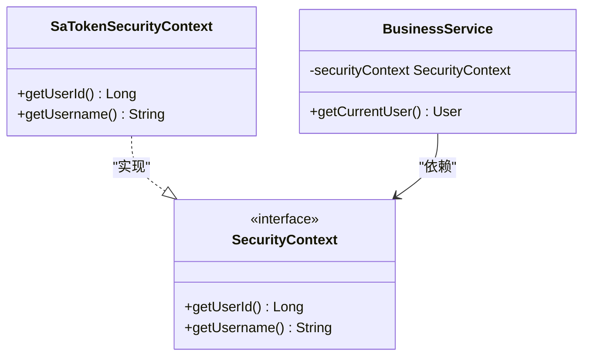

# 安全机制

<cite>
**本文档引用的文件**
- [SecurityConfig.java](file://verulia-framework/verulia-framework-security/src/main/java/org/yann/verulia/framework/security/config/SecurityConfig.java)
- [application.yml](file://verulia-admin/src/main/resources/application.yml)
- [AuthController.java](file://verulia-admin/src/main/java/org/yann/verulia/controller/AuthController.java)
- [StpUserUtil.java](file://verulia-framework/verulia-framework-security/src/main/java/org/yann/verulia/framework/security/StpUserUtil.java)
- [SaTokenSecurityContext.java](file://verulia-framework/verulia-framework-security/src/main/java/org/yann/verulia/framework/security/service/SaTokenSecurityContext.java)
- [StpInterfaceImpl.java](file://verulia-modules/verulia-system/src/main/java/org/yann/verulia/system/service/security/StpInterfaceImpl.java)
- [PasswordAuthStrategy.java](file://verulia-modules/verulia-system/src/main/java/org/yann/verulia/system/service/strategy/PasswordAuthStrategy.java)
- [MiniappAuthStrategy.java](file://verulia-modules/verulia-system/src/main/java/org/yann/verulia/system/service/strategy/MiniappAuthStrategy.java)
- [AuthStrategyFactory.java](file://verulia-framework/verulia-framework-auth/src/main/java/org/yann/verulia/framework/auth/strategy/AuthStrategyFactory.java)
- [IAuthStrategy.java](file://verulia-framework/verulia-framework-auth/src/main/java/org/yann/verulia/framework/auth/strategy/IAuthStrategy.java)
- [LoginBody.java](file://verulia-framework/verulia-framework-auth/src/main/java/org/yann/verulia/framework/auth/domain/LoginBody.java)
- [AuthUser.java](file://verulia-framework/verulia-framework-auth/src/main/java/org/yann/verulia/framework/auth/domain/AuthUser.java)
- [LoginConfig.java](file://verulia-framework/verulia-framework-auth/src/main/java/org/yann/verulia/framework/auth/domain/LoginConfig.java)
</cite>

## 目录
1. [安全架构概述](#安全架构概述)
2. [Sa-Token 框架集成与配置](#sa-token-框架集成与配置)
3. [用户认证流程](#用户认证流程)
4. [权限控制机制](#权限控制机制)
5. [业务代码中的安全上下文使用](#业务代码中的安全上下文使用)
6. [安全最佳实践建议](#安全最佳实践建议)

## 安全架构概述

Verulia系统的安全架构基于Sa-Token权限认证框架构建，采用模块化设计，将认证、授权、会话管理等功能解耦。系统通过`verulia-framework-security`模块封装Sa-Token核心功能，结合`verulia-framework-auth`模块实现多模式认证策略，形成灵活可扩展的安全体系。

整个安全架构的核心组件包括：
- **认证控制器**：处理登录/登出请求
- **认证策略工厂**：支持多种登录方式的动态选择
- **Sa-Token配置**：全局安全参数设置
- **权限接口实现**：角色与权限数据加载
- **安全上下文服务**：提供统一的用户信息访问接口

该架构支持密码登录、微信小程序登录等多种认证方式，并通过拦截器实现全链路的安全保护。

**本节来源**
- [SecurityConfig.java](file://verulia-framework/verulia-framework-security/src/main/java/org/yann/verulia/framework/security/config/SecurityConfig.java)
- [AuthController.java](file://verulia-admin/src/main/java/org/yann/verulia/controller/AuthController.java)
- [AuthStrategyFactory.java](file://verulia-framework/verulia-framework-auth/src/main/java/org/yann/verulia/framework/auth/strategy/AuthStrategyFactory.java)

## Sa-Token 框架集成与配置

### SecurityConfig 类配置分析

`SecurityConfig`类是Sa-Token框架的核心配置入口，实现了`WebMvcConfigurer`接口，通过注册拦截器来实现全局权限校验。该类的主要配置包括：

1. **拦截规则配置**：通过`addInterceptors`方法注册`SaInterceptor`拦截器，对所有请求路径`/**`进行拦截，确保每个请求都经过登录校验。
2. **安全上下文注入**：通过`@Bean`注解将`SaTokenSecurityContext`注入Spring容器，为业务层提供统一的安全上下文访问接口。



**图示来源**
- [SecurityConfig.java](file://verulia-framework/verulia-framework-security/src/main/java/org/yann/verulia/framework/security/config/SecurityConfig.java#L20-L35)
- [SaTokenSecurityContext.java](file://verulia-framework/verulia-framework-security/src/main/java/org/yann/verulia/framework/security/service/SaTokenSecurityContext.java#L12-L27)

### application.yml 安全相关配置

在`application.yml`文件中，Sa-Token的配置项定义了系统的安全行为参数：

| 配置项 | 含义 | 对系统安全行为的影响 |
|-------|------|------------------|
| `sa-token.token-name` | Token名称（同时也是Cookie名称） | 决定了客户端存储Token的键名，默认为`satoken` |
| `sa-token.token-prefix` | Token前缀 | 在Authorization头中使用的前缀，默认为`Bearer` |
| `sa-token.timeout` | Token有效期（秒） | 设置为2592000秒（30天），-1表示永久有效 |
| `sa-token.active-timeout` | 最低活跃频率（秒） | -1表示不限制，不会因不活跃而冻结Token |
| `sa-token.is-concurrent` | 是否允许多地登录 | true表示允许同一账号多地同时登录 |
| `sa-token.is-share` | 是否共用Token | false表示每次登录创建新Token，旧Token失效 |
| `sa-token.token-style` | Token风格 | 使用uuid风格生成Token |
| `sa-token.is-log` | 是否输出操作日志 | true表示开启Sa-Token操作日志 |

这些配置直接影响系统的安全性、用户体验和并发控制策略。例如，较长的Token有效期提升了用户体验但降低了安全性，而允许多地登录则增加了账户风险但提高了使用灵活性。

**本节来源**
- [application.yml](file://verulia-admin/src/main/resources/application.yml#L50-L70)
- [SecurityConfig.java](file://verulia-framework/verulia-framework-security/src/main/java/org/yann/verulia/framework/security/config/SecurityConfig.java)

## 用户认证流程

Verulia系统的用户认证流程是一个完整的生命周期过程，从登录请求到Token生成、存储和验证，具体步骤如下：



**图示来源**
- [AuthController.java](file://verulia-admin/src/main/java/org/yann/verulia/controller/AuthController.java#L37-L57)
- [PasswordAuthStrategy.java](file://verulia-modules/verulia-system/src/main/java/org/yann/verulia/system/service/strategy/PasswordAuthStrategy.java)
- [MiniappAuthStrategy.java](file://verulia-modules/verulia-system/src/main/java/org/yann/verulia/system/service/strategy/MiniappAuthStrategy.java)

### 认证流程详细说明

1. **请求接收**：`AuthController`接收包含`LoginBody`的登录请求，`LoginBody`中包含授权类型、用户名、密码等信息。
2. **策略选择**：通过`AuthStrategyFactory`根据`grantType`获取对应的认证策略实现。
3. **身份验证**：调用具体策略的`authenticate`方法执行认证逻辑，如密码比对、微信小程序Code验证等。
4. **Token生成**：认证成功后，调用`StpUtil.login()`方法生成Token，并根据`LoginConfig`设置特定参数。
5. **会话存储**：将用户信息存储在Sa-Token的会话中，默认使用Redis作为持久化存储。
6. **响应返回**：将生成的Token返回给客户端，后续请求需携带此Token进行身份验证。

默认情况下，Token和会话信息存储在Redis中，利用其高性能和持久化特性保障系统的安全性和可用性。

**本节来源**
- [AuthController.java](file://verulia-admin/src/main/java/org/yann/verulia/controller/AuthController.java)
- [AuthStrategyFactory.java](file://verulia-framework/verulia-framework-auth/src/main/java/org/yann/verulia/framework/auth/strategy/AuthStrategyFactory.java)
- [IAuthStrategy.java](file://verulia-framework/verulia-framework-auth/src/main/java/org/yann/verulia/framework/auth/strategy/IAuthStrategy.java)
- [LoginBody.java](file://verulia-framework/verulia-framework-auth/src/main/java/org/yann/verulia/framework/auth/domain/LoginBody.java)

## 权限控制机制

Verulia系统通过Sa-Token提供的注解实现细粒度的权限控制，支持方法级别的角色和权限校验。

### 权限校验注解

系统主要使用以下注解进行权限控制：

- `@SaCheckRole`：校验用户是否具有指定角色
- `@SaCheckPermission`：校验用户是否具有指定权限
- `@SaIgnore`：忽略权限校验（用于登录等公共接口）

### 权限数据加载实现

`StpInterfaceImpl`类实现了Sa-Token的`StpInterface`接口，负责从数据库加载用户的角色和权限信息。



**图示来源**
- [StpInterfaceImpl.java](file://verulia-modules/verulia-system/src/main/java/org/yann/verulia/system/service/security/StpInterfaceImpl.java#L23-L71)
- [SysUserRoleMapper.java](file://verulia-modules/verulia-system/src/main/java/org/yann/verulia/system/mapper/SysUserRoleMapper.java)
- [SysRoleMapper.java](file://verulia-modules/verulia-system/src/main/java/org/yann/verulia/system/mapper/SysRoleMapper.java)

### 角色校验流程

当使用`@SaCheckRole`注解时，系统执行以下流程：
1. 调用`StpInterfaceImpl.getRoleList()`方法
2. 根据用户ID查询`sys_user_role`关联表获取角色ID列表
3. 根据角色ID查询`sys_role`表获取角色标识（role_key）
4. 比较当前用户角色与要求的角色是否匹配

目前权限列表返回空集合，表明系统暂未实现基于权限码的细粒度控制，主要依赖角色进行访问控制。

**本节来源**
- [StpInterfaceImpl.java](file://verulia-modules/verulia-system/src/main/java/org/yann/verulia/system/service/security/StpInterfaceImpl.java)
- [SysRoleController.java](file://verulia-modules/verulia-system/src/main/java/org/yann/verulia/system/controller/SysRoleController.java)

## 业务代码中的安全上下文使用

在业务代码中，可以通过`StpUserUtil`工具类和`SecurityContext`接口安全地获取当前登录用户信息。

### StpUserUtil 工具类

`StpUserUtil`是一个简单的工具类，主要定义了账号体系的标识常量：

```java
public class StpUserUtil {
    /**
     * 账号体系标识
     */
    public static final String TYPE = "user";
}
```

该常量可用于区分不同的账号体系（如用户、管理员、第三方应用等）。

**本节来源**
- [StpUserUtil.java](file://verulia-framework/verulia-framework-security/src/main/java/org/yann/verulia/framework/security/StpUserUtil.java)

### SecurityContext 接口使用

业务代码应通过`SecurityContext`接口获取用户信息，而不是直接调用Sa-Token的API，以保持代码的解耦性：



**图示来源**
- [SaTokenSecurityContext.java](file://verulia-framework/verulia-framework-security/src/main/java/org/yann/verulia/framework/security/service/SaTokenSecurityContext.java)
- [SecurityContext.java](file://verulia-framework/verulia-framework-core/src/main/java/org/yann/verulia/framework/core/service/SecurityContext.java)

通过依赖注入`SecurityContext`，业务服务可以安全地获取当前登录用户的ID等信息，而无需关心底层认证实现细节。

**本节来源**
- [SaTokenSecurityContext.java](file://verulia-framework/verulia-framework-security/src/main/java/org/yann/verulia/framework/security/service/SaTokenSecurityContext.java)
- [SecurityContext.java](file://verulia-framework/verulia-framework-core/src/main/java/org/yann/verulia/framework/core/service/SecurityContext.java)

## 安全最佳实践建议

基于Verulia系统的安全架构，提出以下安全最佳实践建议：

### Token刷新策略

建议实现Token自动刷新机制：
- 在Token即将过期时（如剩余有效期<30分钟），通过刷新接口获取新Token
- 使用双Token机制（Access Token + Refresh Token），Refresh Token有效期更长且仅用于刷新
- 定期强制用户重新登录以增强安全性

### 防止重放攻击

为防止Token被截获后重复使用：
- 为每个Token绑定客户端指纹（如设备ID、IP地址、User-Agent等）
- 实现Token一次性使用机制，每次请求后更新Token
- 记录Token使用日志，检测异常使用模式

### 敏感信息加密

- 用户密码必须使用强哈希算法（如SHA-256）加盐存储
- 敏感数据在数据库中加密存储
- 配置文件中的密码等敏感信息应使用加密方式存储
- 启用HTTPS确保传输过程中的数据安全

### 其他建议

- 定期轮换Redis访问密码
- 为不同环境配置不同的Token超时时间（开发环境短，生产环境长）
- 实现登录失败次数限制，防止暴力破解
- 记录详细的登录日志，便于安全审计
- 定期审查和更新依赖库，防止已知漏洞

这些建议有助于进一步提升系统的整体安全性，防范潜在的安全威胁。

**本节来源**
- [application.yml](file://verulia-admin/src/main/resources/application.yml)
- [SecurityConfig.java](file://verulia-framework/verulia-framework-security/src/main/java/org/yann/verulia/framework/security/config/SecurityConfig.java)
- [PasswordAuthStrategy.java](file://verulia-modules/verulia-system/src/main/java/org/yann/verulia/system/service/strategy/PasswordAuthStrategy.java)