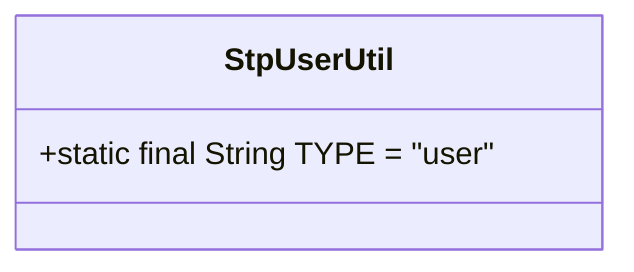
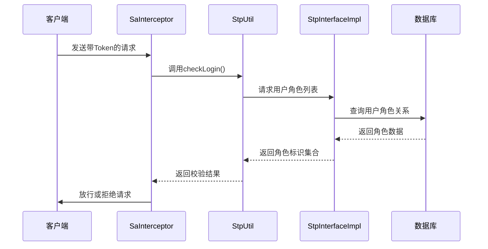
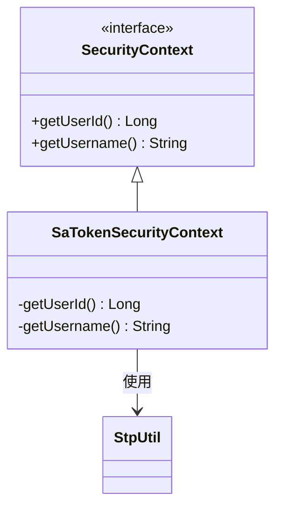

# 权限控制实现

<cite>
**本文档引用的文件**
- [SecurityConfig.java](file://verulia-framework/verulia-framework-security/src/main/java/org/yann/verulia/framework/security/config/SecurityConfig.java)
- [StpUserUtil.java](file://verulia-framework/verulia-framework-security/src/main/java/org/yann/verulia/framework/security/StpUserUtil.java)
- [SecurityExceptionHandler.java](file://verulia-framework/verulia-framework-security/src/main/java/org/yann/verulia/framework/security/handler/SecurityExceptionHandler.java)
- [SaTokenSecurityContext.java](file://verulia-framework/verulia-framework-security/src/main/java/org/yann/verulia/framework/security/service/SaTokenSecurityContext.java)
- [StpInterfaceImpl.java](file://verulia-modules/verulia-system/src/main/java/org/yann/verulia/system/service/security/StpInterfaceImpl.java)
- [AuthUser.java](file://verulia-framework/verulia-framework-auth/src/main/java/org/yann/verulia/framework/auth/domain/AuthUser.java)
- [SysUserController.java](file://verulia-modules/verulia-system/src/main/java/org/yann/verulia/system/controller/SysUserController.java)
- [SysRoleController.java](file://verulia-modules/verulia-system/src/main/java/org/yann/verulia/system/controller/SysRoleController.java)
</cite>

## 目录
1. [权限控制概述](#权限控制概述)
2. [全局登录校验机制](#全局登录校验机制)
3. [细粒度权限控制](#细粒度权限控制)
4. [账号体系标识定义](#账号体系标识定义)
5. [权限校验完整流程](#权限校验完整流程)
6. [异常处理机制](#异常处理机制)
7. [高级特性与扩展](#高级特性与扩展)

## 权限控制概述

本系统基于Sa-Token框架实现完整的权限控制体系，涵盖登录状态管理、角色权限校验、多账号体系支持等核心功能。通过拦截器、注解、安全上下文等组件的协同工作，构建了安全可靠的访问控制机制。

**本节内容未直接分析具体源码文件，因此不提供来源信息。**

## 全局登录校验机制

系统通过`SecurityConfig`配置类集成Sa-Token的拦截器，实现全局登录状态校验。该配置类注册了一个`SaInterceptor`拦截器，对所有请求路径（`/**`）进行拦截，并在拦截处理中调用`StpUtil.checkLogin()`方法验证用户登录状态。

此机制确保了所有接口访问都必须在已登录状态下进行，未登录用户将被统一拦截并返回相应错误信息。当前配置中未设置排除路径，意味着包括登录接口在内的所有请求都需要进行登录校验（实际应用中通常会排除登录接口）。

```mermaid
flowchart TD
A[HTTP请求] --> B{请求路径匹配 /**}
B --> |是| C[执行SaInterceptor拦截器]
C --> D[调用StpUtil.checkLogin()]
D --> E{会话是否有效}
E --> |是| F[放行请求]
E --> |否| G[抛出NotLoginException]
G --> H[SecurityExceptionHandler处理]
H --> I[返回未登录错误]
```

**Diagram sources**
- [SecurityConfig.java](file://verulia-framework/verulia-framework-security/src/main/java/org/yann/verulia/framework/security/config/SecurityConfig.java#L24-L28)

**Section sources**
- [SecurityConfig.java](file://verulia-framework/verulia-framework-security/src/main/java/org/yann/verulia/framework/security/config/SecurityConfig.java#L20-L35)

## 细粒度权限控制

系统支持使用`@SaCheckRole`、`@SaCheckPermission`等注解在Controller或Service方法上实现角色与权限的细粒度控制。这些注解可以精确控制特定接口的访问权限，实现基于角色或权限码的访问控制策略。

虽然在当前分析的控制器代码中未直接体现这些注解的使用，但系统架构已具备支持这些高级权限控制的能力。开发者可以在需要权限控制的方法上添加相应注解，如`@SaCheckRole("admin")`来限制只有管理员角色才能访问。

**本节内容基于系统架构分析，未在当前查看的控制器文件中发现具体注解使用示例。**

## 账号体系标识定义

系统通过`StpUserUtil`类定义了统一的账号体系标识常量`TYPE`，其值为`"user"`。该常量用于标识当前系统的账号类型，在多账号体系场景下具有重要的扩展意义。

当系统需要支持多种账号类型（如用户账号、管理员账号、第三方账号等）时，可以通过不同的类型标识来区分和管理。`StpUtil`在进行会话管理时会使用此类型标识，确保不同账号体系之间的隔离性和独立性。



**Diagram sources**
- [StpUserUtil.java](file://verulia-framework/verulia-framework-security/src/main/java/org/yann/verulia/framework/security/StpUserUtil.java#L14)

**Section sources**
- [StpUserUtil.java](file://verulia-framework/verulia-framework-security/src/main/java/org/yann/verulia/framework/security/StpUserUtil.java#L9-L15)

## 权限校验完整流程

系统的权限校验流程是一个完整的链路，从HTTP请求开始到最终方法执行结束，涉及多个组件的协同工作：

1. **请求携带Token**：客户端在HTTP请求头中携带Sa-Token
2. **拦截器解析**：`SaInterceptor`拦截请求并触发`StpUtil.checkLogin()`验证
3. **会话状态验证**：Sa-Token框架解析Token并验证会话的有效性
4. **方法级注解校验**：如果方法上有角色或权限注解，则进行相应的比对校验
5. **权限数据加载**：通过`StpInterface`实现类从数据库加载用户的实际角色和权限
6. **最终决策**：根据校验结果决定是否放行请求或抛出异常

其中，`StpInterfaceImpl`类实现了`StpInterface`接口，负责从数据库加载用户的角色信息。它通过`sysUserRoleMapper`和`sysRoleMapper`查询用户关联的角色，并返回角色标识集合，供Sa-Token框架进行角色校验。



**Diagram sources**
- [SecurityConfig.java](file://verulia-framework/verulia-framework-security/src/main/java/org/yann/verulia/framework/security/config/SecurityConfig.java#L24-L28)
- [StpInterfaceImpl.java](file://verulia-modules/verulia-system/src/main/java/org/yann/verulia/system/service/security/StpInterfaceImpl.java#L23-L71)

**Section sources**
- [SecurityConfig.java](file://verulia-framework/verulia-framework-security/src/main/java/org/yann/verulia/framework/security/config/SecurityConfig.java#L20-L35)
- [StpInterfaceImpl.java](file://verulia-modules/verulia-system/src/main/java/org/yann/verulia/system/service/security/StpInterfaceImpl.java#L16-L71)

## 异常处理机制

系统通过`SecurityExceptionHandler`类统一处理权限相关的异常。该类使用`@RestControllerAdvice`注解定义为全局异常处理器，专门捕获和处理Sa-Token框架抛出的各类安全异常。

处理器主要处理三种异常类型：
- `NotLoginException`：未登录异常，返回未授权状态
- `NotPermissionException`：无权限异常，返回具体的权限缺失信息
- `NotRoleException`：无角色异常，返回具体的角色缺失信息

所有异常都会被记录为警告级别日志，并返回标准化的响应结果`R<Void>`，确保客户端能够获得一致的错误响应格式。

```mermaid
flowchart TD
A[抛出异常] --> B{异常类型}
B --> |NotLoginException| C[记录警告日志]
B --> |NotPermissionException| D[记录警告日志]
B --> |NotRoleException| E[记录警告日志]
C --> F[返回R.fail(UN_AUTHORIZED)]
D --> G[返回R.fail("无此权限：" + code)]
E --> H[返回R.fail("无此角色：" + role)]
F --> I[客户端接收错误响应]
G --> I
H --> I
```

**Diagram sources**
- [SecurityExceptionHandler.java](file://verulia-framework/verulia-framework-security/src/main/java/org/yann/verulia/framework/security/handler/SecurityExceptionHandler.java#L21-L49)

**Section sources**
- [SecurityExceptionHandler.java](file://verulia-framework/verulia-framework-security/src/main/java/org/yann/verulia/framework/security/handler/SecurityExceptionHandler.java#L18-L49)

## 高级特性与扩展

### 动态权限加载

系统通过实现`StpInterface`接口支持动态权限加载。`StpInterfaceImpl`类中的`getRoleList`方法从数据库动态查询用户的角色信息，而不是使用静态配置。这使得角色权限的变更能够实时生效，无需重启服务。

### 临时权限授予

虽然当前代码未直接体现，但Sa-Token框架支持临时权限授予功能，可以通过`StpUtil.openTempRole()`等方法为用户临时赋予特定角色，满足临时授权的业务需求。

### 二级认证

系统架构支持二级认证机制，可以在关键操作前要求用户进行二次身份验证。这可以通过Sa-Token提供的`StpUtil.checkSafe()`等方法实现，增强敏感操作的安全性。

### 安全上下文集成

系统通过`SaTokenSecurityContext`类实现了`SecurityContext`接口，将Sa-Token的会话管理与业务系统的安全上下文集成。`getUserId()`方法通过`StpUtil.getLoginIdAsLong()`获取当前登录用户ID，为业务逻辑提供安全的用户上下文信息。



**Diagram sources**
- [SaTokenSecurityContext.java](file://verulia-framework/verulia-framework-security/src/main/java/org/yann/verulia/framework/security/service/SaTokenSecurityContext.java#L12-L27)
- [SecurityConfig.java](file://verulia-framework/verulia-framework-security/src/main/java/org/yann/verulia/framework/security/config/SecurityConfig.java#L31-L34)

**Section sources**
- [SaTokenSecurityContext.java](file://verulia-framework/verulia-framework-security/src/main/java/org/yann/verulia/framework/security/service/SaTokenSecurityContext.java#L12-L27)
- [SecurityConfig.java](file://verulia-framework/verulia-framework-security/src/main/java/org/yann/verulia/framework/security/config/SecurityConfig.java#L31-L34)