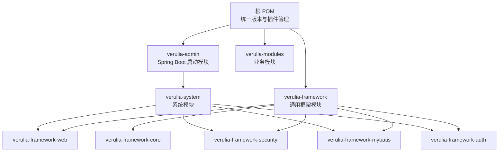
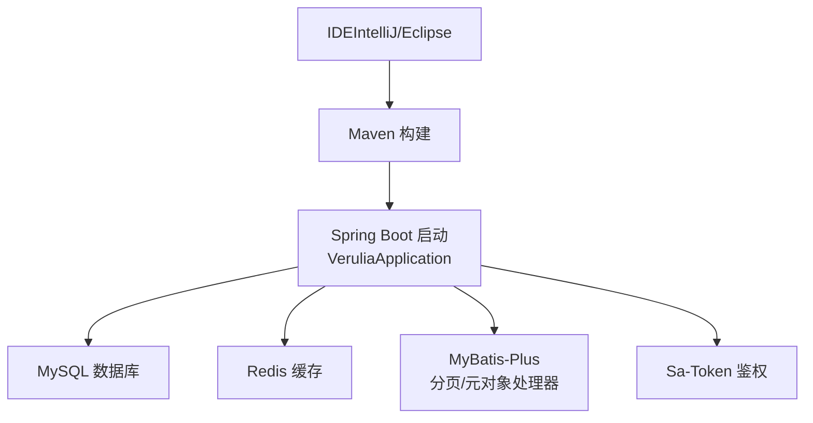
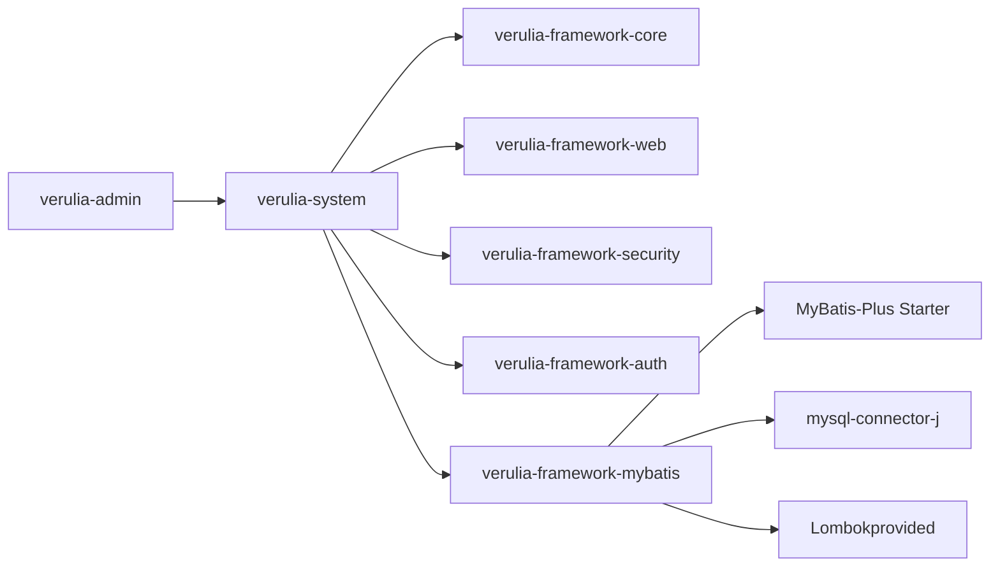

# 开发环境搭建

<cite>
**本文引用的文件**
- [pom.xml](file://pom.xml)
- [verulia-admin/pom.xml](file://verulia-admin/pom.xml)
- [verulia-admin/src/main/resources/application.yml](file://verulia-admin/src/main/resources/application.yml)
- [verulia-admin/src/main/resources/application-dev.yml](file://verulia-admin/src/main/resources/application-dev.yml)
- [verulia-admin/src/main/java/org/yann/verulia/VeruliaApplication.java](file://verulia-admin/src/main/java/org/yann/verulia/VeruliaApplication.java)
- [_script/_init.sql](file://_script/_init.sql)
- [verulia-framework/verulia-framework-mybatis/src/main/java/org/yann/verulia/framework/mybatis/config/MybatisPlusConfig.java](file://verulia-framework/verulia-framework-mybatis/src/main/java/org/yann/verulia/framework/mybatis/config/MybatisPlusConfig.java)
- [verulia-framework/verulia-framework-mybatis/pom.xml](file://verulia-framework/verulia-framework-mybatis/pom.xml)
- [verulia-modules/verulia-system/pom.xml](file://verulia-modules/verulia-system/pom.xml)
</cite>

## 目录
1. [简介](#简介)
2. [项目结构](#项目结构)
3. [核心组件](#核心组件)
4. [架构总览](#架构总览)
5. [详细组件分析](#详细组件分析)
6. [依赖关系分析](#依赖关系分析)
7. [性能与配置要点](#性能与配置要点)
8. [故障排查指南](#故障排查指南)
9. [结论](#结论)
10. [附录](#附录)

## 简介
本指南面向新加入的开发者，帮助你在本地快速搭建 Verulia 项目的开发环境。你将学会：
- 安装并验证 JDK、Maven、MySQL、Redis 的版本要求
- 克隆仓库、导入 Maven 多模块工程、配置 IDE（IntelliJ IDEA 或 Eclipse）
- 初始化数据库并执行初始化脚本
- 启动应用服务（VeruliaApplication）
- 使用 Maven 命令构建项目
- 常见问题定位与解决（Lombok 注解不生效、MyBatis Mapper 扫描失败、端口占用等）
- 推荐 IDE 插件（如 Lombok、MyBatisX）

## 项目结构
Verulia 是一个基于 Spring Boot 4 的多模块 Maven 项目，采用分层与模块化设计：
- verulia-admin：Spring Boot 启动模块，负责服务启动与对外暴露
- verulia-framework：通用框架层，包含核心、Web、安全、MyBatis Plus、认证等子模块
- verulia-modules：业务模块层，当前包含 verulia-system 系统模块
- 根 pom.xml：统一版本与依赖管理、插件管理

图表来源
- [pom.xml](file://pom.xml#L1-L124)
- [verulia-admin/pom.xml](file://verulia-admin/pom.xml#L1-L124)
- [verulia-modules/verulia-system/pom.xml](file://verulia-modules/verulia-system/pom.xml#L1-L48)
- [verulia-framework/verulia-framework-mybatis/pom.xml](file://verulia-framework/verulia-framework-mybatis/pom.xml#L1-L46)

章节来源
- [pom.xml](file://pom.xml#L1-L124)
- [verulia-admin/pom.xml](file://verulia-admin/pom.xml#L1-L124)
- [verulia-modules/verulia-system/pom.xml](file://verulia-modules/verulia-system/pom.xml#L1-L48)

## 核心组件
- 应用启动类：VeruliaApplication，作为 Spring Boot 启动入口
- 配置文件：application.yml（服务端口、Redis、Sa-Token、MyBatis-Plus 等），application-dev.yml（开发环境数据库连接池参数）
- 初始化脚本：_init.sql（创建系统用户、角色、用户角色、社交认证等表）
- MyBatis Plus 配置：MybatisPlusConfig（分页插件、元对象处理器）

章节来源
- [verulia-admin/src/main/java/org/yann/verulia/VeruliaApplication.java](file://verulia-admin/src/main/java/org/yann/verulia/VeruliaApplication.java#L1-L19)
- [verulia-admin/src/main/resources/application.yml](file://verulia-admin/src/main/resources/application.yml#L1-L94)
- [verulia-admin/src/main/resources/application-dev.yml](file://verulia-admin/src/main/resources/application-dev.yml#L1-L23)
- [_script/_init.sql](file://_script/_init.sql#L1-L54)
- [verulia-framework/verulia-framework-mybatis/src/main/java/org/yann/verulia/framework/mybatis/config/MybatisPlusConfig.java](file://verulia-framework/verulia-framework-mybatis/src/main/java/org/yann/verulia/framework/mybatis/config/MybatisPlusConfig.java#L1-L31)

## 架构总览
下图展示了本地开发环境的关键组件与交互关系：IDE 与 Maven 负责编译与打包；Spring Boot 启动应用；应用通过 MyBatis-Plus 访问 MySQL；通过 Redis 存取缓存；Sa-Token 提供鉴权能力。

图表来源
- [verulia-admin/src/main/java/org/yann/verulia/VeruliaApplication.java](file://verulia-admin/src/main/java/org/yann/verulia/VeruliaApplication.java#L1-L19)
- [verulia-admin/src/main/resources/application.yml](file://verulia-admin/src/main/resources/application.yml#L1-L94)
- [verulia-framework/verulia-framework-mybatis/src/main/java/org/yann/verulia/framework/mybatis/config/MybatisPlusConfig.java](file://verulia-framework/verulia-framework-mybatis/src/main/java/org/yann/verulia/framework/mybatis/config/MybatisPlusConfig.java#L1-L31)

## 详细组件分析

### 本地开发环境先决条件
- JDK：项目使用 Java 21（源码与目标版本），建议安装 JDK 21 或更高版本以确保兼容性
- Maven：建议使用 Maven 3.6+，用于多模块构建与依赖管理
- MySQL：建议使用 MySQL 5.7+，用于存储业务数据
- Redis：建议使用 Redis 6+，用于缓存与会话存储

章节来源
- [pom.xml](file://pom.xml#L22-L28)

### 步骤一：克隆仓库与导入 Maven 项目
- 使用 Git 克隆仓库到本地
- 在 IDE 中导入 Maven 项目（选择根目录的 pom.xml），等待依赖下载完成
- 若使用 IntelliJ IDEA，推荐启用“Use plugin registry”和“Import Maven projects automatically”
- 若使用 Eclipse，推荐使用 m2eclipse 插件并勾选“Resolve dependencies automatically”

### 步骤二：配置 IDE（IntelliJ IDEA 或 Eclipse）
- IntelliJ IDEA
  - 安装 Lombok 插件并启用注解处理
  - 在 Project Settings 中设置 Project SDK 为 JDK 21
  - 在 Maven Settings 中设置本地仓库路径与镜像
- Eclipse
  - 安装 Buildship（Gradle 支持）或直接导入 Maven 项目
  - 安装 Lombok 插件并启用注解处理
  - 设置项目 JDK 为 21

章节来源
- [pom.xml](file://pom.xml#L22-L28)

### 步骤三：设置数据库并执行初始化脚本
- 启动本地 MySQL 服务，创建数据库（例如 verulia-db）
- 执行 _script/_init.sql 初始化脚本，创建 sys_user、sys_role、sys_user_role、sys_social_auth 等表
- 修改 application-dev.yml 中的数据库连接参数（URL、用户名、密码）以匹配你的本地环境

章节来源
- [_script/_init.sql](file://_script/_init.sql#L1-L54)
- [verulia-admin/src/main/resources/application-dev.yml](file://verulia-admin/src/main/resources/application-dev.yml#L1-L23)

### 步骤四：配置 Redis（可选）
- 若需要本地缓存功能，启动本地 Redis 服务
- 修改 application.yml 中的 Redis 地址、端口、密码与数据库索引，使其指向你的本地 Redis

章节来源
- [verulia-admin/src/main/resources/application.yml](file://verulia-admin/src/main/resources/application.yml#L27-L49)

### 步骤五：运行 VeruliaApplication 启动服务
- 在 IDE 中找到 VeruliaApplication 并运行其 main 方法
- 服务默认监听端口可在 application.yml 中查看（例如 8012）

章节来源
- [verulia-admin/src/main/resources/application.yml](file://verulia-admin/src/main/resources/application.yml#L1-L15)
- [verulia-admin/src/main/java/org/yann/verulia/VeruliaApplication.java](file://verulia-admin/src/main/java/org/yann/verulia/VeruliaApplication.java#L1-L19)

### 步骤六：使用 Maven 命令构建项目
- 在项目根目录执行 mvn clean install，完成清理、编译、测试与打包
- verulia-admin 模块使用 Spring Boot Maven 插件进行打包，并生成可执行的 ZIP 布局产物（包含 lib 目录与 MANIFEST）

章节来源
- [verulia-admin/pom.xml](file://verulia-admin/pom.xml#L33-L123)

### MyBatis Mapper 扫描与实体包配置
- MyBatis-Plus 在 application.yml 中配置了 mapper XML 扫描路径与实体别名包
- 若自定义了实体包或 XML 路径，请确保与配置保持一致，避免扫描不到 Mapper

章节来源
- [verulia-admin/src/main/resources/application.yml](file://verulia-admin/src/main/resources/application.yml#L71-L88)
- [verulia-framework/verulia-framework-mybatis/src/main/java/org/yann/verulia/framework/mybatis/config/MybatisPlusConfig.java](file://verulia-framework/verulia-framework-mybatis/src/main/java/org/yann/verulia/framework/mybatis/config/MybatisPlusConfig.java#L1-L31)

## 依赖关系分析
- verulia-admin 依赖 verulia-system 与 Lombok
- verulia-system 依赖框架层各模块（core、web、security、auth、mybatis）
- verulia-framework-mybatis 引入 MyBatis-Plus Starter、mysql-connector-j、Lombok（provided）
- 根 pom.xml 统一管理 Spring Boot、MyBatis Plus、Lombok、Hutool、Sa-Token 等版本

图表来源
- [verulia-admin/pom.xml](file://verulia-admin/pom.xml#L19-L31)
- [verulia-modules/verulia-system/pom.xml](file://verulia-modules/verulia-system/pom.xml#L14-L47)
- [verulia-framework/verulia-framework-mybatis/pom.xml](file://verulia-framework/verulia-framework-mybatis/pom.xml#L18-L46)
- [pom.xml](file://pom.xml#L39-L89)

章节来源
- [verulia-admin/pom.xml](file://verulia-admin/pom.xml#L19-L31)
- [verulia-modules/verulia-system/pom.xml](file://verulia-modules/verulia-system/pom.xml#L14-L47)
- [verulia-framework/verulia-framework-mybatis/pom.xml](file://verulia-framework/verulia-framework-mybatis/pom.xml#L18-L46)
- [pom.xml](file://pom.xml#L39-L89)

## 性能与配置要点
- 数据库连接池：开发环境建议使用 HikariCP，已在 application-dev.yml 中给出参数示例（最小空闲、最大连接、超时等）
- Redis 连接池：application.yml 中配置了 lettuce 池参数（最大连接、最大等待、最大空闲、最小空闲）
- MyBatis-Plus：开启下划线转驼峰映射，开发环境可开启 SQL 日志输出以便调试

章节来源
- [verulia-admin/src/main/resources/application-dev.yml](file://verulia-admin/src/main/resources/application-dev.yml#L1-L23)
- [verulia-admin/src/main/resources/application.yml](file://verulia-admin/src/main/resources/application.yml#L27-L49)
- [verulia-admin/src/main/resources/application.yml](file://verulia-admin/src/main/resources/application.yml#L71-L88)

## 故障排查指南

### Lombok 注解不生效
- 症状：编译时报错找不到 getter/setter/构造函数等
- 解决方案：
  - 在 IDE 中安装并启用 Lombok 插件
  - 确保项目使用 JDK 21，并在编译器设置中启用注解处理
  - 清理并重新导入 Maven 项目

章节来源
- [pom.xml](file://pom.xml#L22-L28)
- [verulia-admin/pom.xml](file://verulia-admin/pom.xml#L19-L31)
- [verulia-framework/verulia-framework-mybatis/pom.xml](file://verulia-framework/verulia-framework-mybatis/pom.xml#L38-L44)
- [verulia-modules/verulia-system/pom.xml](file://verulia-modules/verulia-system/pom.xml#L37-L41)

### MyBatis Mapper 扫描失败
- 症状：Mapper 无法注入或 XML 映射未加载
- 排查步骤：
  - 检查 application.yml 中的 mapper-locations 与 type-aliases-package 是否正确
  - 确认 Mapper XML 文件路径与命名符合 classpath* 与通配符规则
  - 确认实体类包名与配置一致，避免全限定名冲突
  - 如需自定义扫描范围，参考 MyBatis-Plus 配置类与注解

章节来源
- [verulia-admin/src/main/resources/application.yml](file://verulia-admin/src/main/resources/application.yml#L71-L88)
- [verulia-framework/verulia-framework-mybatis/src/main/java/org/yann/verulia/framework/mybatis/config/MybatisPlusConfig.java](file://verulia-framework/verulia-framework-mybatis/src/main/java/org/yann/verulia/framework/mybatis/config/MybatisPlusConfig.java#L1-L31)

### 端口占用
- 症状：启动时报端口被占用
- 解决方案：
  - 修改 application.yml 中的 server.port 为其他可用端口
  - 在 IDE 中临时修改 VM Options 或 Program Arguments 指定端口
  - 关闭占用端口的进程（如 Tomcat、其他 Java 进程）

章节来源
- [verulia-admin/src/main/resources/application.yml](file://verulia-admin/src/main/resources/application.yml#L1-L15)

### 数据库连接失败
- 症状：应用启动时报数据库连接异常
- 排查步骤：
  - 确认本地 MySQL 服务已启动且可达
  - 检查 application-dev.yml 中的 URL、用户名、密码是否正确
  - 确认数据库已执行 _init.sql 初始化脚本
  - 如使用 HikariCP，检查连接池参数（最大连接、超时、空闲时间）

章节来源
- [_script/_init.sql](file://_script/_init.sql#L1-L54)
- [verulia-admin/src/main/resources/application-dev.yml](file://verulia-admin/src/main/resources/application-dev.yml#L1-L23)

### Redis 连接失败
- 症状：应用启动时报 Redis 连接异常
- 排查步骤：
  - 确认本地 Redis 服务已启动且可达
  - 检查 application.yml 中的 host、port、password、database 是否正确
  - 如使用 lettuce 池，检查 max-active、max-wait、max-idle、min-idle 参数

章节来源
- [verulia-admin/src/main/resources/application.yml](file://verulia-admin/src/main/resources/application.yml#L27-L49)

## 结论
按照本指南完成先决条件安装、项目导入、数据库与 Redis 初始化、以及应用启动后，你即可在本地顺利运行 Verulia 项目。遇到问题时，优先检查 Lombok 注解处理、MyBatis-Plus 扫描配置、端口占用与数据库/Redis 连接参数。建议在开发过程中启用 SQL 日志与 Sa-Token 日志，便于快速定位问题。

## 附录

### 推荐 IDE 插件
- Lombok：简化实体类与工具类代码
- MyBatisX：增强 MyBatis 开发体验（XML 辅助、Mapper 扫描等）

章节来源
- [pom.xml](file://pom.xml#L29-L33)
- [verulia-framework/verulia-framework-mybatis/pom.xml](file://verulia-framework/verulia-framework-mybatis/pom.xml#L24-L37)

### Maven 常用命令
- mvn clean install：清理、编译、测试、打包
- mvn spring-boot:run：直接运行 Spring Boot 应用（无需打包）
- mvn dependency:tree：查看依赖树，排查冲突

章节来源
- [verulia-admin/pom.xml](file://verulia-admin/pom.xml#L33-L123)