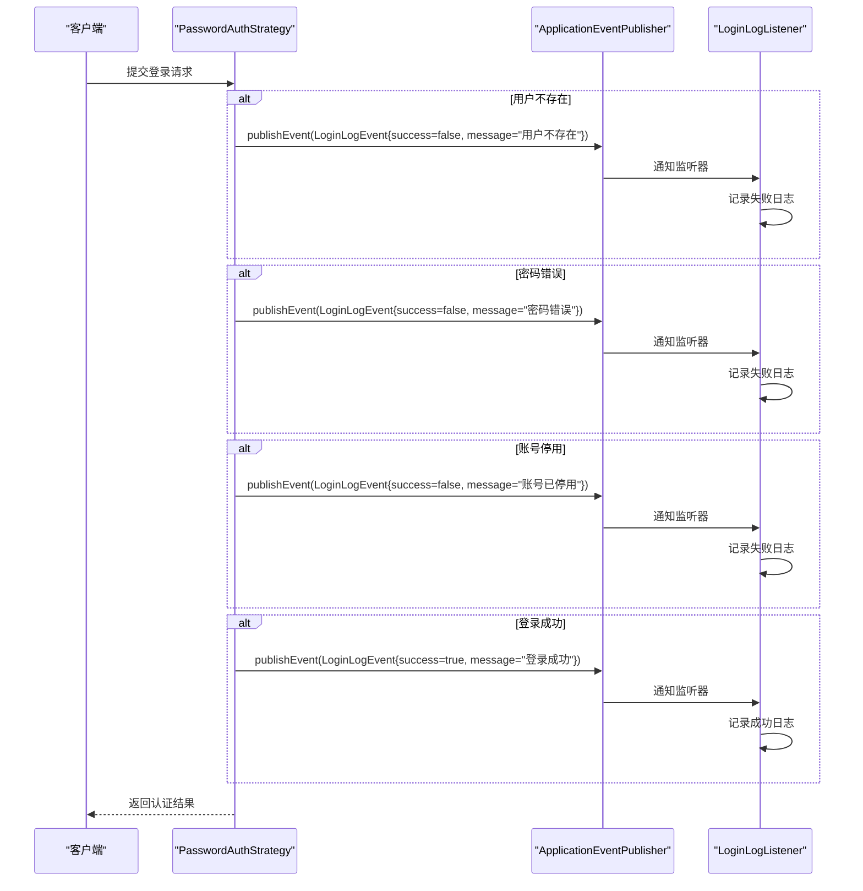
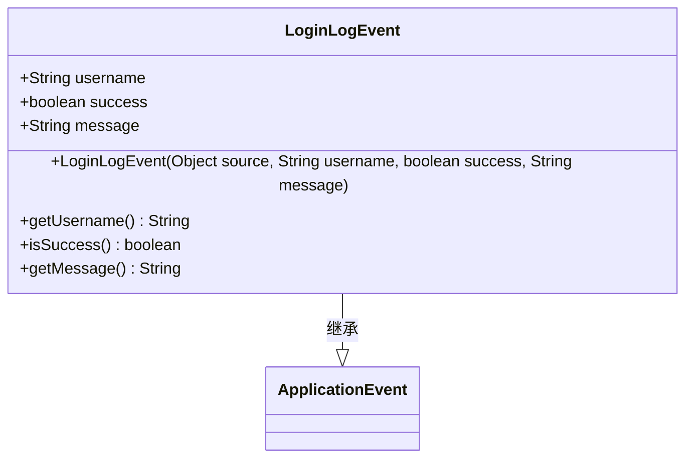
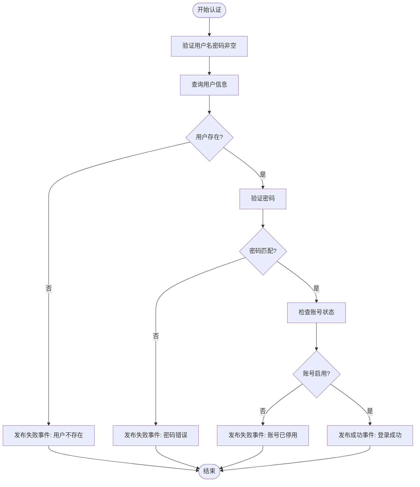
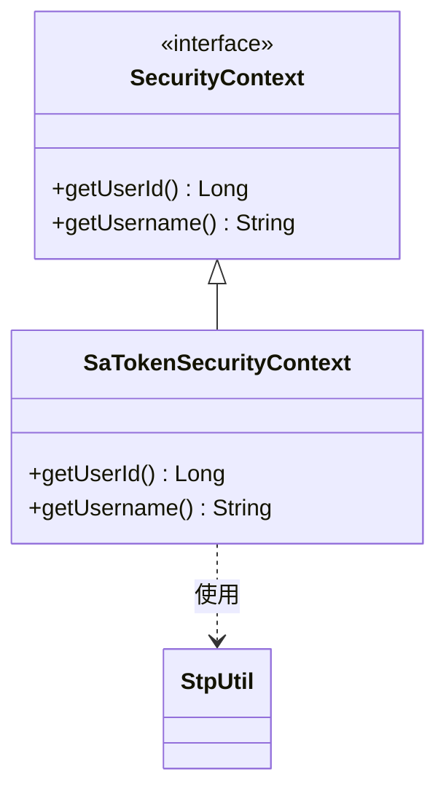
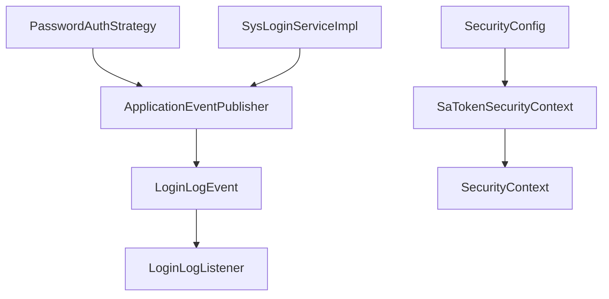

# 扩展事件机制

<cite>
**本文档引用的文件**  
- [LoginLogEvent.java](file://verulia-modules/verulia-system/src/main/java/org/yann/verulia/system/event/LoginLogEvent.java)
- [PasswordAuthStrategy.java](file://verulia-modules/verulia-system/src/main/java/org/yann/verulia/system/service/strategy/PasswordAuthStrategy.java)
- [SysLoginServiceImpl.java](file://verulia-modules/verulia-system/src/main/java/org/yann/verulia/system/service/impl/SysLoginServiceImpl.java)
- [SecurityContext.java](file://verulia-framework/verulia-framework-core/src/main/java/org/yann/verulia/framework/core/service/SecurityContext.java)
- [SaTokenSecurityContext.java](file://verulia-framework/verulia-framework-security/src/main/java/org/yann/verulia/framework/security/service/SaTokenSecurityContext.java)
- [SecurityConfig.java](file://verulia-framework/verulia-framework-security/src/main/java/org/yann/verulia/framework/security/config/SecurityConfig.java)
</cite>

## 目录
1. [引言](#引言)
2. [项目结构](#项目结构)
3. [核心组件](#核心组件)
4. [架构概述](#架构概述)
5. [详细组件分析](#详细组件分析)
6. [依赖分析](#依赖分析)
7. [性能考虑](#性能考虑)
8. [故障排除指南](#故障排除指南)
9. [结论](#结论)

## 引言
本文档详细阐述了如何在Spring框架中利用事件驱动模型，在关键业务节点插入扩展逻辑。以用户登录过程中的日志记录为例，说明如何通过`LoginLogEvent`事件实现登录成功或失败时的日志记录、安全审计和通知服务等扩展功能。文档将介绍事件的定义、发布与监听机制，同步与异步处理策略，以及如何结合`SecurityContext`获取当前用户上下文信息，并提供事件过滤、条件监听和错误处理的最佳实践。

## 项目结构
本项目采用模块化设计，核心事件机制分布在`verulia-modules/verulia-system`模块中，事件发布与监听依赖于Spring框架的`ApplicationEventPublisher`和`@EventListener`机制。安全上下文由`verulia-framework-security`模块提供，通过Sa-Token实现认证管理。

```mermaid
graph TB
subgraph "事件定义"
LoginLogEvent[LoginLogEvent]
end
subgraph "事件发布"
PasswordAuthStrategy[PasswordAuthStrategy]
SysLoginServiceImpl[SysLoginServiceImpl]
end
subgraph "事件监听"
LoginLogListener[LoginLogListener]
end
subgraph "安全上下文"
SecurityContext[SecurityContext]
SaTokenSecurityContext[SaTokenSecurityContext]
SecurityConfig[SecurityConfig]
end
LoginLogEvent --> PasswordAuthStrategy : "发布"
LoginLogEvent --> SysLoginServiceImpl : "发布"
PasswordAuthStrategy --> LoginLogEvent : "触发"
SysLoginServiceImpl --> LoginLogEvent : "触发"
LoginLogListener --> LoginLogEvent : "监听"
SecurityContext --> SaTokenSecurityContext : "实现"
SecurityConfig --> SaTokenSecurityContext : "配置"
```

**图示来源**  
- [LoginLogEvent.java](file://verulia-modules/verulia-system/src/main/java/org/yann/verulia/system/event/LoginLogEvent.java)
- [PasswordAuthStrategy.java](file://verulia-modules/verulia-system/src/main/java/org/yann/verulia/system/service/strategy/PasswordAuthStrategy.java)
- [SysLoginServiceImpl.java](file://verulia-modules/verulia-system/src/main/java/org/yann/verulia/system/service/impl/SysLoginServiceImpl.java)
- [SecurityContext.java](file://verulia-framework/verulia-framework-core/src/main/java/org/yann/verulia/framework/core/service/SecurityContext.java)
- [SaTokenSecurityContext.java](file://verulia-framework/verulia-framework-security/src/main/java/org/yann/verulia/framework/security/service/SaTokenSecurityContext.java)
- [SecurityConfig.java](file://verulia-framework/verulia-framework-security/src/main/java/org/yann/verulia/framework/security/config/SecurityConfig.java)

**本节来源**  
- [LoginLogEvent.java](file://verulia-modules/verulia-system/src/main/java/org/yann/verulia/system/event/LoginLogEvent.java)
- [PasswordAuthStrategy.java](file://verulia-modules/verulia-system/src/main/java/org/yann/verulia/system/service/strategy/PasswordAuthStrategy.java)
- [SecurityConfig.java](file://verulia-framework/verulia-framework-security/src/main/java/org/yann/verulia/framework/security/config/SecurityConfig.java)

## 核心组件
系统通过Spring事件机制实现了松耦合的业务扩展能力。核心组件包括事件对象`LoginLogEvent`、事件发布者`PasswordAuthStrategy`和`SysLoginServiceImpl`，以及潜在的事件监听器。事件机制允许在不修改核心登录逻辑的前提下，灵活添加日志记录、安全审计等功能。

**本节来源**  
- [LoginLogEvent.java](file://verulia-modules/verulia-system/src/main/java/org/yann/verulia/system/event/LoginLogEvent.java)
- [PasswordAuthStrategy.java](file://verulia-modules/verulia-system/src/main/java/org/yann/verulia/system/service/strategy/PasswordAuthStrategy.java)
- [SysLoginServiceImpl.java](file://verulia-modules/verulia-system/src/main/java/org/yann/verulia/system/service/impl/SysLoginServiceImpl.java)

## 架构概述
系统采用Spring事件驱动架构，实现了业务逻辑与扩展功能的解耦。当用户进行登录操作时，认证策略组件会根据结果发布`LoginLogEvent`事件，该事件携带用户名、成功状态和消息等信息。其他监听器可以订阅该事件，执行日志记录、安全告警或用户通知等操作。



**图示来源**  
- [PasswordAuthStrategy.java](file://verulia-modules/verulia-system/src/main/java/org/yann/verulia/system/service/strategy/PasswordAuthStrategy.java)
- [LoginLogEvent.java](file://verulia-modules/verulia-system/src/main/java/org/yann/verulia/system/event/LoginLogEvent.java)

## 详细组件分析

### 事件对象定义
`LoginLogEvent`类继承自Spring的`ApplicationEvent`，用于封装登录事件的相关信息。该事件包含用户名、登录成功状态和描述消息三个核心属性，为监听器提供了足够的上下文信息来执行相应的扩展逻辑。



**图示来源**  
- [LoginLogEvent.java](file://verulia-modules/verulia-system/src/main/java/org/yann/verulia/system/event/LoginLogEvent.java#L10-L35)

**本节来源**  
- [LoginLogEvent.java](file://verulia-modules/verulia-system/src/main/java/org/yann/verulia/system/event/LoginLogEvent.java)

### 事件发布机制
`PasswordAuthStrategy`类通过依赖注入获取`ApplicationEventPublisher`实例，在不同的登录结果场景下发布相应的`LoginLogEvent`事件。无论登录成功或失败（用户不存在、密码错误、账号停用），都会发布事件，确保所有登录活动都被记录和审计。



**图示来源**  
- [PasswordAuthStrategy.java](file://verulia-modules/verulia-system/src/main/java/org/yann/verulia/system/service/strategy/PasswordAuthStrategy.java#L38-L70)

**本节来源**  
- [PasswordAuthStrategy.java](file://verulia-modules/verulia-system/src/main/java/org/yann/verulia/system/service/strategy/PasswordAuthStrategy.java)

### 事件监听与安全上下文
系统通过`SecurityContext`接口抽象了安全上下文的访问方式，`SaTokenSecurityContext`是其具体实现。在事件处理过程中，监听器可以通过注入`SecurityContext`来获取当前登录用户的ID和用户名等信息，实现个性化的日志记录或通知服务。



**图示来源**  
- [SecurityContext.java](file://verulia-framework/verulia-framework-core/src/main/java/org/yann/verulia/framework/core/service/SecurityContext.java#L9-L21)
- [SaTokenSecurityContext.java](file://verulia-framework/verulia-framework-security/src/main/java/org/yann/verulia/framework/security/service/SaTokenSecurityContext.java#L12-L27)

**本节来源**  
- [SecurityContext.java](file://verulia-framework/verulia-framework-core/src/main/java/org/yann/verulia/framework/core/service/SecurityContext.java)
- [SaTokenSecurityContext.java](file://verulia-framework/verulia-framework-security/src/main/java/org/yann/verulia/framework/security/service/SaTokenSecurityContext.java)

## 依赖分析
系统各组件之间通过Spring的依赖注入机制进行协作。事件发布者与监听器之间通过Spring事件机制解耦，仅依赖于事件对象本身。安全上下文的实现与配置分离，便于替换不同的认证框架。



**图示来源**  
- [PasswordAuthStrategy.java](file://verulia-modules/verulia-system/src/main/java/org/yann/verulia/system/service/strategy/PasswordAuthStrategy.java#L31)
- [SysLoginServiceImpl.java](file://verulia-modules/verulia-system/src/main/java/org/yann/verulia/system/service/impl/SysLoginServiceImpl.java#L35)
- [SecurityConfig.java](file://verulia-framework/verulia-framework-security/src/main/java/org/yann/verulia/framework/security/config/SecurityConfig.java#L32-L34)

**本节来源**  
- [PasswordAuthStrategy.java](file://verulia-modules/verulia-system/src/main/java/org/yann/verulia/system/service/strategy/PasswordAuthStrategy.java)
- [SysLoginServiceImpl.java](file://verulia-modules/verulia-system/src/main/java/org/yann/verulia/system/service/impl/SysLoginServiceImpl.java)
- [SecurityConfig.java](file://verulia-framework/verulia-framework-security/src/main/java/org/yann/verulia/framework/security/config/SecurityConfig.java)

## 性能考虑
默认情况下，Spring事件是同步执行的，这意味着事件发布会阻塞当前线程直到所有监听器执行完毕。对于耗时的操作（如远程通知、大数据量日志写入），建议使用`@Async`注解实现异步处理，避免影响核心业务流程的响应时间。同时，应合理设计事件监听器，避免在监听器中执行复杂的业务逻辑。

## 故障排除指南
当事件机制未按预期工作时，应检查以下方面：确保监听器类被Spring容器管理（使用@Component等注解）；确认事件发布者正确注入了`ApplicationEventPublisher`；检查监听方法的参数类型是否与发布的事件类型匹配；若使用异步处理，确保已启用`@EnableAsync`并配置了合适的线程池。

**本节来源**  
- [PasswordAuthStrategy.java](file://verulia-modules/verulia-system/src/main/java/org/yann/verulia/system/service/strategy/PasswordAuthStrategy.java)
- [LoginLogEvent.java](file://verulia-modules/verulia-system/src/main/java/org/yann/verulia/system/event/LoginLogEvent.java)

## 结论
通过Spring事件驱动模型，系统实现了高度可扩展的业务架构。`LoginLogEvent`机制为登录过程提供了灵活的扩展点，支持日志记录、安全审计等多种功能的插拔式集成。结合`SecurityContext`，事件处理可以获取完整的用户上下文信息，实现精细化的操作追踪。该设计模式值得在其他业务场景中推广使用。