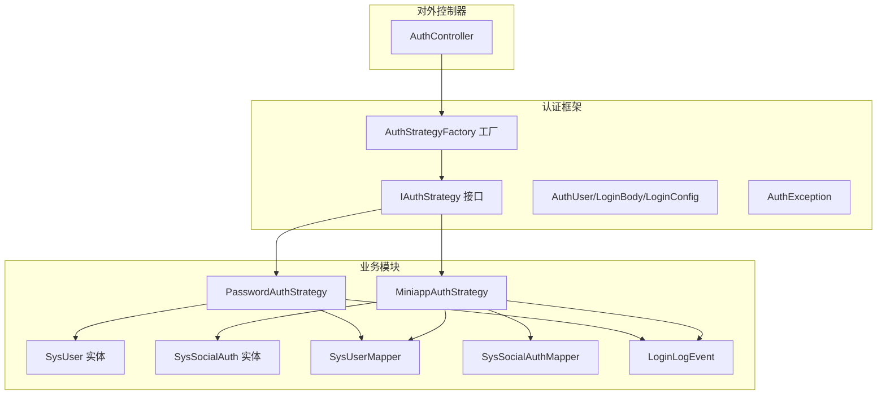
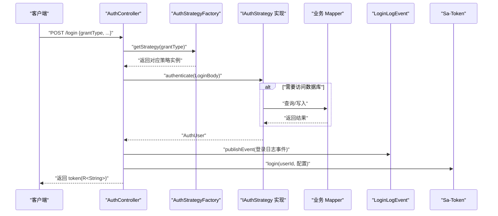
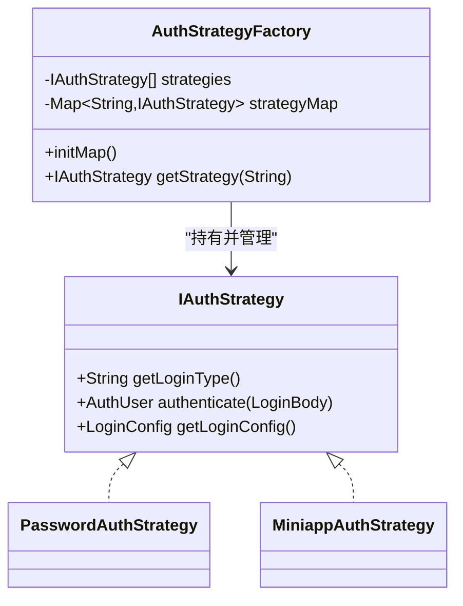
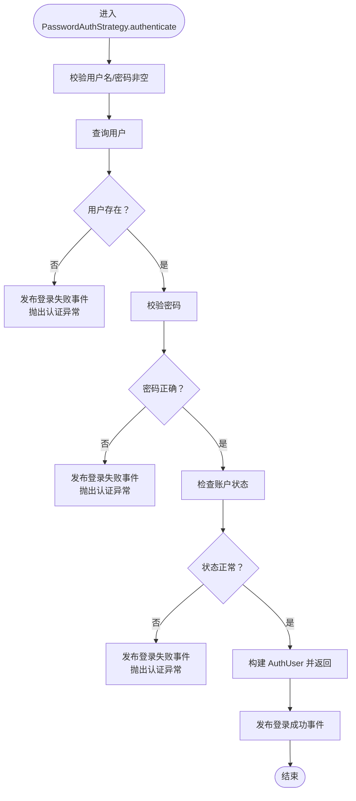
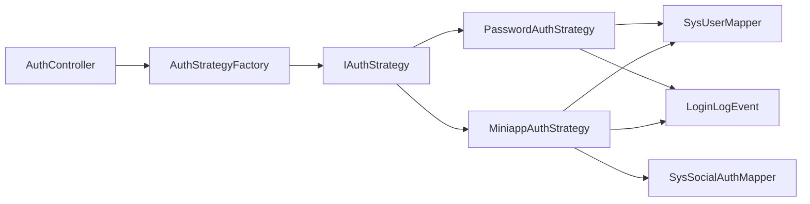

# 扩展开发指南

<cite>
**本文引用的文件**
- [IAuthStrategy.java](file://verulia-framework/verulia-framework-auth/src/main/java/org/yann/verulia/framework/auth/strategy/IAuthStrategy.java)
- [AuthStrategyFactory.java](file://verulia-framework/verulia-framework-auth/src/main/java/org/yann/verulia/framework/auth/strategy/AuthStrategyFactory.java)
- [AuthController.java](file://verulia-admin/src/main/java/org/yann/verulia/controller/AuthController.java)
- [LoginBody.java](file://verulia-framework/verulia-framework-auth/src/main/java/org/yann/verulia/framework/auth/domain/LoginBody.java)
- [AuthUser.java](file://verulia-framework/verulia-framework-auth/src/main/java/org/yann/verulia/framework/auth/domain/AuthUser.java)
- [LoginConfig.java](file://verulia-framework/verulia-framework-auth/src/main/java/org/yann/verulia/framework/auth/domain/LoginConfig.java)
- [AuthException.java](file://verulia-framework/verulia-framework-auth/src/main/java/org/yann/verulia/framework/auth/exception/AuthException.java)
- [PasswordAuthStrategy.java](file://verulia-modules/verulia-system/src/main/java/org/yann/verulia/system/service/strategy/PasswordAuthStrategy.java)
- [MiniappAuthStrategy.java](file://verulia-modules/verulia-system/src/main/java/org/yann/verulia/system/service/strategy/MiniappAuthStrategy.java)
- [LoginLogEvent.java](file://verulia-modules/verulia-system/src/main/java/org/yann/verulia/system/event/LoginLogEvent.java)
- [SysUserMapper.java](file://verulia-modules/verulia-system/src/main/java/org/yann/verulia/system/mapper/SysUserMapper.java)
- [SysSocialAuthMapper.java](file://verulia-modules/verulia-system/src/main/java/org/yann/verulia/system/mapper/SysSocialAuthMapper.java)
- [SysUser.java](file://verulia-modules/verulia-system/src/main/java/org/yann/verulia/system/domain/entity/SysUser.java)
- [SysSocialAuth.java](file://verulia-modules/verulia-system/src/main/java/org/yann/verulia/system/domain/entity/SysSocialAuth.java)
- [R.java](file://verulia-framework/verulia-framework-core/src/main/java/org/yann/verulia/framework/core/domain/R.java)
</cite>

## 目录
1. [简介](#简介)
2. [项目结构](#项目结构)
3. [核心组件](#核心组件)
4. [架构总览](#架构总览)
5. [详细组件分析](#详细组件分析)
6. [依赖关系分析](#依赖关系分析)
7. [性能与可维护性建议](#性能与可维护性建议)
8. [故障排查指南](#故障排查指南)
9. [结论](#结论)
10. [附录：分步教程与最佳实践](#附录分步教程与最佳实践)

## 简介
本指南面向希望向现有系统添加新认证方式的开发者，围绕认证策略扩展展开，目标是帮助你在不破坏既有架构的前提下，快速实现新的认证方式（如短信验证码登录）。文档将：
- 解释如何实现 IAuthStrategy 接口并将其注册到 AuthStrategyFactory
- 对比 PasswordAuthStrategy 与 MiniappAuthStrategy 的实现差异，总结不同认证逻辑的编码模式
- 展示如何利用事件机制（LoginLogEvent）在关键业务节点插入自定义逻辑
- 提供从创建新模块、定义实体、编写 Mapper、实现 Service 到暴露 Controller 接口的完整流程
- 强调遵循项目编码规范与依赖管理原则的重要性

## 项目结构
系统采用多模块划分，认证框架与业务模块分离：
- verulia-framework：通用能力层，包含认证抽象、核心领域模型、异常体系、Web切面等
- verulia-modules：业务模块层，包含系统模块（verulia-system），内含用户、角色、认证策略、Mapper、事件等
- verulia-admin：对外暴露的控制器层，负责接收登录请求并委派给认证策略工厂

图表来源
- [AuthController.java](file://verulia-admin/src/main/java/org/yann/verulia/controller/AuthController.java#L1-L67)
- [AuthStrategyFactory.java](file://verulia-framework/verulia-framework-auth/src/main/java/org/yann/verulia/framework/auth/strategy/AuthStrategyFactory.java#L1-L51)
- [IAuthStrategy.java](file://verulia-framework/verulia-framework-auth/src/main/java/org/yann/verulia/framework/auth/strategy/IAuthStrategy.java#L1-L36)
- [PasswordAuthStrategy.java](file://verulia-modules/verulia-system/src/main/java/org/yann/verulia/system/service/strategy/PasswordAuthStrategy.java#L1-L82)
- [MiniappAuthStrategy.java](file://verulia-modules/verulia-system/src/main/java/org/yann/verulia/system/service/strategy/MiniappAuthStrategy.java#L1-L95)
- [SysUserMapper.java](file://verulia-modules/verulia-system/src/main/java/org/yann/verulia/system/mapper/SysUserMapper.java#L1-L15)
- [SysSocialAuthMapper.java](file://verulia-modules/verulia-system/src/main/java/org/yann/verulia/system/mapper/SysSocialAuthMapper.java#L1-L15)
- [SysUser.java](file://verulia-modules/verulia-system/src/main/java/org/yann/verulia/system/domain/entity/SysUser.java#L1-L70)
- [SysSocialAuth.java](file://verulia-modules/verulia-system/src/main/java/org/yann/verulia/system/domain/entity/SysSocialAuth.java#L1-L62)
- [LoginLogEvent.java](file://verulia-modules/verulia-system/src/main/java/org/yann/verulia/system/event/LoginLogEvent.java#L1-L35)

章节来源
- [AuthController.java](file://verulia-admin/src/main/java/org/yann/verulia/controller/AuthController.java#L1-L67)
- [AuthStrategyFactory.java](file://verulia-framework/verulia-framework-auth/src/main/java/org/yann/verulia/framework/auth/strategy/AuthStrategyFactory.java#L1-L51)

## 核心组件
- 认证策略接口 IAuthStrategy：定义登录类型标识、执行认证、可选的登录配置
- 认证策略工厂 AuthStrategyFactory：基于 Spring 自动注入的策略列表构建映射，并按登录类型获取策略
- 控制器 AuthController：接收登录请求，委派给策略工厂，执行认证并调用 Sa-Token 完成登录态管理
- 认证领域模型：AuthUser、LoginBody、LoginConfig
- 业务实体与 Mapper：SysUser、SysSocialAuth 及其 Mapper
- 事件 LoginLogEvent：用于在认证关键节点发布登录日志事件
- 异常 AuthException：统一的认证异常类型

章节来源
- [IAuthStrategy.java](file://verulia-framework/verulia-framework-auth/src/main/java/org/yann/verulia/framework/auth/strategy/IAuthStrategy.java#L1-L36)
- [AuthStrategyFactory.java](file://verulia-framework/verulia-framework-auth/src/main/java/org/yann/verulia/framework/auth/strategy/AuthStrategyFactory.java#L1-L51)
- [AuthController.java](file://verulia-admin/src/main/java/org/yann/verulia/controller/AuthController.java#L1-L67)
- [AuthUser.java](file://verulia-framework/verulia-framework-auth/src/main/java/org/yann/verulia/framework/auth/domain/AuthUser.java#L1-L41)
- [LoginBody.java](file://verulia-framework/verulia-framework-auth/src/main/java/org/yann/verulia/framework/auth/domain/LoginBody.java#L1-L59)
- [LoginConfig.java](file://verulia-framework/verulia-framework-auth/src/main/java/org/yann/verulia/framework/auth/domain/LoginConfig.java#L1-L34)
- [LoginLogEvent.java](file://verulia-modules/verulia-system/src/main/java/org/yann/verulia/system/event/LoginLogEvent.java#L1-L35)
- [AuthException.java](file://verulia-framework/verulia-framework-auth/src/main/java/org/yann/verulia/framework/auth/exception/AuthException.java#L1-L17)

## 架构总览
下图展示了登录请求从控制器到策略工厂再到具体策略的调用链路，以及认证完成后与 Sa-Token 的交互。

图表来源
- [AuthController.java](file://verulia-admin/src/main/java/org/yann/verulia/controller/AuthController.java#L1-L67)
- [AuthStrategyFactory.java](file://verulia-framework/verulia-framework-auth/src/main/java/org/yann/verulia/framework/auth/strategy/AuthStrategyFactory.java#L1-L51)
- [IAuthStrategy.java](file://verulia-framework/verulia-framework-auth/src/main/java/org/yann/verulia/framework/auth/strategy/IAuthStrategy.java#L1-L36)
- [PasswordAuthStrategy.java](file://verulia-modules/verulia-system/src/main/java/org/yann/verulia/system/service/strategy/PasswordAuthStrategy.java#L1-L82)
- [MiniappAuthStrategy.java](file://verulia-modules/verulia-system/src/main/java/org/yann/verulia/system/service/strategy/MiniappAuthStrategy.java#L1-L95)
- [SysUserMapper.java](file://verulia-modules/verulia-system/src/main/java/org/yann/verulia/system/mapper/SysUserMapper.java#L1-L15)
- [SysSocialAuthMapper.java](file://verulia-modules/verulia-system/src/main/java/org/yann/verulia/system/mapper/SysSocialAuthMapper.java#L1-L15)
- [LoginLogEvent.java](file://verulia-modules/verulia-system/src/main/java/org/yann/verulia/system/event/LoginLogEvent.java#L1-L35)
- [R.java](file://verulia-framework/verulia-framework-core/src/main/java/org/yann/verulia/framework/core/domain/R.java#L1-L101)

## 详细组件分析

### IAuthStrategy 接口与 AuthStrategyFactory 工厂
- IAuthStrategy 定义了三个关键点：登录类型标识、认证执行入口、可选的登录配置
- AuthStrategyFactory 使用构造注入收集所有 IAuthStrategy 实例，启动时构建“登录类型 -> 策略实例”的映射；当请求到来时根据 grantType 获取策略并执行认证
- 工厂对未知登录类型的处理：抛出非法参数异常，便于快速定位问题

图表来源
- [IAuthStrategy.java](file://verulia-framework/verulia-framework-auth/src/main/java/org/yann/verulia/framework/auth/strategy/IAuthStrategy.java#L1-L36)
- [AuthStrategyFactory.java](file://verulia-framework/verulia-framework-auth/src/main/java/org/yann/verulia/framework/auth/strategy/AuthStrategyFactory.java#L1-L51)
- [PasswordAuthStrategy.java](file://verulia-modules/verulia-system/src/main/java/org/yann/verulia/system/service/strategy/PasswordAuthStrategy.java#L1-L82)
- [MiniappAuthStrategy.java](file://verulia-modules/verulia-system/src/main/java/org/yann/verulia/system/service/strategy/MiniappAuthStrategy.java#L1-L95)

章节来源
- [IAuthStrategy.java](file://verulia-framework/verulia-framework-auth/src/main/java/org/yann/verulia/framework/auth/strategy/IAuthStrategy.java#L1-L36)
- [AuthStrategyFactory.java](file://verulia-framework/verulia-framework-auth/src/main/java/org/yann/verulia/framework/auth/strategy/AuthStrategyFactory.java#L1-L51)

### PasswordAuthStrategy 与 MiniappAuthStrategy 的实现对比
- 共同点
  - 都实现 IAuthStrategy，提供 getLoginType 与 authenticate
  - 都通过 ApplicationEventPublisher 发布 LoginLogEvent 事件
  - 都在认证失败时抛出 AuthException
- 不同点
  - PasswordAuthStrategy：基于用户名密码校验，访问 SysUserMapper 查询用户并校验状态；支持 LoginConfig 返回登录配置（设备类型、超时、是否并发）
  - MiniappAuthStrategy：基于微信小程序 code 获取会话，访问第三方服务获取 openid；若未绑定则自动注册用户并建立社交绑定关系；使用事务确保用户与社交绑定的一致性

图表来源
- [PasswordAuthStrategy.java](file://verulia-modules/verulia-system/src/main/java/org/yann/verulia/system/service/strategy/PasswordAuthStrategy.java#L1-L82)
- [SysUserMapper.java](file://verulia-modules/verulia-system/src/main/java/org/yann/verulia/system/mapper/SysUserMapper.java#L1-L15)
- [LoginLogEvent.java](file://verulia-modules/verulia-system/src/main/java/org/yann/verulia/system/event/LoginLogEvent.java#L1-L35)
- [AuthException.java](file://verulia-framework/verulia-framework-auth/src/main/java/org/yann/verulia/framework/auth/exception/AuthException.java#L1-L17)

章节来源
- [PasswordAuthStrategy.java](file://verulia-modules/verulia-system/src/main/java/org/yann/verulia/system/service/strategy/PasswordAuthStrategy.java#L1-L82)
- [MiniappAuthStrategy.java](file://verulia-modules/verulia-system/src/main/java/org/yann/verulia/system/service/strategy/MiniappAuthStrategy.java#L1-L95)

### 事件机制：LoginLogEvent 的使用
- 在认证失败与成功的关键节点发布事件，便于审计与日志记录
- 事件包含用户名、是否成功、消息描述，便于下游监听器进行差异化处理

章节来源
- [LoginLogEvent.java](file://verulia-modules/verulia-system/src/main/java/org/yann/verulia/system/event/LoginLogEvent.java#L1-L35)
- [PasswordAuthStrategy.java](file://verulia-modules/verulia-system/src/main/java/org/yann/verulia/system/service/strategy/PasswordAuthStrategy.java#L1-L82)
- [MiniappAuthStrategy.java](file://verulia-modules/verulia-system/src/main/java/org/yann/verulia/system/service/strategy/MiniappAuthStrategy.java#L1-L95)

### 控制器与登录流程
- AuthController 接收 LoginBody，通过 AuthStrategyFactory 获取策略并执行认证
- 根据策略返回的 LoginConfig 设置 Sa-Token 登录参数（设备类型、超时、是否并发）
- 登录成功后缓存用户信息并返回 token

章节来源
- [AuthController.java](file://verulia-admin/src/main/java/org/yann/verulia/controller/AuthController.java#L1-L67)
- [AuthStrategyFactory.java](file://verulia-framework/verulia-framework-auth/src/main/java/org/yann/verulia/framework/auth/strategy/AuthStrategyFactory.java#L1-L51)
- [LoginConfig.java](file://verulia-framework/verulia-framework-auth/src/main/java/org/yann/verulia/framework/auth/domain/LoginConfig.java#L1-L34)
- [R.java](file://verulia-framework/verulia-framework-core/src/main/java/org/yann/verulia/framework/core/domain/R.java#L1-L101)

## 依赖关系分析
- 控制器依赖工厂与策略接口，策略实现依赖 Mapper 与事件发布器
- 工厂通过构造注入收集策略，Spring 容器自动装配，避免手动注册
- 策略实现之间无直接耦合，仅通过接口与工厂解耦

图表来源
- [AuthController.java](file://verulia-admin/src/main/java/org/yann/verulia/controller/AuthController.java#L1-L67)
- [AuthStrategyFactory.java](file://verulia-framework/verulia-framework-auth/src/main/java/org/yann/verulia/framework/auth/strategy/AuthStrategyFactory.java#L1-L51)
- [IAuthStrategy.java](file://verulia-framework/verulia-framework-auth/src/main/java/org/yann/verulia/framework/auth/strategy/IAuthStrategy.java#L1-L36)
- [PasswordAuthStrategy.java](file://verulia-modules/verulia-system/src/main/java/org/yann/verulia/system/service/strategy/PasswordAuthStrategy.java#L1-L82)
- [MiniappAuthStrategy.java](file://verulia-modules/verulia-system/src/main/java/org/yann/verulia/system/service/strategy/MiniappAuthStrategy.java#L1-L95)
- [SysUserMapper.java](file://verulia-modules/verulia-system/src/main/java/org/yann/verulia/system/mapper/SysUserMapper.java#L1-L15)
- [SysSocialAuthMapper.java](file://verulia-modules/verulia-system/src/main/java/org/yann/verulia/system/mapper/SysSocialAuthMapper.java#L1-L15)
- [LoginLogEvent.java](file://verulia-modules/verulia-system/src/main/java/org/yann/verulia/system/event/LoginLogEvent.java#L1-L35)

## 性能与可维护性建议
- 策略数量增长时，注意工厂初始化的性能与日志输出
- 认证过程中尽量减少不必要的数据库往返，必要时使用批量查询或缓存
- 事件发布为异步化场景留出空间，避免阻塞认证主流程
- 登录配置按需设置，避免过度定制导致复杂度上升

[本节为通用建议，无需列出章节来源]

## 故障排查指南
- 无法找到策略：检查 LoginBody.grantType 是否与策略 getLoginType 返回值一致
- 认证异常：捕获 AuthException 并结合 LoginLogEvent 的消息定位问题
- 第三方服务调用失败：关注 MiniappAuthStrategy 中的异常分支与日志
- 登录配置无效：确认 LoginConfig 的字段是否被正确传递至 Sa-Token 登录参数

章节来源
- [AuthStrategyFactory.java](file://verulia-framework/verulia-framework-auth/src/main/java/org/yann/verulia/framework/auth/strategy/AuthStrategyFactory.java#L1-L51)
- [AuthException.java](file://verulia-framework/verulia-framework-auth/src/main/java/org/yann/verulia/framework/auth/exception/AuthException.java#L1-L17)
- [MiniappAuthStrategy.java](file://verulia-modules/verulia-system/src/main/java/org/yann/verulia/system/service/strategy/MiniappAuthStrategy.java#L1-L95)
- [LoginLogEvent.java](file://verulia-modules/verulia-system/src/main/java/org/yann/verulia/system/event/LoginLogEvent.java#L1-L35)

## 结论
通过策略接口与工厂模式，系统实现了认证扩展的高内聚、低耦合设计。新增认证方式只需实现 IAuthStrategy 并交由 Spring 管理，即可自动纳入工厂映射，无需改动控制器与核心流程。配合事件机制与 LoginConfig，可以在不侵入主流程的情况下完成审计与登录态配置。

[本节为总结，无需列出章节来源]

## 附录：分步教程与最佳实践

### 一、新增认证方式：短信验证码登录
以下步骤以“短信验证码登录”为例，指导你从零开始扩展一个新认证策略。

1. 新建策略类
- 在业务模块中新建策略类，实现 IAuthStrategy
- 实现 getLoginType 返回唯一的登录类型标识（如 "sms"）
- 实现 authenticate：读取 LoginBody 中的手机号与验证码字段，校验验证码有效性，查询用户并返回 AuthUser
- 如需登录配置，重写 getLoginConfig 返回 LoginConfig

参考路径
- [IAuthStrategy.java](file://verulia-framework/verulia-framework-auth/src/main/java/org/yann/verulia/framework/auth/strategy/IAuthStrategy.java#L1-L36)
- [LoginBody.java](file://verulia-framework/verulia-framework-auth/src/main/java/org/yann/verulia/framework/auth/domain/LoginBody.java#L1-L59)
- [AuthUser.java](file://verulia-framework/verulia-framework-auth/src/main/java/org/yann/verulia/framework/auth/domain/AuthUser.java#L1-L41)
- [LoginConfig.java](file://verulia-framework/verulia-framework-auth/src/main/java/org/yann/verulia/framework/auth/domain/LoginConfig.java#L1-L34)

2. 注册策略
- 将策略类标记为 Spring 组件（如 @Component），使其被自动注入到 AuthStrategyFactory 的策略列表中
- 无需手动注册，工厂会在启动时扫描并构建映射

参考路径
- [AuthStrategyFactory.java](file://verulia-framework/verulia-framework-auth/src/main/java/org/yann/verulia/framework/auth/strategy/AuthStrategyFactory.java#L1-L51)

3. 数据访问与事务
- 若需要访问用户或社交绑定数据，引入对应的 Mapper（如 SysUserMapper、SysSocialAuthMapper）
- 若涉及多表一致性，使用事务注解保证原子性

参考路径
- [SysUserMapper.java](file://verulia-modules/verulia-system/src/main/java/org/yann/verulia/system/mapper/SysUserMapper.java#L1-L15)
- [SysSocialAuthMapper.java](file://verulia-modules/verulia-system/src/main/java/org/yann/verulia/system/mapper/SysSocialAuthMapper.java#L1-L15)
- [SysUser.java](file://verulia-modules/verulia-system/src/main/java/org/yann/verulia/system/domain/entity/SysUser.java#L1-L70)
- [SysSocialAuth.java](file://verulia-modules/verulia-system/src/main/java/org/yann/verulia/system/domain/entity/SysSocialAuth.java#L1-L62)

4. 事件与日志
- 在认证成功与失败的关键节点发布 LoginLogEvent，便于审计与监控

参考路径
- [LoginLogEvent.java](file://verulia-modules/verulia-system/src/main/java/org/yann/verulia/system/event/LoginLogEvent.java#L1-L35)

5. 对接控制器
- 控制器无需改动，只要 LoginBody.grantType 与策略 getLoginType 返回值一致，即可自动生效
- 登录配置可通过策略的 getLoginConfig 返回，控制器会自动应用

参考路径
- [AuthController.java](file://verulia-admin/src/main/java/org/yann/verulia/controller/AuthController.java#L1-L67)

6. 编码规范与依赖管理
- 遵循模块边界：认证策略放在业务模块，框架层只保留抽象与通用能力
- 依赖倒置：策略实现依赖接口与 Mapper，不反向依赖控制器
- 异常统一：认证失败抛出 AuthException，便于上层统一处理
- 响应统一：控制器返回 R<T>，保持接口风格一致

参考路径
- [AuthException.java](file://verulia-framework/verulia-framework-auth/src/main/java/org/yann/verulia/framework/auth/exception/AuthException.java#L1-L17)
- [R.java](file://verulia-framework/verulia-framework-core/src/main/java/org/yann/verulia/framework/core/domain/R.java#L1-L101)

### 二、对比分析：PasswordAuthStrategy 与 MiniappAuthStrategy
- 输入参数差异：前者使用用户名/密码，后者使用 code；LoginBody 对两者都兼容
- 数据访问差异：前者仅访问用户表，后者访问用户与社交绑定表，并可能创建新用户
- 事务差异：MiniappAuthStrategy 使用事务确保用户与社交绑定的一致性
- 登录配置：PasswordAuthStrategy 提供 LoginConfig，MiniappAuthStrategy 当前未覆盖

章节来源
- [PasswordAuthStrategy.java](file://verulia-modules/verulia-system/src/main/java/org/yann/verulia/system/service/strategy/PasswordAuthStrategy.java#L1-L82)
- [MiniappAuthStrategy.java](file://verulia-modules/verulia-system/src/main/java/org/yann/verulia/system/service/strategy/MiniappAuthStrategy.java#L1-L95)
- [LoginBody.java](file://verulia-framework/verulia-framework-auth/src/main/java/org/yann/verulia/framework/auth/domain/LoginBody.java#L1-L59)

### 三、从零到上线：完整流程清单
- 创建策略类并实现 IAuthStrategy
- 定义实体与 Mapper（如需）
- 在策略中注入 Mapper 并实现认证逻辑
- 发布 LoginLogEvent 事件
- 返回 AuthUser 并可选地返回 LoginConfig
- 启动验证：使用 /login 接口，grantType 指定为你的策略标识
- 文档与测试：补充接口文档与单元测试

章节来源
- [AuthController.java](file://verulia-admin/src/main/java/org/yann/verulia/controller/AuthController.java#L1-L67)
- [AuthStrategyFactory.java](file://verulia-framework/verulia-framework-auth/src/main/java/org/yann/verulia/framework/auth/strategy/AuthStrategyFactory.java#L1-L51)
- [IAuthStrategy.java](file://verulia-framework/verulia-framework-auth/src/main/java/org/yann/verulia/framework/auth/strategy/IAuthStrategy.java#L1-L36)