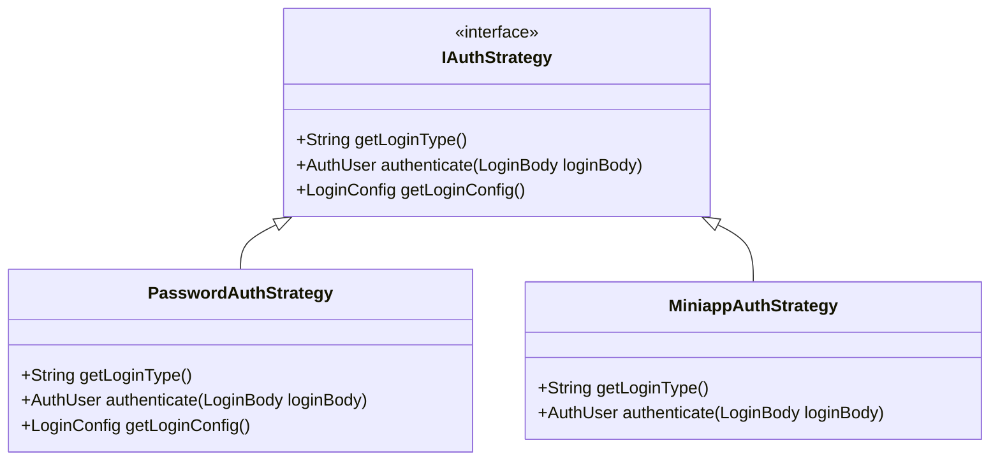
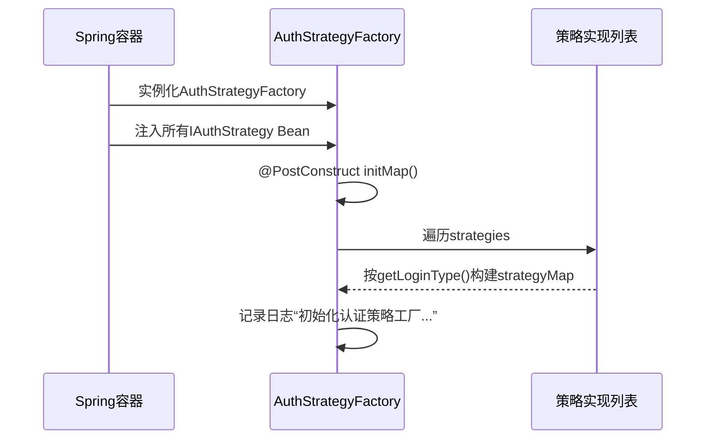
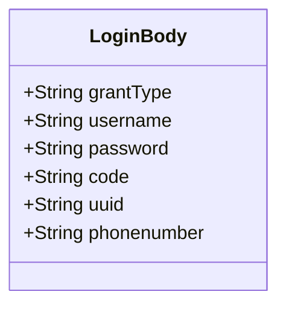
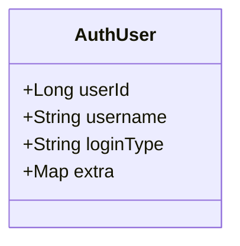
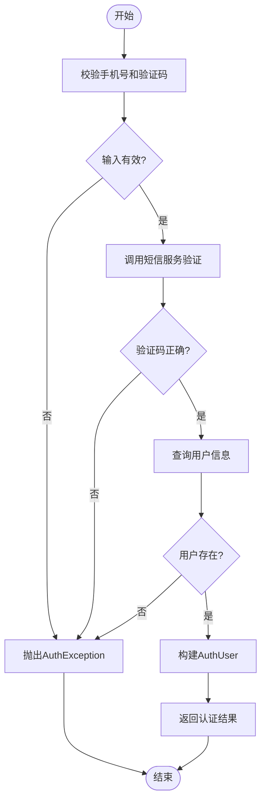
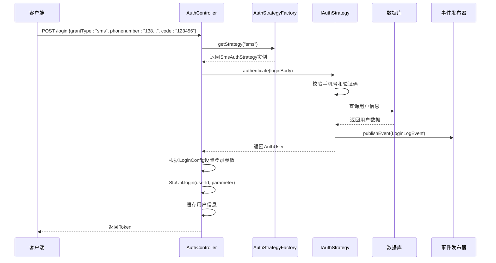

# 新增认证方式

<cite>
**本文档引用的文件**  
- [IAuthStrategy.java](file://verulia-framework/verulia-framework-auth/src/main/java/org/yann/verulia/framework/auth/strategy/IAuthStrategy.java)
- [AuthStrategyFactory.java](file://verulia-framework/verulia-framework-auth/src/main/java/org/yann/verulia/framework/auth/strategy/AuthStrategyFactory.java)
- [LoginBody.java](file://verulia-framework/verulia-framework-auth/src/main/java/org/yann/verulia/framework/auth/domain/LoginBody.java)
- [AuthUser.java](file://verulia-framework/verulia-framework-auth/src/main/java/org/yann/verulia/framework/auth/domain/AuthUser.java)
- [AuthException.java](file://verulia-framework/verulia-framework-auth/src/main/java/org/yann/verulia/framework/auth/exception/AuthException.java)
- [PasswordAuthStrategy.java](file://verulia-modules/verulia-system/src/main/java/org/yann/verulia/system/service/strategy/PasswordAuthStrategy.java)
- [MiniappAuthStrategy.java](file://verulia-modules/verulia-system/src/main/java/org/yann/verulia/system/service/strategy/MiniappAuthStrategy.java)
- [AuthController.java](file://verulia-admin/src/main/java/org/yann/verulia/controller/AuthController.java)
- [LoginConfig.java](file://verulia-framework/verulia-framework-auth/src/main/java/org/yann/verulia/framework/auth/domain/LoginConfig.java)
- [LoginLogEvent.java](file://verulia-modules/verulia-system/src/main/java/org/yann/verulia/system/event/LoginLogEvent.java)
- [SysUser.java](file://verulia-modules/verulia-system/src/main/java/org/yann/verulia/system/domain/entity/SysUser.java)
- [SysSocialAuth.java](file://verulia-modules/verulia-system/src/main/java/org/yann/verulia/system/domain/entity/SysSocialAuth.java)
- [SecurityConfig.java](file://verulia-framework/verulia-framework-security/src/main/java/org/yann/verulia/framework/security/config/SecurityConfig.java)
</cite>

## 目录
1. [引言](#引言)
2. [核心组件](#核心组件)
3. [认证策略接口设计](#认证策略接口设计)
4. [认证策略工厂机制](#认证策略工厂机制)
5. [登录参数对象结构](#登录参数对象结构)
6. [统一认证结果模型](#统一认证结果模型)
7. [具体认证策略实现对比](#具体认证策略实现对比)
8. [新增短信验证码认证方式](#新增短信验证码认证方式)
9. [新增第三方OAuth认证方式](#新增第三方oauth认证方式)
10. [异常处理与日志记录](#异常处理与日志记录)
11. [依赖注入与自动注册机制](#依赖注入与自动注册机制)
12. [完整实现流程图](#完整实现流程图)

## 引言
本文档旨在指导开发者如何在现有系统中扩展新的认证方式，如短信验证码登录或第三方OAuth登录。通过分析`IAuthStrategy`接口的设计、`AuthStrategyFactory`的策略管理机制以及`LoginBody`和`AuthUser`等核心数据模型，详细说明如何实现自定义认证逻辑，并确保其无缝集成到系统中。

## 核心组件

本文档涉及的核心组件包括认证策略接口、策略工厂、登录参数对象、认证结果模型、异常处理机制及Spring依赖注入流程。这些组件共同构成了灵活可扩展的认证体系。

**本节来源**  
- [IAuthStrategy.java](file://verulia-framework/verulia-framework-auth/src/main/java/org/yann/verulia/framework/auth/strategy/IAuthStrategy.java)
- [AuthStrategyFactory.java](file://verulia-framework/verulia-framework-auth/src/main/java/org/yann/verulia/framework/auth/strategy/AuthStrategyFactory.java)
- [LoginBody.java](file://verulia-framework/verulia-framework-auth/src/main/java/org/yann/verulia/framework/auth/domain/LoginBody.java)
- [AuthUser.java](file://verulia-framework/verulia-framework-auth/src/main/java/org/yann/verulia/framework/auth/domain/AuthUser.java)

## 认证策略接口设计

`IAuthStrategy`是所有认证方式必须实现的核心接口，定义了认证行为的基本契约：

- `getLoginType()`：返回该策略对应的登录类型标识（如"password"、"sms"、"miniapp"），用于路由不同认证请求。
- `authenticate(LoginBody loginBody)`：执行实际认证逻辑，返回认证后的用户信息。
- `getLoginConfig()`：可选方法，用于返回特定于该认证方式的配置（如超时时间、设备类型等）。

该接口采用策略模式，允许系统动态选择和执行不同的认证逻辑。



**图示来源**  
- [IAuthStrategy.java](file://verulia-framework/verulia-framework-auth/src/main/java/org/yann/verulia/framework/auth/strategy/IAuthStrategy.java)
- [PasswordAuthStrategy.java](file://verulia-modules/verulia-system/src/main/java/org/yann/verulia/system/service/strategy/PasswordAuthStrategy.java)
- [MiniappAuthStrategy.java](file://verulia-modules/verulia-system/src/main/java/org/yann/verulia/system/service/strategy/MiniappAuthStrategy.java)

## 认证策略工厂机制

`AuthStrategyFactory`负责管理和分发认证策略实例。其关键特性如下：

- 使用`@Component`注解由Spring容器管理。
- 通过构造函数注入所有实现了`IAuthStrategy`接口的Bean。
- 利用`@PostConstruct`注解的`initMap()`方法，在Spring上下文初始化完成后，将所有策略按`loginType`注册到`ConcurrentHashMap`中。
- `getStrategy(String loginType)`方法根据传入的类型查找并返回对应策略，若未找到则抛出`IllegalArgumentException`。

这种设计实现了策略的自动发现与注册，无需手动维护策略映射。



**图示来源**  
- [AuthStrategyFactory.java](file://verulia-framework/verulia-framework-auth/src/main/java/org/yann/verulia/framework/auth/strategy/AuthStrategyFactory.java)

**本节来源**  
- [AuthStrategyFactory.java](file://verulia-framework/verulia-framework-auth/src/main/java/org/yann/verulia/framework/auth/strategy/AuthStrategyFactory.java)

## 登录参数对象结构

`LoginBody`类作为统一的登录请求参数载体，采用包容性设计以适应多种认证场景：

- `grantType`：必填字段，指定认证类型（如"password"、"sms"、"miniapp"），默认为"password"。
- `username` 和 `password`：用于密码认证。
- `code`：通用验证码字段，可用于图形验证码、短信验证码或小程序登录的code。
- `uuid`：用于关联图形验证码的唯一标识。
- `phonenumber`：专用于短信验证码登录的手机号字段。

该设计避免了为每种认证方式创建独立DTO，提高了接口的通用性和可维护性。



**图示来源**  
- [LoginBody.java](file://verulia-framework/verulia-framework-auth/src/main/java/org/yann/verulia/framework/auth/domain/LoginBody.java)

**本节来源**  
- [LoginBody.java](file://verulia-framework/verulia-framework-auth/src/main/java/org/yann/verulia/framework/auth/domain/LoginBody.java)

## 统一认证结果模型

`AuthUser`是所有认证策略返回的标准化用户信息模型，确保上层逻辑处理的一致性：

- `userId` 和 `username`：基础用户标识。
- `loginType`：记录本次登录所使用的认证方式。
- `extra`：扩展字段，允许携带头像、部门ID等业务相关数据。

该模型作为认证成功后的统一输出，被`AuthController`用于生成和缓存会话。



**图示来源**  
- [AuthUser.java](file://verulia-framework/verulia-framework-auth/src/main/java/org/yann/verulia/framework/auth/domain/AuthUser.java)

**本节来源**  
- [AuthUser.java](file://verulia-framework/verulia-framework-auth/src/main/java/org/yann/verulia/framework/auth/domain/AuthUser.java)

## 具体认证策略实现对比

通过对比`PasswordAuthStrategy`和`MiniappAuthStrategy`，可以清晰地看到不同认证逻辑的编码范式差异。

### 密码认证策略 (PasswordAuthStrategy)
- **认证逻辑**：验证用户名密码，查询数据库并比对哈希密码。
- **安全处理**：使用`SecureUtil.sha256`进行密码加密。
- **状态检查**：校验用户是否存在、密码是否正确、账号是否启用。
- **日志事件**：发布`LoginLogEvent`记录登录结果。
- **配置返回**：重写`getLoginConfig()`，指定PC端登录、2小时超时、允许并发。

### 小程序认证策略 (MiniappAuthStrategy)
- **认证逻辑**：调用微信API，通过code换取session信息，获取openid。
- **用户绑定**：若openid未绑定，则自动创建新用户并关联。
- **事务管理**：`@Transactional`确保用户注册与社交账号绑定的原子性。
- **异常处理**：捕获`WxErrorException`并转换为`AuthException`。
- **配置返回**：使用默认配置（返回null）。

两者均实现了`IAuthStrategy`接口，但根据各自场景定制了`authenticate`方法的内部逻辑。

**本节来源**  
- [PasswordAuthStrategy.java](file://verulia-modules/verulia-system/src/main/java/org/yann/verulia/system/service/strategy/PasswordAuthStrategy.java)
- [MiniappAuthStrategy.java](file://verulia-modules/verulia-system/src/main/java/org/yann/verulia/system/service/strategy/MiniappAuthStrategy.java)

## 新增短信验证码认证方式

要实现短信验证码登录，需创建新的策略类：

1. 创建`SmsAuthStrategy`类并实现`IAuthStrategy`接口。
2. `getLoginType()`返回"**sms**"。
3. `authenticate(LoginBody loginBody)`中：
   - 校验`phonenumber`和`code`非空。
   - 调用短信服务验证验证码是否正确且未过期。
   - 查询手机号对应的用户信息。
   - 若验证成功，返回`AuthUser`。
4. 使用`@Component`注解，确保被Spring扫描并注入到`AuthStrategyFactory`。



**图示来源**  
- [IAuthStrategy.java](file://verulia-framework/verulia-framework-auth/src/main/java/org/yann/verulia/framework/auth/strategy/IAuthStrategy.java)
- [LoginBody.java](file://verulia-framework/verulia-framework-auth/src/main/java/org/yann/verulia/framework/auth/domain/LoginBody.java)

## 新增第三方OAuth认证方式

实现第三方OAuth（如微信、QQ）登录的步骤如下：

1. 创建`OAuthAuthStrategy`类实现`IAuthStrategy`。
2. `getLoginType()`返回如"**wechat**"。
3. `authenticate(LoginBody loginBody)`中：
   - 获取`code`（OAuth授权码）。
   - 调用第三方OAuth API，用`code`换取access_token和用户信息。
   - 从用户信息中提取唯一标识（如openid）。
   - 在`sys_social_auth`表中查找绑定的本地用户。
   - 若未绑定，可选择自动注册或引导用户绑定。
   - 返回`AuthUser`。
4. 同样使用`@Component`注解实现自动注册。

此模式与`MiniappAuthStrategy`高度相似，体现了策略模式的复用性。

**本节来源**  
- [MiniappAuthStrategy.java](file://verulia-modules/verulia-system/src/main/java/org/yann/verulia/system/service/strategy/MiniappAuthStrategy.java)
- [SysSocialAuth.java](file://verulia-modules/verulia-system/src/main/java/org/yann/verulia/system/domain/entity/SysSocialAuth.java)

## 异常处理与日志记录

系统采用统一的异常处理机制：

- 所有认证异常均抛出`AuthException`，继承自`BusinessException`。
- `AuthException`构造函数接收错误消息，便于前端展示。
- 在`authenticate`方法中，对各种失败场景（如参数为空、用户不存在、验证码错误）进行预判并抛出相应异常。
- 使用`@Slf4j`注解的日志记录器，在关键步骤输出调试信息。
- 通过`ApplicationEventPublisher`发布`LoginLogEvent`，实现登录日志的解耦记录。

```mermaid
flowchart TD
A["认证逻辑"] --> B{"发生错误?"}
B --> |是| C["throw new AuthException(\"错误信息\")"]
C --> D["GlobalExceptionHandler捕获"]
D --> E["返回R.error()响应"]
B --> |否| F["返回AuthUser"]
```

**图示来源**  
- [AuthException.java](file://verulia-framework/verulia-framework-auth/src/main/java/org/yann/verulia/framework/auth/exception/AuthException.java)
- [LoginLogEvent.java](file://verulia-modules/verulia-system/src/main/java/org/yann/verulia/system/event/LoginLogEvent.java)
- [PasswordAuthStrategy.java](file://verulia-modules/verulia-system/src/main/java/org/yann/verulia/system/service/strategy/PasswordAuthStrategy.java)

## 依赖注入与自动注册机制

新认证策略的注册完全依赖Spring的依赖注入和生命周期管理：

1. 开发者实现`IAuthStrategy`接口并添加`@Component`注解。
2. Spring在启动时扫描到该Bean，并将其纳入IoC容器。
3. `AuthStrategyFactory`的构造函数声明`List<IAuthStrategy>`依赖，Spring自动注入所有匹配的Bean。
4. `@PostConstruct`注解的`initMap()`方法被执行，将所有策略按`loginType`放入`strategyMap`。
5. 当`AuthController`调用`authStrategyFactory.getStrategy()`时，即可正确路由到新策略。

此机制无需修改任何配置文件或工厂代码，实现了真正的“开箱即用”。

```mermaid
graph TD
A["SmsAuthStrategy @Component"] --> B["Spring容器"]
C["MiniappAuthStrategy @Component"] --> B
D["PasswordAuthStrategy @Component"] --> B
B --> E["AuthStrategyFactory 构造函数注入List<IAuthStrategy>"]
E --> F["@PostConstruct initMap()"]
F --> G["strategyMap.put(\"sms\", smsStrategy)"]
G --> H["strategyMap.put(\"miniapp\", miniappStrategy)"]
H --> I["strategyMap.put(\"password\", passwordStrategy)"]
```

**图示来源**  
- [AuthStrategyFactory.java](file://verulia-framework/verulia-framework-auth/src/main/java/org/yann/verulia/framework/auth/strategy/AuthStrategyFactory.java)
- [AuthController.java](file://verulia-admin/src/main/java/org/yann/verulia/controller/AuthController.java)

**本节来源**  
- [AuthStrategyFactory.java](file://verulia-framework/verulia-framework-auth/src/main/java/org/yann/verulia/framework/auth/strategy/AuthStrategyFactory.java)
- [AuthController.java](file://verulia-admin/src/main/java/org/yann/verulia/controller/AuthController.java)

## 完整实现流程图



**图示来源**  
- [AuthController.java](file://verulia-admin/src/main/java/org/yann/verulia/controller/AuthController.java)
- [AuthStrategyFactory.java](file://verulia-framework/verulia-framework-auth/src/main/java/org/yann/verulia/framework/auth/strategy/AuthStrategyFactory.java)
- [IAuthStrategy.java](file://verulia-framework/verulia-framework-auth/src/main/java/org/yann/verulia/framework/auth/strategy/IAuthStrategy.java)