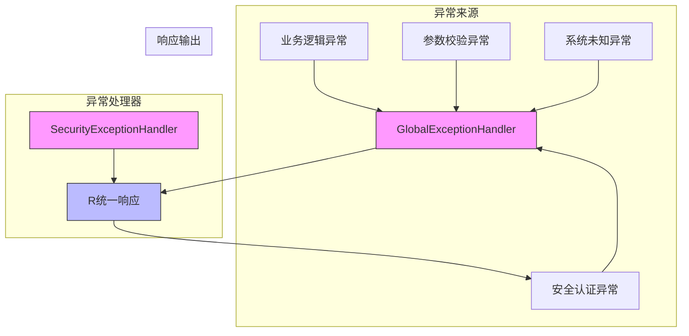
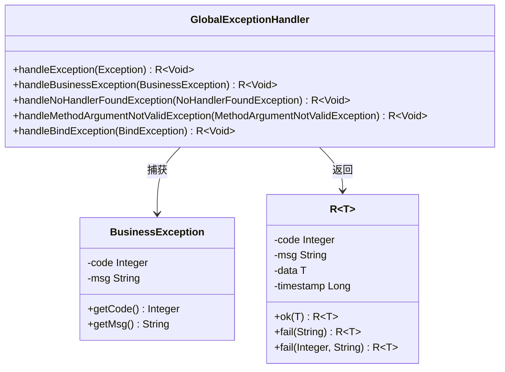
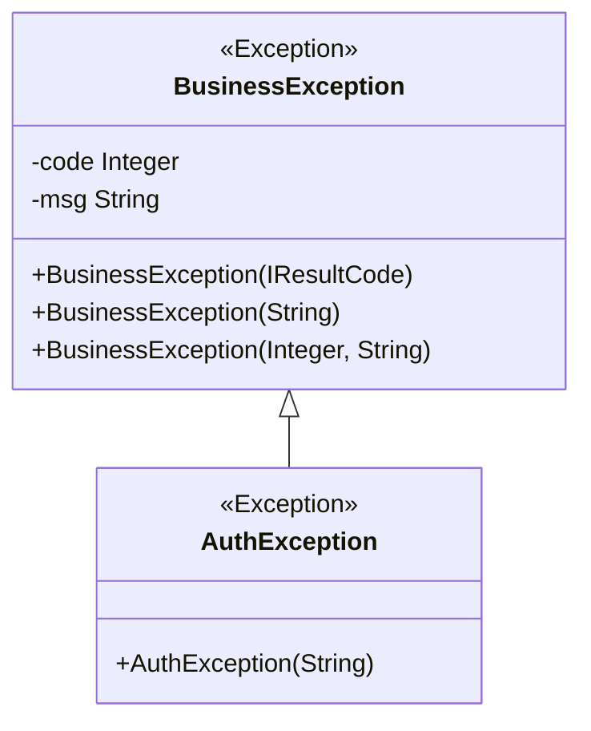
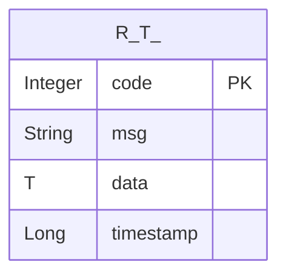
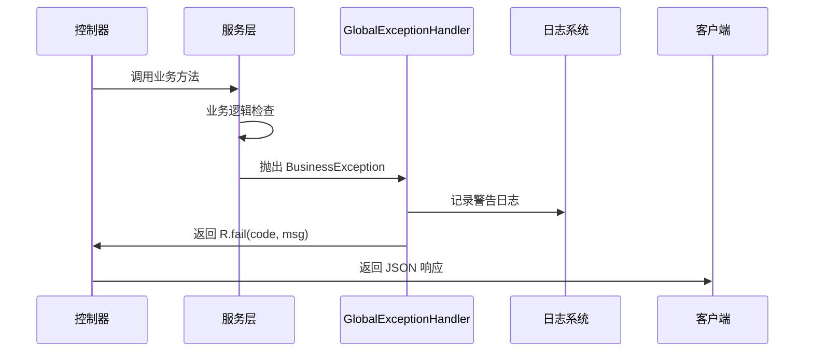

# 自定义异常处理

<cite>
**本文档引用的文件**  
- [GlobalExceptionHandler.java](file://verulia-framework/verulia-framework-web/src/main/java/org/yann/verulia/framework/web/handler/GlobalExceptionHandler.java)
- [R.java](file://verulia-framework/verulia-framework-core/src/main/java/org/yann/verulia/framework/core/domain/R.java)
- [BusinessException.java](file://verulia-framework/verulia-framework-core/src/main/java/org/yann/verulia/framework/core/exception/BusinessException.java)
- [AuthException.java](file://verulia-framework/verulia-framework-auth/src/main/java/org/yann/verulia/framework/auth/exception/AuthException.java)
- [SecurityExceptionHandler.java](file://verulia-framework/verulia-framework-security/src/main/java/org/yann/verulia/framework/security/handler/SecurityExceptionHandler.java)
- [ResultCode.java](file://verulia-framework/verulia-framework-core/src/main/java/org/yann/verulia/framework/core/enums/ResultCode.java)
- [WebLogAspect.java](file://verulia-framework/verulia-framework-web/src/main/java/org/yann/verulia/framework/web/aspect/WebLogAspect.java)
- [SysUserServiceImpl.java](file://verulia-modules/verulia-system/src/main/java/org/yann/verulia/system/service/impl/SysUserServiceImpl.java)
</cite>

## 目录
1. [引言](#引言)
2. [全局异常处理机制架构](#全局异常处理机制架构)
3. [核心组件分析](#核心组件分析)
4. [扩展异常处理体系](#扩展异常处理体系)
5. [统一响应格式实现](#统一响应格式实现)
6. [自定义业务异常类开发](#自定义业务异常类开发)
7. [HTTP状态码映射与国际化支持](#http状态码映射与国际化支持)
8. [异常日志追踪与MDC上下文集成](#异常日志追踪与mdc上下文集成)
9. [安全性控制与敏感信息防护](#安全性控制与敏感信息防护)
10. [最佳实践与使用示例](#最佳实践与使用示例)

## 引言
本系统采用基于Spring Boot的全局异常处理机制，通过`@ControllerAdvice`和`@ExceptionHandler`注解实现统一的异常拦截与响应。该机制确保所有控制器抛出的异常都能被集中处理，返回标准化的JSON响应格式，提升API的健壮性和用户体验。本文档详细说明如何扩展和定制该异常处理体系。

## 全局异常处理机制架构



**图示来源**  
- [GlobalExceptionHandler.java](file://verulia-framework/verulia-framework-web/src/main/java/org/yann/verulia/framework/web/handler/GlobalExceptionHandler.java)
- [SecurityExceptionHandler.java](file://verulia-framework/verulia-framework-security/src/main/java/org/yann/verulia/framework/security/handler/SecurityExceptionHandler.java)
- [R.java](file://verulia-framework/verulia-framework-core/src/main/java/org/yann/verulia/framework/core/domain/R.java)

**本节来源**  
- [GlobalExceptionHandler.java](file://verulia-framework/verulia-framework-web/src/main/java/org/yann/verulia/framework/web/handler/GlobalExceptionHandler.java)
- [SecurityExceptionHandler.java](file://verulia-framework/verulia-framework-security/src/main/java/org/yann/verulia/framework/security/handler/SecurityExceptionHandler.java)

## 核心组件分析

### GlobalExceptionHandler 原理分析
`GlobalExceptionHandler` 使用 `@RestControllerAdvice` 注解标记，使其成为全局控制器增强组件，能够拦截所有控制器抛出的异常。通过 `@ExceptionHandler` 注解定义多个异常处理方法，按异常类型进行精确捕获。

其核心特性包括：
- `@Order(Ordered.LOWEST_PRECEDENCE)`：设置最低优先级，确保其他特定异常处理器（如安全模块）优先执行
- 支持多种异常类型：`Exception`、`BusinessException`、`MethodArgumentNotValidException` 等
- 所有处理方法返回 `R<Void>` 类型，保证响应格式统一



**图示来源**  
- [GlobalExceptionHandler.java](file://verulia-framework/verulia-framework-web/src/main/java/org/yann/verulia/framework/web/handler/GlobalExceptionHandler.java)
- [BusinessException.java](file://verulia-framework/verulia-framework-core/src/main/java/org/yann/verulia/framework/core/exception/BusinessException.java)
- [R.java](file://verulia-framework/verulia-framework-core/src/main/java/org/yann/verulia/framework/core/domain/R.java)

**本节来源**  
- [GlobalExceptionHandler.java](file://verulia-framework/verulia-framework-web/src/main/java/org/yann/verulia/framework/web/handler/GlobalExceptionHandler.java#L23-L68)

### BusinessException 与继承体系
`BusinessException` 是所有业务异常的基类，继承自 `RuntimeException`，支持三种构造方式：
1. 使用 `IResultCode` 枚举（推荐）
2. 仅指定错误消息（使用默认失败码400）
3. 自定义错误码和消息

`AuthException` 作为认证专用异常，继承自 `BusinessException`，用于处理登录、权限等安全相关异常。



**图示来源**  
- [BusinessException.java](file://verulia-framework/verulia-framework-core/src/main/java/org/yann/verulia/framework/core/exception/BusinessException.java)
- [AuthException.java](file://verulia-framework/verulia-framework-auth/src/main/java/org/yann/verulia/framework/auth/exception/AuthException.java)

**本节来源**  
- [BusinessException.java](file://verulia-framework/verulia-framework-core/src/main/java/org/yann/verulia/framework/core/exception/BusinessException.java#L23-L67)
- [AuthException.java](file://verulia-framework/verulia-framework-auth/src/main/java/org/yann/verulia/framework/auth/exception/AuthException.java#L11-L17)

## 扩展异常处理体系

### 添加新的异常处理器
要添加对新异常类型的支持，只需在 `GlobalExceptionHandler` 中添加对应的 `@ExceptionHandler` 方法：

```java
@ExceptionHandler(CustomException.class)
public R<Void> handleCustomException(CustomException e) {
    log.error("自定义异常:", e);
    return R.fail(e.getCode(), e.getMessage());
}
```

### 多异常处理器优先级管理
系统中存在多个 `@ControllerAdvice` 组件时，可通过 `@Order` 注解决定执行顺序：
- `SecurityExceptionHandler` 使用 `HIGHEST_PRECEDENCE`，优先处理安全异常
- `GlobalExceptionHandler` 使用 `LOWEST_PRECEDENCE`，作为兜底处理器

**本节来源**  
- [GlobalExceptionHandler.java](file://verulia-framework/verulia-framework-web/src/main/java/org/yann/verulia/framework/web/handler/GlobalExceptionHandler.java#L21)
- [SecurityExceptionHandler.java](file://verulia-framework/verulia-framework-security/src/main/java/org/yann/verulia/framework/security/handler/SecurityExceptionHandler.java#L19)

## 统一响应格式实现

### R<T> 响应实体结构
`R<T>` 类是统一响应格式的核心，包含以下字段：
- `code`：状态码
- `msg`：消息内容
- `data`：数据对象
- `timestamp`：时间戳

提供静态工厂方法：
- `R.ok(data)`：成功响应
- `R.fail(code, msg)`：失败响应



**图示来源**  
- [R.java](file://verulia-framework/verulia-framework-core/src/main/java/org/yann/verulia/framework/core/domain/R.java)

**本节来源**  
- [R.java](file://verulia-framework/verulia-framework-core/src/main/java/org/yann/verulia/framework/core/domain/R.java#L17-L101)

### ResultCode 枚举定义
`ResultCode` 枚举预定义了常用状态码：

| 状态码 | 含义 |
|-------|------|
| 200 | 操作成功 |
| 400 | 业务异常 |
| 401 | 请求未授权 |
| 404 | 404 没找到请求 |
| 500 | 服务器异常 |

**本节来源**  
- [ResultCode.java](file://verulia-framework/verulia-framework-core/src/main/java/org/yann/verulia/framework/core/enums/ResultCode.java#L14-L20)

## 自定义业务异常类开发

### 创建新的业务异常
创建自定义业务异常类应继承 `BusinessException`：

```java
public class UserNotFoundException extends BusinessException {
    public UserNotFoundException(Long userId) {
        super("用户不存在: " + userId);
    }
}
```

### 在服务层抛出异常
在业务逻辑中直接抛出异常，无需 try-catch：

```java
@Override
public UserDtos.Result getUserById(Long id) {
    SysUser user = this.getById(id);
    if (user == null) {
        throw new BusinessException("用户不存在");
    }
    // ...
}
```

**本节来源**  
- [BusinessException.java](file://verulia-framework/verulia-framework-core/src/main/java/org/yann/verulia/framework/core/exception/BusinessException.java)
- [SysUserServiceImpl.java](file://verulia-modules/verulia-system/src/main/java/org/yann/verulia/system/service/impl/SysUserServiceImpl.java#L65-L66)

## HTTP状态码映射与国际化支持

### HTTP状态码映射
虽然响应体中包含业务状态码，但也可通过 `@ResponseStatus` 注解设置HTTP状态码：

```java
@ExceptionHandler(BusinessException.class)
@ResponseStatus(HttpStatus.BAD_REQUEST)
public R<Void> handleBusinessException(BusinessException e) {
    return R.fail(e.getCode(), e.getMessage());
}
```

### 国际化消息支持
可通过 `MessageSource` 实现错误消息国际化，将错误码映射到不同语言的消息：

```properties
# messages_zh_CN.properties
error.user.not.found=用户不存在
error.auth.failed=认证失败

# messages_en_US.properties
error.user.not.found=User not found
error.auth.failed=Authentication failed
```

**本节来源**  
- [GlobalExceptionHandler.java](file://verulia-framework/verulia-framework-web/src/main/java/org/yann/verulia/framework/web/handler/GlobalExceptionHandler.java#L37-L40)

## 异常日志追踪与MDC上下文集成

### WebLogAspect 与 TraceId
`WebLogAspect` 切面通过 MDC（Mapped Diagnostic Context）为每个请求设置唯一的 `traceId`，实现异常日志的链路追踪：

```java
String traceId = IdUtil.fastSimpleUUID();
MDC.put("traceId", traceId);
// ...
log.error("系统异常:", e); // 日志自动包含 traceId
```

### 异常日志记录规范
- `BusinessException` 使用 `log.warn()` 记录，属于预期异常
- `Exception` 使用 `log.error()` 记录，属于未预期异常
- 所有异常日志均包含 `traceId`，便于问题排查

**本节来源**  
- [WebLogAspect.java](file://verulia-framework/verulia-framework-web/src/main/java/org/yann/verulia/framework/web/aspect/WebLogAspect.java#L61-L62)
- [GlobalExceptionHandler.java](file://verulia-framework/verulia-framework-web/src/main/java/org/yann/verulia/framework/web/handler/GlobalExceptionHandler.java#L30)

## 安全性控制与敏感信息防护

### 敏感信息过滤
- 异常响应中不暴露堆栈信息
- 错误消息使用通用描述，避免泄露系统细节
- 参数校验异常仅返回校验失败提示，不暴露字段含义

### 生产环境异常处理
在生产环境中，应配置全局异常处理器，确保：
- 所有异常都被捕获
- 返回标准化错误响应
- 敏感信息不被暴露

**本节来源**  
- [GlobalExceptionHandler.java](file://verulia-framework/verulia-framework-web/src/main/java/org/yann/verulia/framework/web/handler/GlobalExceptionHandler.java)
- [WebLogAspect.java](file://verulia-framework/verulia-framework-web/src/main/java/org/yann/verulia/framework/web/aspect/WebLogAspect.java)

## 最佳实践与使用示例

### 推荐的异常使用模式
1. **使用枚举定义错误码**：
```java
throw new BusinessException(ResultCode.UN_AUTHORIZED);
```

2. **在服务层直接抛出**：
```java
if (user == null) {
    throw new BusinessException("用户不存在");
}
```

3. **避免捕获后包装再抛出**，除非需要转换异常类型

### 完整使用流程


**图示来源**  
- [GlobalExceptionHandler.java](file://verulia-framework/verulia-framework-web/src/main/java/org/yann/verulia/framework/web/handler/GlobalExceptionHandler.java)
- [SysUserServiceImpl.java](file://verulia-modules/verulia-system/src/main/java/org/yann/verulia/system/service/impl/SysUserServiceImpl.java)

**本节来源**  
- [GlobalExceptionHandler.java](file://verulia-framework/verulia-framework-web/src/main/java/org/yann/verulia/framework/web/handler/GlobalExceptionHandler.java)
- [SysUserServiceImpl.java](file://verulia-modules/verulia-system/src/main/java/org/yann/verulia/system/service/impl/SysUserServiceImpl.java)