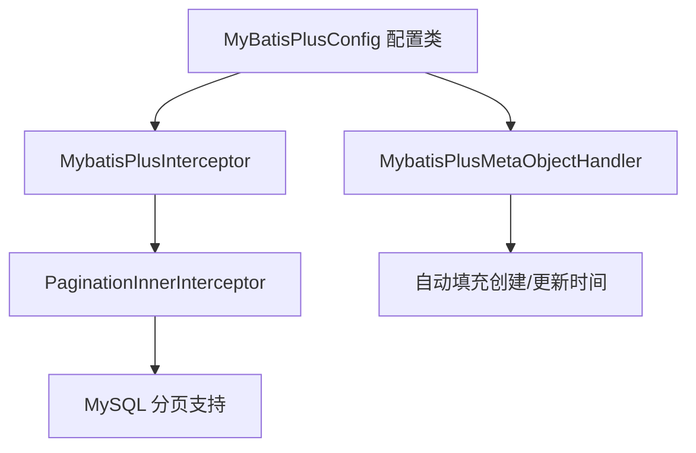
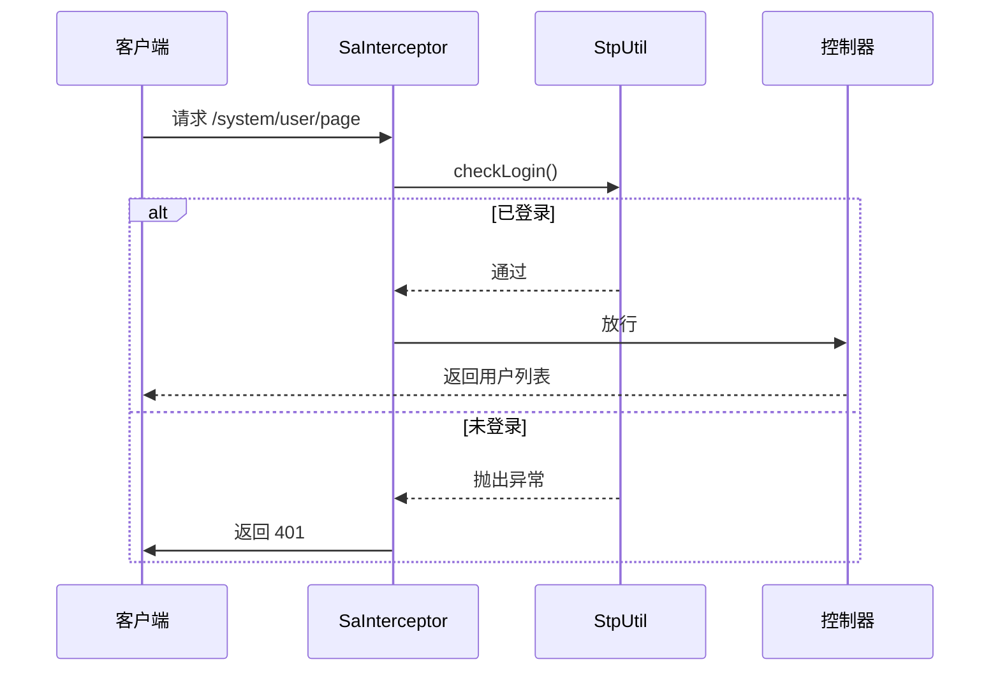
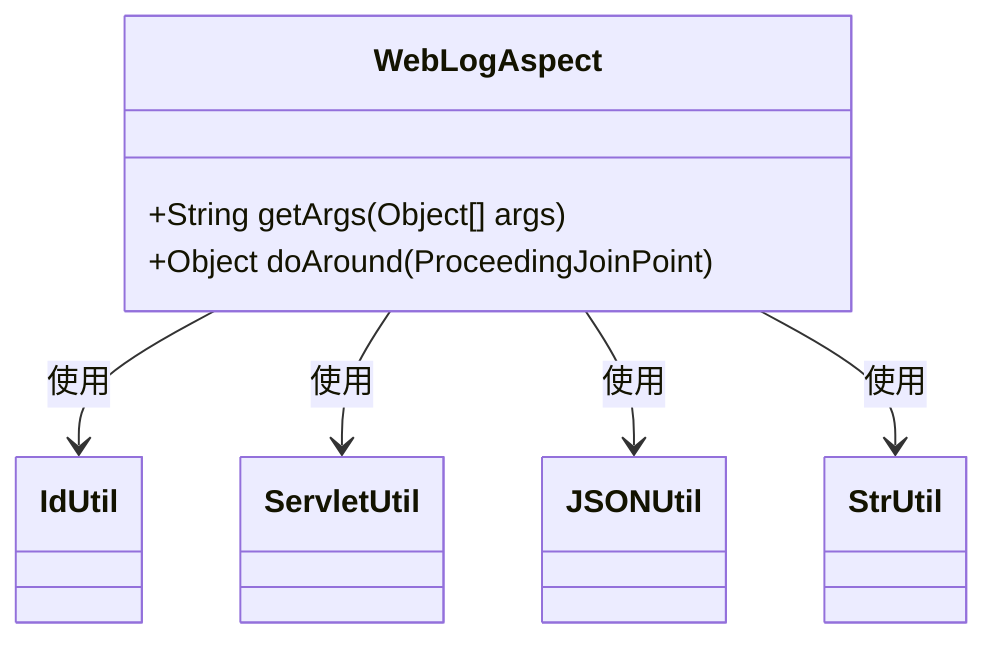
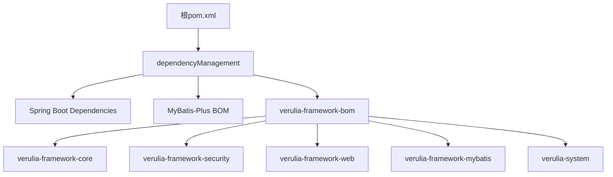
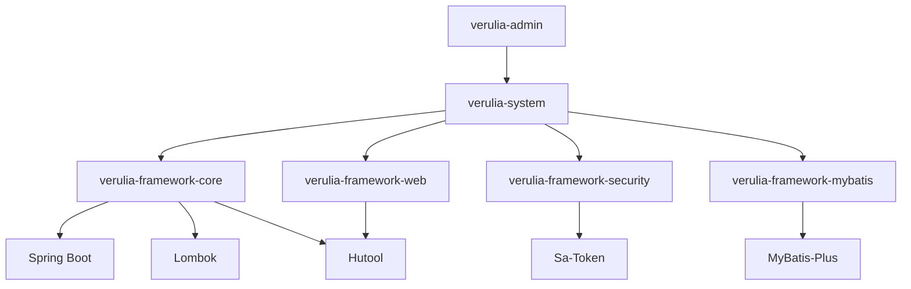

# 技术栈与依赖

<cite>
**本文档引用的文件**  
- [pom.xml](file://pom.xml)
- [verulia-admin/pom.xml](file://verulia-admin/pom.xml)
- [verulia-framework/verulia-framework-bom/pom.xml](file://verulia-framework/verulia-framework-bom/pom.xml)
- [verulia-framework/verulia-framework-core/src/main/java/org/yann/verulia/framework/core/domain/R.java](file://verulia-framework/verulia-framework-core/src/main/java/org/yann/verulia/framework/core/domain/R.java)
- [verulia-framework/verulia-framework-core/src/main/java/org/yann/verulia/framework/core/enums/ResultCode.java](file://verulia-framework/verulia-framework-core/src/main/java/org/yann/verulia/framework/core/enums/ResultCode.java)
- [verulia-framework/verulia-framework-security/src/main/java/org/yann/verulia/framework/security/config/SecurityConfig.java](file://verulia-framework/verulia-framework-security/src/main/java/org/yann/verulia/framework/security/config/SecurityConfig.java)
- [verulia-framework/verulia-framework-mybatis/src/main/java/org/yann/verulia/framework/mybatis/config/MybatisPlusConfig.java](file://verulia-framework/verulia-framework-mybatis/src/main/java/org/yann/verulia/framework/mybatis/config/MybatisPlusConfig.java)
- [verulia-framework/verulia-framework-web/src/main/java/org/yann/verulia/framework/web/aspect/WebLogAspect.java](file://verulia-framework/verulia-framework-web/src/main/java/org/yann/verulia/framework/web/aspect/WebLogAspect.java)
- [verulia-modules/verulia-system/src/main/java/org/yann/verulia/system/controller/SysUserController.java](file://verulia-modules/verulia-system/src/main/java/org/yann/verulia/system/controller/SysUserController.java)
- [verulia-modules/verulia-system/src/main/java/org/yann/verulia/system/service/impl/SysUserServiceImpl.java](file://verulia-modules/verulia-system/src/main/java/org/yann/verulia/system/service/impl/SysUserServiceImpl.java)
- [verulia-admin/src/main/java/org/yann/verulia/VeruliaApplication.java](file://verulia-admin/src/main/java/org/yann/verulia/VeruliaApplication.java)
- [verulia-framework/verulia-framework-auth/src/main/java/org/yann/verulia/framework/auth/domain/AuthUser.java](file://verulia-framework/verulia-framework-auth/src/main/java/org/yann/verulia/framework/auth/domain/AuthUser.java)
</cite>

## 目录
1. [技术栈概览](#技术栈概览)  
2. [核心依赖组件详解](#核心依赖组件详解)  
   2.1 [Spring Boot 基础框架](#spring-boot-基础框架)  
   2.2 [MyBatis-Plus 数据访问增强](#mybatis-plus-数据访问增强)  
   2.3 [Sa-Token 认证授权](#sa-token-认证授权)  
   2.4 [Lombok 减少样板代码](#lombok-减少样板代码)  
   2.5 [Hutool 工具集](#hutool-工具集)  
3. [依赖管理机制分析](#依赖管理机制分析)  
   3.1 [pom.xml 中的依赖管理](#pomxml-中的依赖管理)  
   3.2 [verulia-framework-bom 的作用](#verulia-framework-bom-的作用)  
4. [模块依赖关系](#模块依赖关系)  
5. [技术选型依据与协同机制](#技术选型依据与协同机制)  
6. [新开发者环境准备清单](#新开发者环境准备清单)  
7. [依赖树可视化](#依赖树可视化)  
8. [版本兼容性矩阵](#版本兼容性矩阵)

## 技术栈概览

Verulia 项目采用现代化的 Java 技术栈，基于 Spring Boot 构建微服务架构，结合 MyBatis-Plus 提供高效的数据访问能力，使用 Sa-Token 实现灵活的认证授权机制，通过 Lombok 简化实体类开发，并集成 Hutool 工具库提升开发效率。项目采用 Maven 多模块结构，通过 BOM（Bill of Materials）机制统一管理版本，确保各模块间依赖的一致性与稳定性。

## 核心依赖组件详解

### Spring Boot 基础框架

Spring Boot 作为项目的基础框架，提供了自动配置、内嵌服务器、外部化配置等特性，极大简化了 Spring 应用的搭建与部署。项目中使用 Spring Boot 4.0.0 版本，支持最新的 Spring 6 特性，包括对 Jakarta EE 9+ 的全面支持。

**作用**：
- 自动装配常用组件（如 Web、Security、Data）
- 提供 `@SpringBootApplication` 注解快速启动应用
- 支持 Profile 多环境配置（如 `application-dev.yml`）
- 集成 Actuator 提供健康检查与监控端点

**Section sources**  
- [verulia-admin/src/main/java/org/yann/verulia/VeruliaApplication.java](file://verulia-admin/src/main/java/org/yann/verulia/VeruliaApplication.java#L12-L18)

### MyBatis-Plus 数据访问增强

MyBatis-Plus 是 MyBatis 的增强工具，简化了 CRUD 操作，提供了分页插件、自动填充、逻辑删除等企业级功能。

**作用**：
- 提供 `ServiceImpl` 基类，减少重复代码
- 集成分页插件，自动处理分页逻辑
- 支持字段自动填充（如创建时间、更新时间）
- 使用 `LambdaQueryWrapper` 构建类型安全的查询条件



**Diagram sources**  
- [verulia-framework/verulia-framework-mybatis/src/main/java/org/yann/verulia/framework/mybatis/config/MybatisPlusConfig.java](file://verulia-framework/verulia-framework-mybatis/src/main/java/org/yann/verulia/framework/mybatis/config/MybatisPlusConfig.java#L16-L31)

**Section sources**  
- [verulia-modules/verulia-system/src/main/java/org/yann/verulia/system/service/impl/SysUserServiceImpl.java](file://verulia-modules/verulia-system/src/main/java/org/yann/verulia/system/service/impl/SysUserServiceImpl.java#L33-L147)

### Sa-Token 认证授权

Sa-Token 是一个轻量级 Java 权限认证框架，支持登录认证、权限验证、单点登录、OAuth2.0 等功能。

**作用**：
- 通过 `StpUtil.checkLogin()` 拦截未登录请求
- 集成 Spring MVC 拦截器实现全局权限控制
- 提供 `SaTokenSecurityContext` 与项目安全上下文集成
- 支持多种登录模式（密码、小程序等）



**Diagram sources**  
- [verulia-framework/verulia-framework-security/src/main/java/org/yann/verulia/framework/security/config/SecurityConfig.java](file://verulia-framework/verulia-framework-security/src/main/java/org/yann/verulia/framework/security/config/SecurityConfig.java#L20-L36)

### Lombok 减少样板代码

Lombok 通过注解自动生成 getter、setter、构造函数等样板代码，提升开发效率。

**使用注解**：
- `@Data`：生成 getter/setter/toString/equals/hashCode
- `@Builder`：构建者模式
- `@RequiredArgsConstructor`：基于 final 字段生成构造函数
- `@Getter/@Setter`：细粒度控制访问器

**示例**：
```java
@Builder
@Data
public class AuthUser {
    private Long userId;
    private String username;
}
```

**Section sources**  
- [verulia-framework/verulia-framework-auth/src/main/java/org/yann/verulia/framework/auth/domain/AuthUser.java](file://verulia-framework/verulia-framework-auth/src/main/java/org/yann/verulia/framework/auth/domain/AuthUser.java#L17-L41)

### Hutool 工具集

Hutool 是一个功能丰富的 Java 工具库，提供了字符串处理、加密、HTTP 客户端、JSON 解析等实用功能。

**主要用途**：
- `IdUtil.fastSimpleUUID()`：生成 TraceId 用于链路追踪
- `SecureUtil.sha256()`：密码加密
- `BeanUtil.copyProperties()`：对象属性拷贝
- `ServletUtil.getClientIP()`：获取真实客户端 IP
- `JSONUtil.toJsonStr()`：对象转 JSON 字符串



**Diagram sources**  
- [verulia-framework/verulia-framework-web/src/main/java/org/yann/verulia/framework/web/aspect/WebLogAspect.java](file://verulia-framework/verulia-framework-web/src/main/java/org/yann/verulia/framework/web/aspect/WebLogAspect.java#L37-L136)

## 依赖管理机制分析

### pom.xml 中的依赖管理

项目根目录的 `pom.xml` 文件通过 `<dependencyManagement>` 统一管理所有依赖版本，避免版本冲突。

**关键配置**：
- Spring Boot 4.0.0
- MyBatis-Plus 3.5.15
- Lombok 1.18.30
- Hutool 7.0.0-M3
- Sa-Token 1.44.0

**Section sources**  
- [pom.xml](file://pom.xml#L28-L32)

### verulia-framework-bom 的作用

`verulia-framework-bom` 是一个 BOM（物料清单）模块，用于集中管理项目内部框架模块的版本。

**作用**：
- 统一 `verulia-framework-*` 模块的版本为 `1.0-SNAPSHOT`
- 子模块引入时无需指定版本号
- 确保各模块间依赖一致性



**Diagram sources**  
- [pom.xml](file://pom.xml#L39-L57)
- [verulia-framework/verulia-framework-bom/pom.xml](file://verulia-framework/verulia-framework-bom/pom.xml#L17-L62)

## 模块依赖关系

Verulia 项目采用多模块结构：
- `verulia-admin`：启动模块，聚合所有子模块
- `verulia-framework`：通用框架模块，提供核心功能
- `verulia-modules`：业务模块，包含系统管理等功能

`verulia-admin` 通过依赖 `verulia-system` 模块，间接引入所有框架依赖，实现功能聚合。

**Section sources**  
- [verulia-admin/pom.xml](file://verulia-admin/pom.xml#L27-L30)
- [verulia-modules/pom.xml](file://verulia-modules/pom.xml#L19-L21)

## 技术选型依据与协同机制

| 技术 | 选型依据 |
|------|----------|
| Spring Boot 4.0.0 | 支持最新 Jakarta EE，生命周期长，社区活跃 |
| MyBatis-Plus 3.5.15 | 对 MyBatis 无侵入，功能丰富，文档完善 |
| Sa-Token 1.44.0 | 轻量级，API 简洁，支持多种认证模式 |
| Lombok 1.18.30 | 编译期生成代码，无运行时依赖，成熟稳定 |
| Hutool 7.0.0-M3 | 功能全面，API 友好，支持模块化引入 |

**协同机制**：
- Spring Boot 自动装配各框架配置类
- Sa-Token 拦截器与 Spring MVC 集成
- MyBatis-Plus 与 Spring Data 兼容
- Lombok 注解在编译期处理，不影响运行时
- Hutool 工具类作为静态方法调用，无侵入性

## 新开发者环境准备清单

| 项目 | 要求 |
|------|------|
| JDK 版本 | JDK 21 |
| 构建工具 | Maven 3.8.1+ |
| IDE | IntelliJ IDEA（推荐）或 Eclipse |
| 数据库 | MySQL 5.7+ 或兼容版本 |
| 初始化脚本 | 执行 `_script/_init.sql` 创建基础表 |
| 配置文件 | 复制 `application-dev.yml` 并配置数据库连接 |

## 依赖树可视化



**Diagram sources**  
- [pom.xml](file://pom.xml)
- [verulia-admin/pom.xml](file://verulia-admin/pom.xml)
- [verulia-framework/verulia-framework-bom/pom.xml](file://verulia-framework/verulia-framework-bom/pom.xml)

## 版本兼容性矩阵

| 组件 | 版本 | 兼容性说明 |
|------|------|------------|
| Spring Boot | 4.0.0 | 需 JDK 17+，支持 Spring 6 |
| MyBatis-Plus | 3.5.15 | 兼容 Spring Boot 3.x/4.x |
| Sa-Token | 1.44.0 | 支持 Spring Boot 3.x |
| Lombok | 1.18.30 | 兼容 JDK 21 |
| Hutool | 7.0.0-M3 | 支持模块化，兼容 Spring Boot |