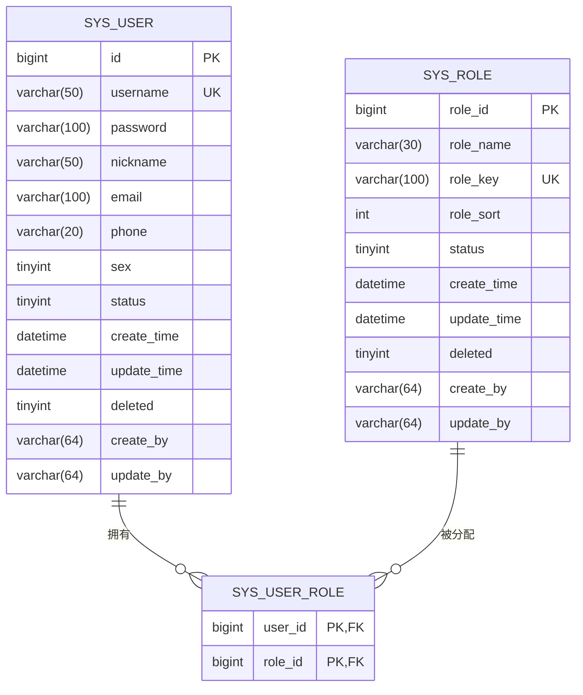

# 数据模型设计

<cite>
**本文档中引用的文件**  
- [SysUser.java](file://verulia-modules/verulia-system/src/main/java/org/yann/verulia/system/domain/entity/SysUser.java)
- [SysRole.java](file://verulia-modules/verulia-system/src/main/java/org/yann/verulia/system/domain/entity/SysRole.java)
- [SysUserRole.java](file://verulia-modules/verulia-system/src/main/java/org/yann/verulia/system/domain/entity/SysUserRole.java)
- [BaseEntity.java](file://verulia-framework/verulia-framework-core/src/main/java/org/yann/verulia/framework/core/domain/BaseEntity.java)
- [_init.sql](file://_script/_init.sql)
- [UserDtos.java](file://verulia-modules/verulia-system/src/main/java/org/yann/verulia/system/domain/dto/UserDtos.java)
- [RoleDtos.java](file://verulia-modules/verulia-system/src/main/java/org/yann/verulia/system/domain/dto/RoleDtos.java)
- [SysUserMapper.java](file://verulia-modules/verulia-system/src/main/java/org/yann/verulia/system/mapper/SysUserMapper.java)
- [SysRoleMapper.java](file://verulia-modules/verulia-system/src/main/java/org/yann/verulia/system/mapper/SysRoleMapper.java)
- [SysUserRoleMapper.java](file://verulia-modules/verulia-system/src/main/java/org/yann/verulia/system/mapper/SysUserRoleMapper.java)
- [SysUserServiceImpl.java](file://verulia-modules/verulia-system/src/main/java/org/yann/verulia/system/service/impl/SysUserServiceImpl.java)
- [SysRoleServiceImpl.java](file://verulia-modules/verulia-system/src/main/java/org/yann/verulia/system/service/impl/SysRoleServiceImpl.java)
</cite>

## 目录
1. [引言](#引言)
2. [核心实体类详解](#核心实体类详解)
   - [SysUser 用户实体](#sysuser-用户实体)
   - [SysRole 角色实体](#sysrole-角色实体)
   - [SysUserRole 用户角色关联实体](#sysuserrole-用户角色关联实体)
3. [继承体系与公共字段](#继承体系与公共字段)
4. [实体关系与ER图](#实体关系与er图)
5. [逻辑删除机制](#逻辑删除机制)
6. [数据访问与DTO最佳实践](#数据访问与dto最佳实践)
7. [总结](#总结)

## 引言
Verulia系统采用基于MyBatis-Plus的持久层设计，其核心数据模型围绕用户（SysUser）、角色（SysRole）和用户角色关联（SysUserRole）三个实体构建。本文档深入分析这三个实体类的字段定义、数据库映射、约束条件及相互关系，并结合SQL脚本和代码实现，为开发者提供数据模型的全面理解与使用指导。

## 核心实体类详解

### SysUser 用户实体
`SysUser`类代表系统用户，继承自`BaseEntity`，映射到数据库表`sys_user`。

**字段说明：**
- `id`: 主键ID，使用MyBatis-Plus的`@TableId(type = IdType.ASSIGN_ID)`注解，由框架自动分配雪花算法ID。
- `username`: 用户名，非空，对应数据库`NOT NULL`约束，并在数据库中建立唯一索引`uk_username`。
- `password`: 密码，使用`@JsonIgnore`注解防止在JSON序列化时暴露，存储时应进行SHA-256等加密处理。
- `nickname`: 昵称，可为空。
- `email`: 邮箱，可为空。
- `phone`: 手机号，可为空。
- `sex`: 性别，整型，0表示未知，1表示男，2表示女。
- `status`: 状态，整型，0表示禁用，1表示正常。
- `deleted`: 逻辑删除标志，继承自`BaseEntity`，由`@TableLogic`注解标记，0表示未删除，1表示已删除。

**数据库映射与约束：**
- 表名通过`@TableName("sys_user")`指定。
- 唯一性约束：用户名`username`在数据库层面通过`UNIQUE KEY uk_username (username)`保证唯一。
- 非空约束：`id`, `username`, `password`字段在数据库中定义为`NOT NULL`。

**Section sources**
- [SysUser.java](file://verulia-modules/verulia-system/src/main/java/org/yann/verulia/system/domain/entity/SysUser.java#L25-L68)
- [_init.sql](file://_script/_init.sql#L4-L16)

### SysRole 角色实体
`SysRole`类代表系统角色，同样继承自`BaseEntity`，映射到数据库表`sys_role`。

**字段说明：**
- `roleId`: 角色ID，主键，使用`@TableId(value = "role_id", type = IdType.ASSIGN_ID)`注解，指定数据库字段名为`role_id`。
- `roleName`: 角色名称，非空。
- `roleKey`: 权限字符，非空，用于权限系统中的唯一标识，在数据库中建立唯一索引`uk_role_key`。
- `roleSort`: 显示顺序，整型，默认值为0。
- `status`: 角色状态，整型，1表示正常，0表示停用。
- `deleted`: 逻辑删除标志，与`SysUser`相同。

**数据库映射与约束：**
- 表名通过`@TableName("sys_role")`指定。
- 唯一性约束：权限字符`roleKey`在数据库层面通过`UNIQUE KEY uk_role_key (role_key)`保证唯一。
- 非空约束：`role_id`, `role_name`, `role_key`, `role_sort`, `status`字段在数据库中定义为`NOT NULL`。

**Section sources**
- [SysRole.java](file://verulia-modules/verulia-system/src/main/java/org/yann/verulia/system/domain/entity/SysRole.java#L24-L51)
- [_init.sql](file://_script/_init.sql#L22-L33)

### SysUserRole 用户角色关联实体
`SysUserRole`类是用户与角色多对多关系的中间表实体，不继承`BaseEntity`，因为它通常不包含创建/更新时间等审计字段，且主键为复合主键。

**字段说明：**
- `userId`: 用户ID，作为复合主键的一部分，使用`@TableId`注解。
- `roleId`: 角色ID，作为复合主键的另一部分。
- `serialVersionUID`: 序列化版本ID，用于Java序列化。

**数据库映射与约束：**
- 表名通过`@TableName("sys_user_role")`指定。
- 主键约束：`PRIMARY KEY (user_id, role_id)`，确保一个用户对一个角色的唯一关联。
- 该表通过外键关联`sys_user(id)`和`sys_role(role_id)`，在SQL脚本中虽未显式声明，但业务逻辑上存在。

**Section sources**
- [SysUserRole.java](file://verulia-modules/verulia-system/src/main/java/org/yann/verulia/system/domain/entity/SysUserRole.java#L29-L35)
- [_init.sql](file://_script/_init.sql#L39-L41)

## 继承体系与公共字段
`SysUser`和`SysRole`均继承自`BaseEntity`类，该类定义了所有实体共有的审计字段，实现了代码复用和一致性。

**BaseEntity 公共字段：**
- `createBy`: 创建者，字符串类型，通过`@TableField(fill = FieldFill.INSERT)`注解，表示在插入记录时由MyBatis-Plus自动填充。
- `createTime`: 创建时间，`LocalDateTime`类型，同样在插入时自动填充。
- `updateBy`: 更新者，字符串类型，通过`@TableField(fill = FieldFill.INSERT_UPDATE)`注解，在插入和更新时自动填充。
- `updateTime`: 更新时间，`LocalDateTime`类型，在插入和更新时自动填充。

这些字段的自动填充功能由`MybatisPlusMetaObjectHandler`（位于`verulia-framework-mybatis`模块）实现，开发者在进行CRUD操作时无需手动设置这些值。

**Section sources**
- [BaseEntity.java](file://verulia-framework/verulia-framework-core/src/main/java/org/yann/verulia/framework/core/domain/BaseEntity.java#L23-L42)
- [SysUser.java](file://verulia-modules/verulia-system/src/main/java/org/yann/verulia/system/domain/entity/SysUser.java#L20)
- [SysRole.java](file://verulia-modules/verulia-system/src/main/java/org/yann/verulia/system/domain/entity/SysRole.java#L19)

## 实体关系与ER图
三个核心实体之间的关系是典型的多对多关联设计：
- 一个`SysUser`可以拥有多个`SysRole`。
- 一个`SysRole`可以被分配给多个`SysUser`。
- 这种多对多关系通过`SysUserRole`中间表来实现，中间表包含`user_id`和`role_id`两个外键。



**Diagram sources**
- [SysUser.java](file://verulia-modules/verulia-system/src/main/java/org/yann/verulia/system/domain/entity/SysUser.java)
- [SysRole.java](file://verulia-modules/verulia-system/src/main/java/org/yann/verulia/system/domain/entity/SysRole.java)
- [SysUserRole.java](file://verulia-modules/verulia-system/src/main/java/org/yann/verulia/system/domain/entity/SysUserRole.java)
- [_init.sql](file://_script/_init.sql)

## 逻辑删除机制
Verulia系统采用逻辑删除而非物理删除，以保障数据安全和可追溯性。

**实现方式：**
1.  **字段定义**：在`BaseEntity`中定义`deleted`字段，并使用MyBatis-Plus的`@TableLogic`注解。
2.  **数据库字段**：数据库表中的`deleted`字段为`tinyint`类型，`0`表示未删除，`1`表示已删除。
3.  **自动处理**：
    - 当调用`service.removeById(id)`或`mapper.deleteById(id)`时，MyBatis-Plus会自动将`deleted`字段的值从`0`更新为`1`，而不是执行`DELETE`语句。
    - 当执行查询（如`service.list()`或`mapper.selectList()`）时，MyBatis-Plus会自动在SQL的`WHERE`条件中添加`deleted = 0`，从而屏蔽已删除的记录。
4.  **物理删除**：如果需要彻底删除数据，必须使用`delete`语句或MyBatis-Plus的`delete`方法配合`@SqlParser(filter = true)`注解来绕过逻辑删除。

此机制对上层业务代码透明，开发者只需像操作物理删除一样调用API，框架会自动处理底层逻辑。

**Section sources**
- [BaseEntity.java](file://verulia-framework/verulia-framework-core/src/main/java/org/yann/verulia/framework/core/domain/BaseEntity.java#L67)
- [SysUser.java](file://verulia-modules/verulia-system/src/main/java/org/yann/verulia/system/domain/entity/SysUser.java#L67)
- [SysRole.java](file://verulia-modules/verulia-system/src/main/java/org/yann/verulia/system/domain/entity/SysRole.java#L50)
- [_init.sql](file://_script/_init.sql#L14-L15)

## 数据访问与DTO最佳实践
直接使用实体类（Entity）进行数据传输（如Controller层返回给前端）存在风险，如暴露敏感字段（密码）、引发循环引用、或包含不必要的数据库字段。因此，推荐使用数据传输对象（DTO）。

**DTO最佳实践：**
1.  **使用专用DTO**：如`UserDtos.Result`和`RoleDtos.Result`，它们只包含前端需要的字段。
2.  **避免循环引用**：例如，`SysUser`和`SysRole`之间存在关联，如果直接序列化，可能会因为`SysUser`包含`SysRole`列表，而`SysRole`又包含`SysUser`列表，导致无限递归。DTO通过只包含ID或扁平化数据来避免此问题。
3.  **数据转换**：在Service层将Entity转换为DTO。例如，在`SysUserServiceImpl.getUserById`方法中，先查询`SysUser`，再查询其关联的`roleIds`，最后通过`UserDtos.Result.fromSysUser(user, roleIds)`构建并返回`Result` DTO。
4.  **使用记录（Record）**：DTO类（如`Create`, `Update`, `Result`）使用了Java 16的`record`特性，它提供了不可变性、自动的`equals`/`hashCode`/`toString`方法，使代码更简洁、安全。
5.  **参数校验**：对于新增和修改操作，使用`Create`和`Update`等DTO接收参数，便于进行JSR-303等参数校验。

```java
// 示例：在Service中将Entity转换为DTO
public UserDtos.Result getUserById(Long id) {
    SysUser user = this.getById(id);
    // ... 查询 roleIds
    return UserDtos.Result.fromSysUser(user, roleIds); // 转换为DTO
}
```

**Section sources**
- [UserDtos.java](file://verulia-modules/verulia-system/src/main/java/org/yann/verulia/system/domain/dto/UserDtos.java#L58-L96)
- [RoleDtos.java](file://verulia-modules/verulia-system/src/main/java/org/yann/verulia/system/domain/dto/RoleDtos.java#L68-L75)
- [SysUserServiceImpl.java](file://verulia-modules/verulia-system/src/main/java/org/yann/verulia/system/service/impl/SysUserServiceImpl.java#L63-L73)

## 总结
Verulia系统的核心数据模型设计清晰、规范。通过`SysUser`、`SysRole`和`SysUserRole`三个实体，有效地管理了用户、角色及其关联关系。利用MyBatis-Plus的`@TableLogic`注解实现了便捷的逻辑删除，`BaseEntity`提供了统一的审计字段。开发者在进行数据访问时，应遵循最佳实践，使用DTO进行数据传输，以确保系统的安全性、稳定性和可维护性。