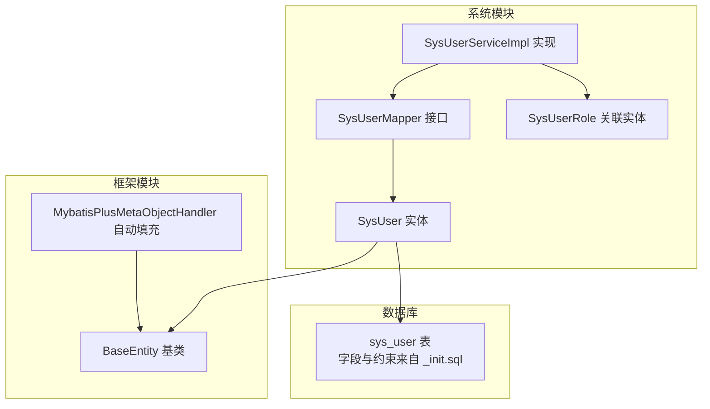
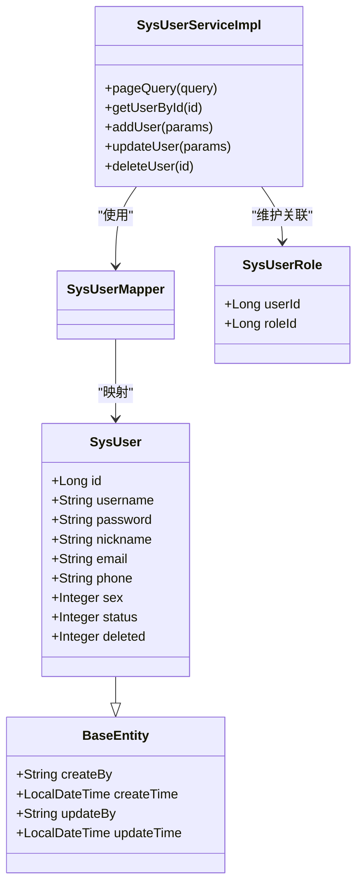
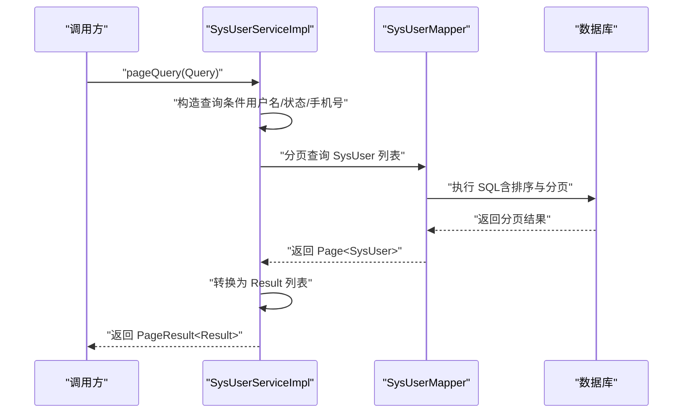
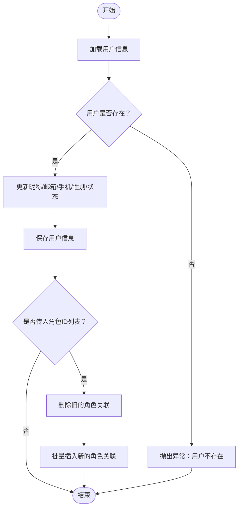
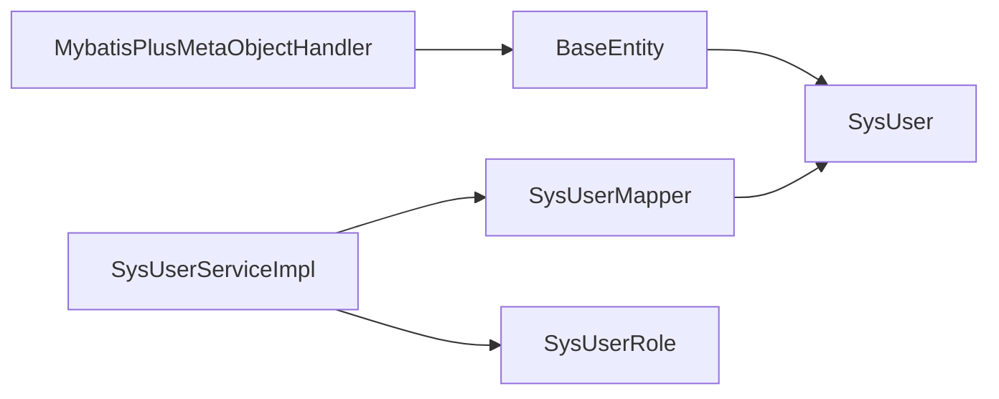

# 用户实体模型

<cite>
**本文引用的文件**
- [SysUser.java](file://verulia-modules/verulia-system/src/main/java/org/yann/verulia/system/domain/entity/SysUser.java)
- [BaseEntity.java](file://verulia-framework/verulia-framework-core/src/main/java/org/yann/verulia/framework/core/domain/BaseEntity.java)
- [_init.sql](file://_script/_init.sql)
- [SysUserServiceImpl.java](file://verulia-modules/verulia-system/src/main/java/org/yann/verulia/system/service/impl/SysUserServiceImpl.java)
- [SysUserMapper.java](file://verulia-modules/verulia-system/src/main/java/org/yann/verulia/system/mapper/SysUserMapper.java)
- [UserDtos.java](file://verulia-modules/verulia-system/src/main/java/org/yann/verulia/system/domain/dto/UserDtos.java)
- [MybatisPlusMetaObjectHandler.java](file://verulia-framework/verulia-framework-mybatis/src/main/java/org/yann/verulia/framework/mybatis/handler/MybatisPlusMetaObjectHandler.java)
- [SysUserRole.java](file://verulia-modules/verulia-system/src/main/java/org/yann/verulia/system/domain/entity/SysUserRole.java)
</cite>

## 目录
1. [简介](#简介)
2. [项目结构](#项目结构)
3. [核心组件](#核心组件)
4. [架构总览](#架构总览)
5. [详细组件分析](#详细组件分析)
6. [依赖关系分析](#依赖关系分析)
7. [性能考量](#性能考量)
8. [故障排查指南](#故障排查指南)
9. [结论](#结论)
10. [附录](#附录)

## 简介
本文件围绕系统用户核心实体 SysUser 的数据模型进行深入解析，阐明其设计目的、字段定义、与基类 BaseEntity 的继承关系、MyBatis-Plus 注解映射规则，以及在服务层的典型使用方式（分页查询、更新状态、维护用户角色关联）。同时结合初始化脚本 _init.sql 中的建表语句，核对字段类型与约束；强调密码字段的安全处理策略与逻辑删除字段与 @TableLogic 的协同机制；并提供常见问题与解决方案，帮助读者在实际开发中正确使用该实体。

## 项目结构
- 实体类位于系统模块的 domain/entity 下，继承框架层的 BaseEntity，统一具备创建/更新时间、创建/更新人与逻辑删除字段。
- 数据访问层采用 MyBatis-Plus，Mapper 接口继承 BaseMapper，Service 层基于 ServiceImpl 并扩展业务逻辑。
- 初始化脚本 _init.sql 定义了 sys_user 表及其字段类型、约束与索引。

图表来源
- [SysUser.java](file://verulia-modules/verulia-system/src/main/java/org/yann/verulia/system/domain/entity/SysUser.java#L1-L70)
- [BaseEntity.java](file://verulia-framework/verulia-framework-core/src/main/java/org/yann/verulia/framework/core/domain/BaseEntity.java#L1-L44)
- [SysUserMapper.java](file://verulia-modules/verulia-system/src/main/java/org/yann/verulia/system/mapper/SysUserMapper.java#L1-L15)
- [SysUserServiceImpl.java](file://verulia-modules/verulia-system/src/main/java/org/yann/verulia/system/service/impl/SysUserServiceImpl.java#L1-L147)
- [SysUserRole.java](file://verulia-modules/verulia-system/src/main/java/org/yann/verulia/system/domain/entity/SysUserRole.java#L1-L37)
- [_init.sql](file://_script/_init.sql#L1-L18)

章节来源
- [SysUser.java](file://verulia-modules/verulia-system/src/main/java/org/yann/verulia/system/domain/entity/SysUser.java#L1-L70)
- [BaseEntity.java](file://verulia-framework/verulia-framework-core/src/main/java/org/yann/verulia/framework/core/domain/BaseEntity.java#L1-L44)
- [_init.sql](file://_script/_init.sql#L1-L18)

## 核心组件
- SysUser：系统用户实体，继承 BaseEntity，包含主键 id（雪花算法生成）、用户名 username（唯一）、密码 password（序列化时忽略）、昵称 nickname、邮箱 email、手机号 phone、性别 sex、状态 status、逻辑删除 deleted。
- BaseEntity：提供 createBy、createTime、updateBy、updateTime 字段，配合 MyBatis-Plus 元对象处理器自动填充。
- SysUserMapper：继承 BaseMapper，提供基础 CRUD 能力。
- SysUserServiceImpl：封装分页查询、新增用户（含密码安全处理）、更新用户、删除用户（级联删除角色关联）等业务逻辑。
- SysUserRole：用户与角色的多对多关联表实体。
- UserDtos：用户查询、新增、修改、结果视图 DTO/VO 聚合，用于服务层与控制器之间的数据传递。

章节来源
- [SysUser.java](file://verulia-modules/verulia-system/src/main/java/org/yann/verulia/system/domain/entity/SysUser.java#L1-L70)
- [BaseEntity.java](file://verulia-framework/verulia-framework-core/src/main/java/org/yann/verulia/framework/core/domain/BaseEntity.java#L1-L44)
- [SysUserMapper.java](file://verulia-modules/verulia-system/src/main/java/org/yann/verulia/system/mapper/SysUserMapper.java#L1-L15)
- [SysUserServiceImpl.java](file://verulia-modules/verulia-system/src/main/java/org/yann/verulia/system/service/impl/SysUserServiceImpl.java#L1-L147)
- [SysUserRole.java](file://verulia-modules/verulia-system/src/main/java/org/yann/verulia/system/domain/entity/SysUserRole.java#L1-L37)
- [UserDtos.java](file://verulia-modules/verulia-system/src/main/java/org/yann/verulia/system/domain/dto/UserDtos.java#L1-L99)

## 架构总览
下图展示 SysUser 及其相关组件在系统中的位置与交互关系。

图表来源
- [SysUser.java](file://verulia-modules/verulia-system/src/main/java/org/yann/verulia/system/domain/entity/SysUser.java#L1-L70)
- [BaseEntity.java](file://verulia-framework/verulia-framework-core/src/main/java/org/yann/verulia/framework/core/domain/BaseEntity.java#L1-L44)
- [SysUserMapper.java](file://verulia-modules/verulia-system/src/main/java/org/yann/verulia/system/mapper/SysUserMapper.java#L1-L15)
- [SysUserServiceImpl.java](file://verulia-modules/verulia-system/src/main/java/org/yann/verulia/system/service/impl/SysUserServiceImpl.java#L1-L147)
- [SysUserRole.java](file://verulia-modules/verulia-system/src/main/java/org/yann/verulia/system/domain/entity/SysUserRole.java#L1-L37)

## 详细组件分析

### SysUser 实体字段与注解说明
- 主键 id：类型为 Long，使用雪花算法生成（ASSIGN_ID），对应数据库自增主键策略在 MyBatis-Plus 中由雪花算法接管。
- 用户名 username：字符串，唯一约束，对应数据库唯一索引。
- 密码 password：字符串，序列化时通过 @JsonIgnore 忽略，避免敏感信息泄露。
- 昵称 nickname、邮箱 email、手机号 phone：字符串，长度依据业务需要设置。
- 性别 sex：整型，0=未知，1=男，2=女。
- 状态 status：整型，0=禁用，1=正常。
- 逻辑删除 deleted：整型，0=未删除，1=已删除，配合 @TableLogic 使用。
- 继承 BaseEntity：自动获得 createBy、createTime、updateBy、updateTime 字段，由元对象处理器自动填充。

章节来源
- [SysUser.java](file://verulia-modules/verulia-system/src/main/java/org/yann/verulia/system/domain/entity/SysUser.java#L1-L70)
- [BaseEntity.java](file://verulia-framework/verulia-framework-core/src/main/java/org/yann/verulia/framework/core/domain/BaseEntity.java#L1-L44)

### 数据库表映射与约束核对
- 表名映射：@TableName("sys_user") 指定与数据库表名一致。
- 主键映射：@TableId(type = IdType.ASSIGN_ID) 对应数据库自增主键，但由雪花算法生成。
- 逻辑删除：@TableLogic 标记 deleted 字段为逻辑删除字段。
- 唯一约束：数据库层面 username 字段具有唯一索引。
- 字段类型与默认值：参考 _init.sql 中 sys_user 表的字段定义与注释。

章节来源
- [SysUser.java](file://verulia-modules/verulia-system/src/main/java/org/yann/verulia/system/domain/entity/SysUser.java#L1-L70)
- [_init.sql](file://_script/_init.sql#L1-L18)

### BaseEntity 自动填充机制
- BaseEntity 提供 createBy、createTime、updateBy、updateTime 字段。
- MybatisPlusMetaObjectHandler 在插入与更新时自动填充上述字段，确保创建/更新时间与创建/更新人的统一管理。

章节来源
- [BaseEntity.java](file://verulia-framework/verulia-framework-core/src/main/java/org/yann/verulia/framework/core/domain/BaseEntity.java#L1-L44)
- [MybatisPlusMetaObjectHandler.java](file://verulia-framework/verulia-framework-mybatis/src/main/java/org/yann/verulia/framework/mybatis/handler/MybatisPlusMetaObjectHandler.java#L1-L32)

### 密码安全处理
- SysUserServiceImpl 在新增用户时对明文密码进行哈希处理后存储，避免明文保存。
- JSON 序列化时通过 @JsonIgnore 忽略 password 字段，防止敏感信息泄露。

章节来源
- [SysUserServiceImpl.java](file://verulia-modules/verulia-system/src/main/java/org/yann/verulia/system/service/impl/SysUserServiceImpl.java#L1-L147)
- [SysUser.java](file://verulia-modules/verulia-system/src/main/java/org/yann/verulia/system/domain/entity/SysUser.java#L1-L70)

### 逻辑删除协同机制
- SysUser 的 deleted 字段标注 @TableLogic，配合 MyBatis-Plus 的全局逻辑删除配置，在查询、更新、删除时自动过滤或标记已删除记录。
- 删除用户时会先清理用户与角色的关联关系，再执行删除操作，保证数据一致性。

章节来源
- [SysUser.java](file://verulia-modules/verulia-system/src/main/java/org/yann/verulia/system/domain/entity/SysUser.java#L1-L70)
- [SysUserServiceImpl.java](file://verulia-modules/verulia-system/src/main/java/org/yann/verulia/system/service/impl/SysUserServiceImpl.java#L1-L147)
- [SysUserRole.java](file://verulia-modules/verulia-system/src/main/java/org/yann/verulia/system/domain/entity/SysUserRole.java#L1-L37)

### 服务层典型操作流程

#### 分页查询流程

图表来源
- [SysUserServiceImpl.java](file://verulia-modules/verulia-system/src/main/java/org/yann/verulia/system/service/impl/SysUserServiceImpl.java#L1-L147)
- [SysUserMapper.java](file://verulia-modules/verulia-system/src/main/java/org/yann/verulia/system/mapper/SysUserMapper.java#L1-L15)
- [UserDtos.java](file://verulia-modules/verulia-system/src/main/java/org/yann/verulia/system/domain/dto/UserDtos.java#L1-L99)

章节来源
- [SysUserServiceImpl.java](file://verulia-modules/verulia-system/src/main/java/org/yann/verulia/system/service/impl/SysUserServiceImpl.java#L1-L147)
- [UserDtos.java](file://verulia-modules/verulia-system/src/main/java/org/yann/verulia/system/domain/dto/UserDtos.java#L1-L99)

#### 更新用户状态与维护角色关联

图表来源
- [SysUserServiceImpl.java](file://verulia-modules/verulia-system/src/main/java/org/yann/verulia/system/service/impl/SysUserServiceImpl.java#L1-L147)
- [SysUserRole.java](file://verulia-modules/verulia-system/src/main/java/org/yann/verulia/system/domain/entity/SysUserRole.java#L1-L37)

章节来源
- [SysUserServiceImpl.java](file://verulia-modules/verulia-system/src/main/java/org/yann/verulia/system/service/impl/SysUserServiceImpl.java#L1-L147)
- [SysUserRole.java](file://verulia-modules/verulia-system/src/main/java/org/yann/verulia/system/domain/entity/SysUserRole.java#L1-L37)

## 依赖关系分析
- SysUser 继承 BaseEntity，复用创建/更新时间与创建/更新人字段。
- SysUserMapper 继承 BaseMapper，提供通用 CRUD 能力。
- SysUserServiceImpl 依赖 SysUserMapper 与 SysUserRoleMapper，负责业务编排与事务控制。
- MybatisPlusMetaObjectHandler 为 BaseEntity 字段提供自动填充。

图表来源
- [BaseEntity.java](file://verulia-framework/verulia-framework-core/src/main/java/org/yann/verulia/framework/core/domain/BaseEntity.java#L1-L44)
- [SysUser.java](file://verulia-modules/verulia-system/src/main/java/org/yann/verulia/system/domain/entity/SysUser.java#L1-L70)
- [SysUserMapper.java](file://verulia-modules/verulia-system/src/main/java/org/yann/verulia/system/mapper/SysUserMapper.java#L1-L15)
- [SysUserServiceImpl.java](file://verulia-modules/verulia-system/src/main/java/org/yann/verulia/system/service/impl/SysUserServiceImpl.java#L1-L147)
- [SysUserRole.java](file://verulia-modules/verulia-system/src/main/java/org/yann/verulia/system/domain/entity/SysUserRole.java#L1-L37)
- [MybatisPlusMetaObjectHandler.java](file://verulia-framework/verulia-framework-mybatis/src/main/java/org/yann/verulia/framework/mybatis/handler/MybatisPlusMetaObjectHandler.java#L1-L32)

章节来源
- [SysUser.java](file://verulia-modules/verulia-system/src/main/java/org/yann/verulia/system/domain/entity/SysUser.java#L1-L70)
- [BaseEntity.java](file://verulia-framework/verulia-framework-core/src/main/java/org/yann/verulia/framework/core/domain/BaseEntity.java#L1-L44)
- [SysUserMapper.java](file://verulia-modules/verulia-system/src/main/java/org/yann/verulia/system/mapper/SysUserMapper.java#L1-L15)
- [SysUserServiceImpl.java](file://verulia-modules/verulia-system/src/main/java/org/yann/verulia/system/service/impl/SysUserServiceImpl.java#L1-L147)
- [SysUserRole.java](file://verulia-modules/verulia-system/src/main/java/org/yann/verulia/system/domain/entity/SysUserRole.java#L1-L37)
- [MybatisPlusMetaObjectHandler.java](file://verulia-framework/verulia-framework-mybatis/src/main/java/org/yann/verulia/framework/mybatis/handler/MybatisPlusMetaObjectHandler.java#L1-L32)

## 性能考量
- 主键生成：雪花算法分配 Long 类型主键，适合高并发场景，减少热点冲突。
- 查询优化：分页查询建议结合索引（如 username、phone、status）以提升检索效率。
- 逻辑删除：使用 @TableLogic 后，查询默认过滤 deleted=1 的记录，减少无效数据扫描。
- 写入性能：批量插入角色关联时可考虑批量提交策略，降低事务开销。

[本节为通用指导，不直接分析具体文件]

## 故障排查指南
- JSON 序列化泄露敏感字段：确认实体上已添加 @JsonIgnore 注解，避免 password 字段出现在响应体中。
- 重复用户名：新增用户前检查唯一性，若违反唯一约束需提示“用户名已存在”。
- 用户不存在：更新或删除用户时需先校验用户是否存在，避免空指针或误删。
- 逻辑删除生效：确保 MyBatis-Plus 已启用逻辑删除配置，否则查询可能返回已删除记录。
- 时间字段为空：确认 MybatisPlusMetaObjectHandler 已注册并生效，否则 createBy、createTime、updateBy、updateTime 可能为空。

章节来源
- [SysUser.java](file://verulia-modules/verulia-system/src/main/java/org/yann/verulia/system/domain/entity/SysUser.java#L1-L70)
- [SysUserServiceImpl.java](file://verulia-modules/verulia-system/src/main/java/org/yann/verulia/system/service/impl/SysUserServiceImpl.java#L1-L147)
- [MybatisPlusMetaObjectHandler.java](file://verulia-framework/verulia-framework-mybatis/src/main/java/org/yann/verulia/framework/mybatis/handler/MybatisPlusMetaObjectHandler.java#L1-L32)

## 结论
SysUser 作为系统用户的核心实体，通过继承 BaseEntity 统一管理创建/更新时间与人员信息，并借助 MyBatis-Plus 的注解与自动填充机制，实现主键生成、表映射、逻辑删除等功能。服务层在 SysUserServiceImpl 中实现了分页查询、密码安全处理、状态更新与角色关联维护等典型业务流程。结合 _init.sql 的建表语句，可确保字段类型与约束的一致性。遵循本文的安全与最佳实践建议，可在保障数据完整性的同时提升系统的安全性与可维护性。

[本节为总结性内容，不直接分析具体文件]

## 附录

### 字段定义与约束对照表
- 字段与类型：参考 _init.sql 中 sys_user 表的字段定义与注释。
- 唯一约束：username 字段具有唯一索引。
- 默认值：status 默认 1（正常），sex 默认 0（未知），deleted 默认 0（未删除）。

章节来源
- [_init.sql](file://_script/_init.sql#L1-L18)