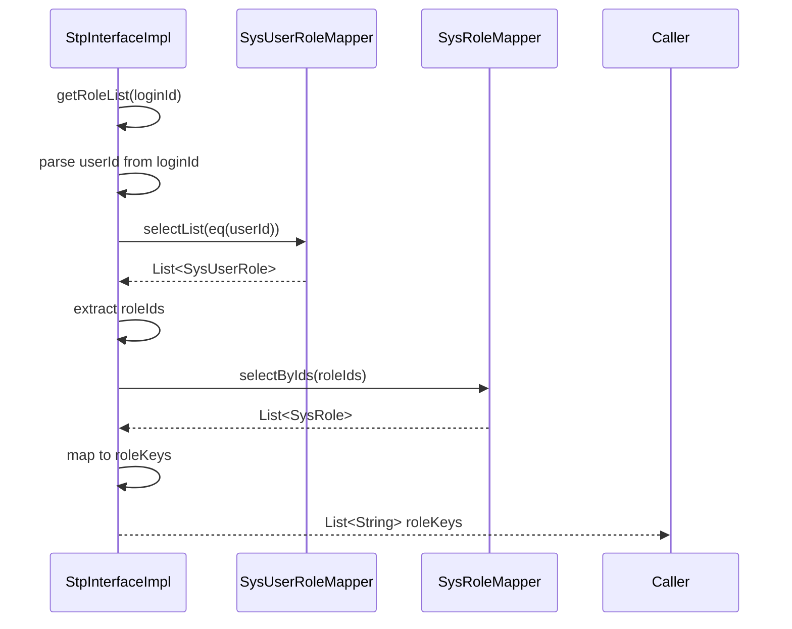

# 用户角色关联模型

<cite>
**本文档引用的文件**  
- [SysUserRole.java](file://verulia-modules/verulia-system/src/main/java/org/yann/verulia/system/domain/entity/SysUserRole.java)
- [_init.sql](file://_script/_init.sql)
- [SysUserMapper.java](file://verulia-modules/verulia-system/src/main/java/org/yann/verulia/system/mapper/SysUserMapper.java)
- [SysRoleMapper.java](file://verulia-modules/verulia-system/src/main/java/org/yann/verulia/system/mapper/SysRoleMapper.java)
- [StpInterfaceImpl.java](file://verulia-modules/verulia-system/src/main/java/org/yann/verulia/system/service/security/StpInterfaceImpl.java)
- [SysUserRoleMapper.java](file://verulia-modules/verulia-system/src/main/java/org/yann/verulia/system/mapper/SysUserRoleMapper.java)
- [SysUserServiceImpl.java](file://verulia-modules/verulia-system/src/main/java/org/yann/verulia/system/service/impl/SysUserServiceImpl.java)
</cite>

## 目录
1. [引言](#引言)
2. [数据结构与实体定义](#数据结构与实体定义)
3. [数据库表结构与约束](#数据库表结构与约束)
4. [序列化支持与远程调用场景](#序列化支持与远程调用场景)
5. [业务逻辑中的使用方式](#业务逻辑中的使用方式)
6. [权限校验中的角色加载机制](#权限校验中的角色加载机制)
7. [批量操作与级联清理实现](#批量操作与级联清理实现)
8. [设计考量：为何不继承BaseEntity](#设计考量为何不继承baseentity)
9. [性能与数据一致性影响分析](#性能与数据一致性影响分析)
10. [总结](#总结)

## 引言
`SysUserRole` 是系统中用于实现用户与角色之间多对多关系的核心中间表实体。它在权限管理系统中扮演着桥梁角色，连接 `SysUser` 与 `SysRole` 两个核心实体，支撑基于角色的访问控制（RBAC）机制。本文档将深入解析该实体的设计原理、数据结构、数据库映射、序列化能力及其在业务流程中的具体应用。

## 数据结构与实体定义
`SysUserRole` 实体类定义了两个关键字段：`userId` 和 `roleId`，分别表示用户ID和角色ID。其中 `userId` 被标注为 `@TableId`，作为联合主键的一部分，确保每个用户-角色组合的唯一性。

该实体通过 Lombok 注解（`@Data`、`@NoArgsConstructor`、`@AllArgsConstructor`）简化了代码结构，提升了可读性和维护性。其核心职责是承载用户与角色之间的关联信息，不包含额外的业务属性。

**Section sources**
- [SysUserRole.java](file://verulia-modules/verulia-system/src/main/java/org/yann/verulia/system/domain/entity/SysUserRole.java#L26-L35)

## 数据库表结构与约束
根据 `_init.sql` 脚本中的建表语句，`sys_user_role` 表由 `user_id` 和 `role_id` 两个字段构成，并以二者共同组成复合主键（`PRIMARY KEY (user_id, role_id)`），确保同一用户不能重复分配同一角色。

尽管建表语句中未显式声明外键约束，但从业务逻辑设计推断，`user_id` 应引用 `sys_user(id)`，`role_id` 应引用 `sys_role(role_id)`，形成参照完整性。这种设计避免了数据孤岛，保障了用户和角色数据的一致性。

```mermaid
erDiagram
SYS_USER {
bigint id PK
varchar username
varchar password
tinyint status
}
SYS_ROLE {
bigint role_id PK
varchar role_name
varchar role_key UK
}
SYS_USER_ROLE {
bigint user_id FK PK
bigint role_id FK PK
}
SYS_USER ||--o{ SYS_USER_ROLE : "拥有"
SYS_ROLE ||--o{ SYS_USER_ROLE : "被分配给"
```

**Diagram sources**
- [_init.sql](file://_script/_init.sql#L36-L42)

## 序列化支持与远程调用场景
`SysUserRole` 实现了 `Serializable` 接口，并显式定义了 `serialVersionUID = 1L`。这一设计使其能够在需要序列化的场景中安全传输，例如：

- 分布式缓存（如 Redis）中存储用户角色关系
- 远程方法调用（RPC）或微服务间通信
- Session 复制或持久化

显式声明 `serialVersionUID` 可防止因类结构变更导致反序列化失败，增强了系统的健壮性和兼容性。

**Section sources**
- [SysUserRole.java](file://verulia-modules/verulia-system/src/main/java/org/yann/verulia/system/domain/entity/SysUserRole.java#L9-L24)

## 业务逻辑中的使用方式
在业务层，`SysUserRole` 主要通过 `SysUserRoleMapper` 进行持久化操作。`SysUserMapper` 和 `SysRoleMapper` 分别负责用户和角色的基础数据管理，而用户与角色的关联关系则通过 `SysUserRoleMapper` 的增删查操作来维护。

典型的联表查询流程如下：
1. 通过 `SysUserMapper` 获取用户基本信息
2. 通过 `SysUserRoleMapper` 查询该用户关联的所有角色ID
3. 通过 `SysRoleMapper` 根据角色ID列表获取角色详情

这种分步查询方式解耦了基础数据与关联关系，提高了查询灵活性和性能可优化空间。

**Section sources**
- [SysUserMapper.java](file://verulia-modules/verulia-system/src/main/java/org/yann/verulia/system/mapper/SysUserMapper.java#L1-L15)
- [SysRoleMapper.java](file://verulia-modules/verulia-system/src/main/java/org/yann/verulia/system/mapper/SysRoleMapper.java#L1-L15)
- [SysUserRoleMapper.java](file://verulia-modules/verulia-system/src/main/java/org/yann/verulia/system/mapper/SysUserRoleMapper.java)

## 权限校验中的角色加载机制
在 Sa-Token 权限框架中，`StpInterfaceImpl.getRoleList` 方法是权限校验的关键入口。该方法接收登录ID，返回用户所拥有的角色标识集合（`role_key`）。

其执行流程如下：
1. 将 `loginId` 转换为 `userId`
2. 使用 `LambdaQueryWrapper` 查询 `sys_user_role` 表中该用户的所有角色记录
3. 提取角色ID列表
4. 批量查询 `sys_role` 表获取对应角色实体
5. 映射为 `role_key` 字符串列表并返回

此机制确保了权限校验时能准确获取用户的角色信息，支撑了基于角色的访问控制逻辑。



**Diagram sources**
- [StpInterfaceImpl.java](file://verulia-modules/verulia-system/src/main/java/org/yann/verulia/system/service/security/StpInterfaceImpl.java#L41-L68)

## 批量操作与级联清理实现
在 `SysUserServiceImpl` 中，提供了对用户角色关系的批量管理能力：

- **批量插入**：`insertUserRole` 方法接收用户ID和角色ID列表，循环创建 `SysUserRole` 实体并批量插入数据库，实现一键分配多个角色。
- **级联清理**：当删除角色时（`deleteRole`），系统会自动清理 `sys_user_role` 表中所有引用该角色ID的记录，防止出现悬挂引用；同理，删除用户时也会清理其所有角色关联。

这种设计保障了数据完整性，避免了孤儿记录的产生。

**Section sources**
- [SysUserServiceImpl.java](file://verulia-modules/verulia-system/src/main/java/org/yann/verulia/system/service/impl/SysUserServiceImpl.java)

## 设计考量：为何不继承BaseEntity
`SysUserRole` 未继承 `BaseEntity` 类（该类通常包含 `createTime`、`updateTime` 等审计字段），原因如下：

1. **纯粹的关联表**：作为中间表，其唯一职责是维护用户与角色的映射关系，无需记录创建/更新时间。
2. **性能优化**：减少字段数量可降低存储开销和I/O成本，提升关联查询性能。
3. **简化维护**：避免自动填充逻辑对批量操作的干扰，保持数据操作的简洁性。

这种“瘦模型”设计符合关联表的最佳实践，专注于关系表达而非业务审计。

**Section sources**
- [SysUserRole.java](file://verulia-modules/verulia-system/src/main/java/org/yann/verulia/system/domain/entity/SysUserRole.java#L1-L37)
- [BaseEntity.java](file://verulia-framework/verulia-framework-core/src/main/java/org/yann/verulia/framework/core/domain/BaseEntity.java)

## 性能与数据一致性影响分析
`SysUserRole` 的设计在性能和数据一致性方面具有显著优势：

- **查询效率**：复合主键确保了基于用户或角色的快速查找，配合索引可实现高效联表查询。
- **数据一致性**：通过业务层控制外键引用和级联删除，避免了数据库级外键带来的锁竞争问题，同时保证了逻辑一致性。
- **扩展性**：无审计字段的设计使该表更适合高频写入场景（如批量授权），减少了不必要的字段更新开销。

然而，缺乏数据库外键约束也意味着数据完整性依赖于应用层逻辑，需通过严格的单元测试和事务控制来保障。

## 总结
`SysUserRole` 作为一个轻量级的中间表实体，在用户-角色多对多关系管理中发挥着关键作用。其简洁的数据结构、明确的序列化支持、与数据库表的精准映射以及在权限校验中的核心地位，体现了良好的设计权衡。通过不继承 `BaseEntity` 的决策，系统在性能与简洁性之间取得了平衡，适用于高并发、低延迟的权限管理场景。