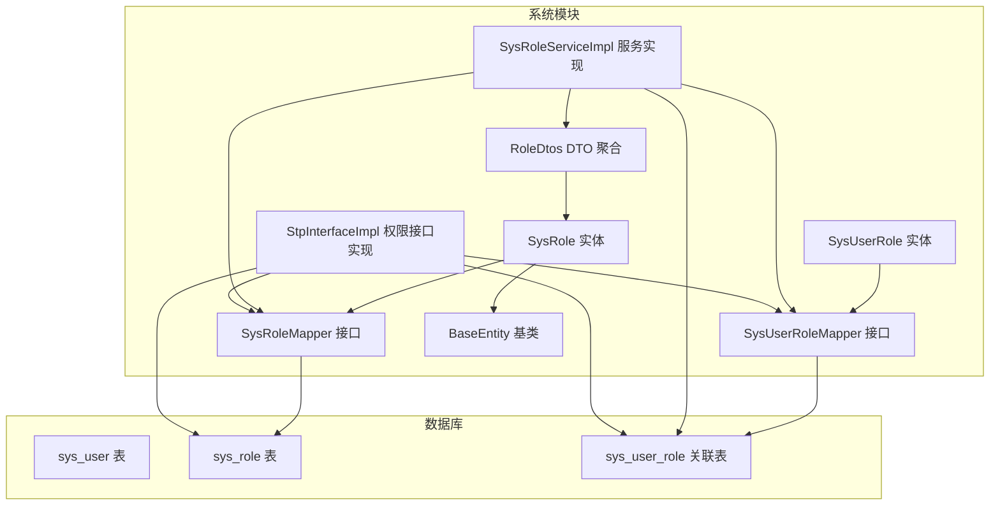
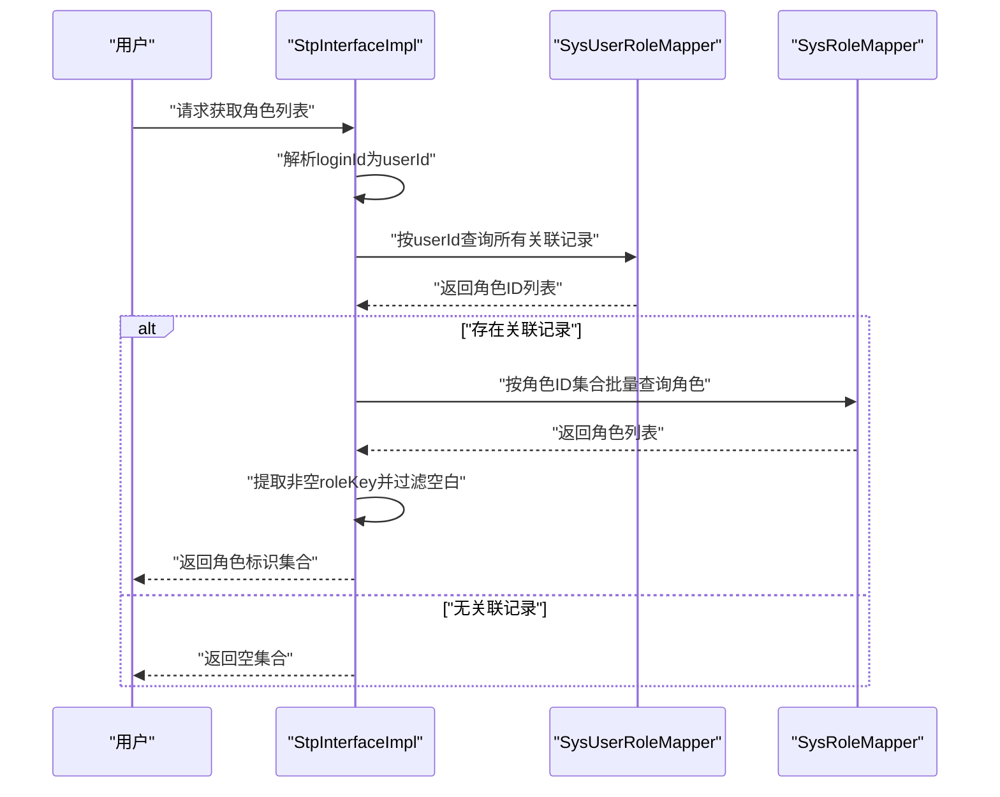
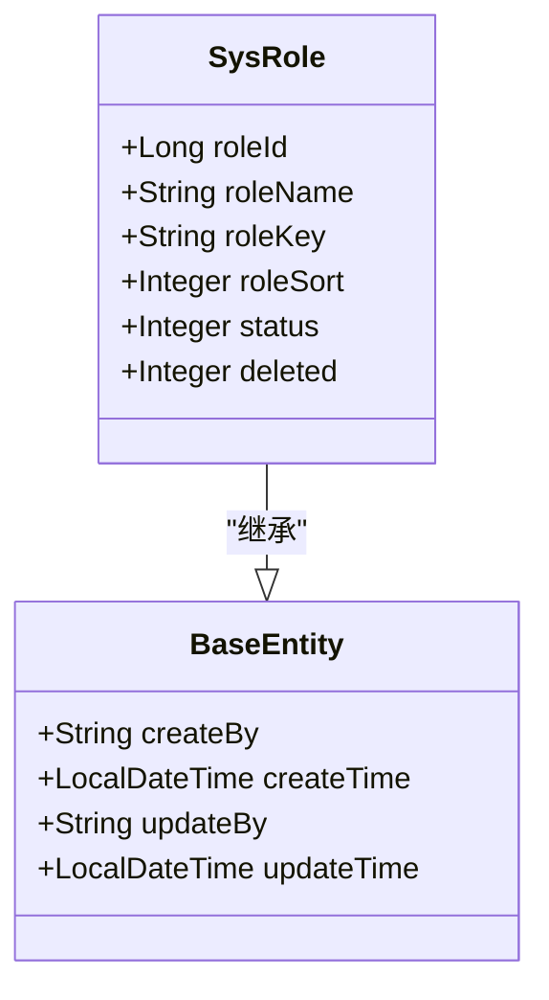
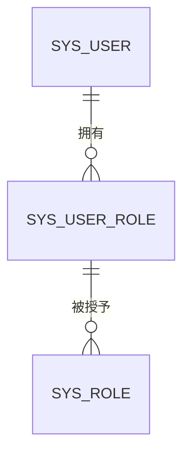
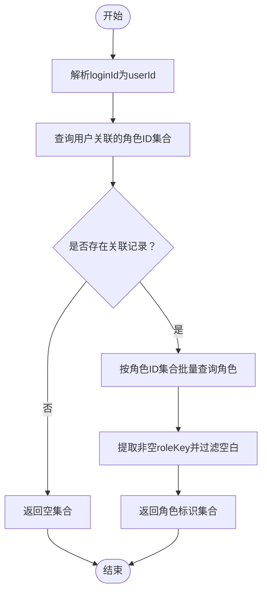
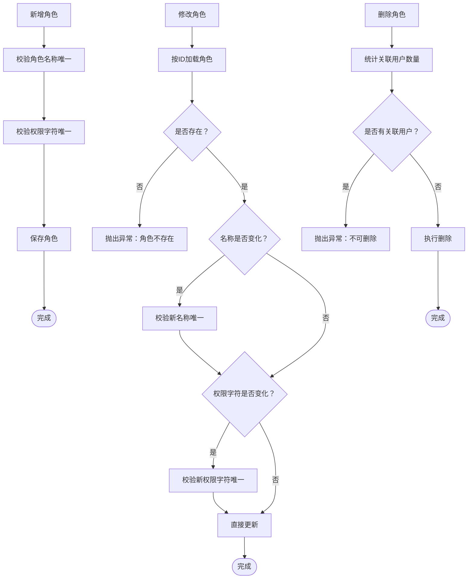
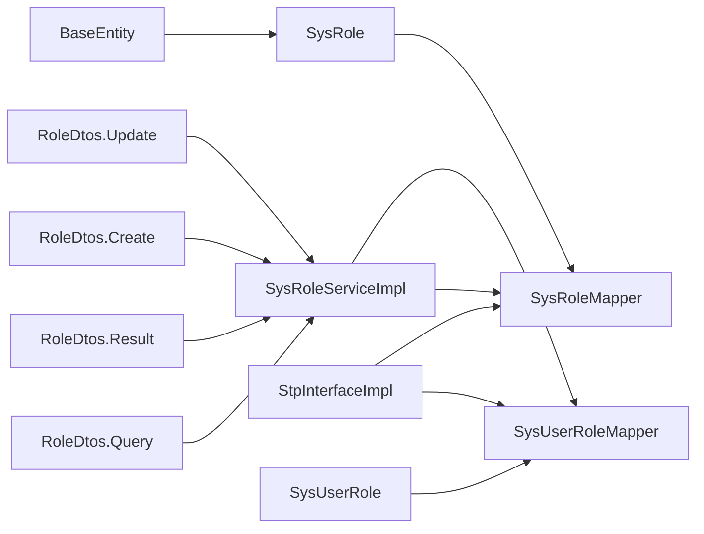

# 角色实体模型

<cite>
**本文引用的文件列表**
- [SysRole.java](file://verulia-modules/verulia-system/src/main/java/org/yann/verulia/system/domain/entity/SysRole.java)
- [SysUserRole.java](file://verulia-modules/verulia-system/src/main/java/org/yann/verulia/system/domain/entity/SysUserRole.java)
- [SysRoleMapper.java](file://verulia-modules/verulia-system/src/main/java/org/yann/verulia/system/mapper/SysRoleMapper.java)
- [SysUserRoleMapper.java](file://verulia-modules/verulia-system/src/main/java/org/yann/verulia/system/mapper/SysUserRoleMapper.java)
- [SysRoleServiceImpl.java](file://verulia-modules/verulia-system/src/main/java/org/yann/verulia/system/service/impl/SysRoleServiceImpl.java)
- [StpInterfaceImpl.java](file://verulia-modules/verulia-system/src/main/java/org/yann/verulia/system/service/security/StpInterfaceImpl.java)
- [_init.sql](file://_script/_init.sql)
- [BaseEntity.java](file://verulia-framework/verulia-framework-core/src/main/java/org/yann/verulia/framework/core/domain/BaseEntity.java)
- [RoleDtos.java](file://verulia-modules/verulia-system/src/main/java/org/yann/verulia/system/domain/dto/RoleDtos.java)
</cite>

## 目录
1. [简介](#简介)
2. [项目结构](#项目结构)
3. [核心组件](#核心组件)
4. [架构总览](#架构总览)
5. [详细组件分析](#详细组件分析)
6. [依赖关系分析](#依赖关系分析)
7. [性能考量](#性能考量)
8. [故障排查指南](#故障排查指南)
9. [结论](#结论)
10. [附录](#附录)

## 简介
本文件围绕 SysRole 实体类展开，系统化阐述其在权限控制系统中的职责与设计要点，包括：
- 字段语义与映射：roleId、roleName、roleKey、roleSort、status、deleted 的业务含义与持久化映射
- 表结构映射：@TableName 与 @TableId 的精确映射关系
- 多对多关系：与 SysUser 通过 SysUserRole 建立的关联
- 权限校验：roleKey 在 Sa-Token 接口中的使用机制
- 数据库设计：基于 _init.sql 的字段长度、索引与约束
- 服务层实践：SysRoleServiceImpl 的增删改查与唯一性校验
- 状态联动与最佳实践：角色状态与用户状态的协同影响

## 项目结构
围绕角色模型的相关模块分布如下：
- 领域模型：SysRole、SysUserRole、BaseEntity
- 数据访问：SysRoleMapper、SysUserRoleMapper
- 业务服务：SysRoleServiceImpl
- 安全集成：StpInterfaceImpl
- DTO：RoleDtos
- 初始化脚本：_init.sql

图表来源
- [SysRole.java](file://verulia-modules/verulia-system/src/main/java/org/yann/verulia/system/domain/entity/SysRole.java#L1-L53)
- [SysUserRole.java](file://verulia-modules/verulia-system/src/main/java/org/yann/verulia/system/domain/entity/SysUserRole.java#L1-L37)
- [SysRoleMapper.java](file://verulia-modules/verulia-system/src/main/java/org/yann/verulia/system/mapper/SysRoleMapper.java#L1-L15)
- [SysUserRoleMapper.java](file://verulia-modules/verulia-system/src/main/java/org/yann/verulia/system/mapper/SysUserRoleMapper.java#L1-L15)
- [SysRoleServiceImpl.java](file://verulia-modules/verulia-system/src/main/java/org/yann/verulia/system/service/impl/SysRoleServiceImpl.java#L1-L123)
- [StpInterfaceImpl.java](file://verulia-modules/verulia-system/src/main/java/org/yann/verulia/system/service/security/StpInterfaceImpl.java#L1-L71)
- [_init.sql](file://_script/_init.sql#L1-L54)

章节来源
- [SysRole.java](file://verulia-modules/verulia-system/src/main/java/org/yann/verulia/system/domain/entity/SysRole.java#L1-L53)
- [SysUserRole.java](file://verulia-modules/verulia-system/src/main/java/org/yann/verulia/system/domain/entity/SysUserRole.java#L1-L37)
- [SysRoleMapper.java](file://verulia-modules/verulia-system/src/main/java/org/yann/verulia/system/mapper/SysRoleMapper.java#L1-L15)
- [SysUserRoleMapper.java](file://verulia-modules/verulia-system/src/main/java/org/yann/verulia/system/mapper/SysUserRoleMapper.java#L1-L15)
- [SysRoleServiceImpl.java](file://verulia-modules/verulia-system/src/main/java/org/yann/verulia/system/service/impl/SysRoleServiceImpl.java#L1-L123)
- [StpInterfaceImpl.java](file://verulia-modules/verulia-system/src/main/java/org/yann/verulia/system/service/security/StpInterfaceImpl.java#L1-L71)
- [_init.sql](file://_script/_init.sql#L1-L54)

## 核心组件
- SysRole：角色领域实体，承载角色基本信息与通用审计字段
- SysUserRole：用户与角色的关联实体，构成多对多关系
- SysRoleMapper/SysUserRoleMapper：MyBatis-Plus Mapper 接口
- SysRoleServiceImpl：角色服务实现，负责分页查询、新增、修改、删除与唯一性校验
- StpInterfaceImpl：Sa-Token 权限加载接口实现，基于角色的 roleKey 构造角色标识集合
- RoleDtos：角色相关 DTO（查询、创建、更新、结果视图）
- BaseEntity：通用审计字段基类

章节来源
- [SysRole.java](file://verulia-modules/verulia-system/src/main/java/org/yann/verulia/system/domain/entity/SysRole.java#L1-L53)
- [SysUserRole.java](file://verulia-modules/verulia-system/src/main/java/org/yann/verulia/system/domain/entity/SysUserRole.java#L1-L37)
- [SysRoleMapper.java](file://verulia-modules/verulia-system/src/main/java/org/yann/verulia/system/mapper/SysRoleMapper.java#L1-L15)
- [SysUserRoleMapper.java](file://verulia-modules/verulia-system/src/main/java/org/yann/verulia/system/mapper/SysUserRoleMapper.java#L1-L15)
- [SysRoleServiceImpl.java](file://verulia-modules/verulia-system/src/main/java/org/yann/verulia/system/service/impl/SysRoleServiceImpl.java#L1-L123)
- [StpInterfaceImpl.java](file://verulia-modules/verulia-system/src/main/java/org/yann/verulia/system/service/security/StpInterfaceImpl.java#L1-L71)
- [RoleDtos.java](file://verulia-modules/verulia-system/src/main/java/org/yann/verulia/system/domain/dto/RoleDtos.java#L1-L77)
- [BaseEntity.java](file://verulia-framework/verulia-framework-core/src/main/java/org/yann/verulia/framework/core/domain/BaseEntity.java#L1-L44)

## 架构总览
下图展示角色实体在权限控制中的关键交互流程：用户登录后，系统通过 SysUserRoleMapper 获取用户关联的角色ID集合，再通过 SysRoleMapper 批量查询角色并提取 roleKey，最终返回给 Sa-Token 作为角色标识集合。

图表来源
- [StpInterfaceImpl.java](file://verulia-modules/verulia-system/src/main/java/org/yann/verulia/system/service/security/StpInterfaceImpl.java#L1-L71)
- [SysUserRoleMapper.java](file://verulia-modules/verulia-system/src/main/java/org/yann/verulia/system/mapper/SysUserRoleMapper.java#L1-L15)
- [SysRoleMapper.java](file://verulia-modules/verulia-system/src/main/java/org/yann/verulia/system/mapper/SysRoleMapper.java#L1-L15)

## 详细组件分析

### SysRole 实体类详解
- 表映射注解
  - @TableName("sys_role")：将实体映射到数据库表 sys_role
  - @TableId(value = "role_id", type = IdType.ASSIGN_ID)：指定主键字段 role_id，并使用雪花算法生成主键
  - @TableLogic：deleted 字段启用逻辑删除
- 继承关系
  - 继承 BaseEntity，自动获得 createBy、createTime、updateBy、updateTime 等审计字段
- 字段语义
  - roleId：角色主键，业务自定义字段名映射
  - roleName：角色名称，业务可读标识
  - roleKey：权限字符，用于 Sa-Token 权限校验的关键字段
  - roleSort：显示顺序，用于排序展示
  - status：角色状态（1 正常，0 停用）
  - deleted：逻辑删除标记（0 未删除，1 已删除）

图表来源
- [SysRole.java](file://verulia-modules/verulia-system/src/main/java/org/yann/verulia/system/domain/entity/SysRole.java#L1-L53)
- [BaseEntity.java](file://verulia-framework/verulia-framework-core/src/main/java/org/yann/verulia/framework/core/domain/BaseEntity.java#L1-L44)

章节来源
- [SysRole.java](file://verulia-modules/verulia-system/src/main/java/org/yann/verulia/system/domain/entity/SysRole.java#L1-L53)
- [BaseEntity.java](file://verulia-framework/verulia-framework-core/src/main/java/org/yann/verulia/framework/core/domain/BaseEntity.java#L1-L44)

### 多对多关系：SysUserRole
- 关联表结构
  - sys_user_role：联合主键 (user_id, role_id)，表示用户与角色的多对多关系
- 实体映射
  - SysUserRole：包含 userId、roleId 两个主键字段，映射到 sys_user_role 表
- 使用场景
  - 用户授权：插入/删除关联记录以授予或撤销角色
  - 角色查询：通过关联表查询用户的角色集合

图表来源
- [_init.sql](file://_script/_init.sql#L36-L42)
- [SysUserRole.java](file://verulia-modules/verulia-system/src/main/java/org/yann/verulia/system/domain/entity/SysUserRole.java#L1-L37)

章节来源
- [_init.sql](file://_script/_init.sql#L36-L42)
- [SysUserRole.java](file://verulia-modules/verulia-system/src/main/java/org/yann/verulia/system/domain/entity/SysUserRole.java#L1-L37)

### 数据库设计与字段约束
- sys_role 表
  - 主键：role_id
  - 唯一索引：role_key
  - 字段长度与类型：role_name（varchar(30)）、role_key（varchar(100)）、status（tinyint，默认1）、deleted（tinyint，默认0）
- sys_user_role 表
  - 联合主键：(user_id, role_id)
- sys_user 表（参考）
  - 字段：username（唯一索引 uk_username）、status（tinyint，默认1）、deleted（tinyint，默认0）

章节来源
- [_init.sql](file://_script/_init.sql#L19-L34)
- [_init.sql](file://_script/_init.sql#L36-L42)
- [_init.sql](file://_script/_init.sql#L1-L17)

### 权限校验机制：roleKey 与 Sa-Token
- 角色标识来源
  - StpInterfaceImpl.getRoleList：根据 userId 查询关联的角色ID，批量查询角色并提取 roleKey
- 角色标识集合
  - 过滤掉 null 或空白的 roleKey，确保仅返回有效权限字符
- 作用
  - Sa-Token 将该集合作为用户的角色标识集合，用于后续权限判定

图表来源
- [StpInterfaceImpl.java](file://verulia-modules/verulia-system/src/main/java/org/yann/verulia/system/service/security/StpInterfaceImpl.java#L1-L71)

章节来源
- [StpInterfaceImpl.java](file://verulia-modules/verulia-system/src/main/java/org/yann/verulia/system/service/security/StpInterfaceImpl.java#L1-L71)

### 服务层：SysRoleServiceImpl 增删改查与唯一性校验
- 分页查询
  - 支持按 roleName、roleKey、status 进行条件过滤，并按 roleSort 升序、创建时间降序排序
- 新增角色
  - 先校验 roleName 与 roleKey 的唯一性，再保存
- 修改角色
  - 若变更了 roleName 或 roleKey，则分别进行唯一性校验；随后更新
- 删除角色
  - 若角色已被用户关联，则拒绝删除；否则执行删除
- 唯一性校验
  - checkRoleNameUnique：按 roleName 查询是否存在
  - checkRoleKeyUnique：按 roleKey 查询是否存在

图表来源
- [SysRoleServiceImpl.java](file://verulia-modules/verulia-system/src/main/java/org/yann/verulia/system/service/impl/SysRoleServiceImpl.java#L1-L123)

章节来源
- [SysRoleServiceImpl.java](file://verulia-modules/verulia-system/src/main/java/org/yann/verulia/system/service/impl/SysRoleServiceImpl.java#L1-L123)

### 代码片段路径（不含具体代码内容）
- 新增角色
  - [SysRoleServiceImpl.addRole(...)](file://verulia-modules/verulia-system/src/main/java/org/yann/verulia/system/service/impl/SysRoleServiceImpl.java#L67-L76)
- 修改角色
  - [SysRoleServiceImpl.updateRole(...)](file://verulia-modules/verulia-system/src/main/java/org/yann/verulia/system/service/impl/SysRoleServiceImpl.java#L78-L95)
- 删除角色
  - [SysRoleServiceImpl.deleteRole(...)](file://verulia-modules/verulia-system/src/main/java/org/yann/verulia/system/service/impl/SysRoleServiceImpl.java#L97-L109)
- 唯一性校验
  - [SysRoleServiceImpl.checkRoleNameUnique(...)](file://verulia-modules/verulia-system/src/main/java/org/yann/verulia/system/service/impl/SysRoleServiceImpl.java#L111-L115)
  - [SysRoleServiceImpl.checkRoleKeyUnique(...)](file://verulia-modules/verulia-system/src/main/java/org/yann/verulia/system/service/impl/SysRoleServiceImpl.java#L117-L121)

## 依赖关系分析
- 实体依赖
  - SysRole 继承 BaseEntity，复用审计字段
  - SysUserRole 为简单实体，映射关联表
- Mapper 依赖
  - SysRoleServiceImpl 依赖 SysRoleMapper 与 SysUserRoleMapper
  - StpInterfaceImpl 依赖 SysUserRoleMapper 与 SysRoleMapper
- DTO 依赖
  - RoleDtos.Query/Result/Create/Update 与 SysRole 实体字段一一对应，便于分页与视图转换

图表来源
- [SysRole.java](file://verulia-modules/verulia-system/src/main/java/org/yann/verulia/system/domain/entity/SysRole.java#L1-L53)
- [SysUserRole.java](file://verulia-modules/verulia-system/src/main/java/org/yann/verulia/system/domain/entity/SysUserRole.java#L1-L37)
- [SysRoleServiceImpl.java](file://verulia-modules/verulia-system/src/main/java/org/yann/verulia/system/service/impl/SysRoleServiceImpl.java#L1-L123)
- [StpInterfaceImpl.java](file://verulia-modules/verulia-system/src/main/java/org/yann/verulia/system/service/security/StpInterfaceImpl.java#L1-L71)
- [RoleDtos.java](file://verulia-modules/verulia-system/src/main/java/org/yann/verulia/system/domain/dto/RoleDtos.java#L1-L77)

章节来源
- [SysRoleServiceImpl.java](file://verulia-modules/verulia-system/src/main/java/org/yann/verulia/system/service/impl/SysRoleServiceImpl.java#L1-L123)
- [StpInterfaceImpl.java](file://verulia-modules/verulia-system/src/main/java/org/yann/verulia/system/service/security/StpInterfaceImpl.java#L1-L71)
- [RoleDtos.java](file://verulia-modules/verulia-system/src/main/java/org/yann/verulia/system/domain/dto/RoleDtos.java#L1-L77)

## 性能考量
- 查询优化
  - 分页查询时按 roleSort 升序、创建时间降序排序，有利于前端展示与检索效率
  - SysRoleMapper 支持按 roleKey 精确匹配，配合数据库唯一索引提升命中率
- 批量查询
  - StpInterfaceImpl 通过按角色ID集合批量查询角色，减少多次往返
- 写入优化
  - 新增/修改前先做唯一性校验，避免重复写入导致的回滚成本
- 逻辑删除
  - 使用 @TableLogic 对 deleted 字段进行统一处理，减少物理删除带来的维护成本

## 故障排查指南
- 新增/修改时报“角色名称已存在”
  - 可能原因：roleName 重复
  - 处理建议：检查唯一性校验逻辑与数据库唯一索引
  - 参考路径：[SysRoleServiceImpl.checkRoleNameUnique(...)](file://verulia-modules/verulia-system/src/main/java/org/yann/verulia/system/service/impl/SysRoleServiceImpl.java#L111-L115)
- 新增/修改时报“权限字符已存在”
  - 可能原因：roleKey 重复
  - 处理建议：检查唯一性校验逻辑与数据库唯一索引
  - 参考路径：[SysRoleServiceImpl.checkRoleKeyUnique(...)](file://verulia-modules/verulia-system/src/main/java/org/yann/verulia/system/service/impl/SysRoleServiceImpl.java#L117-L121)
- 删除时报“该角色已分配用户，无法删除”
  - 可能原因：存在关联记录
  - 处理建议：先撤销用户关联，再删除角色
  - 参考路径：[SysRoleServiceImpl.deleteRole(...)](file://verulia-modules/verulia-system/src/main/java/org/yann/verulia/system/service/impl/SysRoleServiceImpl.java#L97-L109)
- 权限校验无效
  - 可能原因：roleKey 为空或空白
  - 处理建议：确保角色设置有效且非空白的 roleKey
  - 参考路径：[StpInterfaceImpl.getRoleList(...)](file://verulia-modules/verulia-system/src/main/java/org/yann/verulia/system/service/security/StpInterfaceImpl.java#L41-L69)

章节来源
- [SysRoleServiceImpl.java](file://verulia-modules/verulia-system/src/main/java/org/yann/verulia/system/service/impl/SysRoleServiceImpl.java#L97-L121)
- [StpInterfaceImpl.java](file://verulia-modules/verulia-system/src/main/java/org/yann/verulia/system/service/security/StpInterfaceImpl.java#L41-L69)

## 结论
SysRole 实体通过明确的字段语义、严谨的表映射与完善的审计机制，构建了角色管理的基础数据模型。借助 SysUserRole 实现用户与角色的多对多关联，配合 StpInterfaceImpl 基于 roleKey 的角色标识提取，形成从数据到权限的闭环。服务层在新增/修改时严格进行唯一性校验，在删除时防止破坏性操作，整体设计兼顾了可用性与安全性。

## 附录
- 字段与表结构对照（基于 _init.sql）
  - sys_role：role_id（主键）、role_name（varchar(30)）、role_key（varchar(100)，唯一）、role_sort（int）、status（tinyint，默认1）、deleted（tinyint，默认0）
  - sys_user_role：user_id、role_id（联合主键）
- 最佳实践建议
  - 角色命名规范：使用语义清晰、唯一的 roleName
  - 权限字符规范：使用稳定、可读性强的 roleKey，避免频繁变更
  - 状态治理：角色与用户状态应保持一致的治理策略，避免出现“角色正常但用户被禁用”的矛盾
  - 审计追踪：利用 BaseEntity 自动填充的审计字段，保留完整的变更轨迹