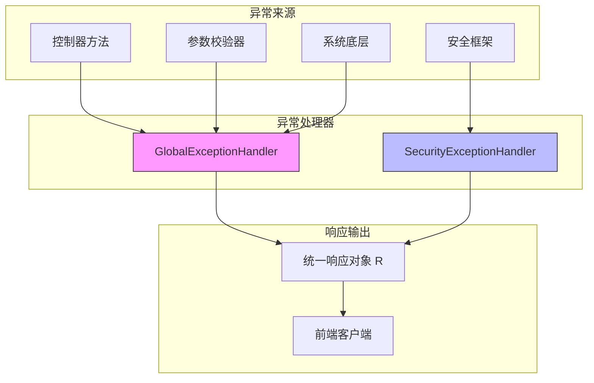
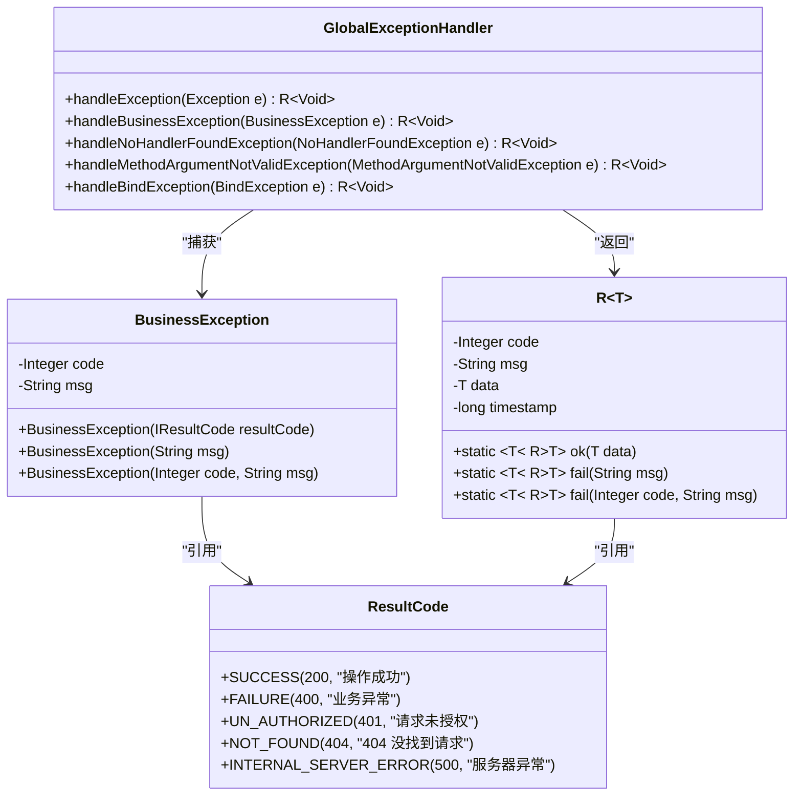
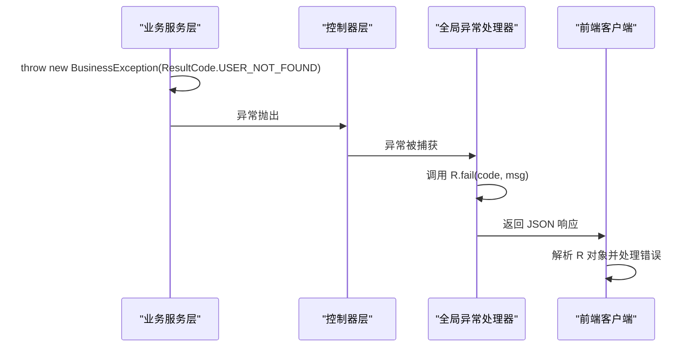
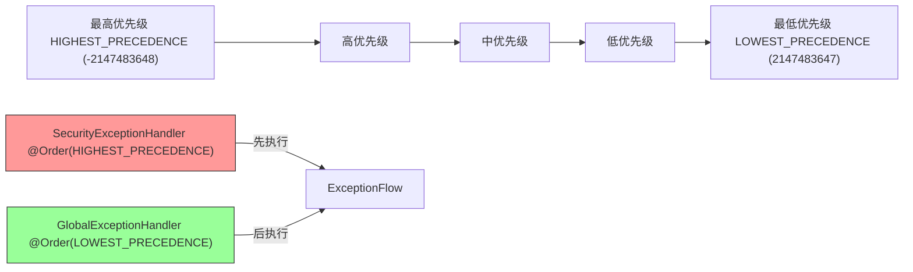
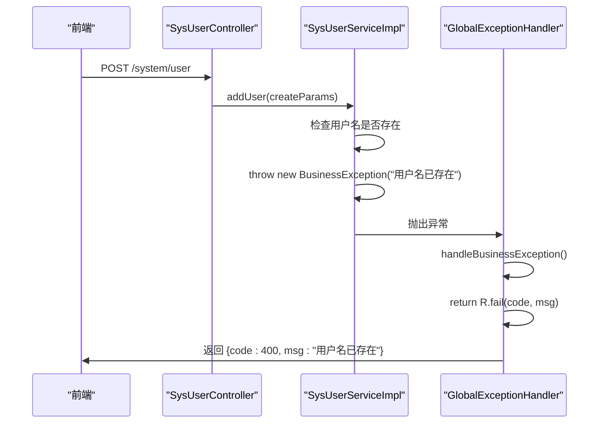

# 全局异常处理体系

<cite>
**本文档引用文件**  
- [GlobalExceptionHandler.java](file://verulia-framework/verulia-framework-web/src/main/java/org/yann/verulia/framework/web/handler/GlobalExceptionHandler.java)
- [BusinessException.java](file://verulia-framework/verulia-framework-core/src/main/java/org/yann/verulia/framework/core/exception/BusinessException.java)
- [R.java](file://verulia-framework/verulia-framework-core/src/main/java/org/yann/verulia/framework/core/domain/R.java)
- [ResultCode.java](file://verulia-framework/verulia-framework-core/src/main/java/org/yann/verulia/framework/core/enums/ResultCode.java)
- [SysUserServiceImpl.java](file://verulia-modules/verulia-system/src/main/java/org/yann/verulia/system/service/impl/SysUserServiceImpl.java)
- [SysUserController.java](file://verulia-modules/verulia-system/src/main/java/org/yann/verulia/system/controller/SysUserController.java)
- [SecurityExceptionHandler.java](file://verulia-framework/verulia-framework-security/src/main/java/org/yann/verulia/framework/security/handler/SecurityExceptionHandler.java)
</cite>

## 目录
1. [引言](#引言)
2. [全局异常处理器架构](#全局异常处理器架构)
3. [核心组件分析](#核心组件分析)
4. [异常处理链路详解](#异常处理链路详解)
5. [日志记录与安全脱敏策略](#日志记录与安全脱敏策略)
6. [处理器优先级机制](#处理器优先级机制)
7. [自定义业务异常使用示例](#自定义业务异常使用示例)
8. [扩展指导：新增自定义异常类型](#扩展指导：新增自定义异常类型)
9. [结论](#结论)

## 引言
本文档深入解析Verulia项目中的全局异常处理机制，重点阐述`GlobalExceptionHandler`如何通过`@RestControllerAdvice`实现跨控制器的异常拦截与统一响应。文档详细说明各类异常的捕获逻辑、转换规则及在系统中的实际应用，为开发者提供完整的异常处理体系认知与扩展指导。

## 全局异常处理器架构



**图示来源**  
- [GlobalExceptionHandler.java](file://verulia-framework/verulia-framework-web/src/main/java/org/yann/verulia/framework/web/handler/GlobalExceptionHandler.java)
- [SecurityExceptionHandler.java](file://verulia-framework/verulia-framework-security/src/main/java/org/yann/verulia/framework/security/handler/SecurityExceptionHandler.java)

**本节来源**  
- [GlobalExceptionHandler.java](file://verulia-framework/verulia-framework-web/src/main/java/org/yann/verulia/framework/web/handler/GlobalExceptionHandler.java)
- [SecurityExceptionHandler.java](file://verulia-framework/verulia-framework-security/src/main/java/org/yann/verulia/framework/security/handler/SecurityExceptionHandler.java)

## 核心组件分析

### 全局异常处理器（GlobalExceptionHandler）

`GlobalExceptionHandler`是系统核心的异常拦截组件，通过`@RestControllerAdvice`注解实现对所有控制器的全局异常捕获。其主要职责包括：

- 捕获未处理的系统异常
- 处理业务逻辑抛出的`BusinessException`
- 拦截参数校验失败异常
- 响应404路径未找到异常
- 统一返回标准化的`R`响应对象



**图示来源**  
- [GlobalExceptionHandler.java](file://verulia-framework/verulia-framework-web/src/main/java/org/yann/verulia/framework/web/handler/GlobalExceptionHandler.java)
- [BusinessException.java](file://verulia-framework/verulia-framework-core/src/main/java/org/yann/verulia/framework/core/exception/BusinessException.java)
- [R.java](file://verulia-framework/verulia-framework-core/src/main/java/org/yann/verulia/framework/core/domain/R.java)
- [ResultCode.java](file://verulia-framework/verulia-framework-core/src/main/java/org/yann/verulia/framework/core/enums/ResultCode.java)

**本节来源**  
- [GlobalExceptionHandler.java](file://verulia-framework/verulia-framework-web/src/main/java/org/yann/verulia/framework/web/handler/GlobalExceptionHandler.java)
- [BusinessException.java](file://verulia-framework/verulia-framework-core/src/main/java/org/yann/verulia/framework/core/exception/BusinessException.java)
- [R.java](file://verulia-framework/verulia-framework-core/src/main/java/org/yann/verulia/framework/core/domain/R.java)

## 异常处理链路详解

### 异常类型与处理逻辑映射表

| 异常类型 | 处理方法 | 错误码 | 响应消息 | 日志级别 |
|---------|--------|-------|--------|--------|
| `Exception` | `handleException` | 500 | "系统繁忙，请稍后重试" | ERROR |
| `BusinessException` | `handleBusinessException` | 自定义 | 自定义 | 无 |
| `NoHandlerFoundException` | `handleNoHandlerFoundException` | 404 | "路径不存在，请检查路径是否正确" | 无 |
| `MethodArgumentNotValidException` | `handleMethodArgumentNotValidException` | 400 | 参数校验错误信息 | WARN |
| `BindException` | `handleBindException` | 400 | "参数格式错误" | WARN |

### 业务异常处理流程



**图示来源**  
- [BusinessException.java](file://verulia-framework/verulia-framework-core/src/main/java/org/yann/verulia/framework/core/exception/BusinessException.java)
- [GlobalExceptionHandler.java](file://verulia-framework/verulia-framework-web/src/main/java/org/yann/verulia/framework/web/handler/GlobalExceptionHandler.java)
- [R.java](file://verulia-framework/verulia-framework-core/src/main/java/org/yann/verulia/framework/core/domain/R.java)

**本节来源**  
- [GlobalExceptionHandler.java](file://verulia-framework/verulia-framework-web/src/main/java/org/yann/verulia/framework/web/handler/GlobalExceptionHandler.java)
- [BusinessException.java](file://verulia-framework/verulia-framework-core/src/main/java/org/yann/verulia/framework/core/exception/BusinessException.java)

## 日志记录与安全脱敏策略

全局异常处理器在捕获异常时实施了精细化的日志记录策略，确保既能提供足够的调试信息，又能保护敏感数据。

### 日志记录策略

- **系统异常**：使用`ERROR`级别记录完整堆栈，便于定位生产环境问题
- **参数异常**：使用`WARN`级别记录，避免日志污染，仅记录关键错误信息
- **业务异常**：不自动记录日志，由业务代码自行决定是否记录

### 安全信息脱敏

处理器通过以下方式实现安全脱敏：
1. 不将原始异常消息直接返回给前端
2. 系统异常返回通用提示，防止信息泄露
3. 参数校验异常仅返回校验失败信息，不暴露内部逻辑

```mermaid
flowchart TD
Start([异常发生]) --> ExceptionType{"异常类型?"}
ExceptionType --> |系统异常| LogError["log.error(\"系统异常:\", e)"]
ExceptionType --> |参数校验| LogWarn["log.warn(\"参数校验异常: {}\", msg)"]
ExceptionType --> |绑定异常| LogWarn2["log.warn(\"参数绑定异常: {}\", e.getMessage())"]
ExceptionType --> |业务异常| NoLog["不记录日志"]
LogError --> BuildResponse
LogWarn --> BuildResponse
LogWarn2 --> BuildResponse
NoLog --> BuildResponse
BuildResponse["构建 R.fail() 响应"] --> ReturnResponse["返回前端"]
style LogError fill:#fdd,stroke:#f00
style LogWarn fill:#ffddcc,stroke:#f90
style LogWarn2 fill:#ffddcc,stroke:#f90
style NoLog fill:#dfd,stroke:#090
```

**图示来源**  
- [GlobalExceptionHandler.java](file://verulia-framework/verulia-framework-web/src/main/java/org/yann/verulia/framework/web/handler/GlobalExceptionHandler.java)

**本节来源**  
- [GlobalExceptionHandler.java](file://verulia-framework/verulia-framework-web/src/main/java/org/yann/verulia/framework/web/handler/GlobalExceptionHandler.java)

## 处理器优先级机制

### @Order 注解解析

`@Order(Ordered.LOWEST_PRECEDENCE)` 注解确保 `GlobalExceptionHandler` 在异常处理责任链中处于最低优先级，其作用机制如下：



### 优先级设计意义

1. **安全异常优先**：`SecurityExceptionHandler` 优先处理认证授权异常
2. **通用异常兜底**：`GlobalExceptionHandler` 作为最后防线处理其他所有异常
3. **避免冲突**：确保特定异常处理器优先于通用处理器执行

**图示来源**  
- [GlobalExceptionHandler.java](file://verulia-framework/verulia-framework-web/src/main/java/org/yann/verulia/framework/web/handler/GlobalExceptionHandler.java)
- [SecurityExceptionHandler.java](file://verulia-framework/verulia-framework-security/src/main/java/org/yann/verulia/framework/security/handler/SecurityExceptionHandler.java)

**本节来源**  
- [GlobalExceptionHandler.java](file://verulia-framework/verulia-framework-web/src/main/java/org/yann/verulia/framework/web/handler/GlobalExceptionHandler.java)
- [SecurityExceptionHandler.java](file://verulia-framework/verulia-framework-security/src/main/java/org/yann/verulia/framework/security/handler/SecurityExceptionHandler.java)

## 自定义业务异常使用示例

### 完整调用链路



### 代码实现示例

当用户服务层检测到用户名冲突时：

```java
if (exists(new LambdaQueryWrapper<SysUser>().eq(SysUser::getUsername, createParams.username()))) {
    throw new BusinessException("用户名已存在");
}
```

该异常被`GlobalExceptionHandler`捕获并转换为标准响应：

```json
{
  "code": 400,
  "msg": "用户名已存在",
  "timestamp": 1740000000000
}
```

**图示来源**  
- [SysUserServiceImpl.java](file://verulia-modules/verulia-system/src/main/java/org/yann/verulia/system/service/impl/SysUserServiceImpl.java)
- [SysUserController.java](file://verulia-modules/verulia-system/src/main/java/org/yann/verulia/system/controller/SysUserController.java)
- [GlobalExceptionHandler.java](file://verulia-framework/verulia-framework-web/src/main/java/org/yann/verulia/framework/web/handler/GlobalExceptionHandler.java)

**本节来源**  
- [SysUserServiceImpl.java](file://verulia-modules/verulia-system/src/main/java/org/yann/verulia/system/service/impl/SysUserServiceImpl.java)
- [SysUserController.java](file://verulia-modules/verulia-system/src/main/java/org/yann/verulia/system/controller/SysUserController.java)

## 扩展指导：新增自定义异常类型

### 新增自定义异常步骤

1. **定义新的结果码枚举**
```java
// 在 ResultCode.java 中添加
USER_LOCKED(403, "用户已被锁定"),
```

2. **在业务代码中抛出异常**
```java
throw new BusinessException(ResultCode.USER_LOCKED);
```

3. **可选：添加专用处理器**
```java
@ExceptionHandler(UserLockedException.class)
public R<Void> handleUserLockedException(UserLockedException e) {
    log.warn("用户被锁定: {}", e.getUserId());
    return R.fail(ResultCode.USER_LOCKED);
}
```

### 扩展原则

- **优先使用枚举**：推荐使用`ResultCode`枚举而非硬编码
- **保持一致性**：新异常应遵循现有命名和处理模式
- **文档化**：在`ResultCode`枚举中添加清晰的注释
- **避免过度扩展**：除非必要，否则应复用现有异常类型

**本节来源**  
- [ResultCode.java](file://verulia-framework/verulia-framework-core/src/main/java/org/yann/verulia/framework/core/enums/ResultCode.java)
- [BusinessException.java](file://verulia-framework/verulia-framework-core/src/main/java/org/yann/verulia/framework/core/exception/BusinessException.java)

## 结论
Verulia项目的全局异常处理机制通过`@RestControllerAdvice`和`@ExceptionHandler`注解实现了优雅的异常拦截与统一响应。该机制具有以下优势：

1. **集中化管理**：所有异常处理逻辑集中在`GlobalExceptionHandler`中
2. **分层处理**：通过`@Order`注解实现处理器优先级控制
3. **安全可靠**：实施日志分级记录和信息脱敏策略
4. **易于扩展**：基于`BusinessException`和`ResultCode`的扩展机制简单明了
5. **前后端分离友好**：统一的`R<T>`响应格式便于前端处理

该设计模式为系统提供了健壮的异常处理能力，是值得在类似项目中借鉴的最佳实践。