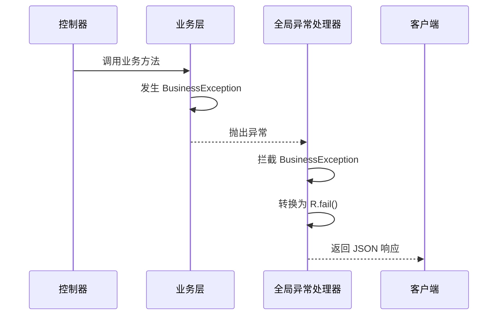
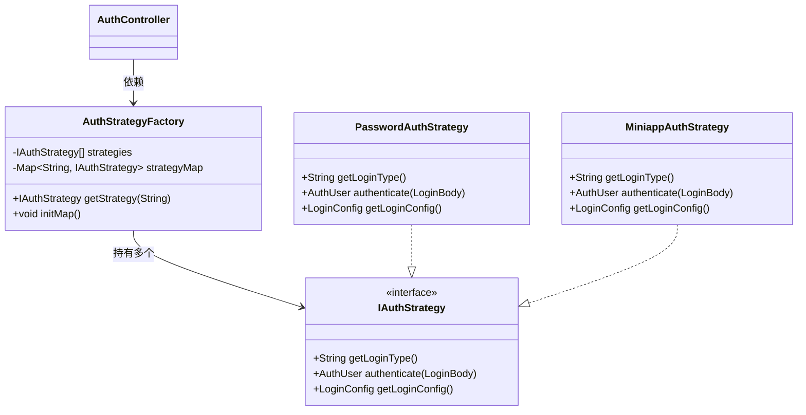
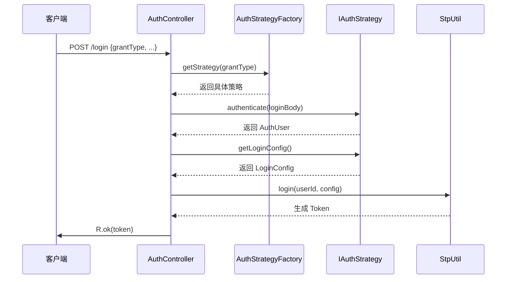

# 核心功能架构

<cite>
**本文档引用的文件**  
- [R.java](file://verulia-framework/verulia-framework-core/src/main/java/org/yann/verulia/framework/core/domain/R.java)
- [GlobalExceptionHandler.java](file://verulia-framework/verulia-framework-web/src/main/java/org/yann/verulia/framework/web/handler/GlobalExceptionHandler.java)
- [IAuthStrategy.java](file://verulia-framework/verulia-framework-auth/src/main/java/org/yann/verulia/framework/auth/strategy/IAuthStrategy.java)
- [AuthStrategyFactory.java](file://verulia-framework/verulia-framework-auth/src/main/java/org/yann/verulia/framework/auth/strategy/AuthStrategyFactory.java)
- [BusinessException.java](file://verulia-framework/verulia-framework-core/src/main/java/org/yann/verulia/framework/core/exception/BusinessException.java)
- [ResultCode.java](file://verulia-framework/verulia-framework-core/src/main/java/org/yann/verulia/framework/core/enums/ResultCode.java)
- [IResultCode.java](file://verulia-framework/verulia-framework-core/src/main/java/org/yann/verulia/framework/core/enums/IResultCode.java)
- [PasswordAuthStrategy.java](file://verulia-modules/verulia-system/src/main/java/org/yann/verulia/system/service/strategy/PasswordAuthStrategy.java)
- [MiniappAuthStrategy.java](file://verulia-modules/verulia-system/src/main/java/org/yann/verulia/system/service/strategy/MiniappAuthStrategy.java)
- [AuthController.java](file://verulia-admin/src/main/java/org/yann/verulia/controller/AuthController.java)
</cite>

## 目录
1. [统一响应机制](#统一响应机制)  
2. [全局异常处理](#全局异常处理)  
3. [认证策略模式](#认证策略模式)  
4. [组件协作与架构设计](#组件协作与架构设计)  
5. [总结](#总结)

## 统一响应机制

Verulia框架通过`R<T>`泛型类实现了统一的API响应格式，确保前后端交互的数据结构一致性。该类作为所有控制器返回值的标准封装，包含状态码（code）、消息（msg）、数据（data）和时间戳（timestamp）四个核心字段。

`R<T>`类的设计哲学基于**静态工厂方法模式**，提供了`ok()`和`fail()`两类静态方法，分别用于构建成功和失败的响应。这种设计避免了直接暴露构造函数，增强了API的可读性和使用的一致性。例如：
- `R.ok(data)`：返回成功响应，携带业务数据
- `R.fail("错误信息")`：返回失败响应，附带错误描述

此外，`R<T>`支持链式调用，允许在构建响应后动态修改状态码或消息内容，如`R.ok().setCode(201)`，提升了灵活性。

**Section sources**  
- [R.java](file://verulia-framework/verulia-framework-core/src/main/java/org/yann/verulia/framework/core/domain/R.java#L1-L101)

## 全局异常处理

框架通过`@RestControllerAdvice`和`@ExceptionHandler`注解实现了全局异常拦截机制，集中处理各类异常并转换为标准化的`R`响应，避免异常信息直接暴露给前端。

`GlobalExceptionHandler`类定义了多个异常处理器，覆盖了系统异常、业务异常、参数校验异常等常见场景：
- `handleException(Exception e)`：捕获未预期的系统异常，返回500错误
- `handleBusinessException(BusinessException e)`：处理自定义业务异常，返回对应的错误码和消息
- `handleMethodArgumentNotValidException(MethodArgumentNotValidException e)`：处理Spring参数校验失败，提取字段错误信息
- `handleNoHandlerFoundException(NoHandlerFoundException e)`：处理404路径不存在异常

该机制与`BusinessException`类协同工作，开发者可在业务层直接抛出`BusinessException`，无需层层捕获，由全局处理器统一转换为`R.fail()`响应，极大简化了错误处理逻辑。

**Diagram sources**  
- [GlobalExceptionHandler.java](file://verulia-framework/verulia-framework-web/src/main/java/org/yann/verulia/framework/web/handler/GlobalExceptionHandler.java#L1-L68)
- [BusinessException.java](file://verulia-framework/verulia-framework-core/src/main/java/org/yann/verulia/framework/core/exception/BusinessException.java#L1-L68)

**Section sources**  
- [GlobalExceptionHandler.java](file://verulia-framework/verulia-framework-web/src/main/java/org/yann/verulia/framework/web/handler/GlobalExceptionHandler.java#L1-L68)
- [BusinessException.java](file://verulia-framework/verulia-framework-core/src/main/java/org/yann/verulia/framework/core/exception/BusinessException.java#L1-L68)

## 认证策略模式

Verulia框架采用**策略模式**实现认证方式的可扩展性，核心由`IAuthStrategy`接口和`AuthStrategyFactory`工厂类构成。

### IAuthStrategy 接口

`IAuthStrategy`定义了认证策略的统一契约，包含三个核心方法：
- `getLoginType()`：返回登录类型标识（如"password"、"miniapp"）
- `authenticate(LoginBody loginBody)`：执行认证逻辑，返回用户信息
- `getLoginConfig()`：获取登录配置（如超时时间、设备类型）

该接口允许系统灵活扩展多种登录方式，如密码登录、小程序登录、短信验证码等，而无需修改核心认证流程。

### AuthStrategyFactory 工厂类

`AuthStrategyFactory`作为策略工厂，负责管理所有认证策略的实例。其核心机制如下：
1. 通过Spring依赖注入获取所有实现`IAuthStrategy`的Bean
2. 在`@PostConstruct`初始化方法中，将策略按`loginType`注册到`ConcurrentHashMap`中
3. 提供`getStrategy(String loginType)`方法，根据请求类型动态获取对应策略

这种设计实现了**运行时策略选择**，控制器只需根据请求参数中的`grantType`调用工厂获取策略，解耦了认证逻辑与调用方。

**Diagram sources**  
- [IAuthStrategy.java](file://verulia-framework/verulia-framework-auth/src/main/java/org/yann/verulia/framework/auth/strategy/IAuthStrategy.java#L1-L36)
- [AuthStrategyFactory.java](file://verulia-framework/verulia-framework-auth/src/main/java/org/yann/verulia/framework/auth/strategy/AuthStrategyFactory.java#L1-L51)
- [PasswordAuthStrategy.java](file://verulia-modules/verulia-system/src/main/java/org/yann/verulia/system/service/strategy/PasswordAuthStrategy.java#L1-L82)
- [MiniappAuthStrategy.java](file://verulia-modules/verulia-system/src/main/java/org/yann/verulia/system/service/strategy/MiniappAuthStrategy.java#L1-L95)

**Section sources**  
- [IAuthStrategy.java](file://verulia-framework/verulia-framework-auth/src/main/java/org/yann/verulia/framework/auth/strategy/IAuthStrategy.java#L1-L36)
- [AuthStrategyFactory.java](file://verulia-framework/verulia-framework-auth/src/main/java/org/yann/verulia/framework/auth/strategy/AuthStrategyFactory.java#L1-L51)

## 组件协作与架构设计

Verulia框架的三大支柱——统一响应、全局异常处理和认证策略——通过清晰的协作机制，共同构建了一个高内聚、低耦合的系统架构。

### 认证流程时序

以用户登录为例，各组件的协作流程如下：

**Diagram sources**  
- [AuthController.java](file://verulia-admin/src/main/java/org/yann/verulia/controller/AuthController.java#L1-L67)
- [AuthStrategyFactory.java](file://verulia-framework/verulia-framework-auth/src/main/java/org/yann/verulia/framework/auth/strategy/AuthStrategyFactory.java#L1-L51)
- [IAuthStrategy.java](file://verulia-framework/verulia-framework-auth/src/main/java/org/yann/verulia/framework/auth/strategy/IAuthStrategy.java#L1-L36)

### 架构优势

1. **可扩展性**：通过策略模式，新增登录方式只需实现`IAuthStrategy`接口，无需修改现有代码
2. **可维护性**：异常处理集中化，业务代码无需关注错误响应格式
3. **一致性**：统一响应格式确保API风格统一，便于前端处理
4. **解耦**：控制器仅依赖工厂和策略接口，不与具体实现耦合

## 总结

Verulia框架通过`R<T>`泛型类、`GlobalExceptionHandler`和`AuthStrategyFactory`三大核心组件，构建了一个现代化、可扩展的后端架构。统一响应机制确保了API的一致性，全局异常处理简化了错误管理，而认证策略模式则提供了灵活的身份验证扩展能力。这些设计共同提升了系统的可维护性、可读性和可扩展性，为业务快速迭代奠定了坚实基础。