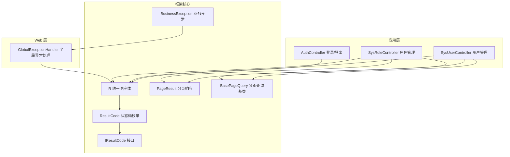
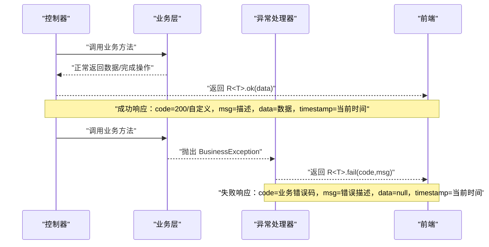
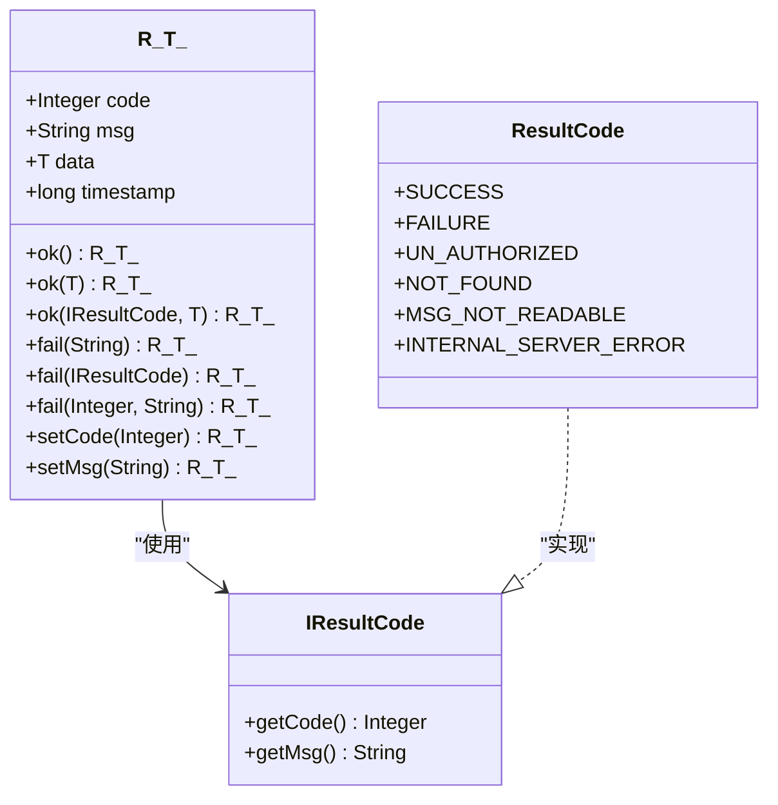
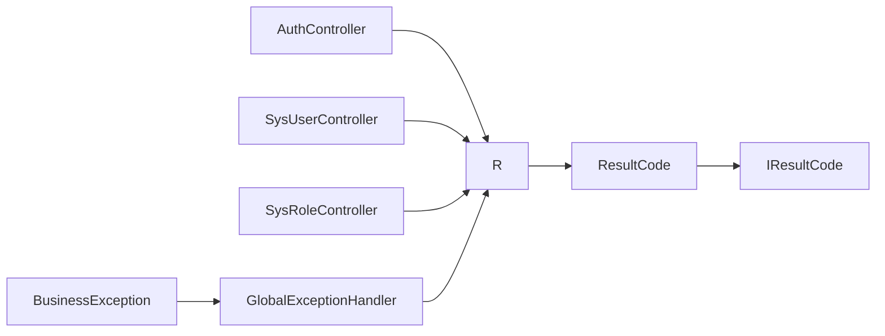

# 统一响应机制

<cite>
**本文引用的文件**
- [R.java](file://verulia-framework/verulia-framework-core/src/main/java/org/yann/verulia/framework/core/domain/R.java)
- [IResultCode.java](file://verulia-framework/verulia-framework-core/src/main/java/org/yann/verulia/framework/core/enums/IResultCode.java)
- [ResultCode.java](file://verulia-framework/verulia-framework-core/src/main/java/org/yann/verulia/framework/core/enums/ResultCode.java)
- [BusinessException.java](file://verulia-framework/verulia-framework-core/src/main/java/org/yann/verulia/framework/core/exception/BusinessException.java)
- [GlobalExceptionHandler.java](file://verulia-framework/verulia-framework-web/src/main/java/org/yann/verulia/framework/web/handler/GlobalExceptionHandler.java)
- [AuthController.java](file://verulia-admin/src/main/java/org/yann/verulia/controller/AuthController.java)
- [SysUserController.java](file://verulia-modules/verulia-system/src/main/java/org/yann/verulia/system/controller/SysUserController.java)
- [SysRoleController.java](file://verulia-modules/verulia-system/src/main/java/org/yann/verulia/system/controller/SysRoleController.java)
- [PageResult.java](file://verulia-framework/verulia-framework-core/src/main/java/org/yann/verulia/framework/core/domain/PageResult.java)
- [BasePageQuery.java](file://verulia-framework/verulia-framework-core/src/main/java/org/yann/verulia/framework/core/domain/BasePageQuery.java)
</cite>

## 目录
1. [引言](#引言)
2. [项目结构](#项目结构)
3. [核心组件](#核心组件)
4. [架构总览](#架构总览)
5. [详细组件分析](#详细组件分析)
6. [依赖分析](#依赖分析)
7. [性能考虑](#性能考虑)
8. [故障排查指南](#故障排查指南)
9. [结论](#结论)
10. [附录](#附录)

## 引言
本文件围绕 Verulia 项目中的统一响应体 R<T> 进行系统化说明，重点阐述其在框架层对任意数据类型的封装能力、code、msg、data、timestamp 四个字段的语义与使用场景；解析静态工厂方法 ok() 与 fail() 的设计优势及多种调用方式；展示链式调用（如 setCode、setMsg）带来的灵活性；并结合控制器与全局异常处理的实际用法，说明该设计如何提升前后端交互一致性、降低接口文档维护成本，以及与 Spring MVC 的集成机制。

## 项目结构
统一响应体位于框架核心模块中，配合状态码枚举、业务异常与全局异常处理共同构成后端接口输出的一致性契约。典型使用位置：
- 控制器层：各模块控制器直接返回 R<T>，确保响应结构统一
- 全局异常处理：将运行期异常转换为统一的 R<T> 失败响应
- 业务层：通过 BusinessException 抛出业务异常，由全局异常处理器转为统一响应

图表来源
- [R.java](file://verulia-framework/verulia-framework-core/src/main/java/org/yann/verulia/framework/core/domain/R.java#L1-L101)
- [ResultCode.java](file://verulia-framework/verulia-framework-core/src/main/java/org/yann/verulia/framework/core/enums/ResultCode.java#L1-L30)
- [IResultCode.java](file://verulia-framework/verulia-framework-core/src/main/java/org/yann/verulia/framework/core/enums/IResultCode.java#L1-L24)
- [BusinessException.java](file://verulia-framework/verulia-framework-core/src/main/java/org/yann/verulia/framework/core/exception/BusinessException.java#L1-L68)
- [GlobalExceptionHandler.java](file://verulia-framework/verulia-framework-web/src/main/java/org/yann/verulia/framework/web/handler/GlobalExceptionHandler.java#L1-L68)
- [AuthController.java](file://verulia-admin/src/main/java/org/yann/verulia/controller/AuthController.java#L1-L67)
- [SysUserController.java](file://verulia-modules/verulia-system/src/main/java/org/yann/verulia/system/controller/SysUserController.java#L1-L65)
- [SysRoleController.java](file://verulia-modules/verulia-system/src/main/java/org/yann/verulia/system/controller/SysRoleController.java#L1-L65)
- [PageResult.java](file://verulia-framework/verulia-framework-core/src/main/java/org/yann/verulia/framework/core/domain/PageResult.java#L1-L36)
- [BasePageQuery.java](file://verulia-framework/verulia-framework-core/src/main/java/org/yann/verulia/framework/core/domain/BasePageQuery.java#L1-L33)

章节来源
- [R.java](file://verulia-framework/verulia-framework-core/src/main/java/org/yann/verulia/framework/core/domain/R.java#L1-L101)
- [GlobalExceptionHandler.java](file://verulia-framework/verulia-framework-web/src/main/java/org/yann/verulia/framework/web/handler/GlobalExceptionHandler.java#L1-L68)

## 核心组件
- R<T> 统一响应体：提供 code、msg、data、timestamp 字段，支持泛型封装任意数据类型；提供静态工厂方法 ok()/fail() 与链式 setCode/setMsg 能力。
- ResultCode 状态码枚举：内置常用状态码与消息，作为 ok()/fail() 的默认值来源。
- IResultCode 接口：定义 code 与 msg 的获取规范，便于扩展自定义状态码。
- BusinessException 业务异常：用于 Service 层抛出业务异常，交由全局异常处理器转换为统一响应。
- GlobalExceptionHandler 全局异常处理：集中捕获异常并返回 R<T> 失败响应，保证异常响应一致性。
- 控制器示例：AuthController、SysUserController、SysRoleController 展示了 R<T> 在不同场景下的使用方式。

章节来源
- [R.java](file://verulia-framework/verulia-framework-core/src/main/java/org/yann/verulia/framework/core/domain/R.java#L1-L101)
- [ResultCode.java](file://verulia-framework/verulia-framework-core/src/main/java/org/yann/verulia/framework/core/enums/ResultCode.java#L1-L30)
- [IResultCode.java](file://verulia-framework/verulia-framework-core/src/main/java/org/yann/verulia/framework/core/enums/IResultCode.java#L1-L24)
- [BusinessException.java](file://verulia-framework/verulia-framework-core/src/main/java/org/yann/verulia/framework/core/exception/BusinessException.java#L1-L68)
- [GlobalExceptionHandler.java](file://verulia-framework/verulia-framework-web/src/main/java/org/yann/verulia/framework/web/handler/GlobalExceptionHandler.java#L1-L68)
- [AuthController.java](file://verulia-admin/src/main/java/org/yann/verulia/controller/AuthController.java#L1-L67)
- [SysUserController.java](file://verulia-modules/verulia-system/src/main/java/org/yann/verulia/system/controller/SysUserController.java#L1-L65)
- [SysRoleController.java](file://verulia-modules/verulia-system/src/main/java/org/yann/verulia/system/controller/SysRoleController.java#L1-L65)

## 架构总览
统一响应机制通过“控制器返回 R<T> + 全局异常处理 + 业务异常抛出”的组合，形成前后端一致的响应契约。控制器负责构造成功响应，全局异常处理负责将异常转换为失败响应，业务异常则承载业务层面的状态码与消息。

图表来源
- [AuthController.java](file://verulia-admin/src/main/java/org/yann/verulia/controller/AuthController.java#L1-L67)
- [SysUserController.java](file://verulia-modules/verulia-system/src/main/java/org/yann/verulia/system/controller/SysUserController.java#L1-L65)
- [SysRoleController.java](file://verulia-modules/verulia-system/src/main/java/org/yann/verulia/system/controller/SysRoleController.java#L1-L65)
- [BusinessException.java](file://verulia-framework/verulia-framework-core/src/main/java/org/yann/verulia/framework/core/exception/BusinessException.java#L1-L68)
- [GlobalExceptionHandler.java](file://verulia-framework/verulia-framework-web/src/main/java/org/yann/verulia/framework/web/handler/GlobalExceptionHandler.java#L1-L68)
- [R.java](file://verulia-framework/verulia-framework-core/src/main/java/org/yann/verulia/framework/core/domain/R.java#L1-L101)

## 详细组件分析

### R<T> 统一响应体
- 泛型设计：通过 T 类型参数支持任意数据类型的封装，使响应体既能承载简单结果（如 Void），也能承载复杂对象或分页结果。
- 字段语义：
  - code：状态码，用于标识请求处理结果（成功/失败/未授权等）
  - msg：消息内容，用于描述处理结果或错误原因
  - data：数据对象，承载具体业务数据
  - timestamp：时间戳，记录响应生成时间
- 静态工厂方法：
  - ok()：无参版本返回无数据的成功响应；有参版本返回带数据的成功响应；支持传入 IResultCode 自定义成功码与消息
  - fail()：支持传入字符串消息、IResultCode 或自定义 code+msg 的失败响应
- 链式调用：
  - setCode(code)：允许在成功响应基础上自定义状态码
  - setMsg(msg)：允许在成功/失败响应基础上自定义消息
- 构建方法：
  - build(code, msg, data)：私有构建器，统一设置字段并返回实例

图表来源
- [R.java](file://verulia-framework/verulia-framework-core/src/main/java/org/yann/verulia/framework/core/domain/R.java#L1-L101)
- [IResultCode.java](file://verulia-framework/verulia-framework-core/src/main/java/org/yann/verulia/framework/core/enums/IResultCode.java#L1-L24)
- [ResultCode.java](file://verulia-framework/verulia-framework-core/src/main/java/org/yann/verulia/framework/core/enums/ResultCode.java#L1-L30)

章节来源
- [R.java](file://verulia-framework/verulia-framework-core/src/main/java/org/yann/verulia/framework/core/domain/R.java#L1-L101)

### ResultCode 与 IResultCode
- IResultCode 定义了 code 与 msg 的获取规范，便于扩展自定义状态码实现
- ResultCode 提供常用状态码与消息，作为 ok()/fail() 的默认值来源，覆盖成功、失败、未授权、未找到、消息不可读、内部异常等场景

章节来源
- [IResultCode.java](file://verulia-framework/verulia-framework-core/src/main/java/org/yann/verulia/framework/core/enums/IResultCode.java#L1-L24)
- [ResultCode.java](file://verulia-framework/verulia-framework-core/src/main/java/org/yann/verulia/framework/core/enums/ResultCode.java#L1-L30)

### BusinessException 业务异常
- 支持三种构造方式：
  - 使用 IResultCode 枚举（推荐）
  - 仅传入字符串消息（使用默认失败码）
  - 完全自定义 code+msg（用于兼容第三方系统错误码）
- 与全局异常处理配合，将业务异常转换为统一的 R<T> 失败响应

章节来源
- [BusinessException.java](file://verulia-framework/verulia-framework-core/src/main/java/org/yann/verulia/framework/core/exception/BusinessException.java#L1-L68)

### 全局异常处理 GlobalExceptionHandler
- 捕获 Exception、BusinessException、NoHandlerFoundException、MethodArgumentNotValidException、BindException 等异常
- 将异常转换为 R<T>.fail(...) 响应，统一返回 code、msg、timestamp，data 为 null
- 与 ResultCode 协作，确保异常响应的一致性

章节来源
- [GlobalExceptionHandler.java](file://verulia-framework/verulia-framework-web/src/main/java/org/yann/verulia/framework/web/handler/GlobalExceptionHandler.java#L1-L68)

### 控制器中的使用范例
- 登录/登出：AuthController 返回 R<String>/R<Void>，分别携带 token 或空数据
- 用户管理：SysUserController 返回 R<PageResult<UserDtos.Result>>、R<UserDtos.Result>、R<Void>，展示分页与单条数据的封装
- 角色管理：SysRoleController 同样返回 R<PageResult<RoleDtos.Result>>、R<RoleDtos.Result>、R<Void>

章节来源
- [AuthController.java](file://verulia-admin/src/main/java/org/yann/verulia/controller/AuthController.java#L1-L67)
- [SysUserController.java](file://verulia-modules/verulia-system/src/main/java/org/yann/verulia/system/controller/SysUserController.java#L1-L65)
- [SysRoleController.java](file://verulia-modules/verulia-system/src/main/java/org/yann/verulia/system/controller/SysRoleController.java#L1-L65)

### 分页响应 PageResult 与查询基类 BasePageQuery
- PageResult<T> 以 record 形式提供 rows 与 total 字段，支持 empty() 与 of() 构造方式
- BasePageQuery 提供 pageNum、pageSize、orderByColumn、isAsc 等分页查询参数

章节来源
- [PageResult.java](file://verulia-framework/verulia-framework-core/src/main/java/org/yann/verulia/framework/core/domain/PageResult.java#L1-L36)
- [BasePageQuery.java](file://verulia-framework/verulia-framework-core/src/main/java/org/yann/verulia/framework/core/domain/BasePageQuery.java#L1-L33)

## 依赖分析
- R<T> 对 IResultCode 的依赖：通过 IResultCode 获取 code 与 msg，从而支持 ResultCode 与自定义状态码
- 控制器对 R<T> 的依赖：控制器直接返回 R<T>，确保响应结构一致
- 全局异常处理对 R<T> 的依赖：将异常转换为 R<T>.fail(...)
- BusinessException 对 IResultCode 的依赖：用于承载业务错误码与消息

图表来源
- [AuthController.java](file://verulia-admin/src/main/java/org/yann/verulia/controller/AuthController.java#L1-L67)
- [SysUserController.java](file://verulia-modules/verulia-system/src/main/java/org/yann/verulia/system/controller/SysUserController.java#L1-L65)
- [SysRoleController.java](file://verulia-modules/verulia-system/src/main/java/org/yann/verulia/system/controller/SysRoleController.java#L1-L65)
- [GlobalExceptionHandler.java](file://verulia-framework/verulia-framework-web/src/main/java/org/yann/verulia/framework/web/handler/GlobalExceptionHandler.java#L1-L68)
- [R.java](file://verulia-framework/verulia-framework-core/src/main/java/org/yann/verulia/framework/core/domain/R.java#L1-L101)
- [ResultCode.java](file://verulia-framework/verulia-framework-core/src/main/java/org/yann/verulia/framework/core/enums/ResultCode.java#L1-L30)
- [IResultCode.java](file://verulia-framework/verulia-framework-core/src/main/java/org/yann/verulia/framework/core/enums/IResultCode.java#L1-L24)
- [BusinessException.java](file://verulia-framework/verulia-framework-core/src/main/java/org/yann/verulia/framework/core/exception/BusinessException.java#L1-L68)

## 性能考虑
- R<T> 为轻量级 POJO，序列化开销低，适合高频接口
- 链式 setCode/setMsg 仅修改对象字段，无额外计算成本
- 全局异常处理避免在控制器中重复判断与包装，减少分支逻辑
- 分页响应 PageResult<T> 使用 record，内存占用小且不可变，利于并发安全

## 故障排查指南
- 控制器未返回 R<T>：检查返回类型是否为 R<T>，确保响应结构一致
- 全局异常未生效：确认 @RestControllerAdvice 是否启用，异常是否被正确捕获
- 业务异常未按预期返回：检查 BusinessException 的构造方式与 GlobalExceptionHandler 的映射
- 分页数据为空：使用 PageResult.empty() 或 PageResult.of(rows,total) 构造空分页

章节来源
- [GlobalExceptionHandler.java](file://verulia-framework/verulia-framework-web/src/main/java/org/yann/verulia/framework/web/handler/GlobalExceptionHandler.java#L1-L68)
- [BusinessException.java](file://verulia-framework/verulia-framework-core/src/main/java/org/yann/verulia/framework/core/exception/BusinessException.java#L1-L68)
- [PageResult.java](file://verulia-framework/verulia-framework-core/src/main/java/org/yann/verulia/framework/core/domain/PageResult.java#L1-L36)

## 结论
R<T> 统一响应体通过泛型设计与静态工厂方法，实现了对任意数据类型的统一封装；配合 ResultCode、IResultCode、BusinessException 与 GlobalExceptionHandler，形成了前后端一致的响应契约。该设计显著提升了接口一致性与可维护性，降低了接口文档维护成本，并与 Spring MVC 无缝集成，便于在控制器与异常处理中复用。

## 附录

### 字段语义与使用场景
- code：状态码，建议使用 ResultCode 中的预设值，或通过 IResultCode 自定义
- msg：消息内容，建议使用 ResultCode 中的预设消息，或根据业务场景自定义
- data：数据对象，承载具体业务数据；成功时填充，失败时为 null
- timestamp：响应生成时间，便于日志与审计

章节来源
- [R.java](file://verulia-framework/verulia-framework-core/src/main/java/org/yann/verulia/framework/core/domain/R.java#L1-L101)

### 静态工厂方法与链式调用
- ok()：无参返回无数据成功响应；有参返回带数据成功响应；支持传入 IResultCode 自定义成功码与消息
- fail()：支持传入字符串消息、IResultCode 或自定义 code+msg 的失败响应
- setCode(code)/setMsg(msg)：在成功/失败响应基础上进行二次定制

章节来源
- [R.java](file://verulia-framework/verulia-framework-core/src/main/java/org/yann/verulia/framework/core/domain/R.java#L1-L101)

### 与 Spring MVC 集成机制
- 控制器返回 R<T>，由 Spring MVC 序列化为 JSON
- 全局异常处理通过 @ExceptionHandler 捕获异常并返回 R<T>.fail(...)
- 业务异常 BusinessException 由异常处理器转换为统一响应

章节来源
- [AuthController.java](file://verulia-admin/src/main/java/org/yann/verulia/controller/AuthController.java#L1-L67)
- [SysUserController.java](file://verulia-modules/verulia-system/src/main/java/org/yann/verulia/system/controller/SysUserController.java#L1-L65)
- [SysRoleController.java](file://verulia-modules/verulia-system/src/main/java/org/yann/verulia/system/controller/SysRoleController.java#L1-L65)
- [GlobalExceptionHandler.java](file://verulia-framework/verulia-framework-web/src/main/java/org/yann/verulia/framework/web/handler/GlobalExceptionHandler.java#L1-L68)

### 实际使用范例（路径参考）
- 控制器返回成功响应（无数据）：[SysUserController.add(...)](file://verulia-modules/verulia-system/src/main/java/org/yann/verulia/system/controller/SysUserController.java#L41-L44)
- 控制器返回成功响应（带数据）：[SysUserController.getInfo(...)](file://verulia-modules/verulia-system/src/main/java/org/yann/verulia/system/controller/SysUserController.java#L33-L35)
- 控制器返回分页响应：[SysUserController.page(...)](file://verulia-modules/verulia-system/src/main/java/org/yann/verulia/system/controller/SysUserController.java#L25-L27)
- 登录返回 token：[AuthController.login(...)](file://verulia-admin/src/main/java/org/yann/verulia/controller/AuthController.java#L37-L56)
- 登出返回空数据：[AuthController.logout()](file://verulia-admin/src/main/java/org/yann/verulia/controller/AuthController.java#L61-L64)
- 全局异常处理失败响应：[GlobalExceptionHandler.handleBusinessException(...)](file://verulia-framework/verulia-framework-web/src/main/java/org/yann/verulia/framework/web/handler/GlobalExceptionHandler.java#L37-L40)