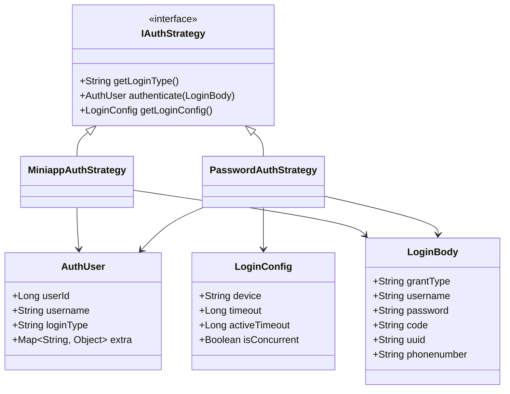
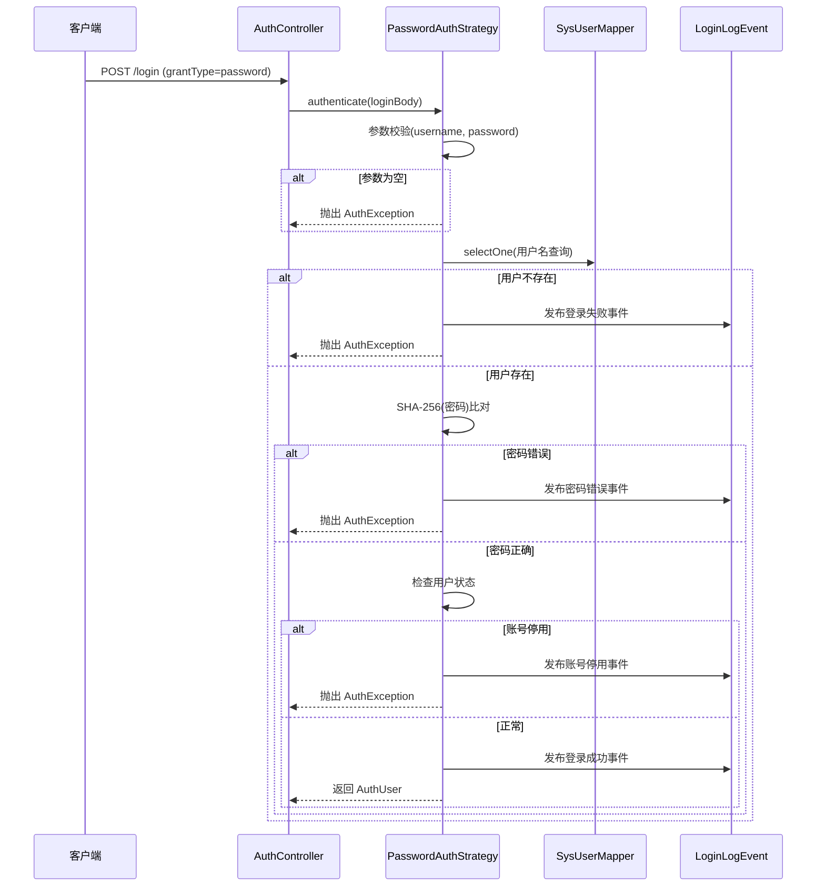
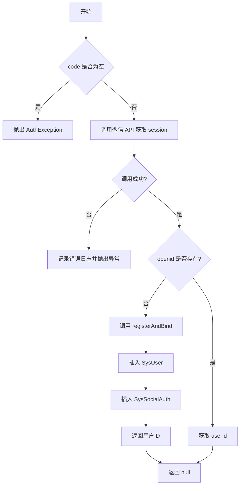

# 具体认证策略实现

<cite>
**本文档引用文件**  
- [PasswordAuthStrategy.java](file://verulia-modules/verulia-system/src/main/java/org/yann/verulia/system/service/strategy/PasswordAuthStrategy.java)
- [MiniappAuthStrategy.java](file://verulia-modules/verulia-system/src/main/java/org/yann/verulia/system/service/strategy/MiniappAuthStrategy.java)
- [IAuthStrategy.java](file://verulia-framework/verulia-framework-auth/src/main/java/org/yann/verulia/framework/auth/strategy/IAuthStrategy.java)
- [AuthUser.java](file://verulia-framework/verulia-framework-auth/src/main/java/org/yann/verulia/framework/auth/domain/AuthUser.java)
- [LoginBody.java](file://verulia-framework/verulia-framework-auth/src/main/java/org/yann/verulia/framework/auth/domain/LoginBody.java)
- [LoginConfig.java](file://verulia-framework/verulia-framework-auth/src/main/java/org/yann/verulia/framework/auth/domain/LoginConfig.java)
- [LoginLogEvent.java](file://verulia-modules/verulia-system/src/main/java/org/yann/verulia/system/event/LoginLogEvent.java)
- [SysUser.java](file://verulia-modules/verulia-system/src/main/java/org/yann/verulia/system/domain/entity/SysUser.java)
- [SysSocialAuth.java](file://verulia-modules/verulia-system/src/main/java/org/yann/verulia/system/domain/entity/SysSocialAuth.java)
- [AuthController.java](file://verulia-admin/src/main/java/org/yann/verulia/controller/AuthController.java)
</cite>

## 目录
1. [引言](#引言)
2. [核心认证策略接口设计](#核心认证策略接口设计)
3. [PasswordAuthStrategy 技术细节分析](#passwordauthstrategy-技术细节分析)
4. [MiniappAuthStrategy 技术细节分析](#miniappauthstrategy-技术细节分析)
5. [authenticate 方法返回值差异对比](#authenticate-方法返回值差异对比)
6. [新增第三方认证策略标准模板](#新增第三方认证策略标准模板)
7. [总结](#总结)

## 引言
本项目采用策略模式实现多类型认证机制，通过 `IAuthStrategy` 接口统一管理不同登录方式。系统支持基于用户名密码的传统认证（`PasswordAuthStrategy`）与微信小程序静默登录（`MiniappAuthStrategy`）两种实现。本文将深入分析两者的技术实现差异，并提供扩展新认证方式的标准规范。

## 核心认证策略接口设计
所有认证策略均需实现 `IAuthStrategy` 接口，该接口定义了三个核心方法：



**Diagram sources**  
- [IAuthStrategy.java](file://verulia-framework/verulia-framework-auth/src/main/java/org/yann/verulia/framework/auth/strategy/IAuthStrategy.java#L12-L35)
- [AuthUser.java](file://verulia-framework/verulia-framework-auth/src/main/java/org/yann/verulia/framework/auth/domain/AuthUser.java#L17-L40)
- [LoginBody.java](file://verulia-framework/verulia-framework-auth/src/main/java/org/yann/verulia/framework/auth/domain/LoginBody.java#L14-L58)
- [LoginConfig.java](file://verulia-framework/verulia-framework-auth/src/main/java/org/yann/verulia/framework/auth/domain/LoginConfig.java#L16-L33)

**Section sources**  
- [IAuthStrategy.java](file://verulia-framework/verulia-framework-auth/src/main/java/org/yann/verulia/framework/auth/strategy/IAuthStrategy.java#L12-L35)

## PasswordAuthStrategy 技术细节分析
`PasswordAuthStrategy` 实现了基于用户名和密码的传统认证流程，其核心逻辑如下：

1. **参数校验**：检查 `username` 和 `password` 是否为空。
2. **用户查询**：通过 `SysUserMapper` 根据用户名查询用户信息。
3. **密码比对**：使用 SHA-256 对输入密码进行哈希后与数据库存储值比对。
4. **状态检查**：验证用户状态是否为启用（`status == 1`）。
5. **日志事件发布**：无论成功或失败，均发布 `LoginLogEvent` 用于记录登录行为。
6. **返回认证用户**：构建并返回 `AuthUser` 对象。



**Diagram sources**  
- [PasswordAuthStrategy.java](file://verulia-modules/verulia-system/src/main/java/org/yann/verulia/system/service/strategy/PasswordAuthStrategy.java#L38-L70)
- [LoginLogEvent.java](file://verulia-modules/verulia-system/src/main/java/org/yann/verulia/system/event/LoginLogEvent.java#L10-L34)

**Section sources**  
- [PasswordAuthStrategy.java](file://verulia-modules/verulia-system/src/main/java/org/yann/verulia/system/service/strategy/PasswordAuthStrategy.java#L28-L81)
- [SysUser.java](file://verulia-modules/verulia-system/src/main/java/org/yann/verulia/system/domain/entity/SysUser.java#L17-L69)

## MiniappAuthStrategy 技术细节分析
`MiniappAuthStrategy` 专用于微信小程序静默登录，其实现包含以下关键步骤：

1. **jsCode 校验**：检查前端传入的 `code` 是否为空。
2. **会话信息获取**：调用 `WxMaService.getUserService().getSessionInfo(code)` 换取 `sessionKey` 和 `openid`。
3. **社交账号绑定查询**：根据 `openid` 查询 `SysSocialAuth` 表判断是否已绑定。
4. **新用户自动注册**：若未绑定，则调用 `registerAndBind` 方法完成注册与绑定。
5. **事务管理**：整个注册绑定过程由 `@Transactional(rollbackFor = Exception.class)` 保证原子性。

其中 `registerAndBind` 方法逻辑如下：
- 生成默认用户名（如 `wx_abc12345`）
- 创建 `SysUser` 并插入数据库
- 构造 `SysSocialAuth` 记录并插入
- 返回新用户 ID



**Diagram sources**  
- [MiniappAuthStrategy.java](file://verulia-modules/verulia-system/src/main/java/org/yann/verulia/system/service/strategy/MiniappAuthStrategy.java#L47-L94)
- [SysSocialAuth.java](file://verulia-modules/verulia-system/src/main/java/org/yann/verulia/system/domain/entity/SysSocialAuth.java#L16-L61)

**Section sources**  
- [MiniappAuthStrategy.java](file://verulia-modules/verulia-system/src/main/java/org/yann/verulia/system/service/strategy/MiniappAuthStrategy.java#L35-L94)
- [SysSocialAuthMapper.java](file://verulia-modules/verulia-system/src/main/java/org/yann/verulia/system/mapper/SysSocialAuthMapper.java#L12-L14)

## authenticate 方法返回值差异对比
| 对比项 | PasswordAuthStrategy | MiniappAuthStrategy |
|-------|----------------------|---------------------|
| 返回类型 | `AuthUser` | `null`（当前未完善） |
| 实现完整性 | 完整返回用户信息 | 尚未返回认证结果 |
| 影响 | 可正常完成登录流程 | 可能导致后续流程异常（如无法设置会话） |
| 建议改进 | —— | 应在绑定后返回 `AuthUser.builder().userId(...).loginType("miniapp").build()` |

此差异已在 `AuthController` 中体现：`StpUtil.login(authUser.getUserId(), parameter);` 依赖 `authUser` 非空，当前 `MiniappAuthStrategy` 返回 `null` 存在运行时风险。

**Section sources**  
- [PasswordAuthStrategy.java](file://verulia-modules/verulia-system/src/main/java/org/yann/verulia/system/service/strategy/PasswordAuthStrategy.java#L66-L70)
- [MiniappAuthStrategy.java](file://verulia-modules/verulia-system/src/main/java/org/yann/verulia/system/service/strategy/MiniappAuthStrategy.java#L76)
- [AuthController.java](file://verulia-admin/src/main/java/org/yann/verulia/controller/AuthController.java#L42)

## 新增第三方认证策略标准模板
为确保系统可扩展性与一致性，新增认证策略应遵循以下规范：

### 1. 组件注册
使用 `@Component` 注解注册为 Spring Bean：
```java
@Component
public class SmsAuthStrategy implements IAuthStrategy { ... }
```

### 2. 登录类型命名规范
`getLoginType()` 返回小写英文标识符，推荐格式：`password`, `sms`, `wechat`, `miniapp`, `oauth2-github` 等。
```java
@Override
public String getLoginType() {
    return "sms";
}
```

### 3. 异常处理一致性
- 所有业务异常应抛出 `AuthException`
- 外部服务调用失败需捕获并封装为 `AuthException`
- 错误信息应清晰且对用户友好

### 4. 单元测试编写指南
- 测试用例应覆盖：参数校验、正常流程、异常分支（用户不存在、密码错误、第三方服务异常）
- 使用 `@SpringBootTest` 或 `@ExtendWith(MockitoExtension.class)` 进行模拟测试
- 验证 `LoginLogEvent` 是否正确发布
- 确保事务边界正确（特别是涉及多表操作时）

### 示例模板
```java
@Slf4j
@Component
@RequiredArgsConstructor
public class OAuth2AuthStrategy implements IAuthStrategy {

    private final OAuth2Client client;
    private final SysUserMapper userMapper;
    private final ApplicationEventPublisher eventPublisher;

    @Override
    public String getLoginType() {
        return "oauth2-github";
    }

    @Override
    public AuthUser authenticate(LoginBody loginBody) {
        String accessToken = loginBody.getCode();
        if (StrUtil.isBlank(accessToken)) {
            throw new AuthException("access token 不能为空");
        }

        UserProfile profile;
        try {
            profile = client.getUserProfile(accessToken);
        } catch (Exception e) {
            log.error("OAuth2 认证失败", e);
            throw new AuthException("第三方登录失败");
        }

        // 查找或创建用户
        SysUser user = findOrCreateUser(profile);
        eventPublisher.publishEvent(new LoginLogEvent(this, user.getUsername(), true, "OAuth2登录成功"));

        return AuthUser.builder()
                .userId(user.getId())
                .username(user.getUsername())
                .loginType(getLoginType())
                .build();
    }

    @Override
    public LoginConfig getLoginConfig() {
        return LoginConfig.builder()
                .device("APP")
                .timeout(60 * 60 * 24L) // 一天
                .isConcurrent(false)
                .build();
    }
}
```

**Section sources**  
- [IAuthStrategy.java](file://verulia-framework/verulia-framework-auth/src/main/java/org/yann/verulia/framework/auth/strategy/IAuthStrategy.java#L12-L35)
- [PasswordAuthStrategy.java](file://verulia-modules/verulia-system/src/main/java/org/yann/verulia/system/service/strategy/PasswordAuthStrategy.java)
- [MiniappAuthStrategy.java](file://verulia-modules/verulia-system/src/main/java/org/yann/verulia/system/service/strategy/MiniappAuthStrategy.java)

## 总结
`PasswordAuthStrategy` 与 `MiniappAuthStrategy` 分别代表了传统账号体系与社交登录两种主流认证模式。前者注重安全性与状态控制，后者强调无缝体验与自动注册。两者均基于统一接口设计，体现了良好的扩展性。然而，`MiniappAuthStrategy` 当前 `authenticate` 方法返回 `null` 是一个明显缺陷，建议尽快修复以保证系统健壮性。未来新增认证方式时，应严格遵循组件注册、命名规范、异常处理与测试覆盖等标准，确保代码质量与维护性。