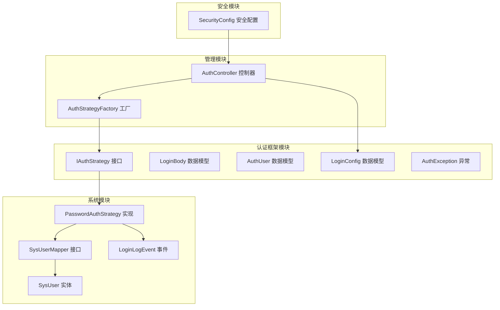
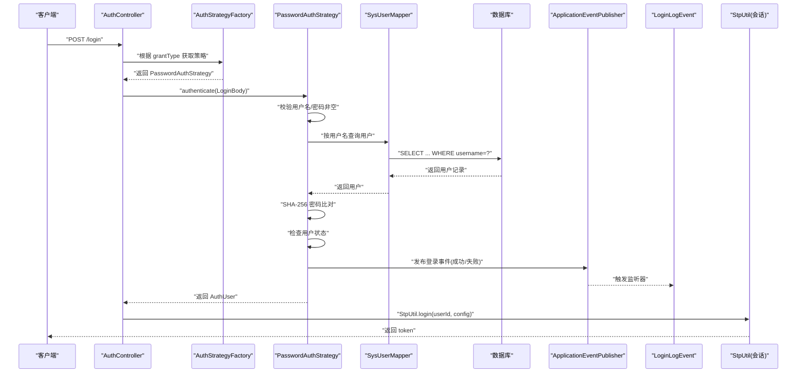
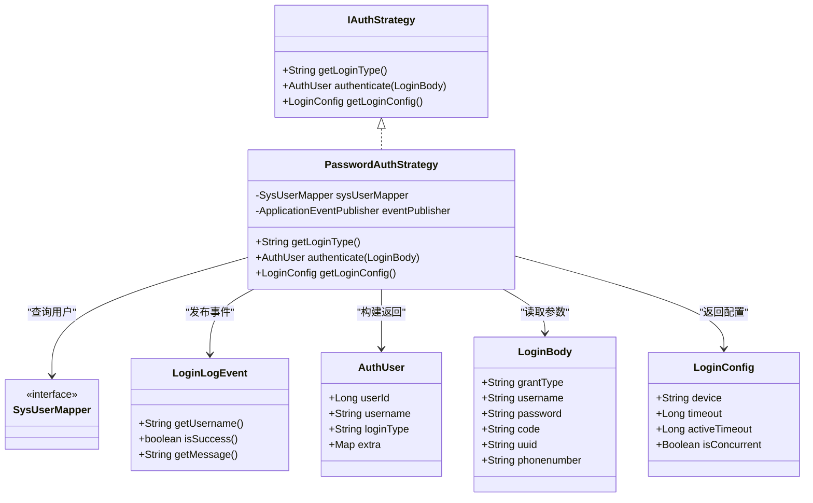
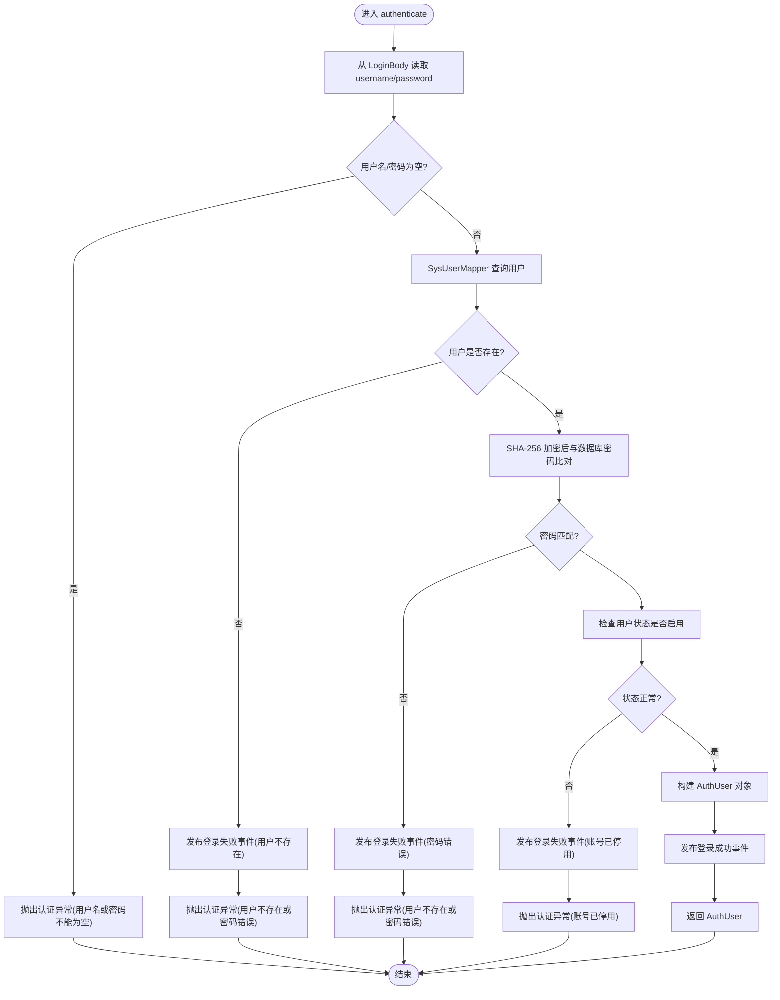
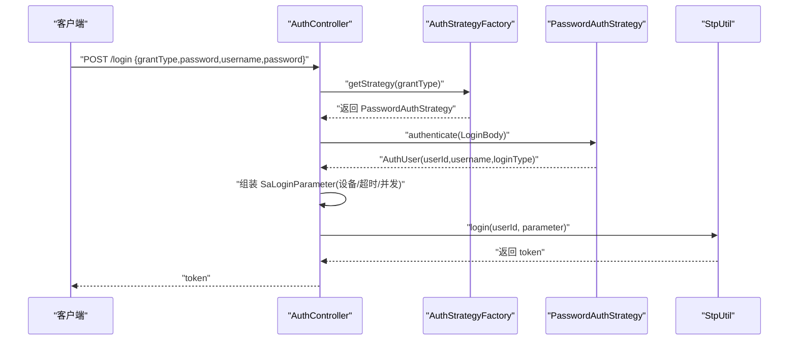
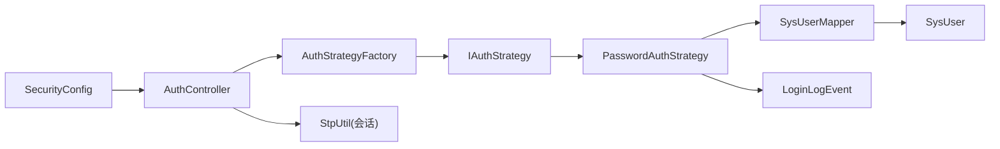

# 密码认证策略

<cite>
**本文引用的文件**
- [IAuthStrategy.java](file://verulia-framework/verulia-framework-auth/src/main/java/org/yann/verulia/framework/auth/strategy/IAuthStrategy.java)
- [PasswordAuthStrategy.java](file://verulia-modules/verulia-system/src/main/java/org/yann/verulia/system/service/strategy/PasswordAuthStrategy.java)
- [LoginBody.java](file://verulia-framework/verulia-framework-auth/src/main/java/org/yann/verulia/framework/auth/domain/LoginBody.java)
- [AuthUser.java](file://verulia-framework/verulia-framework-auth/src/main/java/org/yann/verulia/framework/auth/domain/AuthUser.java)
- [LoginConfig.java](file://verulia-framework/verulia-framework-auth/src/main/java/org/yann/verulia/framework/auth/domain/LoginConfig.java)
- [SysUserMapper.java](file://verulia-modules/verulia-system/src/main/java/org/yann/verulia/system/mapper/SysUserMapper.java)
- [SysUser.java](file://verulia-modules/verulia-system/src/main/java/org/yann/verulia/system/domain/entity/SysUser.java)
- [LoginLogEvent.java](file://verulia-modules/verulia-system/src/main/java/org/yann/verulia/system/event/LoginLogEvent.java)
- [AuthController.java](file://verulia-admin/src/main/java/org/yann/verulia/controller/AuthController.java)
- [AuthStrategyFactory.java](file://verulia-framework/verulia-framework-auth/src/main/java/org/yann/verulia/framework/auth/strategy/AuthStrategyFactory.java)
- [SecurityConfig.java](file://verulia-framework/verulia-framework-security/src/main/java/org/yann/verulia/framework/security/config/SecurityConfig.java)
- [AuthException.java](file://verulia-framework/verulia-framework-auth/src/main/java/org/yann/verulia/framework/auth/exception/AuthException.java)
</cite>

## 目录
1. [简介](#简介)
2. [项目结构](#项目结构)
3. [核心组件](#核心组件)
4. [架构总览](#架构总览)
5. [详细组件分析](#详细组件分析)
6. [依赖关系分析](#依赖关系分析)
7. [性能与安全性考量](#性能与安全性考量)
8. [故障排查指南](#故障排查指南)
9. [结论](#结论)

## 简介
本文件围绕密码认证策略 PasswordAuthStrategy 的实现机制展开，系统性说明其作为 IAuthStrategy 接口实现类的工作方式，包括：
- 通过 getLoginType() 返回“password”以标识该策略类型；
- authenticate() 方法的完整认证流程：从 LoginBody 提取用户名与密码、进行非空校验、通过 SysUserMapper 查询用户、使用 Hutool SecureUtil.sha256 对输入密码进行 SHA-256 加密后与数据库存储的密码比对、检查用户状态是否启用、最终构建并返回 AuthUser；
- 登录成功/失败时通过 ApplicationEventPublisher 发布 LoginLogEvent 事件的日志记录机制；
- getLoginConfig() 返回的登录配置（PC 端设备、2 小时过期、支持并发登录），以及在 Sa-Token 中的应用；
- 在 AuthController 中的调用流程、线程安全与无状态设计特点。

## 项目结构
本项目采用多模块分层组织，认证策略位于系统模块中，认证框架定义于框架模块，控制器位于管理模块，安全拦截由 Sa-Token 提供。

图表来源
- [IAuthStrategy.java](file://verulia-framework/verulia-framework-auth/src/main/java/org/yann/verulia/framework/auth/strategy/IAuthStrategy.java#L1-L36)
- [PasswordAuthStrategy.java](file://verulia-modules/verulia-system/src/main/java/org/yann/verulia/system/service/strategy/PasswordAuthStrategy.java#L1-L82)
- [LoginBody.java](file://verulia-framework/verulia-framework-auth/src/main/java/org/yann/verulia/framework/auth/domain/LoginBody.java#L1-L59)
- [AuthUser.java](file://verulia-framework/verulia-framework-auth/src/main/java/org/yann/verulia/framework/auth/domain/AuthUser.java#L1-L41)
- [LoginConfig.java](file://verulia-framework/verulia-framework-auth/src/main/java/org/yann/verulia/framework/auth/domain/LoginConfig.java#L1-L34)
- [SysUserMapper.java](file://verulia-modules/verulia-system/src/main/java/org/yann/verulia/system/mapper/SysUserMapper.java#L1-L15)
- [SysUser.java](file://verulia-modules/verulia-system/src/main/java/org/yann/verulia/system/domain/entity/SysUser.java#L1-L70)
- [LoginLogEvent.java](file://verulia-modules/verulia-system/src/main/java/org/yann/verulia/system/event/LoginLogEvent.java#L1-L35)
- [AuthController.java](file://verulia-admin/src/main/java/org/yann/verulia/controller/AuthController.java#L1-L67)
- [AuthStrategyFactory.java](file://verulia-framework/verulia-framework-auth/src/main/java/org/yann/verulia/framework/auth/strategy/AuthStrategyFactory.java#L1-L51)
- [SecurityConfig.java](file://verulia-framework/verulia-framework-security/src/main/java/org/yann/verulia/framework/security/config/SecurityConfig.java#L1-L36)

章节来源
- [AuthController.java](file://verulia-admin/src/main/java/org/yann/verulia/controller/AuthController.java#L1-L67)
- [AuthStrategyFactory.java](file://verulia-framework/verulia-framework-auth/src/main/java/org/yann/verulia/framework/auth/strategy/AuthStrategyFactory.java#L1-L51)

## 核心组件
- IAuthStrategy：定义登录类型标识、认证执行与登录配置获取的统一接口。
- PasswordAuthStrategy：具体实现密码登录策略，包含 getLoginType、authenticate、getLoginConfig。
- LoginBody：登录请求载体，包含 grantType、username、password 等字段。
- AuthUser：认证后返回的用户信息载体。
- LoginConfig：登录会话配置（设备类型、超时、并发等）。
- SysUserMapper/SysUser：用户数据访问与实体。
- LoginLogEvent：登录事件，用于发布登录成功/失败日志。
- AuthController：对外提供登录入口，委派给策略工厂选择策略并执行认证。
- AuthStrategyFactory：基于 Spring 扫描到的 IAuthStrategy 列表，按 getLoginType 构建映射。
- SecurityConfig：注册 Sa-Token 拦截器，统一鉴权。

章节来源
- [IAuthStrategy.java](file://verulia-framework/verulia-framework-auth/src/main/java/org/yann/verulia/framework/auth/strategy/IAuthStrategy.java#L1-L36)
- [PasswordAuthStrategy.java](file://verulia-modules/verulia-system/src/main/java/org/yann/verulia/system/service/strategy/PasswordAuthStrategy.java#L1-L82)
- [LoginBody.java](file://verulia-framework/verulia-framework-auth/src/main/java/org/yann/verulia/framework/auth/domain/LoginBody.java#L1-L59)
- [AuthUser.java](file://verulia-framework/verulia-framework-auth/src/main/java/org/yann/verulia/framework/auth/domain/AuthUser.java#L1-L41)
- [LoginConfig.java](file://verulia-framework/verulia-framework-auth/src/main/java/org/yann/verulia/framework/auth/domain/LoginConfig.java#L1-L34)
- [SysUserMapper.java](file://verulia-modules/verulia-system/src/main/java/org/yann/verulia/system/mapper/SysUserMapper.java#L1-L15)
- [SysUser.java](file://verulia-modules/verulia-system/src/main/java/org/yann/verulia/system/domain/entity/SysUser.java#L1-L70)
- [LoginLogEvent.java](file://verulia-modules/verulia-system/src/main/java/org/yann/verulia/system/event/LoginLogEvent.java#L1-L35)
- [AuthController.java](file://verulia-admin/src/main/java/org/yann/verulia/controller/AuthController.java#L1-L67)
- [AuthStrategyFactory.java](file://verulia-framework/verulia-framework-auth/src/main/java/org/yann/verulia/framework/auth/strategy/AuthStrategyFactory.java#L1-L51)
- [SecurityConfig.java](file://verulia-framework/verulia-framework-security/src/main/java/org/yann/verulia/framework/security/config/SecurityConfig.java#L1-L36)

## 架构总览
密码认证策略在整体架构中的位置如下：

图表来源
- [AuthController.java](file://verulia-admin/src/main/java/org/yann/verulia/controller/AuthController.java#L1-L67)
- [AuthStrategyFactory.java](file://verulia-framework/verulia-framework-auth/src/main/java/org/yann/verulia/framework/auth/strategy/AuthStrategyFactory.java#L1-L51)
- [PasswordAuthStrategy.java](file://verulia-modules/verulia-system/src/main/java/org/yann/verulia/system/service/strategy/PasswordAuthStrategy.java#L1-L82)
- [SysUserMapper.java](file://verulia-modules/verulia-system/src/main/java/org/yann/verulia/system/mapper/SysUserMapper.java#L1-L15)
- [SysUser.java](file://verulia-modules/verulia-system/src/main/java/org/yann/verulia/system/domain/entity/SysUser.java#L1-L70)
- [LoginLogEvent.java](file://verulia-modules/verulia-system/src/main/java/org/yann/verulia/system/event/LoginLogEvent.java#L1-L35)

## 详细组件分析

### PasswordAuthStrategy 类图
PasswordAuthStrategy 实现 IAuthStrategy 接口，依赖 SysUserMapper 和 ApplicationEventPublisher，负责密码登录的完整流程。

图表来源
- [IAuthStrategy.java](file://verulia-framework/verulia-framework-auth/src/main/java/org/yann/verulia/framework/auth/strategy/IAuthStrategy.java#L1-L36)
- [PasswordAuthStrategy.java](file://verulia-modules/verulia-system/src/main/java/org/yann/verulia/system/service/strategy/PasswordAuthStrategy.java#L1-L82)
- [SysUserMapper.java](file://verulia-modules/verulia-system/src/main/java/org/yann/verulia/system/mapper/SysUserMapper.java#L1-L15)
- [LoginLogEvent.java](file://verulia-modules/verulia-system/src/main/java/org/yann/verulia/system/event/LoginLogEvent.java#L1-L35)
- [AuthUser.java](file://verulia-framework/verulia-framework-auth/src/main/java/org/yann/verulia/framework/auth/domain/AuthUser.java#L1-L41)
- [LoginBody.java](file://verulia-framework/verulia-framework-auth/src/main/java/org/yann/verulia/framework/auth/domain/LoginBody.java#L1-L59)
- [LoginConfig.java](file://verulia-framework/verulia-framework-auth/src/main/java/org/yann/verulia/framework/auth/domain/LoginConfig.java#L1-L34)

章节来源
- [PasswordAuthStrategy.java](file://verulia-modules/verulia-system/src/main/java/org/yann/verulia/system/service/strategy/PasswordAuthStrategy.java#L1-L82)
- [IAuthStrategy.java](file://verulia-framework/verulia-framework-auth/src/main/java/org/yann/verulia/framework/auth/strategy/IAuthStrategy.java#L1-L36)

### authenticate() 方法流程图
该流程图展示 PasswordAuthStrategy.authenticate() 的关键步骤与分支判断。

图表来源
- [PasswordAuthStrategy.java](file://verulia-modules/verulia-system/src/main/java/org/yann/verulia/system/service/strategy/PasswordAuthStrategy.java#L1-L82)
- [SysUserMapper.java](file://verulia-modules/verulia-system/src/main/java/org/yann/verulia/system/mapper/SysUserMapper.java#L1-L15)
- [SysUser.java](file://verulia-modules/verulia-system/src/main/java/org/yann/verulia/system/domain/entity/SysUser.java#L1-L70)
- [LoginLogEvent.java](file://verulia-modules/verulia-system/src/main/java/org/yann/verulia/system/event/LoginLogEvent.java#L1-L35)

章节来源
- [PasswordAuthStrategy.java](file://verulia-modules/verulia-system/src/main/java/org/yann/verulia/system/service/strategy/PasswordAuthStrategy.java#L1-L82)

### getLoginType() 与 getLoginConfig() 行为
- getLoginType() 返回字符串“password”，用于标识该策略类型，供工厂按类型选择具体策略。
- getLoginConfig() 返回 LoginConfig，包含：
  - 设备类型：PC
  - 会话超时：2 小时（秒）
  - 并发登录：允许
  - 活跃超时：未设置则跟随全局默认

这些配置在 AuthController 中被转换为 Sa-Token 的 SaLoginParameter，并传递给 StpUtil.login()，从而影响后续会话行为。

章节来源
- [PasswordAuthStrategy.java](file://verulia-modules/verulia-system/src/main/java/org/yann/verulia/system/service/strategy/PasswordAuthStrategy.java#L73-L81)
- [LoginConfig.java](file://verulia-framework/verulia-framework-auth/src/main/java/org/yann/verulia/framework/auth/domain/LoginConfig.java#L1-L34)
- [AuthController.java](file://verulia-admin/src/main/java/org/yann/verulia/controller/AuthController.java#L37-L57)

### 登录事件发布机制
PasswordAuthStrategy 在以下场景发布 LoginLogEvent：
- 用户不存在
- 密码错误
- 账号已停用
- 登录成功

事件携带用户名、成功标志与消息，便于外部监听器记录审计日志。

章节来源
- [PasswordAuthStrategy.java](file://verulia-modules/verulia-system/src/main/java/org/yann/verulia/system/service/strategy/PasswordAuthStrategy.java#L43-L71)
- [LoginLogEvent.java](file://verulia-modules/verulia-system/src/main/java/org/yann/verulia/system/event/LoginLogEvent.java#L1-L35)

### AuthController 调用流程
AuthController 的 /login 接口负责：
- 使用 AuthStrategyFactory 根据 LoginBody.grantType 获取对应策略；
- 调用策略的 authenticate() 获取 AuthUser；
- 若策略提供了 LoginConfig，则转换为 Sa-Token 的 SaLoginParameter；
- 调用 StpUtil.login() 完成登录并生成 token；
- 将用户信息缓存至会话，返回 token。

图表来源
- [AuthController.java](file://verulia-admin/src/main/java/org/yann/verulia/controller/AuthController.java#L1-L67)
- [AuthStrategyFactory.java](file://verulia-framework/verulia-framework-auth/src/main/java/org/yann/verulia/framework/auth/strategy/AuthStrategyFactory.java#L1-L51)
- [PasswordAuthStrategy.java](file://verulia-modules/verulia-system/src/main/java/org/yann/verulia/system/service/strategy/PasswordAuthStrategy.java#L1-L82)

章节来源
- [AuthController.java](file://verulia-admin/src/main/java/org/yann/verulia/controller/AuthController.java#L1-L67)

## 依赖关系分析
- PasswordAuthStrategy 依赖 SysUserMapper 进行用户查询；SysUserMapper 继承 MyBatis-Plus 的 BaseMapper，底层访问数据库。
- PasswordAuthStrategy 通过 ApplicationEventPublisher 发布 LoginLogEvent，事件监听器可异步处理日志写入。
- AuthController 依赖 AuthStrategyFactory 选择策略；AuthStrategyFactory 通过构造函数注入 IAuthStrategy 列表并按 getLoginType 建立映射。
- SecurityConfig 注册 Sa-Token 拦截器，统一校验登录态。

图表来源
- [AuthController.java](file://verulia-admin/src/main/java/org/yann/verulia/controller/AuthController.java#L1-L67)
- [AuthStrategyFactory.java](file://verulia-framework/verulia-framework-auth/src/main/java/org/yann/verulia/framework/auth/strategy/AuthStrategyFactory.java#L1-L51)
- [IAuthStrategy.java](file://verulia-framework/verulia-framework-auth/src/main/java/org/yann/verulia/framework/auth/strategy/IAuthStrategy.java#L1-L36)
- [PasswordAuthStrategy.java](file://verulia-modules/verulia-system/src/main/java/org/yann/verulia/system/service/strategy/PasswordAuthStrategy.java#L1-L82)
- [SysUserMapper.java](file://verulia-modules/verulia-system/src/main/java/org/yann/verulia/system/mapper/SysUserMapper.java#L1-L15)
- [SysUser.java](file://verulia-modules/verulia-system/src/main/java/org/yann/verulia/system/domain/entity/SysUser.java#L1-L70)
- [LoginLogEvent.java](file://verulia-modules/verulia-system/src/main/java/org/yann/verulia/system/event/LoginLogEvent.java#L1-L35)
- [SecurityConfig.java](file://verulia-framework/verulia-framework-security/src/main/java/org/yann/verulia/framework/security/config/SecurityConfig.java#L1-L36)

章节来源
- [AuthStrategyFactory.java](file://verulia-framework/verulia-framework-auth/src/main/java/org/yann/verulia/framework/auth/strategy/AuthStrategyFactory.java#L1-L51)
- [PasswordAuthStrategy.java](file://verulia-modules/verulia-system/src/main/java/org/yann/verulia/system/service/strategy/PasswordAuthStrategy.java#L1-L82)
- [AuthController.java](file://verulia-admin/src/main/java/org/yann/verulia/controller/AuthController.java#L1-L67)

## 性能与安全性考量
- 线程安全与无状态
  - PasswordAuthStrategy 仅依赖只读的 SysUserMapper 与事件发布器，无共享可变状态，天然线程安全。
  - 工厂 AuthStrategyFactory 使用 ConcurrentHashMap 存储策略映射，初始化后只读，适合高并发场景。
  - 控制器 AuthController 与策略均无会话状态，遵循无状态设计，利于水平扩展。
- 密码安全
  - 使用 SHA-256 对输入密码进行哈希比对，避免明文存储与传输风险。
  - 建议配合盐值与更安全的密码哈希算法（如 bcrypt/scrypt）进一步提升安全性。
- 性能优化
  - 用户名查询建议在数据库层面建立唯一索引，降低查询成本。
  - 登录日志事件采用异步发布，避免阻塞主认证流程。
- 会话与并发
  - LoginConfig 允许并发登录，适合 PC 端多标签页或多设备同时在线场景。
  - 2 小时超时适配 PC 端较长会话需求，结合 Sa-Token 的自动续期机制可进一步优化体验。

[本节为通用指导，无需列出章节来源]

## 故障排查指南
- 常见异常与定位
  - 用户名或密码为空：检查 LoginBody 参数绑定与校验注解。
  - 用户不存在或密码错误：确认用户名大小写、特殊字符与数据库一致性；核对 SHA-256 加密逻辑。
  - 账号已停用：检查 SysUser.status 字段值。
  - 不支持的登录类型：确认 AuthStrategyFactory 是否正确扫描到策略并初始化映射。
- 日志与审计
  - 通过监听 LoginLogEvent 可记录登录尝试与结果，便于审计与风控。
  - 结合 SecurityConfig 的拦截器，确保受保护资源的统一鉴权。
- 代码路径参考
  - 认证异常：[AuthException.java](file://verulia-framework/verulia-framework-auth/src/main/java/org/yann/verulia/framework/auth/exception/AuthException.java#L1-L17)
  - 策略工厂初始化与查找：[AuthStrategyFactory.java](file://verulia-framework/verulia-framework-auth/src/main/java/org/yann/verulia/framework/auth/strategy/AuthStrategyFactory.java#L1-L51)
  - 策略实现与事件发布：[PasswordAuthStrategy.java](file://verulia-modules/verulia-system/src/main/java/org/yann/verulia/system/service/strategy/PasswordAuthStrategy.java#L1-L82)
  - 控制器调用链路：[AuthController.java](file://verulia-admin/src/main/java/org/yann/verulia/controller/AuthController.java#L1-L67)

章节来源
- [AuthException.java](file://verulia-framework/verulia-framework-auth/src/main/java/org/yann/verulia/framework/auth/exception/AuthException.java#L1-L17)
- [AuthStrategyFactory.java](file://verulia-framework/verulia-framework-auth/src/main/java/org/yann/verulia/framework/auth/strategy/AuthStrategyFactory.java#L1-L51)
- [PasswordAuthStrategy.java](file://verulia-modules/verulia-system/src/main/java/org/yann/verulia/system/service/strategy/PasswordAuthStrategy.java#L1-L82)
- [AuthController.java](file://verulia-admin/src/main/java/org/yann/verulia/controller/AuthController.java#L1-L67)

## 结论
PasswordAuthStrategy 通过清晰的接口契约与简洁的实现，完成了密码登录的完整流程：参数校验、用户查询、密码比对、状态检查与结果返回。其与事件发布、工厂模式、Sa-Token 会话体系的组合，既保证了功能的可扩展性，也满足了线程安全与无状态的设计要求。LoginConfig 的细粒度配置使得 PC 端登录具备合理的超时与并发策略，配合审计事件可形成完整的登录闭环。