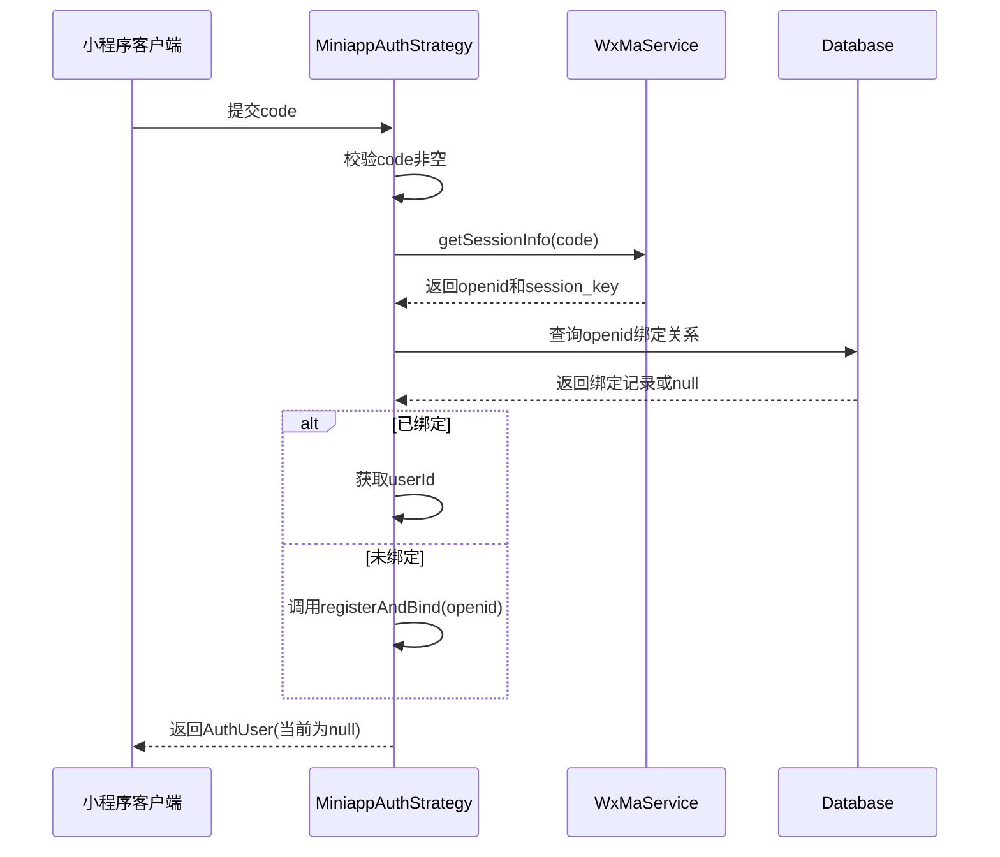
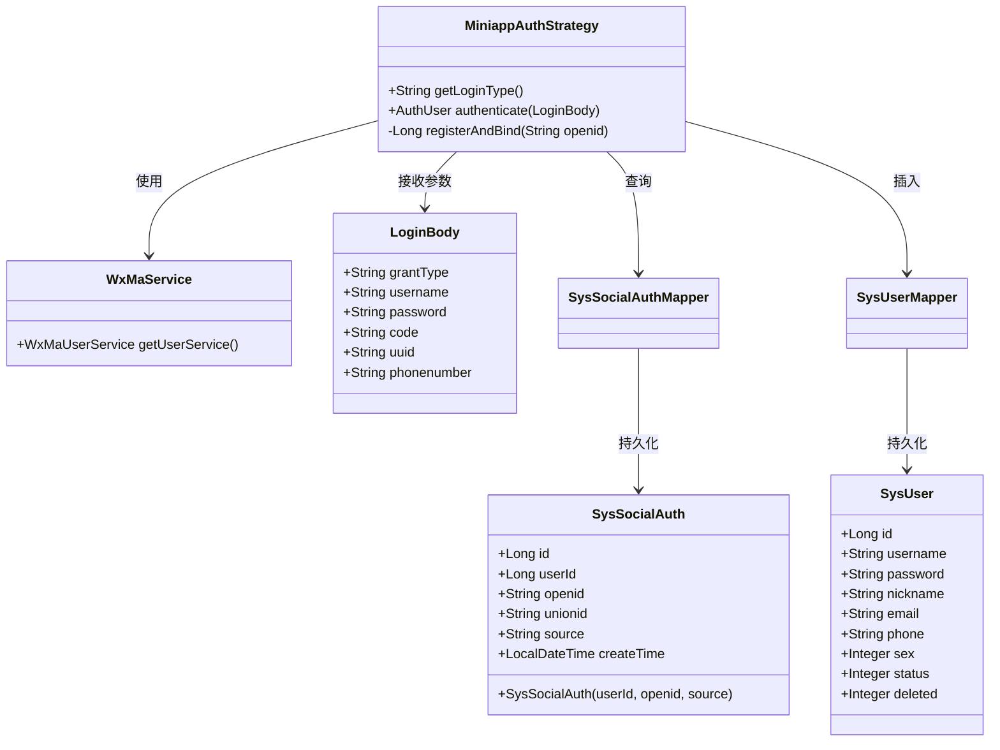

# 小程序认证策略

<cite>
**本文档引用文件**  
- [MiniappAuthStrategy.java](file://verulia-modules/verulia-system/src/main/java/org/yann/verulia/system/service/strategy/MiniappAuthStrategy.java)
- [LoginBody.java](file://verulia-framework/verulia-framework-auth/src/main/java/org/yann/verulia/framework/auth/domain/LoginBody.java)
- [SysSocialAuthMapper.java](file://verulia-modules/verulia-system/src/main/java/org/yann/verulia/system/mapper/SysSocialAuthMapper.java)
- [SysSocialAuth.java](file://verulia-modules/verulia-system/src/main/java/org/yann/verulia/system/domain/entity/SysSocialAuth.java)
- [SysUserMapper.java](file://verulia-modules/verulia-system/src/main/java/org/yann/verulia/system/mapper/SysUserMapper.java)
- [SysUser.java](file://verulia-modules/verulia-system/src/main/java/org/yann/verulia/system/domain/entity/SysUser.java)
- [IAuthStrategy.java](file://verulia-framework/verulia-framework-auth/src/main/java/org/yann/verulia/framework/auth/strategy/IAuthStrategy.java)
- [AuthUser.java](file://verulia-framework/verulia-framework-auth/src/main/java/org/yann/verulia/framework/auth/domain/AuthUser.java)
</cite>

## 目录
1. [引言](#引言)
2. [核心组件分析](#核心组件分析)
3. [认证流程详解](#认证流程详解)
4. [社交账号绑定逻辑](#社交账号绑定逻辑)
5. [自动注册与绑定事务分析](#自动注册与绑定事务分析)
6. [接口集成与配置要点](#接口集成与配置要点)
7. [待完善问题与改进建议](#待完善问题与改进建议)
8. [总结](#总结)

## 引言
本文深入剖析基于微信小程序的静默登录认证策略 `MiniappAuthStrategy` 的实现机制。该策略实现了通过微信小程序获取用户临时登录凭证（jsCode），并结合微信开放平台接口完成用户身份认证、社交账号绑定及自动注册的一体化流程。重点分析其与微信服务的集成方式、数据库事务处理机制以及当前实现中存在的返回值缺陷。

## 核心组件分析

`MiniappAuthStrategy` 是一个实现了 `IAuthStrategy` 接口的具体认证策略类，专用于处理微信小程序来源的登录请求。其通过 `getLoginType()` 方法返回 `"miniapp"` 字符串，作为区分不同登录方式的标识符。

该策略依赖于多个核心组件：
- `WxMaService`：用于调用微信小程序官方API，获取会话信息
- `SysUserMapper`：操作用户主表 `sys_user`
- `SysSocialAuthMapper`：管理第三方社交账号绑定关系

**本节来源**  
- [MiniappAuthStrategy.java](file://verulia-modules/verulia-system/src/main/java/org/yann/verulia/system/service/strategy/MiniappAuthStrategy.java#L32-L44)
- [IAuthStrategy.java](file://verulia-framework/verulia-framework-auth/src/main/java/org/yann/verulia/framework/auth/strategy/IAuthStrategy.java#L12-L19)

## 认证流程详解

### 认证入口与参数校验
`authenticate` 方法是整个认证流程的入口，接收 `LoginBody` 对象作为输入参数。该对象包含 `code` 字段，即小程序前端通过 `wx.login()` 获取的临时登录凭证。

方法首先对 `code` 进行非空校验，若为空则抛出 `AuthException` 异常，确保后续操作的安全性。

### 微信会话信息获取
使用注入的 `WxMaService` 实例调用 `getSessionInfo(code)` 接口，向微信服务器发起请求以换取用户的 `session_key` 和 `openid`。此过程封装在 `WxMaJscode2SessionResult` 对象中。

当调用失败时，捕获 `WxErrorException` 异常，记录错误日志，并将微信返回的具体错误信息包装后重新抛出，便于前端展示。

### OpenID 提取与验证
成功获取会话结果后，提取其中的 `openid` 字段。`openid` 是微信用户在当前小程序下的唯一标识。若未能获取有效 `openid`，则立即终止流程并抛出认证失败异常。



**图示来源**  
- [MiniappAuthStrategy.java](file://verulia-modules/verulia-system/src/main/java/org/yann/verulia/system/service/strategy/MiniappAuthStrategy.java#L48-L65)

**本节来源**  
- [MiniappAuthStrategy.java](file://verulia-modules/verulia-system/src/main/java/org/yann/verulia/system/service/strategy/MiniappAuthStrategy.java#L48-L65)
- [LoginBody.java](file://verulia-framework/verulia-framework-auth/src/main/java/org/yann/verulia/framework/auth/domain/LoginBody.java#L42)

## 社交账号绑定逻辑

系统通过 `SysSocialAuthMapper` 查询用户是否已存在绑定记录。查询条件为：
- `source = "miniapp"`：标识来源为微信小程序
- `openid`：匹配微信返回的用户唯一标识

若查询到已有绑定记录，则直接使用该记录中的 `userId` 关联到系统用户。否则，进入自动注册与绑定流程。



**图示来源**  
- [SysSocialAuthMapper.java](file://verulia-modules/verulia-system/src/main/java/org/yann/verulia/system/mapper/SysSocialAuthMapper.java#L12-L14)
- [SysSocialAuth.java](file://verulia-modules/verulia-system/src/main/java/org/yann/verulia/system/domain/entity/SysSocialAuth.java#L16-L61)
- [SysUser.java](file://verulia-modules/verulia-system/src/main/java/org/yann/verulia/system/domain/entity/SysUser.java#L17-L69)

**本节来源**  
- [MiniappAuthStrategy.java](file://verulia-modules/verulia-system/src/main/java/org/yann/verulia/system/service/strategy/MiniappAuthStrategy.java#L67-L74)
- [SysSocialAuthMapper.java](file://verulia-modules/verulia-system/src/main/java/org/yann/verulia/system/mapper/SysSocialAuthMapper.java#L12-L14)

## 自动注册与绑定事务分析

`registerAndBind` 方法负责处理新用户的自动注册与社交绑定。该方法被 `@Transactional(rollbackFor = Exception.class)` 注解修饰，确保以下两个数据库操作的原子性：

1. **创建系统用户**：
   - 生成以 `"wx_"` 开头的唯一用户名，取 `openid` 前8位作为后缀
   - 设置默认昵称为“微信用户”
   - 密码为空字符串（因使用第三方登录，无需本地密码）
   - 初始状态为启用（status=0）

   通过 `SysUserMapper.insert()` 将用户记录插入 `sys_user` 表，并自动获取生成的主键ID。

2. **建立社交绑定关系**：
   - 创建 `SysSocialAuth` 实体，关联上一步生成的 `userId`
   - 设置 `openid` 和 `source="miniapp"`
   - 通过 `SysSocialAuthMapper.insert()` 写入绑定关系

若任一操作失败（如唯一键冲突、数据库异常），整个事务将回滚，避免出现用户已创建但未绑定，或已绑定但用户不存在的不一致状态。

**本节来源**  
- [MiniappAuthStrategy.java](file://verulia-modules/verulia-system/src/main/java/org/yann/verulia/system/service/strategy/MiniappAuthStrategy.java#L79-L92)
- [SysUser.java](file://verulia-modules/verulia-system/src/main/java/org/yann/verulia/system/domain/entity/SysUser.java#L31-L37)
- [SysSocialAuth.java](file://verulia-modules/verulia-system/src/main/java/org/yann/verulia/system/domain/entity/SysSocialAuth.java#L56-L60)

## 接口集成与配置要点

### 微信开放平台集成
`WxMaService` 的实现依赖于微信官方SDK（`cn.binarywang.wx.miniapp`），需在项目配置中提供以下关键参数：
- `appId`：小程序唯一标识
- `appSecret`：小程序密钥

这些配置通常通过 `application.yml` 或环境变量注入，确保敏感信息不硬编码在代码中。

### 网络请求安全性
- 所有与微信服务器的通信均通过HTTPS协议进行，保证数据传输安全。
- `jsCode` 仅能使用一次，防止重放攻击。
- `session_key` 不应返回给前端，仅在服务端用于数据解密等安全操作。

### 依赖库说明
项目使用了 `hutool` 工具库（`cn.hutool.v7`）进行随机数生成、HTTP请求和JSON处理，简化了基础功能开发。

## 待完善问题与改进建议

当前 `authenticate` 方法存在一个明显缺陷：无论认证成功与否，最终都返回 `null`。根据 `IAuthStrategy` 接口定义，应返回 `AuthUser` 对象，包含用户ID、用户名等信息，以便后续生成令牌或会话。

**改进建议**：
1. 在查询到已有绑定或完成自动注册后，应构造并返回 `AuthUser` 实例：
```java
AuthUser.builder()
    .userId(userId)
    .username(user.getUsername())
    .loginType("miniapp")
    .build();
```
2. 可考虑在 `extra` 字段中携带微信用户头像、昵称等信息（需小程序前端提供并解密）。

## 总结

`MiniappAuthStrategy` 实现了一套完整的微信小程序静默登录方案，具备以下特点：
- 清晰的策略模式设计，易于扩展其他第三方登录方式
- 安全的微信API调用与异常处理机制
- 原子性的数据库事务保障数据一致性
- 简洁的自动注册逻辑，提升用户体验

未来应完善 `AuthUser` 的返回逻辑，使认证结果能够被上层安全框架正确处理，从而完成完整的认证闭环。