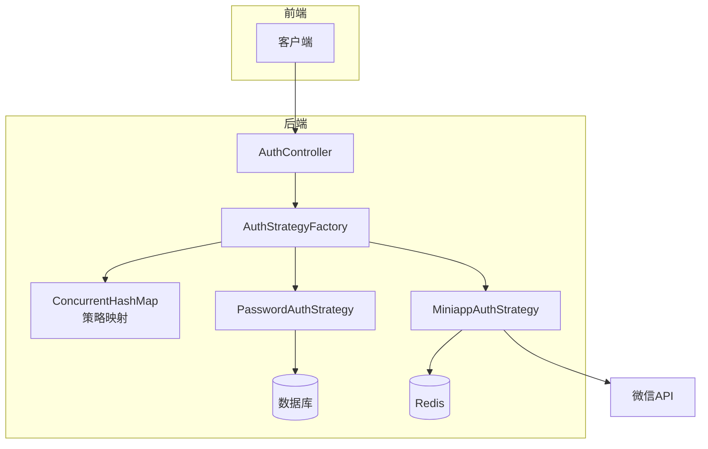
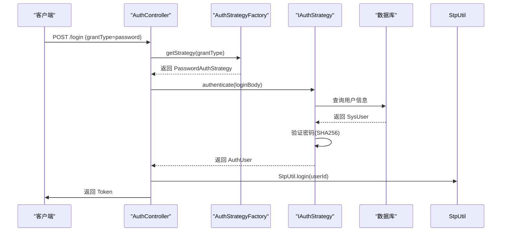
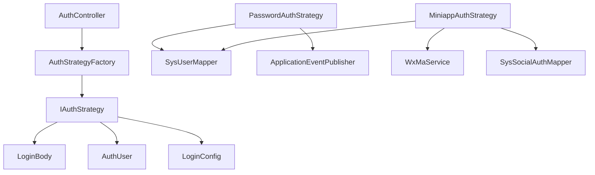

# 认证策略实现

<cite>
**本文档引用的文件**  
- [IAuthStrategy.java](file://verulia-framework/verulia-framework-auth/src/main/java/org/yann/verulia/framework/auth/strategy/IAuthStrategy.java)
- [AuthStrategyFactory.java](file://verulia-framework/verulia-framework-auth/src/main/java/org/yann/verulia/framework/auth/strategy/AuthStrategyFactory.java)
- [AuthController.java](file://verulia-admin/src/main/java/org/yann/verulia/controller/AuthController.java)
- [PasswordAuthStrategy.java](file://verulia-modules/verulia-system/src/main/java/org/yann/verulia/system/service/strategy/PasswordAuthStrategy.java)
- [MiniappAuthStrategy.java](file://verulia-modules/verulia-system/src/main/java/org/yann/verulia/system/service/strategy/MiniappAuthStrategy.java)
- [LoginBody.java](file://verulia-framework/verulia-framework-auth/src/main/java/org/yann/verulia/framework/auth/domain/LoginBody.java)
- [LoginConfig.java](file://verulia-framework/verulia-framework-auth/src/main/java/org/yann/verulia/framework/auth/domain/LoginConfig.java)
- [AuthUser.java](file://verulia-framework/verulia-framework-auth/src/main/java/org/yann/verulia/framework/auth/domain/AuthUser.java)
- [application.yml](file://verulia-admin/src/main/resources/application.yml)
</cite>

## 目录

1. [引言](#引言)
2. [核心组件](#核心组件)
3. [架构概览](#架构概览)
4. [详细组件分析](#详细组件分析)
5. [依赖分析](#依赖分析)
6. [性能考虑](#性能考虑)
7. [故障排除指南](#故障排除指南)
8. [结论](#结论)

## 引言

本文档深入剖析基于策略模式的认证系统实现，重点阐述 `IAuthStrategy` 接口定义的技术契约、`AuthStrategyFactory` 工厂类的初始化机制，以及从控制器接收请求到完成用户认证的完整流程。该设计通过开闭原则支持灵活扩展多种认证方式（如密码、微信小程序、短信、OAuth2等），为系统提供高内聚、低耦合的安全认证能力。

## 核心组件

本系统的核心组件包括认证策略接口 `IAuthStrategy`、策略工厂 `AuthStrategyFactory`、认证控制器 `AuthController` 以及具体的策略实现类（如 `PasswordAuthStrategy` 和 `MiniappAuthStrategy`）。这些组件共同构成了一个可扩展的认证体系，允许在不修改现有代码的前提下新增认证方式。

**核心组件来源**  
- [IAuthStrategy.java](file://verulia-framework/verulia-framework-auth/src/main/java/org/yann/verulia/framework/auth/strategy/IAuthStrategy.java#L1-L36)
- [AuthStrategyFactory.java](file://verulia-framework/verulia-framework-auth/src/main/java/org/yann/verulia/framework/auth/strategy/AuthStrategyFactory.java#L1-L51)
- [AuthController.java](file://verulia-admin/src/main/java/org/yann/verulia/controller/AuthController.java#L1-L67)

## 架构概览

整个认证流程遵循典型的策略模式与工厂模式结合的设计。Spring 容器负责管理所有 `IAuthStrategy` 实现类的生命周期，并通过依赖注入将它们传递给 `AuthStrategyFactory`。工厂在初始化时构建策略映射表，供运行时快速查找。当 `AuthController` 接收到登录请求时，根据 `grantType` 参数动态选择对应的认证策略执行认证逻辑。



**图示来源**  
- [AuthController.java](file://verulia-admin/src/main/java/org/yann/verulia/controller/AuthController.java#L29-L57)
- [AuthStrategyFactory.java](file://verulia-framework/verulia-framework-auth/src/main/java/org/yann/verulia/framework/auth/strategy/AuthStrategyFactory.java#L22-L51)
- [PasswordAuthStrategy.java](file://verulia-modules/verulia-system/src/main/java/org/yann/verulia/system/service/strategy/PasswordAuthStrategy.java#L28-L82)
- [MiniappAuthStrategy.java](file://verulia-modules/verulia-system/src/main/java/org/yann/verulia/system/service/strategy/MiniappAuthStrategy.java#L35-L95)

## 详细组件分析

### IAuthStrategy 接口技术契约

`IAuthStrategy` 是所有认证策略的统一接口，定义了三个核心方法：

- `getLoginType()`：返回当前策略的唯一标识（如 "password"、"miniapp"），用于策略注册和查找。
- `authenticate(LoginBody)`：执行具体的认证逻辑，返回认证后的用户信息对象 `AuthUser`。
- `getLoginConfig()`：可选方法，返回本次登录的特定配置（如超时时间、设备类型），若返回 null 则使用全局默认配置。

此接口通过抽象化认证过程，使得上层调用者无需关心具体实现细节。

**组件来源**  
- [IAuthStrategy.java](file://verulia-framework/verulia-framework-auth/src/main/java/org/yann/verulia/framework/auth/strategy/IAuthStrategy.java#L12-L35)

### AuthStrategyFactory 初始化机制

`AuthStrategyFactory` 使用 Spring 的依赖注入机制自动收集所有实现了 `IAuthStrategy` 接口的 Bean。通过 `@PostConstruct` 注解标记的 `initMap()` 方法，在 Bean 初始化完成后，将所有策略按 `loginType` 映射到 `ConcurrentHashMap` 中，确保线程安全和高效访问。

```java
@PostConstruct
public void initMap() {
    strategyMap = strategies.stream()
        .collect(Collectors.toMap(IAuthStrategy::getLoginType, Function.identity()));
}
```

这种设计避免了硬编码的 if-else 分支判断，提升了系统的可维护性和扩展性。

**组件来源**  
- [AuthStrategyFactory.java](file://verulia-framework/verulia-framework-auth/src/main/java/org/yann/verulia/framework/auth/strategy/AuthStrategyFactory.java#L30-L35)

### 认证流程时序图

以下时序图展示了从客户端发起登录请求到完成认证的完整流程：



**图示来源**  
- [AuthController.java](file://verulia-admin/src/main/java/org/yann/verulia/controller/AuthController.java#L39-L56)
- [PasswordAuthStrategy.java](file://verulia-modules/verulia-system/src/main/java/org/yann/verulia/system/service/strategy/PasswordAuthStrategy.java#L39-L71)

### 策略实现差异对比

| 特性 | PasswordAuthStrategy | MiniappAuthStrategy |
|------|------------------------|----------------------|
| 登录类型 | "password" | "miniapp" |
| 认证参数 | username, password | code (微信登录凭证) |
| 认证方式 | 查询数据库并比对 SHA256 加密密码 | 调用微信 API 获取 openid，绑定或注册用户 |
| 用户创建 | 不创建新用户 | 不存在时自动注册（用户名前缀 wx_） |
| 登录配置 | 自定义超时（2小时）、允许并发 | 使用全局默认配置 |
| 事件发布 | 发布 LoginLogEvent 日志事件 | 发布 LoginLogEvent 日志事件 |

**组件来源**  
- [PasswordAuthStrategy.java](file://verulia-modules/verulia-system/src/main/java/org/yann/verulia/system/service/strategy/PasswordAuthStrategy.java#L28-L82)
- [MiniappAuthStrategy.java](file://verulia-modules/verulia-system/src/main/java/org/yann/verulia/system/service/strategy/MiniappAuthStrategy.java#L35-L95)

### 新增第三方认证策略模板

要新增一种认证方式（如短信登录），只需实现 `IAuthStrategy` 接口并注册为 Spring Bean：

```java
@Component
public class SmsAuthStrategy implements IAuthStrategy {

    @Override
    public String getLoginType() {
        return "sms";
    }

    @Override
    public AuthUser authenticate(LoginBody loginBody) {
        String phonenumber = loginBody.getPhonenumber();
        String code = loginBody.getCode();
        
        // 1. 校验手机号格式
        // 2. 验证短信验证码（Redis）
        // 3. 查询用户并返回 AuthUser
        throw new UnsupportedOperationException("未实现");
    }

    @Override
    public LoginConfig getLoginConfig() {
        return LoginConfig.builder()
            .device("APP")
            .timeout(60 * 30L) // 30分钟
            .isConcurrent(false)
            .build();
    }
}
```

注册步骤：
1. 创建新类实现 `IAuthStrategy`
2. 添加 `@Component` 注解
3. 实现 `getLoginType` 返回唯一标识
4. 实现 `authenticate` 完成认证逻辑
5. 可选实现 `getLoginConfig` 自定义登录行为

**组件来源**  
- [IAuthStrategy.java](file://verulia-framework/verulia-framework-auth/src/main/java/org/yann/verulia/framework/auth/strategy/IAuthStrategy.java#L12-L35)
- [LoginBody.java](file://verulia-framework/verulia-framework-auth/src/main/java/org/yann/verulia/framework/auth/domain/LoginBody.java#L15-L58)
- [LoginConfig.java](file://verulia-framework/verulia-framework-auth/src/main/java/org/yann/verulia/framework/auth/domain/LoginConfig.java#L20-L34)

## 依赖分析

系统依赖关系清晰，各模块职责分明：



所有策略实现均依赖于 `IAuthStrategy` 接口，符合依赖倒置原则。工厂类与具体策略解耦，仅通过接口交互。

**图示来源**  
- [AuthController.java](file://verulia-admin/src/main/java/org/yann/verulia/controller/AuthController.java#L31)
- [AuthStrategyFactory.java](file://verulia-framework/verulia-framework-auth/src/main/java/org/yann/verulia/framework/auth/strategy/AuthStrategyFactory.java#L24)
- [PasswordAuthStrategy.java](file://verulia-modules/verulia-system/src/main/java/org/yann/verulia/system/service/strategy/PasswordAuthStrategy.java#L30-L31)
- [MiniappAuthStrategy.java](file://verulia-modules/verulia-system/src/main/java/org/yann/verulia/system/service/strategy/MiniappAuthStrategy.java#L37-L39)

## 性能考虑

- 使用 `ConcurrentHashMap` 存储策略映射，保证多线程环境下的高效读取。
- 认证过程中避免不必要的数据库查询，建议对频繁访问的数据进行缓存。
- 微信小程序登录涉及远程 API 调用，应设置合理的超时和重试机制。
- 密码验证使用 SHA256 哈希算法，兼顾安全性与性能。

## 故障排除指南

常见问题及解决方案：

- **不支持的登录类型异常**：检查 `getLoginType()` 返回值是否与请求参数 `grantType` 一致，确认策略类已正确添加 `@Component` 注解并被 Spring 扫描。
- **微信登录失败**：检查 `application.yml` 中的 `wx.miniapp.appid` 和 `secret` 配置是否正确，确保网络可访问微信 API。
- **密码验证失败**：确认前端传入密码已加密，数据库中存储的是 SHA256 哈希值。
- **并发登录限制无效**：检查 `sa-token.is-concurrent` 配置项是否启用。

**组件来源**  
- [AuthStrategyFactory.java](file://verulia-framework/verulia-framework-auth/src/main/java/org/yann/verulia/framework/auth/strategy/AuthStrategyFactory.java#L45-L47)
- [application.yml](file://verulia-admin/src/main/resources/application.yml#L50-L67)
- [PasswordAuthStrategy.java](file://verulia-modules/verulia-system/src/main/java/org/yann/verulia/system/service/strategy/PasswordAuthStrategy.java#L55-L58)

## 结论

该认证策略模式通过接口抽象、工厂初始化和运行时动态分发，实现了高度可扩展的认证体系。新增认证方式无需修改核心逻辑，只需添加新的策略实现类即可，完全符合开闭原则。结合 Spring 的依赖注入机制，系统具备良好的可维护性和灵活性，适用于需要支持多种登录方式的企业级应用。