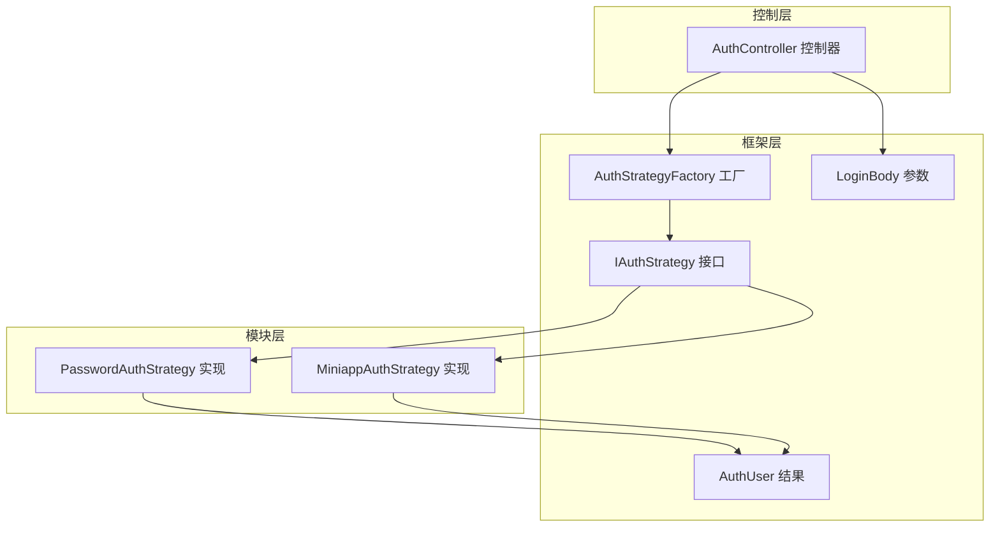
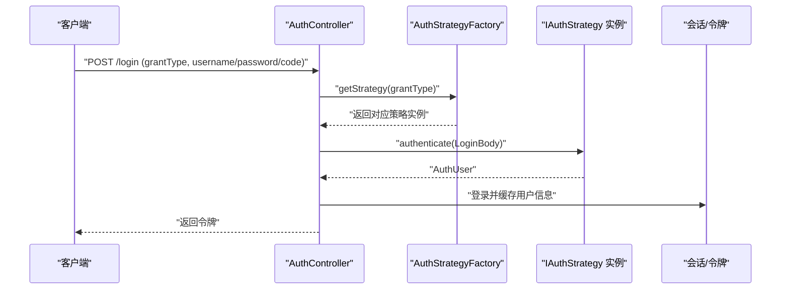
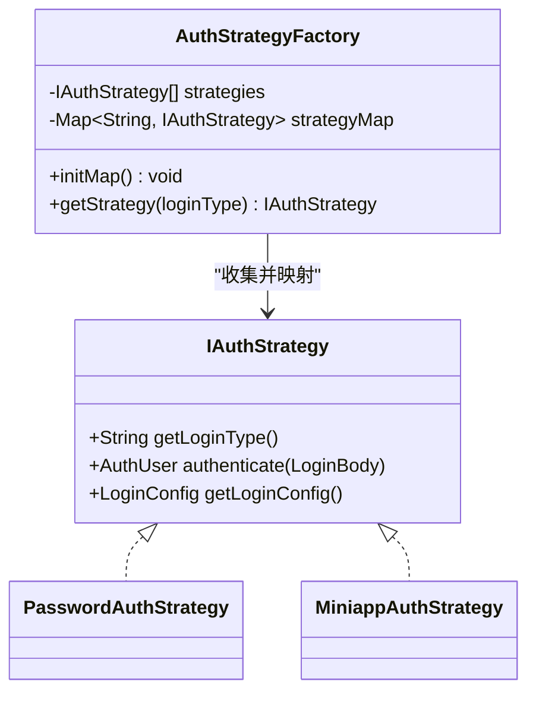
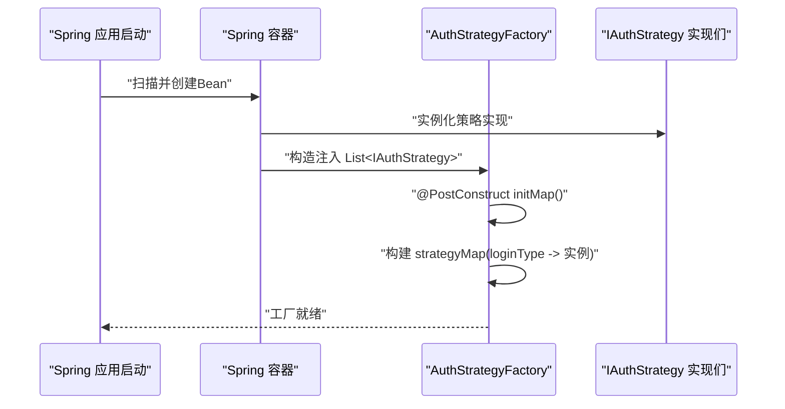
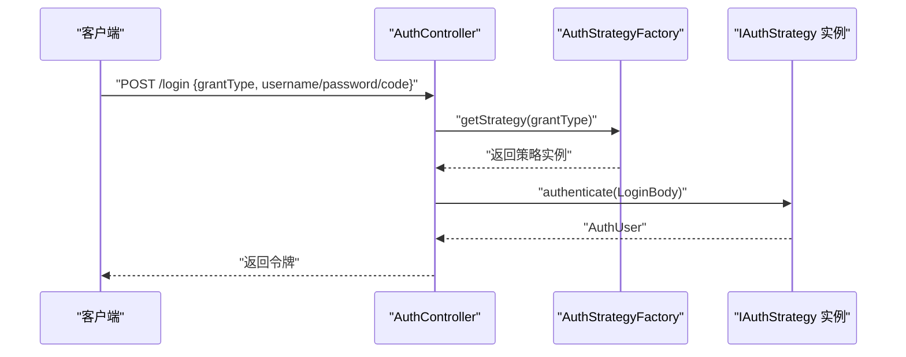
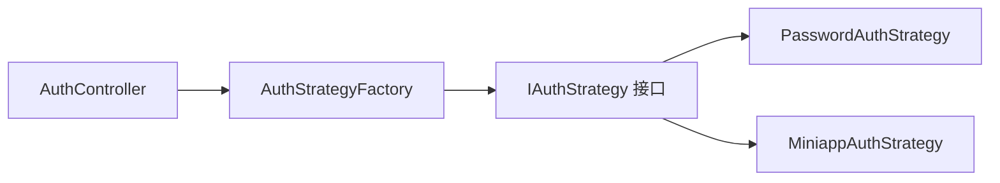

# 认证策略工厂机制

<cite>
**本文引用的文件**
- [AuthStrategyFactory.java](file://verulia-framework/verulia-framework-auth/src/main/java/org/yann/verulia/framework/auth/strategy/AuthStrategyFactory.java)
- [IAuthStrategy.java](file://verulia-framework/verulia-framework-auth/src/main/java/org/yann/verulia/framework/auth/strategy/IAuthStrategy.java)
- [PasswordAuthStrategy.java](file://verulia-modules/verulia-system/src/main/java/org/yann/verulia/system/service/strategy/PasswordAuthStrategy.java)
- [MiniappAuthStrategy.java](file://verulia-modules/verulia-system/src/main/java/org/yann/verulia/system/service/strategy/MiniappAuthStrategy.java)
- [AuthController.java](file://verulia-admin/src/main/java/org/yann/verulia/controller/AuthController.java)
- [LoginBody.java](file://verulia-framework/verulia-framework-auth/src/main/java/org/yann/verulia/framework/auth/domain/LoginBody.java)
- [AuthUser.java](file://verulia-framework/verulia-framework-auth/src/main/java/org/yann/verulia/framework/auth/domain/AuthUser.java)
- [VeruliaApplication.java](file://verulia-admin/src/main/java/org/yann/verulia/VeruliaApplication.java)
</cite>

## 目录
1. [引言](#引言)
2. [项目结构](#项目结构)
3. [核心组件](#核心组件)
4. [架构总览](#架构总览)
5. [详细组件分析](#详细组件分析)
6. [依赖关系分析](#依赖关系分析)
7. [性能与并发特性](#性能与并发特性)
8. [故障排查指南](#故障排查指南)
9. [结论](#结论)
10. [附录](#附录)

## 引言
本文件围绕认证策略工厂机制展开，重点阐述AuthStrategyFactory如何通过Spring依赖注入收集所有IAuthStrategy实现类Bean，并在@PostConstruct标记的初始化方法中构建线程安全的策略映射；同时解释getStrategy方法如何依据loginType快速定位策略实例、未命中时抛出IllegalArgumentException的合理性，以及为何采用ConcurrentHashMap进行并发访问保障。最后，通过时序图展示从Spring容器初始化到策略工厂准备就绪的全过程，并给出高并发场景下的性能优化建议与监控指标设计。

## 项目结构
该认证体系由框架层的通用接口与工厂、模块层的具体策略实现、以及控制器层的调用方组成：
- 框架层（verulia-framework）：定义认证策略接口IAuthStrategy与工厂AuthStrategyFactory，以及认证域模型LoginBody、AuthUser等。
- 模块层（verulia-system）：实现具体策略PasswordAuthStrategy与MiniappAuthStrategy。
- 控制器层（verulia-admin）：AuthController接收登录请求，委托工厂选择策略并完成登录流程。

图表来源
- [AuthStrategyFactory.java](file://verulia-framework/verulia-framework-auth/src/main/java/org/yann/verulia/framework/auth/strategy/AuthStrategyFactory.java#L1-L51)
- [IAuthStrategy.java](file://verulia-framework/verulia-framework-auth/src/main/java/org/yann/verulia/framework/auth/strategy/IAuthStrategy.java#L1-L36)
- [PasswordAuthStrategy.java](file://verulia-modules/verulia-system/src/main/java/org/yann/verulia/system/service/strategy/PasswordAuthStrategy.java#L1-L82)
- [MiniappAuthStrategy.java](file://verulia-modules/verulia-system/src/main/java/org/yann/verulia/system/service/strategy/MiniappAuthStrategy.java#L1-L95)
- [AuthController.java](file://verulia-admin/src/main/java/org/yann/verulia/controller/AuthController.java#L1-L67)
- [LoginBody.java](file://verulia-framework/verulia-framework-auth/src/main/java/org/yann/verulia/framework/auth/domain/LoginBody.java#L1-L59)
- [AuthUser.java](file://verulia-framework/verulia-framework-auth/src/main/java/org/yann/verulia/framework/auth/domain/AuthUser.java#L1-L41)

章节来源
- [AuthStrategyFactory.java](file://verulia-framework/verulia-framework-auth/src/main/java/org/yann/verulia/framework/auth/strategy/AuthStrategyFactory.java#L1-L51)
- [IAuthStrategy.java](file://verulia-framework/verulia-framework-auth/src/main/java/org/yann/verulia/framework/auth/strategy/IAuthStrategy.java#L1-L36)
- [AuthController.java](file://verulia-admin/src/main/java/org/yann/verulia/controller/AuthController.java#L1-L67)

## 核心组件
- IAuthStrategy：定义统一的认证策略接口，包含获取登录类型、执行认证、可选的登录配置等能力。
- AuthStrategyFactory：负责收集所有IAuthStrategy Bean，构建基于loginType的映射表，并提供getStrategy查询方法。
- 具体策略实现：
  - PasswordAuthStrategy：基于用户名/密码的认证策略，返回标准登录配置。
  - MiniappAuthStrategy：基于微信小程序code换取会话的认证策略，处理社交绑定与注册逻辑。

章节来源
- [IAuthStrategy.java](file://verulia-framework/verulia-framework-auth/src/main/java/org/yann/verulia/framework/auth/strategy/IAuthStrategy.java#L1-L36)
- [AuthStrategyFactory.java](file://verulia-framework/verulia-framework-auth/src/main/java/org/yann/verulia/framework/auth/strategy/AuthStrategyFactory.java#L1-L51)
- [PasswordAuthStrategy.java](file://verulia-modules/verulia-system/src/main/java/org/yann/verulia/system/service/strategy/PasswordAuthStrategy.java#L1-L82)
- [MiniappAuthStrategy.java](file://verulia-modules/verulia-system/src/main/java/org/yann/verulia/system/service/strategy/MiniappAuthStrategy.java#L1-L95)

## 架构总览
下图展示了从HTTP请求到策略执行的整体流程，以及工厂在其中的关键作用。

图表来源
- [AuthController.java](file://verulia-admin/src/main/java/org/yann/verulia/controller/AuthController.java#L1-L67)
- [AuthStrategyFactory.java](file://verulia-framework/verulia-framework-auth/src/main/java/org/yann/verulia/framework/auth/strategy/AuthStrategyFactory.java#L1-L51)
- [IAuthStrategy.java](file://verulia-framework/verulia-framework-auth/src/main/java/org/yann/verulia/framework/auth/strategy/IAuthStrategy.java#L1-L36)
- [LoginBody.java](file://verulia-framework/verulia-framework-auth/src/main/java/org/yann/verulia/framework/auth/domain/LoginBody.java#L1-L59)
- [AuthUser.java](file://verulia-framework/verulia-framework-auth/src/main/java/org/yann/verulia/framework/auth/domain/AuthUser.java#L1-L41)

## 详细组件分析

### AuthStrategyFactory 实现原理
- 依赖注入与Bean收集
  - 工厂通过构造函数注入List<IAuthStrategy>，Spring会自动收集所有标注为@Component且实现IAuthStrategy的Bean，形成策略列表。
  - 这种方式天然具备“零配置”扩展能力：新增策略只需实现IAuthStrategy并交由Spring管理，无需修改工厂代码。
- 初始化映射
  - 在@PostConstruct标记的initMap方法中，工厂使用Stream将策略集合转换为Map<String, IAuthStrategy>，键为各策略的loginType，值为策略实例。
  - 使用Collectors.toMap确保键唯一性，若出现重复loginType，将抛出异常，从而在启动阶段暴露配置问题。
- 查询策略
  - getStrategy方法通过strategyMap.get(loginType)进行O(1)时间复杂度的查找。
  - 若未找到对应策略，抛出IllegalArgumentException，明确提示“不支持的登录类型”，便于快速定位问题。
- 线程安全
  - 字段strategyMap采用ConcurrentHashMap，保证多线程并发读写的安全性；在初始化阶段通过原子替换策略避免竞态条件。
  - 由于策略实例通常无状态且只读，读操作无需额外同步。

图表来源
- [AuthStrategyFactory.java](file://verulia-framework/verulia-framework-auth/src/main/java/org/yann/verulia/framework/auth/strategy/AuthStrategyFactory.java#L1-L51)
- [IAuthStrategy.java](file://verulia-framework/verulia-framework-auth/src/main/java/org/yann/verulia/framework/auth/strategy/IAuthStrategy.java#L1-L36)
- [PasswordAuthStrategy.java](file://verulia-modules/verulia-system/src/main/java/org/yann/verulia/system/service/strategy/PasswordAuthStrategy.java#L1-L82)
- [MiniappAuthStrategy.java](file://verulia-modules/verulia-system/src/main/java/org/yann/verulia/system/service/strategy/MiniappAuthStrategy.java#L1-L95)

章节来源
- [AuthStrategyFactory.java](file://verulia-framework/verulia-framework-auth/src/main/java/org/yann/verulia/framework/auth/strategy/AuthStrategyFactory.java#L1-L51)

### Spring容器初始化到工厂就绪的时序
- 启动阶段
  - Spring Boot应用启动，扫描@Component注解的Bean（包括IAuthStrategy实现）。
  - 完成依赖注入，将各策略Bean注入到AuthStrategyFactory的构造函数参数List<IAuthStrategy>中。
- 初始化阶段
  - 调用@PostConstruct标记的initMap方法，将策略列表转换为基于loginType的映射表。
  - 初始化完成后，工厂进入可用状态，后续请求可直接通过getStrategy进行查询。
- 请求阶段
  - 控制器接收请求参数LoginBody，调用工厂getStrategy(grantType)，再委派给具体策略执行authenticate。

图表来源
- [AuthStrategyFactory.java](file://verulia-framework/verulia-framework-auth/src/main/java/org/yann/verulia/framework/auth/strategy/AuthStrategyFactory.java#L1-L51)
- [VeruliaApplication.java](file://verulia-admin/src/main/java/org/yann/verulia/VeruliaApplication.java#L1-L19)

章节来源
- [AuthStrategyFactory.java](file://verulia-framework/verulia-framework-auth/src/main/java/org/yann/verulia/framework/auth/strategy/AuthStrategyFactory.java#L1-L51)
- [VeruliaApplication.java](file://verulia-admin/src/main/java/org/yann/verulia/VeruliaApplication.java#L1-L19)

### 控制器调用链与参数传递
- AuthController接收LoginBody，其中grantType作为选择策略的关键字段。
- 调用工厂getStrategy(grantType)获取具体策略，随后执行authenticate(LoginBody)并根据策略返回的LoginConfig设置登录参数（设备、超时、并发等），最终完成登录并返回令牌。

图表来源
- [AuthController.java](file://verulia-admin/src/main/java/org/yann/verulia/controller/AuthController.java#L1-L67)
- [AuthStrategyFactory.java](file://verulia-framework/verulia-framework-auth/src/main/java/org/yann/verulia/framework/auth/strategy/AuthStrategyFactory.java#L1-L51)
- [LoginBody.java](file://verulia-framework/verulia-framework-auth/src/main/java/org/yann/verulia/framework/auth/domain/LoginBody.java#L1-L59)

章节来源
- [AuthController.java](file://verulia-admin/src/main/java/org/yann/verulia/controller/AuthController.java#L1-L67)
- [LoginBody.java](file://verulia-framework/verulia-framework-auth/src/main/java/org/yann/verulia/framework/auth/domain/LoginBody.java#L1-L59)

## 依赖关系分析
- 组件耦合
  - AuthController仅依赖AuthStrategyFactory与IAuthStrategy接口，遵循面向接口编程，降低对具体实现的耦合。
  - AuthStrategyFactory依赖IAuthStrategy接口与Spring容器的依赖注入机制，内部持有策略列表与映射表。
- 外部依赖
  - 具体策略实现依赖各自的数据访问层与第三方服务（如微信小程序服务），但这些细节对工厂透明。
- 可能的循环依赖
  - 当前结构未见循环依赖迹象：控制器依赖工厂，工厂依赖接口，策略实现依赖接口与外部服务，方向清晰。

图表来源
- [AuthController.java](file://verulia-admin/src/main/java/org/yann/verulia/controller/AuthController.java#L1-L67)
- [AuthStrategyFactory.java](file://verulia-framework/verulia-framework-auth/src/main/java/org/yann/verulia/framework/auth/strategy/AuthStrategyFactory.java#L1-L51)
- [IAuthStrategy.java](file://verulia-framework/verulia-framework-auth/src/main/java/org/yann/verulia/framework/auth/strategy/IAuthStrategy.java#L1-L36)
- [PasswordAuthStrategy.java](file://verulia-modules/verulia-system/src/main/java/org/yann/verulia/system/service/strategy/PasswordAuthStrategy.java#L1-L82)
- [MiniappAuthStrategy.java](file://verulia-modules/verulia-system/src/main/java/org/yann/verulia/system/service/strategy/MiniappAuthStrategy.java#L1-L95)

章节来源
- [AuthController.java](file://verulia-admin/src/main/java/org/yann/verulia/controller/AuthController.java#L1-L67)
- [AuthStrategyFactory.java](file://verulia-framework/verulia-framework-auth/src/main/java/org/yann/verulia/framework/auth/strategy/AuthStrategyFactory.java#L1-L51)

## 性能与并发特性
- 并发访问安全性
  - 使用ConcurrentHashMap承载策略映射，保证读操作的高并发安全性；写入发生在初始化阶段，运行期只读，避免锁竞争。
- 查找性能
  - getStrategy采用Map.get，平均O(1)时间复杂度，满足高并发场景下的低延迟需求。
- 初始化成本
  - initMap在容器启动时一次性完成，避免运行期重复构建映射带来的开销。
- 扩展性
  - 新增策略无需修改工厂，Spring自动发现并注入，符合开闭原则。

章节来源
- [AuthStrategyFactory.java](file://verulia-framework/verulia-framework-auth/src/main/java/org/yann/verulia/framework/auth/strategy/AuthStrategyFactory.java#L1-L51)

## 故障排查指南
- “不支持的登录类型”异常
  - 现象：调用getStrategy时抛出IllegalArgumentException。
  - 原因：传入的grantType未匹配任何策略的loginType。
  - 排查要点：
    - 确认LoginBody.grantType是否正确传递。
    - 检查各策略实现的getLoginType返回值是否与调用方一致。
    - 确保策略Bean被Spring扫描并成功注入到工厂的List中。
- 策略未生效
  - 现象：策略未被识别或未加载。
  - 排查要点：
    - 确认策略类上存在@Component注解且位于可扫描包路径内。
    - 检查Spring组件扫描范围是否覆盖策略所在包。
- 登录流程中断
  - 现象：authenticate执行过程中抛出业务异常。
  - 排查要点：
    - 查看具体策略实现中的异常分支（如参数校验、第三方服务调用失败、数据状态检查等）。
    - 关注策略返回的LoginConfig是否合理（设备、超时、并发等）。

章节来源
- [AuthStrategyFactory.java](file://verulia-framework/verulia-framework-auth/src/main/java/org/yann/verulia/framework/auth/strategy/AuthStrategyFactory.java#L1-L51)
- [AuthController.java](file://verulia-admin/src/main/java/org/yann/verulia/controller/AuthController.java#L1-L67)
- [PasswordAuthStrategy.java](file://verulia-modules/verulia-system/src/main/java/org/yann/verulia/system/service/strategy/PasswordAuthStrategy.java#L1-L82)
- [MiniappAuthStrategy.java](file://verulia-modules/verulia-system/src/main/java/org/yann/verulia/system/service/strategy/MiniappAuthStrategy.java#L1-L95)

## 结论
AuthStrategyFactory通过Spring依赖注入聚合所有IAuthStrategy实现，并在启动阶段构建线程安全的策略映射，实现了高并发下的快速策略选择与良好的扩展性。getStrategy的O(1)查找与IllegalArgumentException的明确错误提示，使得系统在易用性与可维护性之间取得平衡。整体设计简洁、职责清晰，适合在多策略认证场景中推广使用。

## 附录

### 高并发场景优化建议
- 预热策略映射
  - 在应用启动阶段尽早触发initMap，确保首次请求无需等待初始化。
- 缓存热点策略
  - 对高频登录类型的策略实例进行本地缓存（若需要跨线程共享，仍以ConcurrentHashMap为主）。
- 限流与熔断
  - 在控制器或网关层对/login接口实施限流与熔断，防止突发流量冲击认证链路。
- 异步日志与事件
  - 将登录日志与事件发布异步化，降低认证主路径的阻塞风险。

### 监控指标设计
- 认证成功率与失败率
  - 统计不同grantType的成功/失败次数，识别异常波动。
- 延迟分布
  - 记录getStrategy与authenticate的耗时分位数，定位慢策略。
- 线程池与锁竞争
  - 观测并发线程数、队列长度与阻塞时长，评估策略选择与执行的并发压力。
- 异常分类
  - 统计IllegalArgumentException、业务异常与第三方服务异常的比例，辅助定位问题根因。