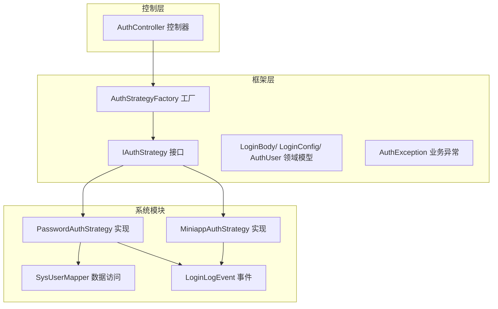
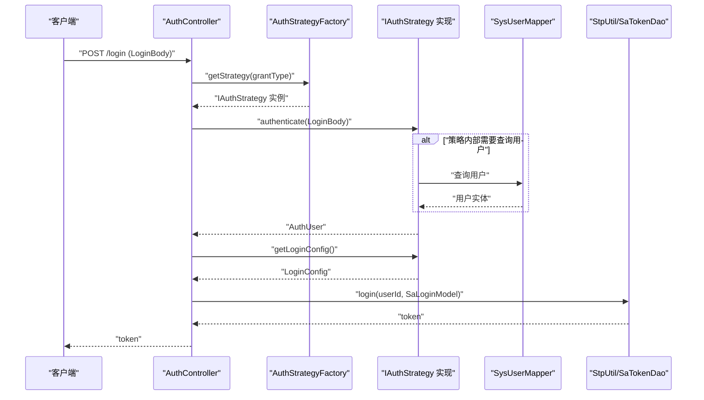
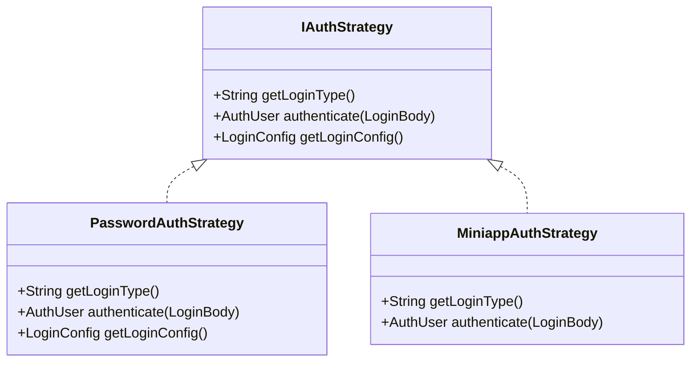
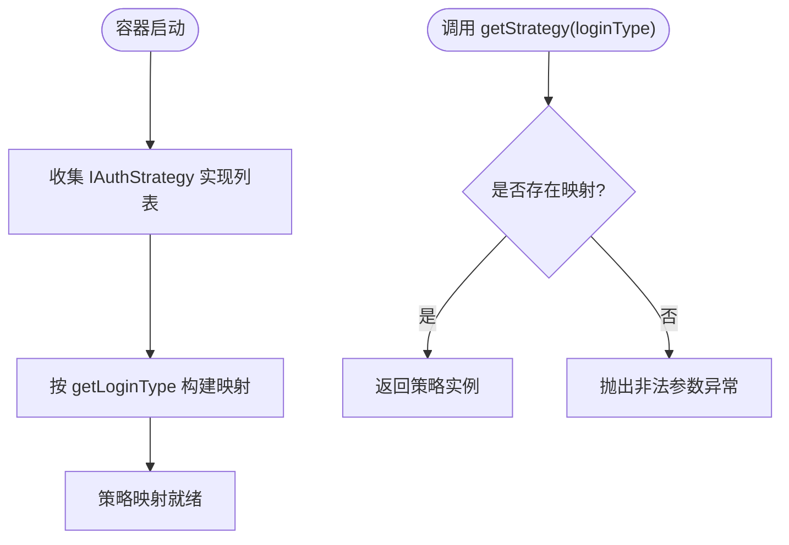
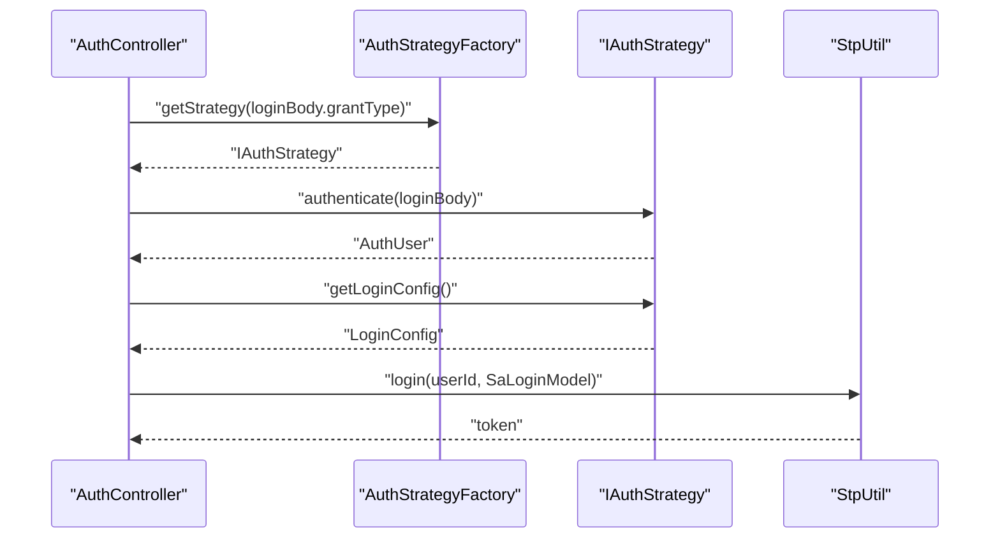
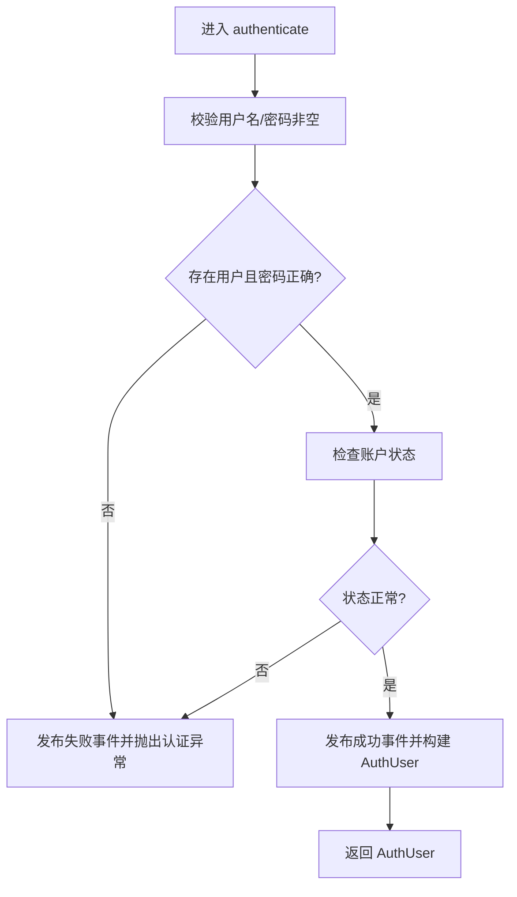
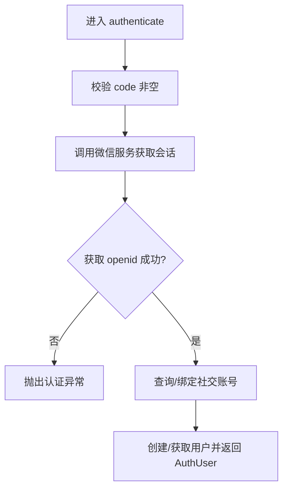
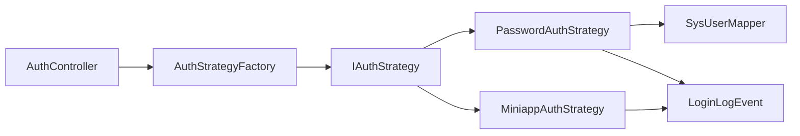

# 认证策略接口规范

<cite>
**本文引用的文件**
- [IAuthStrategy.java](file://verulia-framework/verulia-framework-auth/src/main/java/org/yann/verulia/framework/auth/strategy/IAuthStrategy.java)
- [LoginBody.java](file://verulia-framework/verulia-framework-auth/src/main/java/org/yann/verulia/framework/auth/domain/LoginBody.java)
- [AuthUser.java](file://verulia-framework/verulia-framework-auth/src/main/java/org/yann/verulia/framework/auth/domain/AuthUser.java)
- [LoginConfig.java](file://verulia-framework/verulia-framework-auth/src/main/java/org/yann/verulia/framework/auth/domain/LoginConfig.java)
- [AuthStrategyFactory.java](file://verulia-framework/verulia-framework-auth/src/main/java/org/yann/verulia/framework/auth/strategy/AuthStrategyFactory.java)
- [PasswordAuthStrategy.java](file://verulia-modules/verulia-system/src/main/java/org/yann/verulia/system/service/strategy/PasswordAuthStrategy.java)
- [MiniappAuthStrategy.java](file://verulia-modules/verulia-system/src/main/java/org/yann/verulia/system/service/strategy/MiniappAuthStrategy.java)
- [AuthController.java](file://verulia-admin/src/main/java/org/yann/verulia/controller/AuthController.java)
- [AuthException.java](file://verulia-framework/verulia-framework-auth/src/main/java/org/yann/verulia/framework/auth/exception/AuthException.java)
- [BusinessException.java](file://verulia-framework/verulia-framework-core/src/main/java/org/yann/verulia/framework/core/exception/BusinessException.java)
- [SysUserMapper.java](file://verulia-modules/verulia-system/src/main/java/org/yann/verulia/system/mapper/SysUserMapper.java)
- [LoginLogEvent.java](file://verulia-modules/verulia-system/src/main/java/org/yann/verulia/system/event/LoginLogEvent.java)
</cite>

## 目录
1. [引言](#引言)
2. [项目结构](#项目结构)
3. [核心组件](#核心组件)
4. [架构总览](#架构总览)
5. [详细组件分析](#详细组件分析)
6. [依赖关系分析](#依赖关系分析)
7. [性能考量](#性能考量)
8. [故障排查指南](#故障排查指南)
9. [结论](#结论)
10. [附录](#附录)

## 引言
本文件围绕认证策略接口 IAuthStrategy 的技术契约进行深入解析，重点阐述：
- getLoginType 如何定义认证方式标识（如 password、miniapp）
- authenticate 如何接收 LoginBody 参数并返回 AuthUser 认证结果
- getLoginConfig 默认方法在定制化登录配置（如超时时间、设备类型、并发登录）中的作用
- 结合代码示例展示该接口作为扩展点的设计意图，以及与 Spring 生态（Spring 容器、事件发布、事务管理）的集成方式
- 实现类必须遵循的方法规范与异常处理机制
- 常见错误场景与解决方案，如 loginType 冲突、认证逻辑阻塞等性能问题

## 项目结构
本项目采用多模块分层组织，认证策略位于框架层，具体实现位于系统模块，控制器负责入口调用与 Sa-Token 登录集成。

图表来源
- [AuthController.java](file://verulia-admin/src/main/java/org/yann/verulia/controller/AuthController.java#L31-L57)
- [AuthStrategyFactory.java](file://verulia-framework/verulia-framework-auth/src/main/java/org/yann/verulia/framework/auth/strategy/AuthStrategyFactory.java#L23-L50)
- [IAuthStrategy.java](file://verulia-framework/verulia-framework-auth/src/main/java/org/yann/verulia/framework/auth/strategy/IAuthStrategy.java#L12-L36)
- [PasswordAuthStrategy.java](file://verulia-modules/verulia-system/src/main/java/org/yann/verulia/system/service/strategy/PasswordAuthStrategy.java#L25-L82)
- [MiniappAuthStrategy.java](file://verulia-modules/verulia-system/src/main/java/org/yann/verulia/system/service/strategy/MiniappAuthStrategy.java#L1-L95)
- [SysUserMapper.java](file://verulia-modules/verulia-system/src/main/java/org/yann/verulia/system/mapper/SysUserMapper.java#L1-L15)
- [LoginLogEvent.java](file://verulia-modules/verulia-system/src/main/java/org/yann/verulia/system/event/LoginLogEvent.java#L1-L35)

章节来源
- [AuthController.java](file://verulia-admin/src/main/java/org/yann/verulia/controller/AuthController.java#L31-L57)
- [AuthStrategyFactory.java](file://verulia-framework/verulia-framework-auth/src/main/java/org/yann/verulia/framework/auth/strategy/AuthStrategyFactory.java#L23-L50)
- [IAuthStrategy.java](file://verulia-framework/verulia-framework-auth/src/main/java/org/yann/verulia/framework/auth/strategy/IAuthStrategy.java#L12-L36)

## 核心组件
- IAuthStrategy：认证策略接口，定义登录类型标识、认证执行与登录配置获取三个关键方法
- AuthStrategyFactory：基于 Spring 容器收集所有 IAuthStrategy 实现，按 loginType 构建映射，提供获取策略的能力
- AuthController：对外暴露登录接口，通过工厂选择策略、执行认证、读取登录配置并调用 Sa-Token 完成登录
- LoginBody/LoginConfig/AuthUser：输入参数、登录配置与认证结果载体
- 具体实现 PasswordAuthStrategy/MiniappAuthStrategy：分别实现账号密码与微信小程序登录策略

章节来源
- [IAuthStrategy.java](file://verulia-framework/verulia-framework-auth/src/main/java/org/yann/verulia/framework/auth/strategy/IAuthStrategy.java#L12-L36)
- [AuthStrategyFactory.java](file://verulia-framework/verulia-framework-auth/src/main/java/org/yann/verulia/framework/auth/strategy/AuthStrategyFactory.java#L23-L50)
- [AuthController.java](file://verulia-admin/src/main/java/org/yann/verulia/controller/AuthController.java#L31-L57)
- [LoginBody.java](file://verulia-framework/verulia-framework-auth/src/main/java/org/yann/verulia/framework/auth/domain/LoginBody.java#L1-L59)
- [LoginConfig.java](file://verulia-framework/verulia-framework-auth/src/main/java/org/yann/verulia/framework/auth/domain/LoginConfig.java#L1-L34)
- [AuthUser.java](file://verulia-framework/verulia-framework-auth/src/main/java/org/yann/verulia/framework/auth/domain/AuthUser.java#L1-L41)

## 架构总览
下图展示了从请求到认证完成的整体流程，包括策略选择、认证执行、配置应用与登录态建立。

图表来源
- [AuthController.java](file://verulia-admin/src/main/java/org/yann/verulia/controller/AuthController.java#L37-L57)
- [AuthStrategyFactory.java](file://verulia-framework/verulia-framework-auth/src/main/java/org/yann/verulia/framework/auth/strategy/AuthStrategyFactory.java#L37-L50)
- [IAuthStrategy.java](file://verulia-framework/verulia-framework-auth/src/main/java/org/yann/verulia/framework/auth/strategy/IAuthStrategy.java#L19-L34)
- [SysUserMapper.java](file://verulia-modules/verulia-system/src/main/java/org/yann/verulia/system/mapper/SysUserMapper.java#L1-L15)

## 详细组件分析

### IAuthStrategy 接口技术契约
- getLoginType：返回当前策略的登录类型标识字符串，用于工厂映射与路由选择
- authenticate：接收 LoginBody，执行具体认证逻辑，返回 AuthUser；若认证失败需抛出业务异常
- getLoginConfig：默认返回 null 表示使用系统默认登录配置；也可返回 LoginConfig 自定义设备类型、超时时间、活跃频率与并发登录策略

图表来源
- [IAuthStrategy.java](file://verulia-framework/verulia-framework-auth/src/main/java/org/yann/verulia/framework/auth/strategy/IAuthStrategy.java#L12-L36)
- [PasswordAuthStrategy.java](file://verulia-modules/verulia-system/src/main/java/org/yann/verulia/system/service/strategy/PasswordAuthStrategy.java#L25-L82)
- [MiniappAuthStrategy.java](file://verulia-modules/verulia-system/src/main/java/org/yann/verulia/system/service/strategy/MiniappAuthStrategy.java#L1-L95)

章节来源
- [IAuthStrategy.java](file://verulia-framework/verulia-framework-auth/src/main/java/org/yann/verulia/framework/auth/strategy/IAuthStrategy.java#L12-L36)

### AuthStrategyFactory 工厂与 Spring 集成
- 通过构造注入收集所有 IAuthStrategy 实现，启动时构建 loginType 到策略实例的映射
- 提供 getStrategy 方法，按 loginType 获取对应策略；未匹配时抛出非法参数异常

图表来源
- [AuthStrategyFactory.java](file://verulia-framework/verulia-framework-auth/src/main/java/org/yann/verulia/framework/auth/strategy/AuthStrategyFactory.java#L23-L50)

章节来源
- [AuthStrategyFactory.java](file://verulia-framework/verulia-framework-auth/src/main/java/org/yann/verulia/framework/auth/strategy/AuthStrategyFactory.java#L23-L50)

### AuthController 登录流程与 Sa-Token 集成
- 从请求体提取 grantType 并通过工厂获取策略
- 调用策略 authenticate 执行认证，随后读取 getLoginConfig 应用登录配置
- 使用 Sa-Token 的登录模型设置设备类型、超时与并发策略，完成登录并返回 token

图表来源
- [AuthController.java](file://verulia-admin/src/main/java/org/yann/verulia/controller/AuthController.java#L37-L57)
- [IAuthStrategy.java](file://verulia-framework/verulia-framework-auth/src/main/java/org/yann/verulia/framework/auth/strategy/IAuthStrategy.java#L21-L34)

章节来源
- [AuthController.java](file://verulia-admin/src/main/java/org/yann/verulia/controller/AuthController.java#L37-L57)

### PasswordAuthStrategy 实现要点
- loginType 固定为 password
- authenticate 中对用户名/密码进行校验，查询用户并比对密码，状态校验，成功后发布登录事件并返回 AuthUser
- getLoginConfig 返回 PC 设备、两小时超时与允许并发登录的配置

图表来源
- [PasswordAuthStrategy.java](file://verulia-modules/verulia-system/src/main/java/org/yann/verulia/system/service/strategy/PasswordAuthStrategy.java#L38-L81)
- [SysUserMapper.java](file://verulia-modules/verulia-system/src/main/java/org/yann/verulia/system/mapper/SysUserMapper.java#L1-L15)
- [LoginLogEvent.java](file://verulia-modules/verulia-system/src/main/java/org/yann/verulia/system/event/LoginLogEvent.java#L1-L35)

章节来源
- [PasswordAuthStrategy.java](file://verulia-modules/verulia-system/src/main/java/org/yann/verulia/system/service/strategy/PasswordAuthStrategy.java#L38-L81)

### MiniappAuthStrategy 实现要点
- loginType 固定为 miniapp
- authenticate 通过微信服务获取会话信息，绑定或注册用户，返回 AuthUser
- 该实现演示了事务管理与外部服务调用的集成

图表来源
- [MiniappAuthStrategy.java](file://verulia-modules/verulia-system/src/main/java/org/yann/verulia/system/service/strategy/MiniappAuthStrategy.java#L46-L95)

章节来源
- [MiniappAuthStrategy.java](file://verulia-modules/verulia-system/src/main/java/org/yann/verulia/system/service/strategy/MiniappAuthStrategy.java#L46-L95)

### 领域模型与异常处理
- LoginBody：包含 grantType、用户名/密码、验证码/uuid、手机号等字段，用于承载不同登录方式的输入
- LoginConfig：封装设备类型、Token 超时、活跃频率与并发登录开关
- AuthUser：认证后的用户标识与登录类型，以及扩展信息
- AuthException：继承 BusinessException，用于认证过程中的业务异常
- BusinessException：统一的业务异常基类，配合全局异常处理器返回标准响应

章节来源
- [LoginBody.java](file://verulia-framework/verulia-framework-auth/src/main/java/org/yann/verulia/framework/auth/domain/LoginBody.java#L1-L59)
- [LoginConfig.java](file://verulia-framework/verulia-framework-auth/src/main/java/org/yann/verulia/framework/auth/domain/LoginConfig.java#L1-L34)
- [AuthUser.java](file://verulia-framework/verulia-framework-auth/src/main/java/org/yann/verulia/framework/auth/domain/AuthUser.java#L1-L41)
- [AuthException.java](file://verulia-framework/verulia-framework-auth/src/main/java/org/yann/verulia/framework/auth/exception/AuthException.java#L1-L17)
- [BusinessException.java](file://verulia-framework/verulia-framework-core/src/main/java/org/yann/verulia/framework/core/exception/BusinessException.java#L1-L68)

## 依赖关系分析
- 控制层依赖工厂与策略接口，策略实现依赖数据访问与事件发布
- 工厂通过 Spring 收集策略实现，避免硬编码映射
- 控制层与 Sa-Token 集成，策略实现与业务模块耦合度低

图表来源
- [AuthController.java](file://verulia-admin/src/main/java/org/yann/verulia/controller/AuthController.java#L31-L57)
- [AuthStrategyFactory.java](file://verulia-framework/verulia-framework-auth/src/main/java/org/yann/verulia/framework/auth/strategy/AuthStrategyFactory.java#L23-L50)
- [PasswordAuthStrategy.java](file://verulia-modules/verulia-system/src/main/java/org/yann/verulia/system/service/strategy/PasswordAuthStrategy.java#L25-L82)
- [MiniappAuthStrategy.java](file://verulia-modules/verulia-system/src/main/java/org/yann/verulia/system/service/strategy/MiniappAuthStrategy.java#L1-L95)
- [SysUserMapper.java](file://verulia-modules/verulia-system/src/main/java/org/yann/verulia/system/mapper/SysUserMapper.java#L1-L15)
- [LoginLogEvent.java](file://verulia-modules/verulia-system/src/main/java/org/yann/verulia/system/event/LoginLogEvent.java#L1-L35)

章节来源
- [AuthController.java](file://verulia-admin/src/main/java/org/yann/verulia/controller/AuthController.java#L31-L57)
- [AuthStrategyFactory.java](file://verulia-framework/verulia-framework-auth/src/main/java/org/yann/verulia/framework/auth/strategy/AuthStrategyFactory.java#L23-L50)

## 性能考量
- 策略选择：工厂在启动时一次性构建映射，运行时 O(1) 查找，避免重复扫描
- 认证阻塞：微信登录等外部调用建议异步化或引入超时与熔断，防止阻塞主线程
- 查询优化：密码登录应确保用户名字段具备索引，减少数据库压力
- 并发登录：合理设置 isConcurrent，避免过度并发导致资源竞争
- Token 策略：根据业务场景调整 timeout 与 activeTimeout，平衡安全与体验

## 故障排查指南
- loginType 冲突
  - 现象：多个策略返回相同 loginType，导致映射覆盖
  - 解决：确保每个策略的 getLoginType 唯一，工厂初始化时会以 loginType 为键覆盖
  - 参考路径
    - [AuthStrategyFactory.java](file://verulia-framework/verulia-framework-auth/src/main/java/org/yann/verulia/framework/auth/strategy/AuthStrategyFactory.java#L30-L35)
    - [PasswordAuthStrategy.java](file://verulia-modules/verulia-system/src/main/java/org/yann/verulia/system/service/strategy/PasswordAuthStrategy.java#L33-L37)
    - [MiniappAuthStrategy.java](file://verulia-modules/verulia-system/src/main/java/org/yann/verulia/system/service/strategy/MiniappAuthStrategy.java#L41-L45)

- 不支持的登录类型
  - 现象：grantType 未被任何策略实现，工厂抛出非法参数异常
  - 解决：确认请求 grantType 与策略 loginType 一致，或新增对应策略
  - 参考路径
    - [AuthStrategyFactory.java](file://verulia-framework/verulia-framework-auth/src/main/java/org/yann/verulia/framework/auth/strategy/AuthStrategyFactory.java#L43-L49)
    - [AuthController.java](file://verulia-admin/src/main/java/org/yann/verulia/controller/AuthController.java#L40-L42)

- 认证逻辑阻塞
  - 现象：微信登录等外部服务调用耗时长，阻塞请求线程
  - 解决：引入超时、重试与熔断；必要时异步化处理
  - 参考路径
    - [MiniappAuthStrategy.java](file://verulia-modules/verulia-system/src/main/java/org/yann/verulia/system/service/strategy/MiniappAuthStrategy.java#L54-L60)

- 密码错误或用户不存在
  - 现象：认证异常，同时发布失败事件
  - 解决：统一异常处理，避免泄露敏感信息；记录审计日志
  - 参考路径
    - [PasswordAuthStrategy.java](file://verulia-modules/verulia-system/src/main/java/org/yann/verulia/system/service/strategy/PasswordAuthStrategy.java#L50-L63)
    - [AuthException.java](file://verulia-framework/verulia-framework-auth/src/main/java/org/yann/verulia/framework/auth/exception/AuthException.java#L1-L17)
    - [BusinessException.java](file://verulia-framework/verulia-framework-core/src/main/java/org/yann/verulia/framework/core/exception/BusinessException.java#L1-L68)

- 登录配置未生效
  - 现象：未设置 LoginConfig 或字段为空，导致默认行为不符合预期
  - 解决：在策略中返回 LoginConfig，或在控制器侧做空值兜底
  - 参考路径
    - [AuthController.java](file://verulia-admin/src/main/java/org/yann/verulia/controller/AuthController.java#L44-L53)
    - [PasswordAuthStrategy.java](file://verulia-modules/verulia-system/src/main/java/org/yann/verulia/system/service/strategy/PasswordAuthStrategy.java#L73-L81)

## 结论
IAuthStrategy 通过清晰的职责划分与默认配置机制，提供了高度可扩展的认证策略体系。借助 Spring 容器与工厂模式，系统可在不修改核心流程的情况下灵活增加新的登录方式；通过 LoginConfig 与 Sa-Token 的集成，实现了登录配置的细粒度控制。实现类需严格遵守 loginType 唯一性与异常处理规范，以保障系统的稳定性与安全性。

## 附录
- 接口方法规范
  - 必须实现 getLoginType，返回唯一标识字符串
  - 必须实现 authenticate，正确处理参数校验与业务校验，失败抛出业务异常
  - 可选实现 getLoginConfig，默认返回 null 使用系统默认配置
- 常见登录类型
  - password：账号密码登录
  - miniapp：微信小程序静默登录
- 集成建议
  - 在策略实现中使用事务注解保证数据一致性
  - 发布登录事件便于审计与监控
  - 对外部服务调用设置超时与重试策略