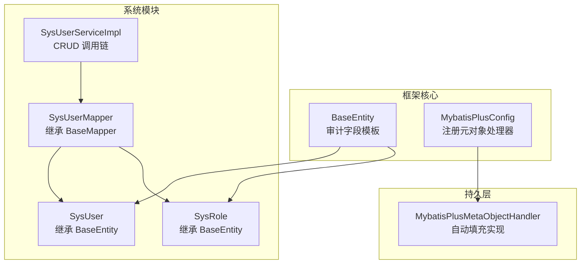
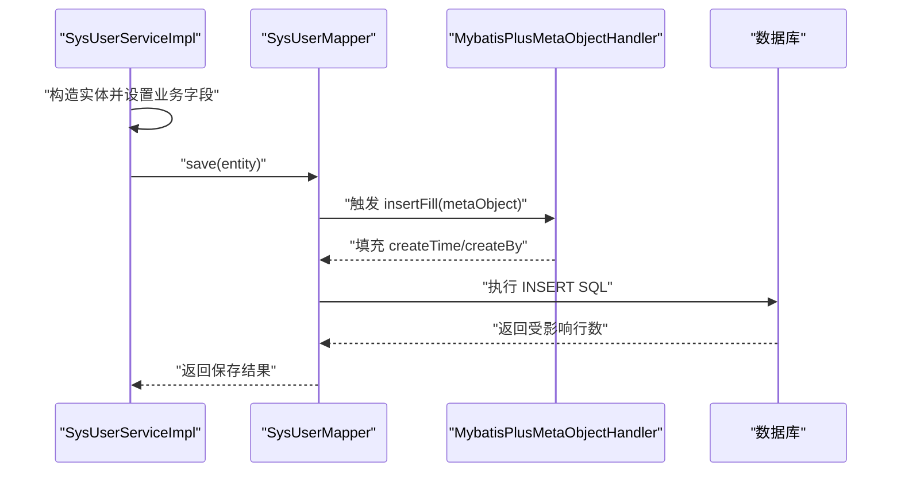
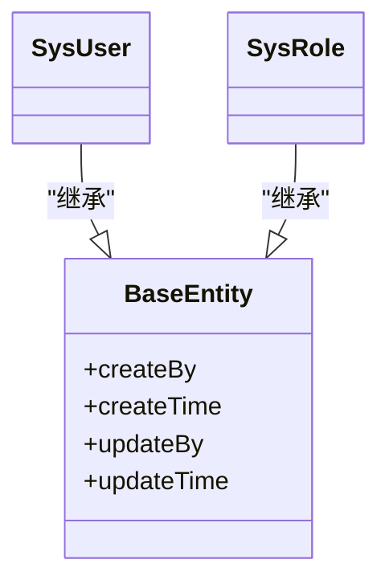
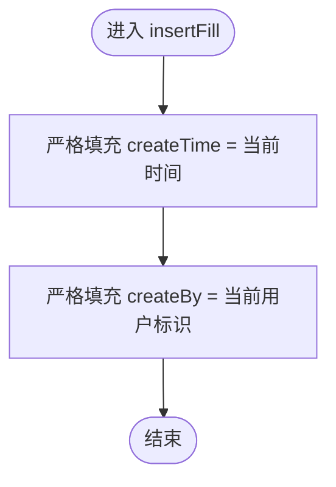
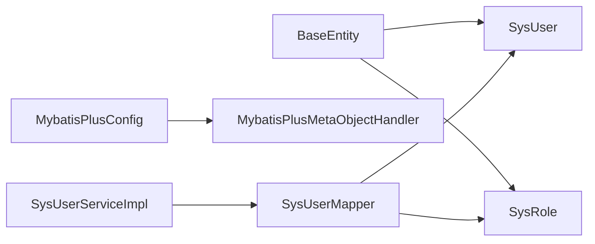

# 模板方法模式

<cite>
**本文引用的文件**
- [BaseEntity.java](file://verulia-framework/verulia-framework-core/src/main/java/org/yann/verulia/framework/core/domain/BaseEntity.java)
- [SysUser.java](file://verulia-modules/verulia-system/src/main/java/org/yann/verulia/system/domain/entity/SysUser.java)
- [SysRole.java](file://verulia-modules/verulia-system/src/main/java/org/yann/verulia/system/domain/entity/SysRole.java)
- [MybatisPlusMetaObjectHandler.java](file://verulia-framework/verulia-framework-mybatis/src/main/java/org/yann/verulia/framework/mybatis/handler/MybatisPlusMetaObjectHandler.java)
- [MybatisPlusConfig.java](file://verulia-framework/verulia-framework-mybatis/src/main/java/org/yann/verulia/framework/mybatis/config/MybatisPlusConfig.java)
- [_init.sql](file://_script/_init.sql)
- [SysUserServiceImpl.java](file://verulia-modules/verulia-system/src/main/java/org/yann/verulia/system/service/impl/SysUserServiceImpl.java)
- [SysUserMapper.java](file://verulia-modules/verulia-system/src/main/java/org/yann/verulia/system/mapper/SysUserMapper.java)
</cite>

## 目录
1. [引言](#引言)
2. [项目结构](#项目结构)
3. [核心组件](#核心组件)
4. [架构总览](#架构总览)
5. [详细组件分析](#详细组件分析)
6. [依赖关系分析](#依赖关系分析)
7. [性能考量](#性能考量)
8. [故障排查指南](#故障排查指南)
9. [结论](#结论)
10. [附录](#附录)

## 引言
本文件围绕“模板方法模式”在持久层实体中的应用展开，重点说明：
- 抽象基类 BaseEntity 如何通过统一的审计字段模板（createBy、createTime、updateBy、updateTime），为所有继承实体提供一致的数据追踪能力；
- 子类（如 SysUser、SysRole）如何继承该模板，自动获得审计字段，减少重复代码；
- MybatisPlusMetaObjectHandler 如何利用 MetaObject 在 INSERT 和 INSERT_UPDATE 场景下进行自动填充；
- 结合数据库表结构与实际插入/更新流程，验证自动填充效果；
- 逻辑删除注解 @TableLogic 与模板方法的协同工作；
- 自定义填充逻辑的扩展思路（如实现 IFieldFillHandler 的思路）；
- 最佳实践：子类不应重写审计字段，以避免破坏模板行为。

## 项目结构
本项目采用分层+模块化组织，其中与模板方法模式直接相关的核心位于：
- framework-core 提供通用实体基类 BaseEntity；
- framework-mybatis 提供 MyBatis-Plus 元对象处理器 MybatisPlusMetaObjectHandler 及其 Spring 配置；
- system 模块包含具体业务实体（SysUser、SysRole）及其服务/映射。

图表来源
- [BaseEntity.java](file://verulia-framework/verulia-framework-core/src/main/java/org/yann/verulia/framework/core/domain/BaseEntity.java#L1-L44)
- [MybatisPlusConfig.java](file://verulia-framework/verulia-framework-mybatis/src/main/java/org/yann/verulia/framework/mybatis/config/MybatisPlusConfig.java#L1-L31)
- [MybatisPlusMetaObjectHandler.java](file://verulia-framework/verulia-framework-mybatis/src/main/java/org/yann/verulia/framework/mybatis/handler/MybatisPlusMetaObjectHandler.java#L1-L32)
- [SysUser.java](file://verulia-modules/verulia-system/src/main/java/org/yann/verulia/system/domain/entity/SysUser.java#L1-L70)
- [SysRole.java](file://verulia-modules/verulia-system/src/main/java/org/yann/verulia/system/domain/entity/SysRole.java#L1-L53)
- [SysUserMapper.java](file://verulia-modules/verulia-system/src/main/java/org/yann/verulia/system/mapper/SysUserMapper.java#L1-L15)
- [SysUserServiceImpl.java](file://verulia-modules/verulia-system/src/main/java/org/yann/verulia/system/service/impl/SysUserServiceImpl.java#L1-L147)

章节来源
- [BaseEntity.java](file://verulia-framework/verulia-framework-core/src/main/java/org/yann/verulia/framework/core/domain/BaseEntity.java#L1-L44)
- [MybatisPlusConfig.java](file://verulia-framework/verulia-framework-mybatis/src/main/java/org/yann/verulia/framework/mybatis/config/MybatisPlusConfig.java#L1-L31)
- [MybatisPlusMetaObjectHandler.java](file://verulia-framework/verulia-framework-mybatis/src/main/java/org/yann/verulia/framework/mybatis/handler/MybatisPlusMetaObjectHandler.java#L1-L32)
- [SysUser.java](file://verulia-modules/verulia-system/src/main/java/org/yann/verulia/system/domain/entity/SysUser.java#L1-L70)
- [SysRole.java](file://verulia-modules/verulia-system/src/main/java/org/yann/verulia/system/domain/entity/SysRole.java#L1-L53)
- [SysUserMapper.java](file://verulia-modules/verulia-system/src/main/java/org/yann/verulia/system/mapper/SysUserMapper.java#L1-L15)
- [SysUserServiceImpl.java](file://verulia-modules/verulia-system/src/main/java/org/yann/verulia/system/service/impl/SysUserServiceImpl.java#L1-L147)

## 核心组件
- BaseEntity：定义审计字段 createBy、createTime、updateBy、updateTime，并通过注解声明在 INSERT 和 INSERT_UPDATE 时由 MyBatis-Plus 自动填充。
- MybatisPlusMetaObjectHandler：实现 MetaObjectHandler 接口，分别在 insertFill 和 updateFill 中对上述字段进行严格填充。
- MybatisPlusConfig：Spring 配置类，注册 MybatisPlusMetaObjectHandler 为 Bean，使自动填充生效。
- SysUser/SysRole：继承 BaseEntity，自动获得审计字段，同时通过 @TableLogic 支持逻辑删除。
- SysUserMapper：继承 BaseMapper，提供 CRUD 基础能力。
- SysUserServiceImpl：封装业务逻辑，调用 save/updateById 等方法触发自动填充。

章节来源
- [BaseEntity.java](file://verulia-framework/verulia-framework-core/src/main/java/org/yann/verulia/framework/core/domain/BaseEntity.java#L1-L44)
- [MybatisPlusMetaObjectHandler.java](file://verulia-framework/verulia-framework-mybatis/src/main/java/org/yann/verulia/framework/mybatis/handler/MybatisPlusMetaObjectHandler.java#L1-L32)
- [MybatisPlusConfig.java](file://verulia-framework/verulia-framework-mybatis/src/main/java/org/yann/verulia/framework/mybatis/config/MybatisPlusConfig.java#L1-L31)
- [SysUser.java](file://verulia-modules/verulia-system/src/main/java/org/yann/verulia/system/domain/entity/SysUser.java#L1-L70)
- [SysRole.java](file://verulia-modules/verulia-system/src/main/java/org/yann/verulia/system/domain/entity/SysRole.java#L1-L53)
- [SysUserMapper.java](file://verulia-modules/verulia-system/src/main/java/org/yann/verulia/system/mapper/SysUserMapper.java#L1-L15)
- [SysUserServiceImpl.java](file://verulia-modules/verulia-system/src/main/java/org/yann/verulia/system/service/impl/SysUserServiceImpl.java#L1-L147)

## 架构总览
下面的序列图展示了从服务层到持久层的典型插入流程，以及自动填充如何在 INSERT 时生效。

图表来源
- [SysUserServiceImpl.java](file://verulia-modules/verulia-system/src/main/java/org/yann/verulia/system/service/impl/SysUserServiceImpl.java#L76-L96)
- [SysUserMapper.java](file://verulia-modules/verulia-system/src/main/java/org/yann/verulia/system/mapper/SysUserMapper.java#L1-L15)
- [MybatisPlusMetaObjectHandler.java](file://verulia-framework/verulia-framework-mybatis/src/main/java/org/yann/verulia/framework/mybatis/handler/MybatisPlusMetaObjectHandler.java#L1-L32)

## 详细组件分析

### BaseEntity：审计字段模板
- 字段设计：createBy、createTime、updateBy、updateTime 四个受保护字段，作为所有实体的统一审计模板。
- 注解策略：
  - @TableField(fill = FieldFill.INSERT)：仅在插入时填充 createBy、createTime；
  - @TableField(fill = FieldFill.INSERT_UPDATE)：在插入和更新时填充 updateBy、updateTime。
- 作用：通过注解声明“何时填充”，将“填充时机”的决策从业务代码中抽离，形成可复用的模板方法骨架。

图表来源
- [BaseEntity.java](file://verulia-framework/verulia-framework-core/src/main/java/org/yann/verulia/framework/core/domain/BaseEntity.java#L1-L44)
- [SysUser.java](file://verulia-modules/verulia-system/src/main/java/org/yann/verulia/system/domain/entity/SysUser.java#L1-L70)
- [SysRole.java](file://verulia-modules/verulia-system/src/main/java/org/yann/verulia/system/domain/entity/SysRole.java#L1-L53)

章节来源
- [BaseEntity.java](file://verulia-framework/verulia-framework-core/src/main/java/org/yann/verulia/framework/core/domain/BaseEntity.java#L1-L44)

### MybatisPlusMetaObjectHandler：自动填充实现
- insertFill：在插入时严格填充 createTime 和 createBy。
- updateFill：在更新时严格填充 updateTime。
- 与 BaseEntity 注解的协作：当实体字段标注了 FieldFill，MyBatis-Plus 在执行 SQL 前会回调 MetaObjectHandler，从而完成字段填充。

图表来源
- [MybatisPlusMetaObjectHandler.java](file://verulia-framework/verulia-framework-mybatis/src/main/java/org/yann/verulia/framework/mybatis/handler/MybatisPlusMetaObjectHandler.java#L1-L32)

章节来源
- [MybatisPlusMetaObjectHandler.java](file://verulia-framework/verulia-framework-mybatis/src/main/java/org/yann/verulia/framework/mybatis/handler/MybatisPlusMetaObjectHandler.java#L1-L32)

### MybatisPlusConfig：注册与启用
- 将 MybatisPlusMetaObjectHandler 作为 Bean 注册，确保 MyBatis-Plus 在执行 SQL 时回调自动填充逻辑。
- 同时配置分页插件，保证查询分页功能正常。

章节来源
- [MybatisPlusConfig.java](file://verulia-framework/verulia-framework-mybatis/src/main/java/org/yann/verulia/framework/mybatis/config/MybatisPlusConfig.java#L1-L31)

### SysUser/SysRole：继承模板，获得审计字段
- 继承 BaseEntity，自动具备 createBy、createTime、updateBy、updateTime 字段；
- 通过 @TableLogic 注解支持逻辑删除，与模板方法协同工作，避免物理删除带来的数据不一致风险。

章节来源
- [SysUser.java](file://verulia-modules/verulia-system/src/main/java/org/yann/verulia/system/domain/entity/SysUser.java#L1-L70)
- [SysRole.java](file://verulia-modules/verulia-system/src/main/java/org/yann/verulia/system/domain/entity/SysRole.java#L1-L53)

### 数据库表结构：验证自动填充效果
- sys_user 表包含 create_time、update_time、deleted 等审计字段；
- sys_role 表包含 create_by、create_time、update_by、update_time 等审计字段；
- 插入/更新操作后，这些字段应被自动填充，从而保证数据一致性。

章节来源
- [_init.sql](file://_script/_init.sql#L1-L54)

### 服务层调用链：CRUD 触发自动填充
- 添加用户：服务层构造实体并调用 save，触发 insertFill；
- 更新用户：服务层调用 updateById，触发 updateFill；
- 分页查询：通过 BaseMapper 的分页能力，排序按 createTime 降序，体现审计字段的价值。

章节来源
- [SysUserServiceImpl.java](file://verulia-modules/verulia-system/src/main/java/org/yann/verulia/system/service/impl/SysUserServiceImpl.java#L38-L60)
- [SysUserServiceImpl.java](file://verulia-modules/verulia-system/src/main/java/org/yann/verulia/system/service/impl/SysUserServiceImpl.java#L76-L96)
- [SysUserServiceImpl.java](file://verulia-modules/verulia-system/src/main/java/org/yann/verulia/system/service/impl/SysUserServiceImpl.java#L100-L112)
- [SysUserMapper.java](file://verulia-modules/verulia-system/src/main/java/org/yann/verulia/system/mapper/SysUserMapper.java#L1-L15)

## 依赖关系分析
- BaseEntity 是模板方法的“骨架”，SysUser/SysRole 作为“具体实现”继承该骨架；
- MybatisPlusMetaObjectHandler 作为“模板方法的具体步骤实现”，在插入/更新时填充审计字段；
- MybatisPlusConfig 将处理器注入到 MyBatis-Plus 容器中，形成完整的自动填充链路；
- SysUserServiceImpl 通过调用 BaseMapper 的 save/updateById，间接触发自动填充。

图表来源
- [BaseEntity.java](file://verulia-framework/verulia-framework-core/src/main/java/org/yann/verulia/framework/core/domain/BaseEntity.java#L1-L44)
- [SysUser.java](file://verulia-modules/verulia-system/src/main/java/org/yann/verulia/system/domain/entity/SysUser.java#L1-L70)
- [SysRole.java](file://verulia-modules/verulia-system/src/main/java/org/yann/verulia/system/domain/entity/SysRole.java#L1-L53)
- [MybatisPlusConfig.java](file://verulia-framework/verulia-framework-mybatis/src/main/java/org/yann/verulia/framework/mybatis/config/MybatisPlusConfig.java#L1-L31)
- [MybatisPlusMetaObjectHandler.java](file://verulia-framework/verulia-framework-mybatis/src/main/java/org/yann/verulia/framework/mybatis/handler/MybatisPlusMetaObjectHandler.java#L1-L32)
- [SysUserMapper.java](file://verulia-modules/verulia-system/src/main/java/org/yann/verulia/system/mapper/SysUserMapper.java#L1-L15)
- [SysUserServiceImpl.java](file://verulia-modules/verulia-system/src/main/java/org/yann/verulia/system/service/impl/SysUserServiceImpl.java#L1-L147)

章节来源
- [BaseEntity.java](file://verulia-framework/verulia-framework-core/src/main/java/org/yann/verulia/framework/core/domain/BaseEntity.java#L1-L44)
- [MybatisPlusMetaObjectHandler.java](file://verulia-framework/verulia-framework-mybatis/src/main/java/org/yann/verulia/framework/mybatis/handler/MybatisPlusMetaObjectHandler.java#L1-L32)
- [MybatisPlusConfig.java](file://verulia-framework/verulia-framework-mybatis/src/main/java/org/yann/verulia/framework/mybatis/config/MybatisPlusConfig.java#L1-L31)
- [SysUser.java](file://verulia-modules/verulia-system/src/main/java/org/yann/verulia/system/domain/entity/SysUser.java#L1-L70)
- [SysRole.java](file://verulia-modules/verulia-system/src/main/java/org/yann/verulia/system/domain/entity/SysRole.java#L1-L53)
- [SysUserMapper.java](file://verulia-modules/verulia-system/src/main/java/org/yann/verulia/system/mapper/SysUserMapper.java#L1-L15)
- [SysUserServiceImpl.java](file://verulia-modules/verulia-system/src/main/java/org/yann/verulia/system/service/impl/SysUserServiceImpl.java#L1-L147)

## 性能考量
- 自动填充基于反射回调，通常开销较小，且只在 INSERT/UPDATE 时发生；
- 使用严格填充（strictInsertFill/strictUpdateFill）可避免覆盖已有值，减少不必要的写放大；
- 对于高频写入场景，建议：
  - 合理设置审计字段默认值，减少空值判断；
  - 在批量写入时保持字段一致性，避免重复填充导致的额外开销。

## 故障排查指南
- 现象：插入后 createTime/createBy 为空
  - 检查 MybatisPlusConfig 是否正确注册 MybatisPlusMetaObjectHandler；
  - 检查实体字段是否标注了正确的 FieldFill；
  - 检查服务层是否通过 BaseMapper 的 save 方法触发。
- 现象：更新后 updateBy/updateTime 未更新
  - 检查是否通过 updateById 或其他更新方法触发；
  - 检查实体字段是否标注了 FieldFill.INSERT_UPDATE。
- 现象：逻辑删除无效
  - 检查 @TableLogic 注解是否正确配置；
  - 检查数据库表结构中 deleted 字段是否存在且类型匹配。

章节来源
- [MybatisPlusConfig.java](file://verulia-framework/verulia-framework-mybatis/src/main/java/org/yann/verulia/framework/mybatis/config/MybatisPlusConfig.java#L1-L31)
- [MybatisPlusMetaObjectHandler.java](file://verulia-framework/verulia-framework-mybatis/src/main/java/org/yann/verulia/framework/mybatis/handler/MybatisPlusMetaObjectHandler.java#L1-L32)
- [BaseEntity.java](file://verulia-framework/verulia-framework-core/src/main/java/org/yann/verulia/framework/core/domain/BaseEntity.java#L1-L44)
- [SysUser.java](file://verulia-modules/verulia-system/src/main/java/org/yann/verulia/system/domain/entity/SysUser.java#L1-L70)
- [SysRole.java](file://verulia-modules/verulia-system/src/main/java/org/yann/verulia/system/domain/entity/SysRole.java#L1-L53)
- [_init.sql](file://_script/_init.sql#L1-L54)

## 结论
- BaseEntity 通过注解定义“填充时机”，形成模板方法骨架；
- MybatisPlusMetaObjectHandler 实现“填充步骤”，在 INSERT/UPDATE 时自动填充审计字段；
- SysUser/SysRole 继承 BaseEntity，自动获得审计能力，减少重复代码；
- @TableLogic 与模板方法协同，保障逻辑删除的一致性；
- 通过合理的扩展点（如自定义填充逻辑）与最佳实践（不重写审计字段），可进一步提升系统的可维护性与一致性。

## 附录

### 自定义填充逻辑扩展思路
- 当需要更复杂的填充规则（如根据上下文动态设置 createBy/updateBy）时，可在现有处理器基础上扩展或替换；
- 若需实现“字段级自定义填充”，可参考 MyBatis-Plus 的扩展机制，将复杂逻辑封装在处理器内部，保持实体层简洁。

### 最佳实践
- 子类不应重写审计字段，避免破坏模板行为；
- 保持 BaseEntity 的字段与注解不变，确保所有继承实体的一致性；
- 在新增实体时，优先继承 BaseEntity，减少重复样板代码。