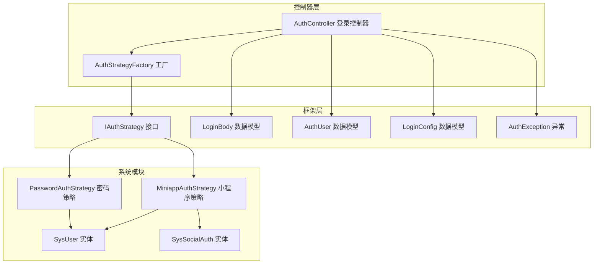
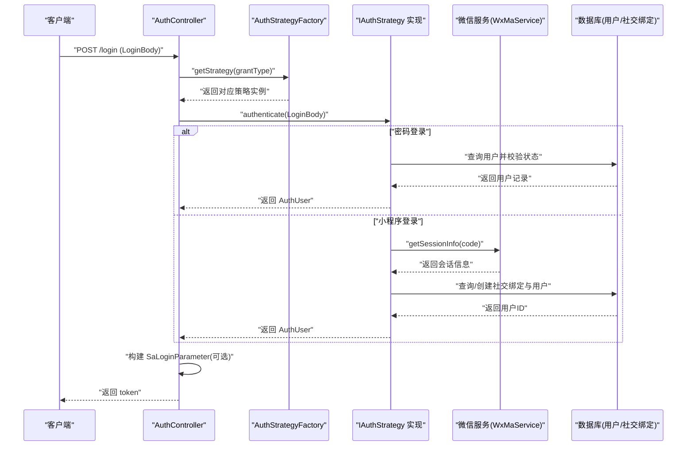
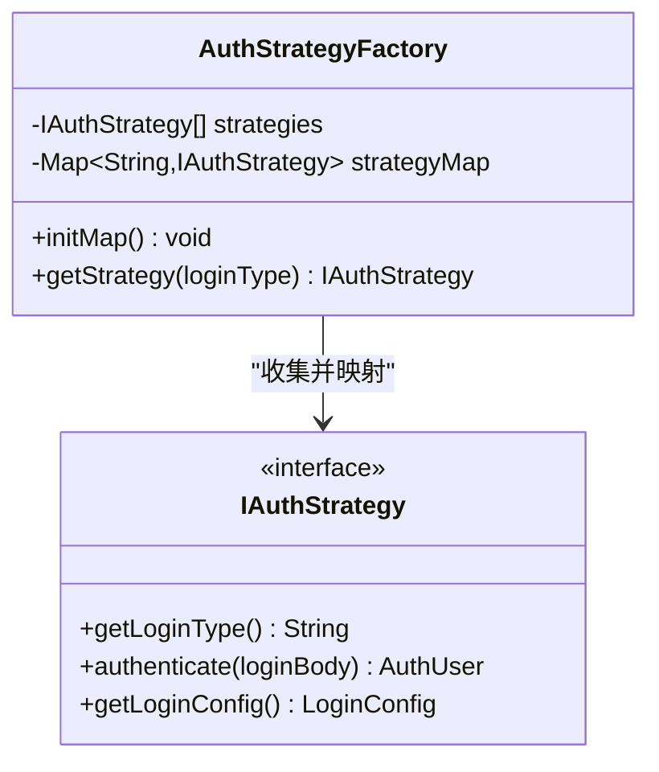
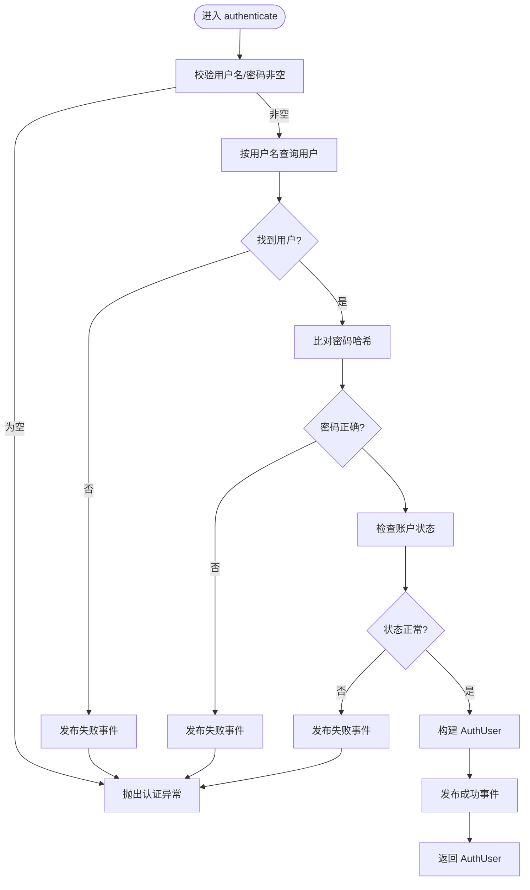
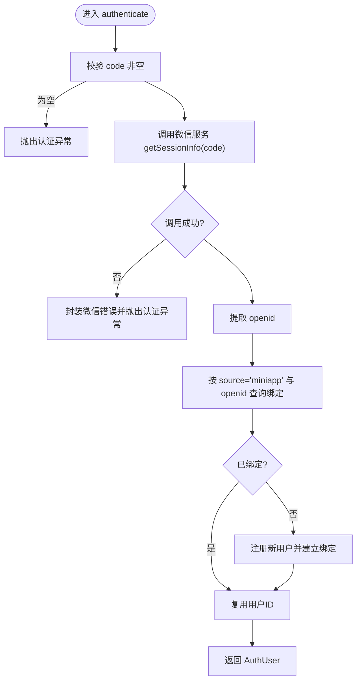
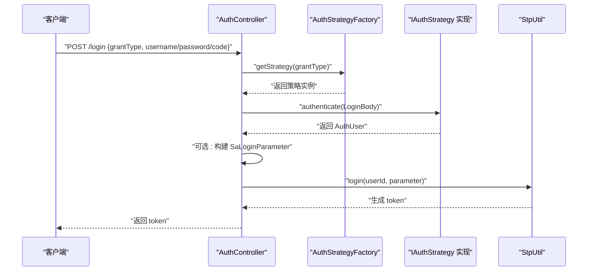
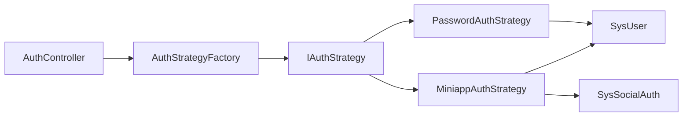
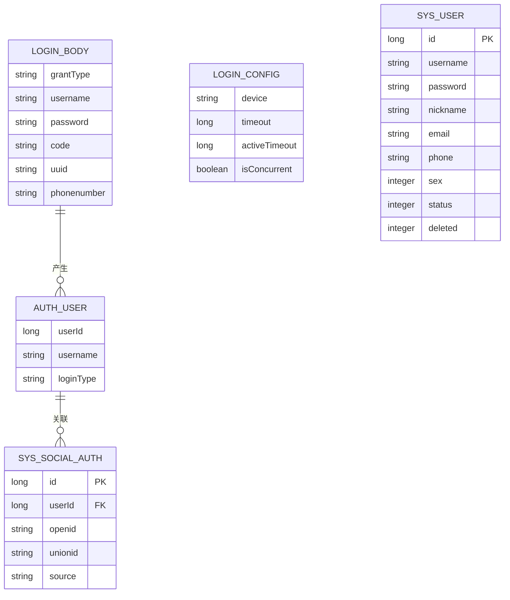

# 策略模式与工厂模式

<cite>
**本文引用的文件**
- [IAuthStrategy.java](file://verulia-framework/verulia-framework-auth/src/main/java/org/yann/verulia/framework/auth/strategy/IAuthStrategy.java)
- [AuthStrategyFactory.java](file://verulia-framework/verulia-framework-auth/src/main/java/org/yann/verulia/framework/auth/strategy/AuthStrategyFactory.java)
- [PasswordAuthStrategy.java](file://verulia-modules/verulia-system/src/main/java/org/yann/verulia/system/service/strategy/PasswordAuthStrategy.java)
- [MiniappAuthStrategy.java](file://verulia-modules/verulia-system/src/main/java/org/yann/verulia/system/service/strategy/MiniappAuthStrategy.java)
- [AuthController.java](file://verulia-admin/src/main/java/org/yann/verulia/controller/AuthController.java)
- [LoginBody.java](file://verulia-framework/verulia-framework-auth/src/main/java/org/yann/verulia/framework/auth/domain/LoginBody.java)
- [AuthUser.java](file://verulia-framework/verulia-framework-auth/src/main/java/org/yann/verulia/framework/auth/domain/AuthUser.java)
- [LoginConfig.java](file://verulia-framework/verulia-framework-auth/src/main/java/org/yann/verulia/framework/auth/domain/LoginConfig.java)
- [SysUser.java](file://verulia-modules/verulia-system/src/main/java/org/yann/verulia/system/domain/entity/SysUser.java)
- [SysSocialAuth.java](file://verulia-modules/verulia-system/src/main/java/org/yann/verulia/system/domain/entity/SysSocialAuth.java)
- [AuthException.java](file://verulia-framework/verulia-framework-auth/src/main/java/org/yann/verulia/framework/auth/exception/AuthException.java)
- [SecurityConfig.java](file://verulia-framework/verulia-framework-security/src/main/java/org/yann/verulia/framework/security/config/SecurityConfig.java)
</cite>

## 目录
1. [引言](#引言)
2. [项目结构](#项目结构)
3. [核心组件](#核心组件)
4. [架构总览](#架构总览)
5. [详细组件分析](#详细组件分析)
6. [依赖分析](#依赖分析)
7. [性能考虑](#性能考虑)
8. [故障排查指南](#故障排查指南)
9. [结论](#结论)
10. [附录](#附录)

## 引言
本文件围绕认证体系中的“策略模式 + 工厂模式”展开，系统化解析以下要点：
- IAuthStrategy 接口如何定义认证算法族的统一契约（包括 getLoginType、authenticate、getLoginConfig）；
- PasswordAuthStrategy 与 MiniappAuthStrategy 如何分别实现密码登录与小程序静默登录的差异化逻辑；
- AuthStrategyFactory 工厂如何通过 @PostConstruct 初始化将所有 IAuthStrategy 实现注册到并发映射中，并通过 getStrategy(grant_type) 动态选择策略；
- AuthController 中调用工厂获取策略并执行认证的运行时绑定流程；
- 新增 OAuth2 等登录方式时的扩展路径与最佳实践；
- 常见问题（如策略未被 Spring 管理导致注入失败）及解决方案；
- 单元测试建议（使用 Mockito 对策略接口进行模拟验证）。

## 项目结构
认证相关代码分布在三个层次：
- 框架层：定义通用的认证接口、数据模型与异常；
- 系统模块：提供具体的认证策略实现；
- 控制器层：对外暴露登录接口，委托工厂选择策略并完成登录。

图表来源
- [AuthController.java](file://verulia-admin/src/main/java/org/yann/verulia/controller/AuthController.java#L1-L67)
- [AuthStrategyFactory.java](file://verulia-framework/verulia-framework-auth/src/main/java/org/yann/verulia/framework/auth/strategy/AuthStrategyFactory.java#L1-L51)
- [IAuthStrategy.java](file://verulia-framework/verulia-framework-auth/src/main/java/org/yann/verulia/framework/auth/strategy/IAuthStrategy.java#L1-L36)
- [PasswordAuthStrategy.java](file://verulia-modules/verulia-system/src/main/java/org/yann/verulia/system/service/strategy/PasswordAuthStrategy.java#L1-L82)
- [MiniappAuthStrategy.java](file://verulia-modules/verulia-system/src/main/java/org/yann/verulia/system/service/strategy/MiniappAuthStrategy.java#L1-L95)
- [LoginBody.java](file://verulia-framework/verulia-framework-auth/src/main/java/org/yann/verulia/framework/auth/domain/LoginBody.java#L1-L59)
- [AuthUser.java](file://verulia-framework/verulia-framework-auth/src/main/java/org/yann/verulia/framework/auth/domain/AuthUser.java#L1-L41)
- [LoginConfig.java](file://verulia-framework/verulia-framework-auth/src/main/java/org/yann/verulia/framework/auth/domain/LoginConfig.java#L1-L34)
- [SysUser.java](file://verulia-modules/verulia-system/src/main/java/org/yann/verulia/system/domain/entity/SysUser.java#L1-L70)
- [SysSocialAuth.java](file://verulia-modules/verulia-system/src/main/java/org/yann/verulia/system/domain/entity/SysSocialAuth.java#L1-L62)
- [AuthException.java](file://verulia-framework/verulia-framework-auth/src/main/java/org/yann/verulia/framework/auth/exception/AuthException.java#L1-L17)

章节来源
- [AuthController.java](file://verulia-admin/src/main/java/org/yann/verulia/controller/AuthController.java#L1-L67)
- [AuthStrategyFactory.java](file://verulia-framework/verulia-framework-auth/src/main/java/org/yann/verulia/framework/auth/strategy/AuthStrategyFactory.java#L1-L51)
- [IAuthStrategy.java](file://verulia-framework/verulia-framework-auth/src/main/java/org/yann/verulia/framework/auth/strategy/IAuthStrategy.java#L1-L36)

## 核心组件
- IAuthStrategy：定义认证算法族的统一契约，包含登录类型标识、认证执行与登录配置获取三部分能力。
- AuthStrategyFactory：负责收集所有 IAuthStrategy 实现，按登录类型建立映射，并提供运行时选择策略的能力。
- PasswordAuthStrategy：实现基于用户名/密码的认证流程，包含参数校验、用户查询、密码比对、状态检查与登录事件发布。
- MiniappAuthStrategy：实现基于微信小程序 code 的静默登录流程，包含 code 校验、微信服务会话查询、第三方绑定与新用户注册。
- AuthController：对外提供 /login 接口，接收 LoginBody，通过工厂选择策略并完成登录与会话缓存。

章节来源
- [IAuthStrategy.java](file://verulia-framework/verulia-framework-auth/src/main/java/org/yann/verulia/framework/auth/strategy/IAuthStrategy.java#L1-L36)
- [AuthStrategyFactory.java](file://verulia-framework/verulia-framework-auth/src/main/java/org/yann/verulia/framework/auth/strategy/AuthStrategyFactory.java#L1-L51)
- [PasswordAuthStrategy.java](file://verulia-modules/verulia-system/src/main/java/org/yann/verulia/system/service/strategy/PasswordAuthStrategy.java#L1-L82)
- [MiniappAuthStrategy.java](file://verulia-modules/verulia-system/src/main/java/org/yann/verulia/system/service/strategy/MiniappAuthStrategy.java#L1-L95)
- [AuthController.java](file://verulia-admin/src/main/java/org/yann/verulia/controller/AuthController.java#L1-L67)

## 架构总览
下图展示了从控制器到工厂再到具体策略的调用链路，以及策略内部的数据流与外部依赖。

图表来源
- [AuthController.java](file://verulia-admin/src/main/java/org/yann/verulia/controller/AuthController.java#L1-L67)
- [AuthStrategyFactory.java](file://verulia-framework/verulia-framework-auth/src/main/java/org/yann/verulia/framework/auth/strategy/AuthStrategyFactory.java#L1-L51)
- [PasswordAuthStrategy.java](file://verulia-modules/verulia-system/src/main/java/org/yann/verulia/system/service/strategy/PasswordAuthStrategy.java#L1-L82)
- [MiniappAuthStrategy.java](file://verulia-modules/verulia-system/src/main/java/org/yann/verulia/system/service/strategy/MiniappAuthStrategy.java#L1-L95)

## 详细组件分析

### IAuthStrategy 接口与契约
- 统一契约
  - getLoginType(): 返回该策略对应的登录类型标识（如 "password"、"miniapp"），用于工厂映射与运行时选择。
  - authenticate(LoginBody): 执行具体认证逻辑，返回认证后的用户信息 AuthUser。
  - getLoginConfig(): 可选，默认返回空，表示使用系统默认登录配置；若实现类返回自定义配置，则可覆盖设备类型、过期时间、是否并发等。
- 设计意义
  - 通过接口抽象，使不同登录方式共享同一调用入口，便于扩展与替换。
  - 将“选择策略”与“执行策略”解耦，提升可维护性与可测试性。

章节来源
- [IAuthStrategy.java](file://verulia-framework/verulia-framework-auth/src/main/java/org/yann/verulia/framework/auth/strategy/IAuthStrategy.java#L1-L36)

### AuthStrategyFactory 工厂
- 初始化机制
  - 使用 @PostConstruct 在容器启动后自动扫描 List<IAuthStrategy> 并以 getLoginType() 为键构建并发映射 strategyMap。
  - 日志输出已加载的策略集合，便于运维观察。
- 运行时选择
  - getStrategy(loginType) 依据传入的 grant_type 查找策略；若不存在则抛出非法参数异常，避免静默失败。
- 复杂度与并发
  - 初始化阶段为 O(n)；运行时查找为 O(1) 平均复杂度；采用 ConcurrentHashMap 提升并发安全性。

图表来源
- [AuthStrategyFactory.java](file://verulia-framework/verulia-framework-auth/src/main/java/org/yann/verulia/framework/auth/strategy/AuthStrategyFactory.java#L1-L51)
- [IAuthStrategy.java](file://verulia-framework/verulia-framework-auth/src/main/java/org/yann/verulia/framework/auth/strategy/IAuthStrategy.java#L1-L36)

章节来源
- [AuthStrategyFactory.java](file://verulia-framework/verulia-framework-auth/src/main/java/org/yann/verulia/framework/auth/strategy/AuthStrategyFactory.java#L1-L51)

### PasswordAuthStrategy（密码登录）
- 关键流程
  - 参数校验：用户名/密码非空校验。
  - 用户查询：根据用户名查询用户记录。
  - 密码校验：对明文密码进行哈希后与存储值比对。
  - 状态校验：禁止停用账户登录。
  - 事件发布：登录成功/失败事件用于审计与日志。
  - 返回 AuthUser：包含用户ID、用户名与登录类型。
- 登录配置
  - 默认返回 LoginConfig，设置设备类型、超时时间与是否允许并发登录。

图表来源
- [PasswordAuthStrategy.java](file://verulia-modules/verulia-system/src/main/java/org/yann/verulia/system/service/strategy/PasswordAuthStrategy.java#L1-L82)
- [SysUser.java](file://verulia-modules/verulia-system/src/main/java/org/yann/verulia/system/domain/entity/SysUser.java#L1-L70)
- [AuthException.java](file://verulia-framework/verulia-framework-auth/src/main/java/org/yann/verulia/framework/auth/exception/AuthException.java#L1-L17)

章节来源
- [PasswordAuthStrategy.java](file://verulia-modules/verulia-system/src/main/java/org/yann/verulia/system/service/strategy/PasswordAuthStrategy.java#L1-L82)
- [SysUser.java](file://verulia-modules/verulia-system/src/main/java/org/yann/verulia/system/domain/entity/SysUser.java#L1-L70)

### MiniappAuthStrategy（小程序登录）
- 关键流程
  - 参数校验：code 非空校验。
  - 微信会话：调用微信服务获取会话信息，提取 openid。
  - 社交绑定：若存在 openid 对应的社交绑定，则复用用户；否则注册新用户并建立绑定。
  - 返回 AuthUser：当前实现返回用户ID（后续可完善为完整 AuthUser）。
- 外部依赖
  - WxMaService：微信小程序服务接口。
  - SysUserMapper、SysSocialAuthMapper：用户与社交绑定的持久化操作。

图表来源
- [MiniappAuthStrategy.java](file://verulia-modules/verulia-system/src/main/java/org/yann/verulia/system/service/strategy/MiniappAuthStrategy.java#L1-L95)
- [SysSocialAuth.java](file://verulia-modules/verulia-system/src/main/java/org/yann/verulia/system/domain/entity/SysSocialAuth.java#L1-L62)

章节来源
- [MiniappAuthStrategy.java](file://verulia-modules/verulia-system/src/main/java/org/yann/verulia/system/service/strategy/MiniappAuthStrategy.java#L1-L95)
- [SysSocialAuth.java](file://verulia-modules/verulia-system/src/main/java/org/yann/verulia/system/domain/entity/SysSocialAuth.java#L1-L62)

### AuthController 中的运行时绑定
- 入口方法
  - 接收 LoginBody，其中包含 grantType（默认 "password"）。
- 策略选择与执行
  - 通过 authStrategyFactory.getStrategy(loginBody.getGrantType()) 获取具体策略。
  - 调用 strategy.authenticate(loginBody) 完成认证。
  - 若策略提供 LoginConfig，则构造 SaLoginParameter 并调用 StpUtil.login(...) 完成会话建立。
- 结果返回
  - 返回令牌字符串，同时将用户对象缓存至会话。

图表来源
- [AuthController.java](file://verulia-admin/src/main/java/org/yann/verulia/controller/AuthController.java#L1-L67)
- [AuthStrategyFactory.java](file://verulia-framework/verulia-framework-auth/src/main/java/org/yann/verulia/framework/auth/strategy/AuthStrategyFactory.java#L1-L51)
- [IAuthStrategy.java](file://verulia-framework/verulia-framework-auth/src/main/java/org/yann/verulia/framework/auth/strategy/IAuthStrategy.java#L1-L36)

章节来源
- [AuthController.java](file://verulia-admin/src/main/java/org/yann/verulia/controller/AuthController.java#L1-L67)

## 依赖分析
- 组件耦合
  - AuthController 仅依赖 AuthStrategyFactory 与 IAuthStrategy 抽象，不直接依赖具体实现，满足开闭原则。
  - 工厂通过构造注入收集所有 IAuthStrategy 实现，形成松耦合的策略注册机制。
- 外部依赖
  - PasswordAuthStrategy 依赖用户表实体与持久化访问器，以及事件发布器。
  - MiniappAuthStrategy 依赖微信服务与社交绑定表，且涉及事务控制。
- 潜在循环依赖
  - 当前结构无循环依赖迹象；若新增跨模块依赖，需关注装配顺序与作用域。

图表来源
- [AuthController.java](file://verulia-admin/src/main/java/org/yann/verulia/controller/AuthController.java#L1-L67)
- [AuthStrategyFactory.java](file://verulia-framework/verulia-framework-auth/src/main/java/org/yann/verulia/framework/auth/strategy/AuthStrategyFactory.java#L1-L51)
- [IAuthStrategy.java](file://verulia-framework/verulia-framework-auth/src/main/java/org/yann/verulia/framework/auth/strategy/IAuthStrategy.java#L1-L36)
- [PasswordAuthStrategy.java](file://verulia-modules/verulia-system/src/main/java/org/yann/verulia/system/service/strategy/PasswordAuthStrategy.java#L1-L82)
- [MiniappAuthStrategy.java](file://verulia-modules/verulia-system/src/main/java/org/yann/verulia/system/service/strategy/MiniappAuthStrategy.java#L1-L95)
- [SysUser.java](file://verulia-modules/verulia-system/src/main/java/org/yann/verulia/system/domain/entity/SysUser.java#L1-L70)
- [SysSocialAuth.java](file://verulia-modules/verulia-system/src/main/java/org/yann/verulia/system/domain/entity/SysSocialAuth.java#L1-L62)

章节来源
- [AuthController.java](file://verulia-admin/src/main/java/org/yann/verulia/controller/AuthController.java#L1-L67)
- [AuthStrategyFactory.java](file://verulia-framework/verulia-framework-auth/src/main/java/org/yann/verulia/framework/auth/strategy/AuthStrategyFactory.java#L1-L51)

## 性能考虑
- 工厂初始化
  - 一次性扫描与映射，初始化成本与策略数量线性相关；运行时查找为常数时间，适合高频登录场景。
- 并发安全
  - 使用 ConcurrentHashMap 存储映射，避免多线程竞争；@PostConstruct 确保初始化顺序可控。
- 策略内部
  - 密码登录涉及数据库查询与哈希比对；小程序登录涉及外部 HTTP 调用与数据库写入；建议对数据库与外部服务增加必要的缓存与重试策略。
- 会话与配置
  - LoginConfig 支持按登录方式定制会话参数，避免全局配置带来的性能与安全风险。

[本节为通用指导，不直接分析具体文件]

## 故障排查指南
- 现象：策略未被 Spring 管理导致注入失败
  - 原因：未添加 @Component 注解或未纳入组件扫描范围。
  - 解决：确保实现类标注 @Component，并保证包扫描路径包含其实现类所在包。
- 现象：调用 getStrategy 时抛出非法参数异常
  - 原因：grant_type 与策略映射键不一致或未注册。
  - 解决：确认 LoginBody.grantType 与策略 getLoginType() 返回值一致；检查工厂初始化日志是否包含该策略。
- 现象：小程序登录失败
  - 原因：微信服务调用异常或未获取到 openid。
  - 解决：检查微信服务配置与网络连通性；确认 code 有效且未过期。
- 现象：密码登录失败
  - 原因：用户名不存在、密码错误或账户停用。
  - 解决：核对用户名与密码；检查用户状态；关注登录事件日志。

章节来源
- [AuthStrategyFactory.java](file://verulia-framework/verulia-framework-auth/src/main/java/org/yann/verulia/framework/auth/strategy/AuthStrategyFactory.java#L1-L51)
- [MiniappAuthStrategy.java](file://verulia-modules/verulia-system/src/main/java/org/yann/verulia/system/service/strategy/MiniappAuthStrategy.java#L1-L95)
- [PasswordAuthStrategy.java](file://verulia-modules/verulia-system/src/main/java/org/yann/verulia/system/service/strategy/PasswordAuthStrategy.java#L1-L82)

## 结论
通过“策略模式 + 工厂模式”的组合，认证体系实现了：
- 统一的认证契约与灵活的策略选择；
- 高可扩展性：新增 OAuth2 等登录方式仅需新增实现类并保持 getLoginType() 与 authenticate() 的一致性；
- 良好的可维护性：控制器与策略解耦，工厂集中管理策略注册；
- 可观测性：登录事件与异常信息有助于定位问题。

[本节为总结性内容，不直接分析具体文件]

## 附录

### 新增 OAuth2 登录方式的扩展步骤
- 实现 IAuthStrategy
  - 实现 getLoginType() 返回 OAuth2 的登录类型标识（如 "oauth2"）。
  - 实现 authenticate(LoginBody) 完成 OAuth2 授权码/令牌交换与用户识别。
  - 可选实现 getLoginConfig() 返回 OAuth2 特有的登录配置。
- 确保被 Spring 管理
  - 添加 @Component 注解，确保组件扫描可发现该实现。
- 运行验证
  - 在 LoginBody 中使用新的 grant_type 触发工厂选择对应策略。
  - 关注工厂初始化日志，确认策略已注册。

章节来源
- [IAuthStrategy.java](file://verulia-framework/verulia-framework-auth/src/main/java/org/yann/verulia/framework/auth/strategy/IAuthStrategy.java#L1-L36)
- [AuthStrategyFactory.java](file://verulia-framework/verulia-framework-auth/src/main/java/org/yann/verulia/framework/auth/strategy/AuthStrategyFactory.java#L1-L51)

### 单元测试建议（Mockito）
- 对 AuthController 的测试
  - 使用 @MockBean 注入 AuthStrategyFactory；
  - 使用 when(factory.getStrategy(...)).thenReturn(mockStrategy) 模拟策略选择；
  - 使用 when(strategy.authenticate(...)).thenReturn(mockAuthUser) 模拟认证结果；
  - 断言控制器返回值与会话缓存行为。
- 对策略实现的测试
  - 使用 @Mock 注入依赖（如 Mapper、WxMaService、事件发布器）；
  - 针对边界条件（空参数、用户不存在、密码错误、微信调用异常）编写用例；
  - 验证 LoginConfig 的返回值与登录事件发布。
- 对工厂的测试
  - 验证 @PostConstruct 初始化后映射键值正确；
  - 验证 getStrategy 未匹配时抛出异常。

章节来源
- [AuthController.java](file://verulia-admin/src/main/java/org/yann/verulia/controller/AuthController.java#L1-L67)
- [AuthStrategyFactory.java](file://verulia-framework/verulia-framework-auth/src/main/java/org/yann/verulia/framework/auth/strategy/AuthStrategyFactory.java#L1-L51)
- [PasswordAuthStrategy.java](file://verulia-modules/verulia-system/src/main/java/org/yann/verulia/system/service/strategy/PasswordAuthStrategy.java#L1-L82)
- [MiniappAuthStrategy.java](file://verulia-modules/verulia-system/src/main/java/org/yann/verulia/system/service/strategy/MiniappAuthStrategy.java#L1-L95)

### 数据模型概览

图表来源
- [LoginBody.java](file://verulia-framework/verulia-framework-auth/src/main/java/org/yann/verulia/framework/auth/domain/LoginBody.java#L1-L59)
- [AuthUser.java](file://verulia-framework/verulia-framework-auth/src/main/java/org/yann/verulia/framework/auth/domain/AuthUser.java#L1-L41)
- [LoginConfig.java](file://verulia-framework/verulia-framework-auth/src/main/java/org/yann/verulia/framework/auth/domain/LoginConfig.java#L1-L34)
- [SysUser.java](file://verulia-modules/verulia-system/src/main/java/org/yann/verulia/system/domain/entity/SysUser.java#L1-L70)
- [SysSocialAuth.java](file://verulia-modules/verulia-system/src/main/java/org/yann/verulia/system/domain/entity/SysSocialAuth.java#L1-L62)