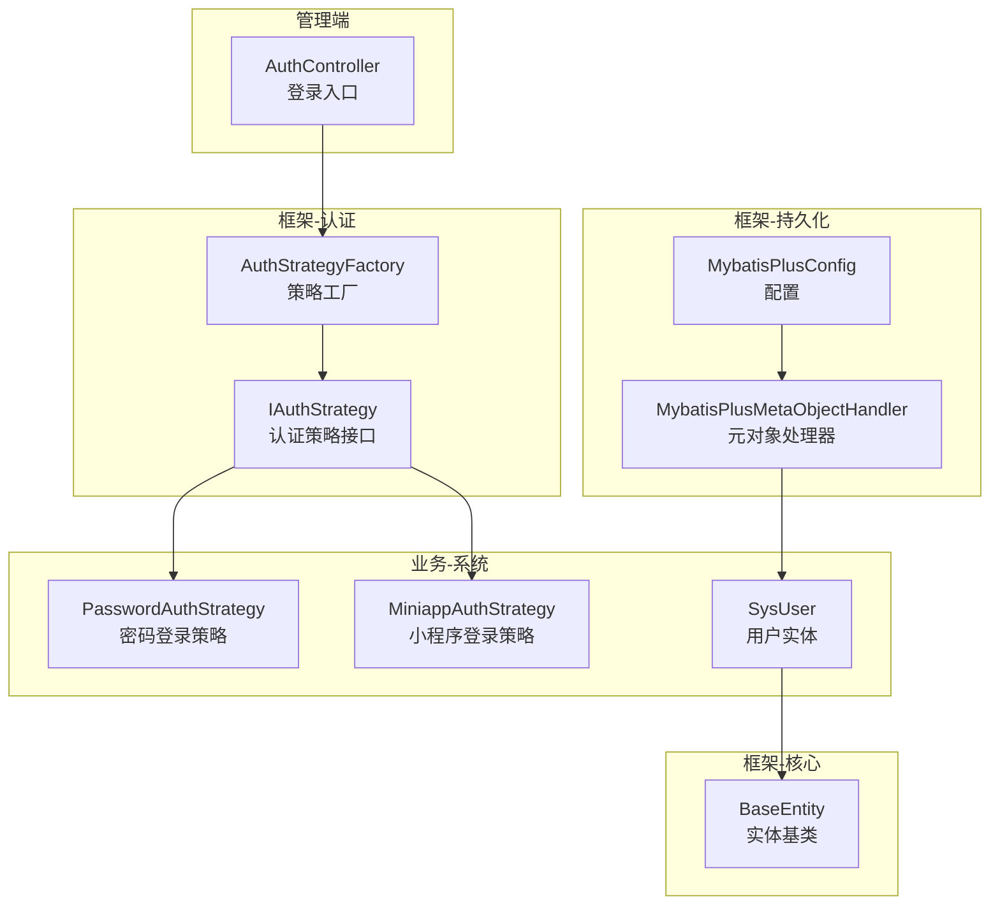
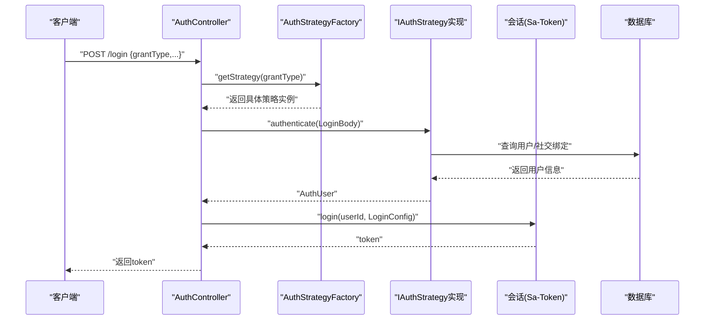
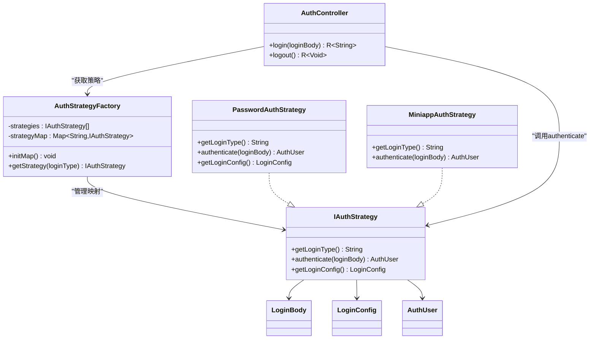
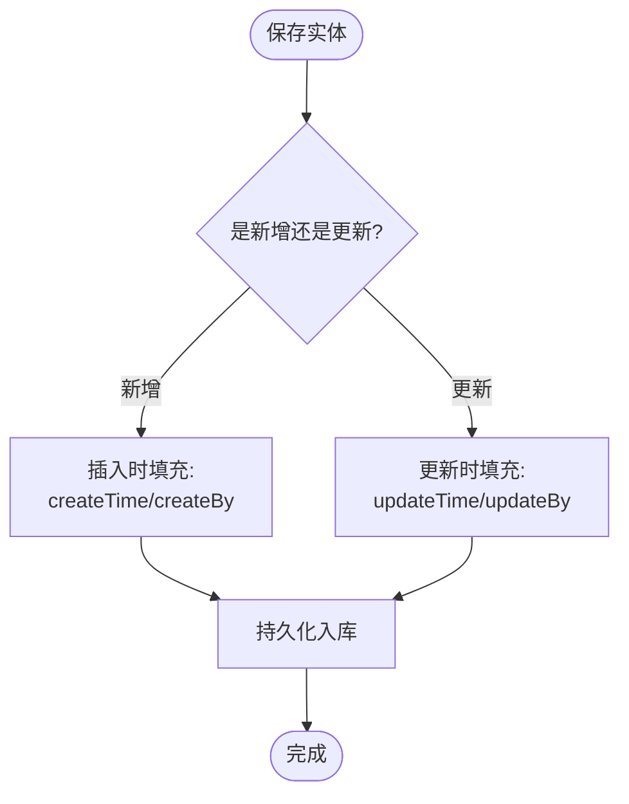
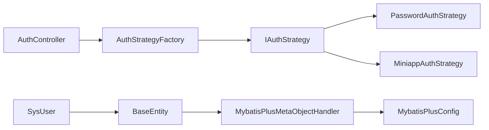

# 设计模式应用

<cite>
**本文引用的文件**
- [AuthController.java](file://verulia-admin/src/main/java/org/yann/verulia/controller/AuthController.java)
- [IAuthStrategy.java](file://verulia-framework/verulia-framework-auth/src/main/java/org/yann/verulia/framework/auth/strategy/IAuthStrategy.java)
- [AuthStrategyFactory.java](file://verulia-framework/verulia-framework-auth/src/main/java/org/yann/verulia/framework/auth/strategy/AuthStrategyFactory.java)
- [PasswordAuthStrategy.java](file://verulia-modules/verulia-system/src/main/java/org/yann/verulia/system/service/strategy/PasswordAuthStrategy.java)
- [MiniappAuthStrategy.java](file://verulia-modules/verulia-system/src/main/java/org/yann/verulia/system/service/strategy/MiniappAuthStrategy.java)
- [BaseEntity.java](file://verulia-framework/verulia-framework-core/src/main/java/org/yann/verulia/framework/core/domain/BaseEntity.java)
- [MybatisPlusMetaObjectHandler.java](file://verulia-framework/verulia-framework-mybatis/src/main/java/org/yann/verulia/framework/mybatis/handler/MybatisPlusMetaObjectHandler.java)
- [MybatisPlusConfig.java](file://verulia-framework/verulia-framework-mybatis/src/main/java/org/yann/verulia/framework/mybatis/config/MybatisPlusConfig.java)
- [SysUser.java](file://verulia-modules/verulia-system/src/main/java/org/yann/verulia/system/domain/entity/SysUser.java)
- [LoginBody.java](file://verulia-framework/verulia-framework-auth/src/main/java/org/yann/verulia/framework/auth/domain/LoginBody.java)
- [LoginConfig.java](file://verulia-framework/verulia-framework-auth/src/main/java/org/yann/verulia/framework/auth/domain/LoginConfig.java)
- [AuthUser.java](file://verulia-framework/verulia-framework-auth/src/main/java/org/yann/verulia/framework/auth/domain/AuthUser.java)
</cite>

## 目录
1. [引言](#引言)
2. [项目结构](#项目结构)
3. [核心组件](#核心组件)
4. [架构总览](#架构总览)
5. [详细组件分析](#详细组件分析)
6. [依赖关系分析](#依赖关系分析)
7. [性能考量](#性能考量)
8. [故障排查指南](#故障排查指南)
9. [结论](#结论)
10. [附录](#附录)

## 引言
本文件系统性梳理Verulia项目中应用的设计模式，重点围绕以下两个方面：
- 策略模式在认证体系中的实现：通过IAuthStrategy定义算法族，PasswordAuthStrategy等具体策略提供不同的登录方式；AuthStrategyFactory负责根据登录类型选择并执行相应策略，从而实现对策略创建与使用的解耦，便于未来扩展OAuth2、LDAP等新认证方式。
- 模板方法模式在BaseEntity中的应用：通过抽象类定义公共的创建/更新时间字段及自动填充逻辑，由MybatisPlusMetaObjectHandler统一处理，确保所有实体在插入/更新时自动填充一致的时间戳与操作人信息。

通过对关键文件的逐层解析与图示化展示，帮助开发者理解这些模式如何提升系统的灵活性、可维护性与可测试性，并提供可复用的重构指导。

## 项目结构
Verulia采用多模块分层组织，认证策略位于框架层，具体实现位于业务模块，持久化与元对象填充位于框架层，控制器位于管理端模块。整体结构清晰，职责边界明确，便于扩展与维护。

图表来源
- [AuthController.java](file://verulia-admin/src/main/java/org/yann/verulia/controller/AuthController.java#L1-L67)
- [IAuthStrategy.java](file://verulia-framework/verulia-framework-auth/src/main/java/org/yann/verulia/framework/auth/strategy/IAuthStrategy.java#L1-L36)
- [AuthStrategyFactory.java](file://verulia-framework/verulia-framework-auth/src/main/java/org/yann/verulia/framework/auth/strategy/AuthStrategyFactory.java#L1-L51)
- [PasswordAuthStrategy.java](file://verulia-modules/verulia-system/src/main/java/org/yann/verulia/system/service/strategy/PasswordAuthStrategy.java#L1-L82)
- [MiniappAuthStrategy.java](file://verulia-modules/verulia-system/src/main/java/org/yann/verulia/system/service/strategy/MiniappAuthStrategy.java#L1-L95)
- [BaseEntity.java](file://verulia-framework/verulia-framework-core/src/main/java/org/yann/verulia/framework/core/domain/BaseEntity.java#L1-L44)
- [MybatisPlusMetaObjectHandler.java](file://verulia-framework/verulia-framework-mybatis/src/main/java/org/yann/verulia/framework/mybatis/handler/MybatisPlusMetaObjectHandler.java#L1-L32)
- [MybatisPlusConfig.java](file://verulia-framework/verulia-framework-mybatis/src/main/java/org/yann/verulia/framework/mybatis/config/MybatisPlusConfig.java#L1-L31)
- [SysUser.java](file://verulia-modules/verulia-system/src/main/java/org/yann/verulia/system/domain/entity/SysUser.java#L1-L70)

章节来源
- [AuthController.java](file://verulia-admin/src/main/java/org/yann/verulia/controller/AuthController.java#L1-L67)
- [IAuthStrategy.java](file://verulia-framework/verulia-framework-auth/src/main/java/org/yann/verulia/framework/auth/strategy/IAuthStrategy.java#L1-L36)
- [AuthStrategyFactory.java](file://verulia-framework/verulia-framework-auth/src/main/java/org/yann/verulia/framework/auth/strategy/AuthStrategyFactory.java#L1-L51)
- [PasswordAuthStrategy.java](file://verulia-modules/verulia-system/src/main/java/org/yann/verulia/system/service/strategy/PasswordAuthStrategy.java#L1-L82)
- [MiniappAuthStrategy.java](file://verulia-modules/verulia-system/src/main/java/org/yann/verulia/system/service/strategy/MiniappAuthStrategy.java#L1-L95)
- [BaseEntity.java](file://verulia-framework/verulia-framework-core/src/main/java/org/yann/verulia/framework/core/domain/BaseEntity.java#L1-L44)
- [MybatisPlusMetaObjectHandler.java](file://verulia-framework/verulia-framework-mybatis/src/main/java/org/yann/verulia/framework/mybatis/handler/MybatisPlusMetaObjectHandler.java#L1-L32)
- [MybatisPlusConfig.java](file://verulia-framework/verulia-framework-mybatis/src/main/java/org/yann/verulia/framework/mybatis/config/MybatisPlusConfig.java#L1-L31)
- [SysUser.java](file://verulia-modules/verulia-system/src/main/java/org/yann/verulia/system/domain/entity/SysUser.java#L1-L70)

## 核心组件
- 认证策略接口IAuthStrategy：定义登录类型、认证执行与登录配置获取的统一规范。
- 策略工厂AuthStrategyFactory：基于Spring容器收集的策略列表，按登录类型构建映射，提供安全的策略获取能力。
- 具体策略PasswordAuthStrategy与MiniappAuthStrategy：分别实现密码登录与小程序静默登录的业务逻辑。
- 控制器AuthController：接收登录请求，委派给策略工厂与具体策略，完成认证与会话登录。
- 实体基类BaseEntity与MybatisPlusMetaObjectHandler：统一注入创建/更新时间与操作人信息，体现模板方法模式的“钩子”机制。

章节来源
- [IAuthStrategy.java](file://verulia-framework/verulia-framework-auth/src/main/java/org/yann/verulia/framework/auth/strategy/IAuthStrategy.java#L1-L36)
- [AuthStrategyFactory.java](file://verulia-framework/verulia-framework-auth/src/main/java/org/yann/verulia/framework/auth/strategy/AuthStrategyFactory.java#L1-L51)
- [PasswordAuthStrategy.java](file://verulia-modules/verulia-system/src/main/java/org/yann/verulia/system/service/strategy/PasswordAuthStrategy.java#L1-L82)
- [MiniappAuthStrategy.java](file://verulia-modules/verulia-system/src/main/java/org/yann/verulia/system/service/strategy/MiniappAuthStrategy.java#L1-L95)
- [AuthController.java](file://verulia-admin/src/main/java/org/yann/verulia/controller/AuthController.java#L1-L67)
- [BaseEntity.java](file://verulia-framework/verulia-framework-core/src/main/java/org/yann/verulia/framework/core/domain/BaseEntity.java#L1-L44)
- [MybatisPlusMetaObjectHandler.java](file://verulia-framework/verulia-framework-mybatis/src/main/java/org/yann/verulia/framework/mybatis/handler/MybatisPlusMetaObjectHandler.java#L1-L32)

## 架构总览
下图展示了认证流程从HTTP入口到策略执行与会话登录的整体交互，以及实体元数据自动填充的横切关注点。

图表来源
- [AuthController.java](file://verulia-admin/src/main/java/org/yann/verulia/controller/AuthController.java#L1-L67)
- [AuthStrategyFactory.java](file://verulia-framework/verulia-framework-auth/src/main/java/org/yann/verulia/framework/auth/strategy/AuthStrategyFactory.java#L1-L51)
- [IAuthStrategy.java](file://verulia-framework/verulia-framework-auth/src/main/java/org/yann/verulia/framework/auth/strategy/IAuthStrategy.java#L1-L36)
- [PasswordAuthStrategy.java](file://verulia-modules/verulia-system/src/main/java/org/yann/verulia/system/service/strategy/PasswordAuthStrategy.java#L1-L82)
- [MiniappAuthStrategy.java](file://verulia-modules/verulia-system/src/main/java/org/yann/verulia/system/service/strategy/MiniappAuthStrategy.java#L1-L95)

## 详细组件分析

### 策略模式：认证体系
- 接口IAuthStrategy定义了登录类型、认证执行与登录配置的约定，形成稳定的算法族。
- AuthStrategyFactory通过构造期扫描容器中的策略实现，建立登录类型到策略实例的映射，提供线程安全的策略获取。
- PasswordAuthStrategy与MiniappAuthStrategy分别实现密码登录与小程序登录的具体逻辑，包括参数校验、外部服务调用、用户状态检查、事件发布与结果封装。
- AuthController作为门面，仅依赖IAuthStrategy与AuthStrategyFactory，不关心具体策略实现细节，从而实现解耦与可扩展。

图表来源
- [IAuthStrategy.java](file://verulia-framework/verulia-framework-auth/src/main/java/org/yann/verulia/framework/auth/strategy/IAuthStrategy.java#L1-L36)
- [AuthStrategyFactory.java](file://verulia-framework/verulia-framework-auth/src/main/java/org/yann/verulia/framework/auth/strategy/AuthStrategyFactory.java#L1-L51)
- [PasswordAuthStrategy.java](file://verulia-modules/verulia-system/src/main/java/org/yann/verulia/system/service/strategy/PasswordAuthStrategy.java#L1-L82)
- [MiniappAuthStrategy.java](file://verulia-modules/verulia-system/src/main/java/org/yann/verulia/system/service/strategy/MiniappAuthStrategy.java#L1-L95)
- [AuthController.java](file://verulia-admin/src/main/java/org/yann/verulia/controller/AuthController.java#L1-L67)
- [LoginBody.java](file://verulia-framework/verulia-framework-auth/src/main/java/org/yann/verulia/framework/auth/domain/LoginBody.java#L1-L59)
- [LoginConfig.java](file://verulia-framework/verulia-framework-auth/src/main/java/org/yann/verulia/framework/auth/domain/LoginConfig.java#L1-L34)
- [AuthUser.java](file://verulia-framework/verulia-framework-auth/src/main/java/org/yann/verulia/framework/auth/domain/AuthUser.java#L1-L41)

章节来源
- [IAuthStrategy.java](file://verulia-framework/verulia-framework-auth/src/main/java/org/yann/verulia/framework/auth/strategy/IAuthStrategy.java#L1-L36)
- [AuthStrategyFactory.java](file://verulia-framework/verulia-framework-auth/src/main/java/org/yann/verulia/framework/auth/strategy/AuthStrategyFactory.java#L1-L51)
- [PasswordAuthStrategy.java](file://verulia-modules/verulia-system/src/main/java/org/yann/verulia/system/service/strategy/PasswordAuthStrategy.java#L1-L82)
- [MiniappAuthStrategy.java](file://verulia-modules/verulia-system/src/main/java/org/yann/verulia/system/service/strategy/MiniappAuthStrategy.java#L1-L95)
- [AuthController.java](file://verulia-admin/src/main/java/org/yann/verulia/controller/AuthController.java#L1-L67)

### 模板方法模式：实体元数据自动填充
- BaseEntity以注解形式声明字段的自动填充策略，定义了创建/更新时间与创建/更新人的标准字段。
- MybatisPlusMetaObjectHandler实现MetaObjectHandler接口，在插入与更新时统一填充对应字段，形成“模板方法”的钩子机制。
- MybatisPlusConfig将处理器注册为Spring Bean，确保全局生效。

图表来源
- [BaseEntity.java](file://verulia-framework/verulia-framework-core/src/main/java/org/yann/verulia/framework/core/domain/BaseEntity.java#L1-L44)
- [MybatisPlusMetaObjectHandler.java](file://verulia-framework/verulia-framework-mybatis/src/main/java/org/yann/verulia/framework/mybatis/handler/MybatisPlusMetaObjectHandler.java#L1-L32)
- [MybatisPlusConfig.java](file://verulia-framework/verulia-framework-mybatis/src/main/java/org/yann/verulia/framework/mybatis/config/MybatisPlusConfig.java#L1-L31)
- [SysUser.java](file://verulia-modules/verulia-system/src/main/java/org/yann/verulia/system/domain/entity/SysUser.java#L1-L70)

章节来源
- [BaseEntity.java](file://verulia-framework/verulia-framework-core/src/main/java/org/yann/verulia/framework/core/domain/BaseEntity.java#L1-L44)
- [MybatisPlusMetaObjectHandler.java](file://verulia-framework/verulia-framework-mybatis/src/main/java/org/yann/verulia/framework/mybatis/handler/MybatisPlusMetaObjectHandler.java#L1-L32)
- [MybatisPlusConfig.java](file://verulia-framework/verulia-framework-mybatis/src/main/java/org/yann/verulia/framework/mybatis/config/MybatisPlusConfig.java#L1-L31)
- [SysUser.java](file://verulia-modules/verulia-system/src/main/java/org/yann/verulia/system/domain/entity/SysUser.java#L1-L70)

## 依赖关系分析
- 控制器AuthController依赖AuthStrategyFactory与IAuthStrategy，但不直接依赖具体策略实现，符合开闭原则。
- AuthStrategyFactory依赖List<IAuthStrategy>，通过Spring容器自动装配，避免硬编码。
- 具体策略PasswordAuthStrategy与MiniappAuthStrategy依赖各自的数据访问层与外部服务，保持业务内聚。
- 实体SysUser继承BaseEntity，自动获得元数据字段；MybatisPlusMetaObjectHandler统一处理插入/更新填充。

图表来源
- [AuthController.java](file://verulia-admin/src/main/java/org/yann/verulia/controller/AuthController.java#L1-L67)
- [AuthStrategyFactory.java](file://verulia-framework/verulia-framework-auth/src/main/java/org/yann/verulia/framework/auth/strategy/AuthStrategyFactory.java#L1-L51)
- [IAuthStrategy.java](file://verulia-framework/verulia-framework-auth/src/main/java/org/yann/verulia/framework/auth/strategy/IAuthStrategy.java#L1-L36)
- [PasswordAuthStrategy.java](file://verulia-modules/verulia-system/src/main/java/org/yann/verulia/system/service/strategy/PasswordAuthStrategy.java#L1-L82)
- [MiniappAuthStrategy.java](file://verulia-modules/verulia-system/src/main/java/org/yann/verulia/system/service/strategy/MiniappAuthStrategy.java#L1-L95)
- [BaseEntity.java](file://verulia-framework/verulia-framework-core/src/main/java/org/yann/verulia/framework/core/domain/BaseEntity.java#L1-L44)
- [MybatisPlusMetaObjectHandler.java](file://verulia-framework/verulia-framework-mybatis/src/main/java/org/yann/verulia/framework/mybatis/handler/MybatisPlusMetaObjectHandler.java#L1-L32)
- [MybatisPlusConfig.java](file://verulia-framework/verulia-framework-mybatis/src/main/java/org/yann/verulia/framework/mybatis/config/MybatisPlusConfig.java#L1-L31)
- [SysUser.java](file://verulia-modules/verulia-system/src/main/java/org/yann/verulia/system/domain/entity/SysUser.java#L1-L70)

章节来源
- [AuthController.java](file://verulia-admin/src/main/java/org/yann/verulia/controller/AuthController.java#L1-L67)
- [AuthStrategyFactory.java](file://verulia-framework/verulia-framework-auth/src/main/java/org/yann/verulia/framework/auth/strategy/AuthStrategyFactory.java#L1-L51)
- [SysUser.java](file://verulia-modules/verulia-system/src/main/java/org/yann/verulia/system/domain/entity/SysUser.java#L1-L70)

## 性能考量
- 策略工厂初始化阶段一次性构建映射，后续按登录类型O(1)查找，避免重复扫描与实例化。
- 具体策略内部的数据库查询建议结合索引与分页，减少全表扫描。
- 元对象处理器在插入/更新时进行字段填充，属于轻量级操作，对性能影响可忽略。
- 登录配置中的超时与并发控制由会话框架统一管理，避免在业务层重复计算。

## 故障排查指南
- 登录类型不匹配：当传入的grantType未被任何策略实现覆盖时，策略工厂会抛出异常。请确认LoginBody的grantType与各策略的getLoginType返回值一致。
- 密码登录失败：检查用户名是否存在、密码是否正确、账户状态是否启用；同时关注登录日志事件的记录。
- 小程序登录失败：检查微信服务调用是否成功、OpenID是否获取到、社交绑定是否正确创建。
- 时间字段缺失：确认实体是否继承BaseEntity且MybatisPlusMetaObjectHandler已注册生效。

章节来源
- [AuthStrategyFactory.java](file://verulia-framework/verulia-framework-auth/src/main/java/org/yann/verulia/framework/auth/strategy/AuthStrategyFactory.java#L1-L51)
- [PasswordAuthStrategy.java](file://verulia-modules/verulia-system/src/main/java/org/yann/verulia/system/service/strategy/PasswordAuthStrategy.java#L1-L82)
- [MiniappAuthStrategy.java](file://verulia-modules/verulia-system/src/main/java/org/yann/verulia/system/service/strategy/MiniappAuthStrategy.java#L1-L95)
- [MybatisPlusMetaObjectHandler.java](file://verulia-framework/verulia-framework-mybatis/src/main/java/org/yann/verulia/framework/mybatis/handler/MybatisPlusMetaObjectHandler.java#L1-L32)

## 结论
Verulia通过策略模式实现了认证体系的高内聚与可扩展性，借助工厂模式解耦了策略的创建与使用；通过模板方法模式在BaseEntity与MybatisPlusMetaObjectHandler之间建立了统一的元数据填充机制。这些设计模式共同提升了系统的灵活性、可维护性与可测试性，为后续扩展OAuth2、LDAP等认证方式提供了清晰的演进路径。

## 附录
- 代码级参考路径（用于定位实现）
  - 策略接口与工厂：[IAuthStrategy.java](file://verulia-framework/verulia-framework-auth/src/main/java/org/yann/verulia/framework/auth/strategy/IAuthStrategy.java#L1-L36)、[AuthStrategyFactory.java](file://verulia-framework/verulia-framework-auth/src/main/java/org/yann/verulia/framework/auth/strategy/AuthStrategyFactory.java#L1-L51)
  - 具体策略实现：[PasswordAuthStrategy.java](file://verulia-modules/verulia-system/src/main/java/org/yann/verulia/system/service/strategy/PasswordAuthStrategy.java#L1-L82)、[MiniappAuthStrategy.java](file://verulia-modules/verulia-system/src/main/java/org/yann/verulia/system/service/strategy/MiniappAuthStrategy.java#L1-L95)
  - 控制器入口：[AuthController.java](file://verulia-admin/src/main/java/org/yann/verulia/controller/AuthController.java#L1-L67)
  - 实体与元对象填充：[BaseEntity.java](file://verulia-framework/verulia-framework-core/src/main/java/org/yann/verulia/framework/core/domain/BaseEntity.java#L1-L44)、[MybatisPlusMetaObjectHandler.java](file://verulia-framework/verulia-framework-mybatis/src/main/java/org/yann/verulia/framework/mybatis/handler/MybatisPlusMetaObjectHandler.java#L1-L32)、[MybatisPlusConfig.java](file://verulia-framework/verulia-framework-mybatis/src/main/java/org/yann/verulia/framework/mybatis/config/MybatisPlusConfig.java#L1-L31)
  - 领域模型：[LoginBody.java](file://verulia-framework/verulia-framework-auth/src/main/java/org/yann/verulia/framework/auth/domain/LoginBody.java#L1-L59)、[LoginConfig.java](file://verulia-framework/verulia-framework-auth/src/main/java/org/yann/verulia/framework/auth/domain/LoginConfig.java#L1-L34)、[AuthUser.java](file://verulia-framework/verulia-framework-auth/src/main/java/org/yann/verulia/framework/auth/domain/AuthUser.java#L1-L41)