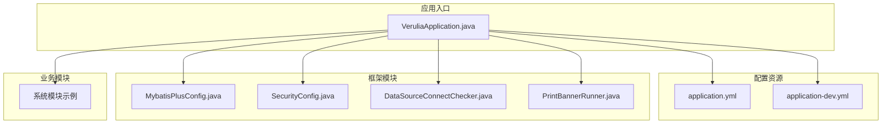
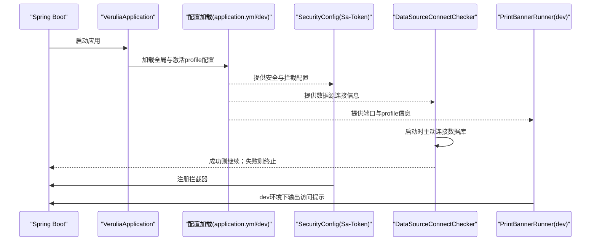
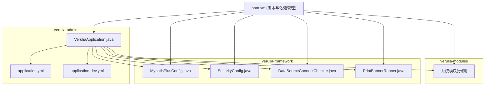

# 部署配置说明

<cite>
**本文引用的文件**
- [application.yml](file://verulia-admin/src/main/resources/application.yml)
- [application-dev.yml](file://verulia-admin/src/main/resources/application-dev.yml)
- [VeruliaApplication.java](file://verulia-admin/src/main/java/org/yann/verulia/VeruliaApplication.java)
- [MybatisPlusConfig.java](file://verulia-framework/verulia-framework-mybatis/src/main/java/org/yann/verulia/framework/mybatis/config/MybatisPlusConfig.java)
- [SecurityConfig.java](file://verulia-framework/verulia-framework-security/src/main/java/org/yann/verulia/framework/security/config/SecurityConfig.java)
- [DataSourceConnectChecker.java](file://verulia-framework/verulia-framework-mybatis/src/main/java/org/yann/verulia/framework/mybatis/cmd/DataSourceConnectChecker.java)
- [PrintBannerRunner.java](file://verulia-framework/verulia-framework-web/src/main/java/org/yann/verulia/framework/web/runner/PrintBannerRunner.java)
- [_init.sql](file://_script/_init.sql)
- [pom.xml](file://pom.xml)
</cite>

## 目录
1. [简介](#简介)
2. [项目结构](#项目结构)
3. [核心组件](#核心组件)
4. [架构总览](#架构总览)
5. [详细组件分析](#详细组件分析)
6. [依赖关系分析](#依赖关系分析)
7. [性能与配置建议](#性能与配置建议)
8. [故障排查指南](#故障排查指南)
9. [结论](#结论)
10. [附录](#附录)

## 简介
本指南面向运维与开发团队，提供Verulia应用在不同环境下的部署与配置说明，涵盖：
- application.yml与application-dev.yml的结构与关键参数解析（服务器端口、数据库连接、Redis、MyBatis-Plus、Sa-Token、日志级别等）
- Spring Profile多环境配置切换（开发、测试、生产）的实践方式
- Docker与Kubernetes部署建议
- 外部依赖（MySQL、Redis）及版本要求
- 配置验证步骤与常见问题排查（数据库连接失败、端口冲突等）

## 项目结构
Verulia采用多模块Maven工程组织，核心模块包括：
- verulia-admin：应用入口与配置资源
- verulia-framework：通用框架模块（安全、Web、MyBatis-Plus、认证等）
- verulia-modules：业务模块（如系统管理）

下图展示与部署配置直接相关的文件与模块关系：

图表来源
- [VeruliaApplication.java](file://verulia-admin/src/main/java/org/yann/verulia/VeruliaApplication.java#L1-L19)
- [application.yml](file://verulia-admin/src/main/resources/application.yml#L1-L94)
- [application-dev.yml](file://verulia-admin/src/main/resources/application-dev.yml#L1-L23)
- [MybatisPlusConfig.java](file://verulia-framework/verulia-framework-mybatis/src/main/java/org/yann/verulia/framework/mybatis/config/MybatisPlusConfig.java#L1-L31)
- [SecurityConfig.java](file://verulia-framework/verulia-framework-security/src/main/java/org/yann/verulia/framework/security/config/SecurityConfig.java#L1-L36)
- [DataSourceConnectChecker.java](file://verulia-framework/verulia-framework-mybatis/src/main/java/org/yann/verulia/framework/mybatis/cmd/DataSourceConnectChecker.java#L1-L44)
- [PrintBannerRunner.java](file://verulia-framework/verulia-framework-web/src/main/java/org/yann/verulia/framework/web/runner/PrintBannerRunner.java#L1-L78)

章节来源
- [VeruliaApplication.java](file://verulia-admin/src/main/java/org/yann/verulia/VeruliaApplication.java#L1-L19)
- [pom.xml](file://pom.xml#L1-L124)

## 核心组件
- 应用入口与启动
  - 启动类负责加载Spring Boot上下文，应用配置由resources目录下的application.yml与application-dev.yml提供。
- 配置中心
  - application.yml：全局默认配置（端口、虚拟线程、Redis、Sa-Token、MyBatis-Plus、微信小程序等）
  - application-dev.yml：开发环境数据库连接池参数（驱动、URL、用户名、密码、HikariCP）
- 安全与拦截
  - SecurityConfig：注册Sa-Token拦截器，统一鉴权
  - Sa-Token：令牌名称、前缀、有效期、并发登录策略、日志开关等
- ORM与数据源
  - MybatisPlusConfig：分页插件、元对象处理器
  - DataSourceConnectChecker：启动阶段主动校验数据库连接，失败则终止启动
- Web与日志
  - PrintBannerRunner：仅在dev profile输出本地与外网访问提示

章节来源
- [application.yml](file://verulia-admin/src/main/resources/application.yml#L1-L94)
- [application-dev.yml](file://verulia-admin/src/main/resources/application-dev.yml#L1-L23)
- [SecurityConfig.java](file://verulia-framework/verulia-framework-security/src/main/java/org/yann/verulia/framework/security/config/SecurityConfig.java#L1-L36)
- [MybatisPlusConfig.java](file://verulia-framework/verulia-framework-mybatis/src/main/java/org/yann/verulia/framework/mybatis/config/MybatisPlusConfig.java#L1-L31)
- [DataSourceConnectChecker.java](file://verulia-framework/verulia-framework-mybatis/src/main/java/org/yann/verulia/framework/mybatis/cmd/DataSourceConnectChecker.java#L1-L44)
- [PrintBannerRunner.java](file://verulia-framework/verulia-framework-web/src/main/java/org/yann/verulia/framework/web/runner/PrintBannerRunner.java#L1-L78)

## 架构总览
下图展示应用启动到可用的关键流程，以及配置对各组件的影响：

图表来源
- [VeruliaApplication.java](file://verulia-admin/src/main/java/org/yann/verulia/VeruliaApplication.java#L1-L19)
- [application.yml](file://verulia-admin/src/main/resources/application.yml#L1-L94)
- [application-dev.yml](file://verulia-admin/src/main/resources/application-dev.yml#L1-L23)
- [SecurityConfig.java](file://verulia-framework/verulia-framework-security/src/main/java/org/yann/verulia/framework/security/config/SecurityConfig.java#L1-L36)
- [DataSourceConnectChecker.java](file://verulia-framework/verulia-framework-mybatis/src/main/java/org/yann/verulia/framework/mybatis/cmd/DataSourceConnectChecker.java#L1-L44)
- [PrintBannerRunner.java](file://verulia-framework/verulia-framework-web/src/main/java/org/yann/verulia/framework/web/runner/PrintBannerRunner.java#L1-L78)

## 详细组件分析

### 配置文件结构与关键参数
- 服务器与Tomcat参数
  - 端口、最大连接数、队列长度、连接超时、Keep-Alive超时、每连接最大请求等
- Spring应用与Profile
  - 应用名称、当前激活的profile（默认dev）
  - 虚拟线程启用
- Redis配置
  - 数据库索引、主机、端口、密码、连接超时、连接池参数（最大活跃、最大空闲、最小空闲、最大等待）
- Sa-Token配置
  - 令牌名称、前缀、有效期、最低活跃时间、并发登录策略、是否共享、令牌风格、日志开关、版本字符画
- MyBatis-Plus配置
  - Mapper XML位置、实体包名、驼峰映射、开发环境SQL日志实现、逻辑删除字段与值
- 微信小程序配置
  - 小程序appid、secret、消息数据格式

章节来源
- [application.yml](file://verulia-admin/src/main/resources/application.yml#L1-L94)

### 开发环境专用配置（application-dev.yml）
- 数据库驱动类名、URL、用户名、密码
- HikariCP连接池参数：池名称、最小空闲、最大连接、最大生命周期、连接超时、空闲超时

章节来源
- [application-dev.yml](file://verulia-admin/src/main/resources/application-dev.yml#L1-L23)

### Spring Profile多环境配置
- 全局激活profile在application.yml中定义
- 不同环境通过application-{profile}.yml进行覆盖
- 开发环境示例：application-dev.yml
- 生产环境建议新增application-prod.yml，按需覆盖数据库、Redis、日志级别、安全策略等

章节来源
- [application.yml](file://verulia-admin/src/main/resources/application.yml#L1-L94)
- [application-dev.yml](file://verulia-admin/src/main/resources/application-dev.yml#L1-L23)

### 安全与拦截（Sa-Token）
- 注册全局拦截器，统一校验登录状态
- 安全上下文实现由框架提供

章节来源
- [SecurityConfig.java](file://verulia-framework/verulia-framework-security/src/main/java/org/yann/verulia/framework/security/config/SecurityConfig.java#L1-L36)

### ORM与数据源校验（MyBatis-Plus）
- 分页插件与元对象处理器注册
- 启动阶段主动连接数据库，失败即终止，避免“带病启动”

章节来源
- [MybatisPlusConfig.java](file://verulia-framework/verulia-framework-mybatis/src/main/java/org/yann/verulia/framework/mybatis/config/MybatisPlusConfig.java#L1-L31)
- [DataSourceConnectChecker.java](file://verulia-framework/verulia-framework-mybatis/src/main/java/org/yann/verulia/framework/mybatis/cmd/DataSourceConnectChecker.java#L1-L44)

### Web与日志（开发提示）
- dev profile下输出本地与外网访问URL、激活的profile列表
- 便于快速定位服务访问地址

章节来源
- [PrintBannerRunner.java](file://verulia-framework/verulia-framework-web/src/main/java/org/yann/verulia/framework/web/runner/PrintBannerRunner.java#L1-L78)

## 依赖关系分析
- 外部依赖
  - MySQL：用于持久化存储
  - Redis：用于会话与缓存
- 内部模块
  - verulia-admin：应用入口与配置
  - verulia-framework：安全、Web、MyBatis-Plus、认证等基础能力
  - verulia-modules：业务模块（如系统管理）

图表来源
- [pom.xml](file://pom.xml#L1-L124)
- [VeruliaApplication.java](file://verulia-admin/src/main/java/org/yann/verulia/VeruliaApplication.java#L1-L19)
- [application.yml](file://verulia-admin/src/main/resources/application.yml#L1-L94)
- [application-dev.yml](file://verulia-admin/src/main/resources/application-dev.yml#L1-L23)
- [MybatisPlusConfig.java](file://verulia-framework/verulia-framework-mybatis/src/main/java/org/yann/verulia/framework/mybatis/config/MybatisPlusConfig.java#L1-L31)
- [SecurityConfig.java](file://verulia-framework/verulia-framework-security/src/main/java/org/yann/verulia/framework/security/config/SecurityConfig.java#L1-L36)
- [DataSourceConnectChecker.java](file://verulia-framework/verulia-framework-mybatis/src/main/java/org/yann/verulia/framework/mybatis/cmd/DataSourceConnectChecker.java#L1-L44)
- [PrintBannerRunner.java](file://verulia-framework/verulia-framework-web/src/main/java/org/yann/verulia/framework/web/runner/PrintBannerRunner.java#L1-L78)

## 性能与配置建议
- 端口与Tomcat
  - 根据并发量调整最大连接数与队列长度，避免连接积压
  - 合理设置Keep-Alive超时与每连接最大请求数，平衡资源占用与延迟
- Redis
  - 连接池大小与等待时间应结合CPU与网络带宽评估
  - 密码与超时需与网络环境匹配，避免频繁重连
- 数据库连接池
  - HikariCP的最大连接数与生命周期应与数据库最大连接数一致
  - 连接超时与空闲超时避免线程长时间阻塞
- MyBatis-Plus
  - 开发环境开启SQL日志有助于调试，生产环境建议关闭
  - 逻辑删除字段与值需与业务约定一致
- Sa-Token
  - 令牌有效期与并发策略需结合业务场景权衡
  - 日志开关按环境选择，生产环境建议关闭

章节来源
- [application.yml](file://verulia-admin/src/main/resources/application.yml#L1-L94)
- [application-dev.yml](file://verulia-admin/src/main/resources/application-dev.yml#L1-L23)

## 故障排查指南
- 数据库连接失败
  - 现象：启动阶段日志出现数据库连接失败并终止
  - 排查要点：
    - 检查application-dev.yml中的驱动类名、URL、用户名、密码
    - 检查MySQL服务状态与网络连通性
    - 检查HikariCP连接池参数（最大连接、连接超时、空闲超时）
    - 查看DataSourceConnectChecker的异常日志
- 端口冲突
  - 现象：应用无法启动或绑定失败
  - 排查要点：
    - 检查application.yml中的server.port
    - 使用系统工具确认端口占用情况
    - 更换端口或释放占用进程
- Redis连接失败
  - 现象：Redis连接超时或认证失败
  - 排查要点：
    - 检查application.yml中的Redis主机、端口、密码、超时
    - 确认Redis服务可达与防火墙放行
- 启动后无访问提示
  - 现象：未看到本地与外网访问URL
  - 排查要点：
    - 确认当前激活profile为dev
    - 检查PrintBannerRunner的日志输出

章节来源
- [DataSourceConnectChecker.java](file://verulia-framework/verulia-framework-mybatis/src/main/java/org/yann/verulia/framework/mybatis/cmd/DataSourceConnectChecker.java#L1-L44)
- [application.yml](file://verulia-admin/src/main/resources/application.yml#L1-L94)
- [application-dev.yml](file://verulia-admin/src/main/resources/application-dev.yml#L1-L23)
- [PrintBannerRunner.java](file://verulia-framework/verulia-framework-web/src/main/java/org/yann/verulia/framework/web/runner/PrintBannerRunner.java#L1-L78)

## 结论
- Verulia通过application.yml与application-{profile}.yml实现了清晰的多环境配置分离
- 安全、ORM、数据源校验与Web提示等关键组件均以配置为中心，便于在不同环境快速切换
- 建议在生产环境进一步完善配置（如关闭开发日志、强化安全策略、优化连接池参数）

## 附录

### 外部依赖与版本要求
- MySQL：用于持久化存储
- Redis：用于会话与缓存
- 版本与依赖管理由根pom.xml集中维护，Spring Boot版本、MyBatis-Plus版本、Sa-Token版本等均在此声明

章节来源
- [pom.xml](file://pom.xml#L1-L124)

### 初始化数据库脚本
- 提供初始化表结构（用户、角色、用户角色、社交认证等），可用于首次部署或环境初始化

章节来源
- [_init.sql](file://_script/_init.sql#L1-L54)

### 部署与配置验证步骤
- 验证步骤
  - 启动应用，观察启动日志中数据库连接检查结果
  - 访问服务，确认端口与profile信息输出（dev）
  - 登录接口验证Sa-Token拦截生效
- 常见问题
  - 数据库连接失败：检查application-dev.yml与MySQL服务
  - 端口冲突：修改application.yml中的server.port
  - Redis不可达：检查application.yml中的Redis配置与网络连通性

章节来源
- [application.yml](file://verulia-admin/src/main/resources/application.yml#L1-L94)
- [application-dev.yml](file://verulia-admin/src/main/resources/application-dev.yml#L1-L23)
- [DataSourceConnectChecker.java](file://verulia-framework/verulia-framework-mybatis/src/main/java/org/yann/verulia/framework/mybatis/cmd/DataSourceConnectChecker.java#L1-L44)
- [PrintBannerRunner.java](file://verulia-framework/verulia-framework-web/src/main/java/org/yann/verulia/framework/web/runner/PrintBannerRunner.java#L1-L78)