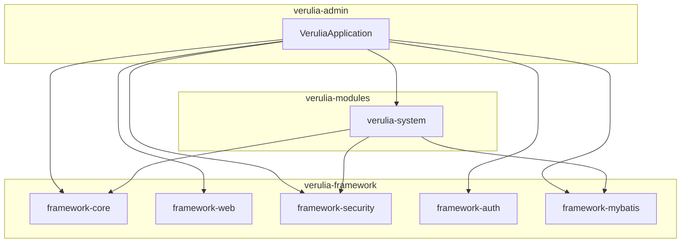
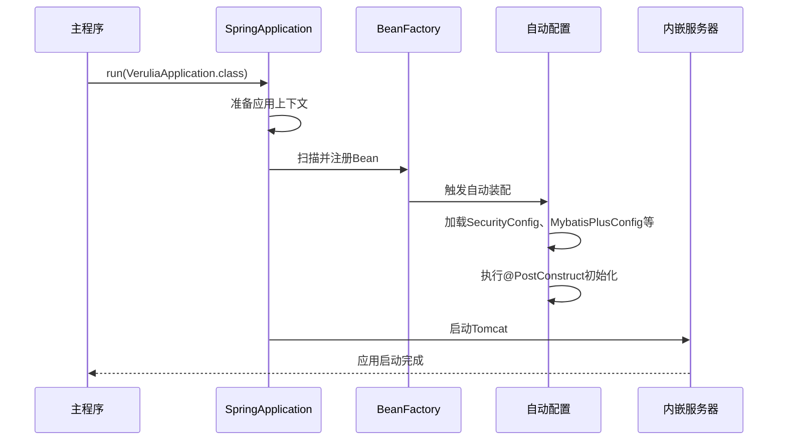
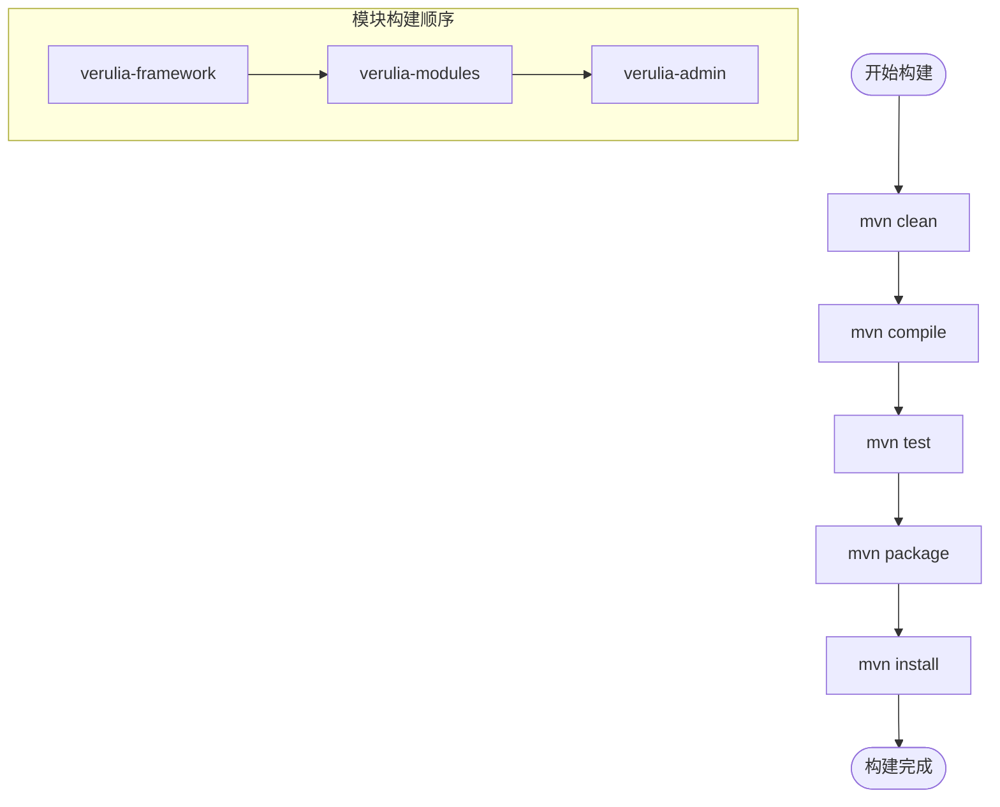
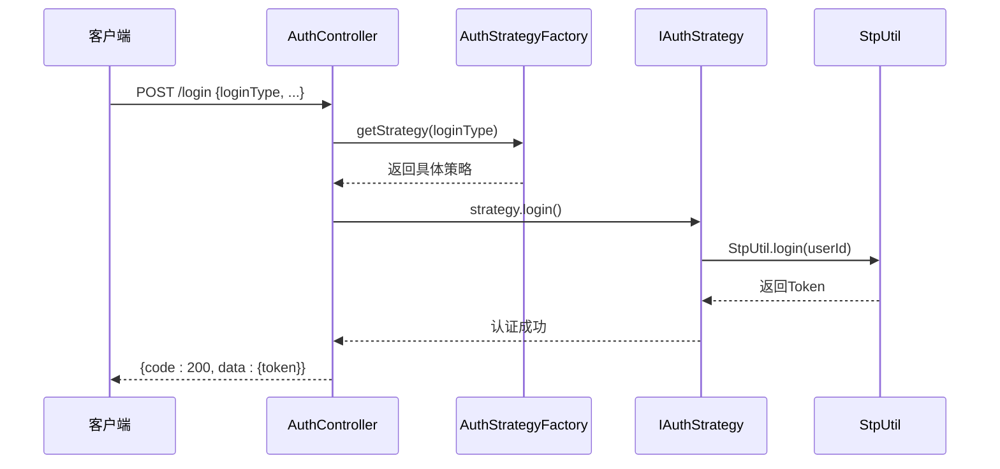
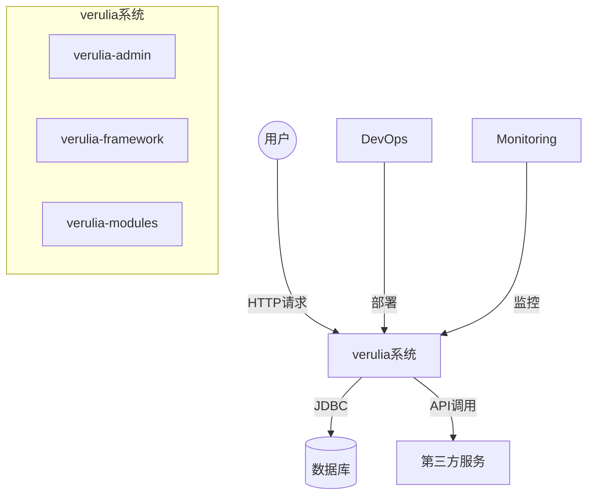
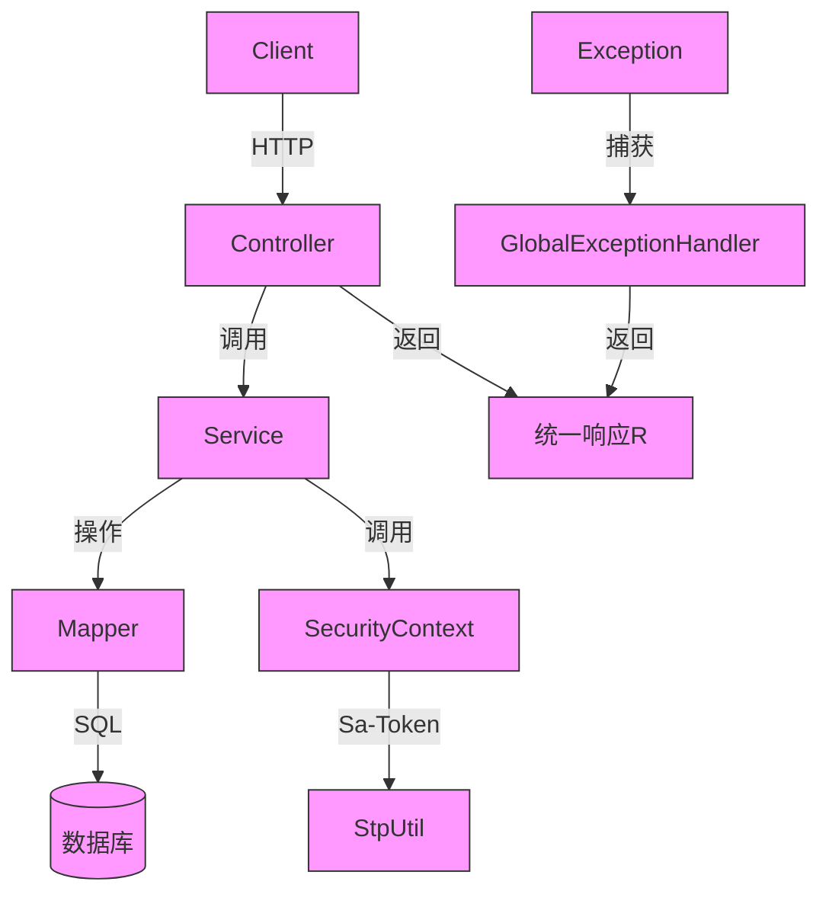

# 项目概述

<cite>
**本文档引用的文件**  
- [pom.xml](file://pom.xml)
- [VeruliaApplication.java](file://verulia-admin/src/main/java/org/yann/verulia/VeruliaApplication.java)
- [SecurityConfig.java](file://verulia-framework/verulia-framework-security/src/main/java/org/yann/verulia/framework/security/config/SecurityConfig.java)
- [GlobalExceptionHandler.java](file://verulia-framework/verulia-framework-web/src/main/java/org/yann/verulia/framework/web/handler/GlobalExceptionHandler.java)
- [R.java](file://verulia-framework/verulia-framework-core/src/main/java/org/yann/verulia/framework/core/domain/R.java)
- [SysUserController.java](file://verulia-modules/verulia-system/src/main/java/org/yann/verulia/system/controller/SysUserController.java)
- [SysUserServiceImpl.java](file://verulia-modules/verulia-system/src/main/java/org/yann/verulia/system/service/impl/SysUserServiceImpl.java)
- [AuthStrategyFactory.java](file://verulia-framework/verulia-framework-auth/src/main/java/org/yann/verulia/framework/auth/strategy/AuthStrategyFactory.java)
</cite>

## 目录
1. [项目简介](#项目简介)
2. [项目结构与模块化设计](#项目结构与模块化设计)
3. [核心功能目标](#核心功能目标)
4. [项目启动流程与自动装配机制](#项目启动流程与自动装配机制)
5. [Maven多模块依赖与构建流程](#maven多模块依赖与构建流程)
6. [统一认证授权架构设计](#统一认证授权架构设计)
7. [系统上下文图](#系统上下文图)
8. [组件交互示意图](#组件交互示意图)
9. [为何选择Sa-Token而非Spring Security](#为何选择sa-token而非spring-security)
10. [总结](#总结)

## 项目简介

verulia 是一个基于 Spring Boot 构建的企业级后台管理系统开发脚手架，旨在为开发者提供一套标准化、可扩展、易于维护的后端架构解决方案。项目采用 Maven 多模块结构，清晰划分了基础框架层、业务模块层和主应用层，支持快速集成企业级通用能力，如统一认证授权、用户角色权限管理、系统基础服务等。通过模块化设计和松耦合架构，verulia 既适合初学者理解企业级系统结构，也为高级开发者提供了灵活的扩展机制。

**Section sources**
- [pom.xml](file://pom.xml#L1-L124)
- [VeruliaApplication.java](file://verulia-admin/src/main/java/org/yann/verulia/VeruliaApplication.java#L1-L19)

## 项目结构与模块化设计

verulia 项目采用典型的三层模块化架构，分别为：

- **framework 基础框架层**：位于 `verulia-framework` 模块，提供通用工具类、安全控制、Web 基础配置、MyBatis Plus 集成等跨业务的公共能力。
- **modules 业务模块层**：位于 `verulia-modules` 模块，包含具体的业务功能实现，如用户管理、角色权限等。
- **admin 主应用层**：位于 `verulia-admin` 模块，作为 Spring Boot 应用的入口，负责整合所有模块并启动服务。

各模块通过 Maven 的父子 POM 关系进行依赖管理，确保版本统一和依赖隔离。

**Diagram sources**
- [pom.xml](file://pom.xml#L16-L20)
- [verulia-framework/pom.xml](file://verulia-framework/pom.xml#L19-L26)
- [verulia-modules/pom.xml](file://verulia-modules/pom.xml#L19-L21)

**Section sources**
- [pom.xml](file://pom.xml#L1-L124)
- [verulia-framework/pom.xml](file://verulia-framework/pom.xml#L1-L27)
- [verulia-modules/pom.xml](file://verulia-modules/pom.xml#L1-L22)

## 核心功能目标

verulia 的核心目标是为企业级后台系统提供以下关键能力：

- **统一认证授权**：支持多种登录方式（如账号密码、小程序等），通过策略模式灵活扩展认证方式。
- **用户角色权限管理**：实现用户、角色、权限的增删改查及关联管理，支持基于角色的访问控制（RBAC）。
- **系统基础服务**：提供统一响应结构、全局异常处理、日志记录、分页查询等通用功能，提升开发效率。
- **高可扩展性**：通过模块化设计，新业务模块可独立开发并无缝集成。

这些功能通过 `verulia-framework` 提供的通用组件和 `verulia-modules` 中的具体业务实现协同工作。

**Section sources**
- [R.java](file://verulia-framework/verulia-framework-core/src/main/java/org/yann/verulia/framework/core/domain/R.java#L1-L101)
- [GlobalExceptionHandler.java](file://verulia-framework/verulia-framework-web/src/main/java/org/yann/verulia/framework/web/handler/GlobalExceptionHandler.java#L1-L68)
- [SysUserController.java](file://verulia-modules/verulia-system/src/main/java/org/yann/verulia/system/controller/SysUserController.java#L1-L65)

## 项目启动流程与自动装配机制

verulia 的启动入口为 `VeruliaApplication.java`，其核心注解为 `@SpringBootApplication`。该注解组合了 `@Configuration`、`@EnableAutoConfiguration` 和 `@ComponentScan`，实现了自动配置和组件扫描。

启动流程如下：
1. `SpringApplication.run(VeruliaApplication.class, args)` 启动 Spring Boot 应用。
2. 自动扫描 `org.yann.verulia` 包下的所有组件（Controller、Service、Component 等）。
3. 加载 `verulia-framework` 中的自动配置类，如 `SecurityConfig`、`MybatisPlusConfig` 等。
4. 执行 `@PostConstruct` 初始化方法，如 `AuthStrategyFactory` 的策略注册。
5. 启动内嵌 Web 服务器，监听指定端口。

**Diagram sources**
- [VeruliaApplication.java](file://verulia-admin/src/main/java/org/yann/verulia/VeruliaApplication.java#L12-L18)
- [SecurityConfig.java](file://verulia-framework/verulia-framework-security/src/main/java/org/yann/verulia/framework/security/config/SecurityConfig.java#L21-L35)
- [AuthStrategyFactory.java](file://verulia-framework/verulia-framework-auth/src/main/java/org/yann/verulia/framework/auth/strategy/AuthStrategyFactory.java#L30-L35)

**Section sources**
- [VeruliaApplication.java](file://verulia-admin/src/main/java/org/yann/verulia/VeruliaApplication.java#L1-L19)
- [SecurityConfig.java](file://verulia-framework/verulia-framework-security/src/main/java/org/yann/verulia/framework/security/config/SecurityConfig.java#L1-L36)

## Maven多模块依赖与构建流程

verulia 采用 Maven 多模块项目结构，根 `pom.xml` 文件通过 `<modules>` 定义了三个子模块：`verulia-admin`、`verulia-framework` 和 `verulia-modules`。每个子模块可独立编译、测试和打包。

依赖管理通过 `<dependencyManagement>` 实现，统一管理 Spring Boot、Sa-Token、MyBatis Plus 等关键依赖的版本，避免版本冲突。

构建流程：
1. `mvn clean install` 从根目录执行。
2. Maven 按照模块依赖顺序依次构建：先构建 `verulia-framework`，再构建 `verulia-modules`，最后构建 `verulia-admin`。
3. `verulia-admin` 作为最终可执行的 JAR 包，包含所有依赖。

**Diagram sources**
- [pom.xml](file://pom.xml#L28-L87)
- [verulia-framework/pom.xml](file://verulia-framework/pom.xml#L1-L27)

**Section sources**
- [pom.xml](file://pom.xml#L1-L124)

## 统一认证授权架构设计

verulia 的认证授权体系基于 Sa-Token 实现，核心组件包括：

- `AuthStrategyFactory`：认证策略工厂，通过 `@PostConstruct` 初始化所有 `IAuthStrategy` 实现类（如 `PasswordAuthStrategy`、`MiniappAuthStrategy`），并按 `loginType` 注册到 `strategyMap`。
- `SecurityConfig`：配置 Sa-Token 拦截器，对所有请求路径 `/**` 进行登录校验（`StpUtil.checkLogin()`），实现全局权限控制。
- `GlobalExceptionHandler`：统一处理认证异常（如 `NotLoginException`），返回标准化的错误响应。

认证流程：
1. 客户端提交 `LoginBody`（含 `loginType` 和凭证）。
2. `AuthController` 调用 `AuthStrategyFactory.getStrategy(loginType)` 获取对应策略。
3. 执行策略的 `login` 方法完成认证。
4. 认证成功后，Sa-Token 生成 Token 并返回。

**Diagram sources**
- [AuthStrategyFactory.java](file://verulia-framework/verulia-framework-auth/src/main/java/org/yann/verulia/framework/auth/strategy/AuthStrategyFactory.java#L22-L51)
- [SecurityConfig.java](file://verulia-framework/verulia-framework-security/src/main/java/org/yann/verulia/framework/security/config/SecurityConfig.java#L24-L27)
- [SysUserServiceImpl.java](file://verulia-modules/verulia-system/src/main/java/org/yann/verulia/system/service/impl/SysUserServiceImpl.java#L78-L96)

**Section sources**
- [AuthStrategyFactory.java](file://verulia-framework/verulia-framework-auth/src/main/java/org/yann/verulia/framework/auth/strategy/AuthStrategyFactory.java#L1-L51)
- [SecurityConfig.java](file://verulia-framework/verulia-framework-security/src/main/java/org/yann/verulia/framework/security/config/SecurityConfig.java#L1-L36)

## 系统上下文图

系统上下文图展示了 verulia 作为一个整体与外部用户、数据库及其他系统的交互关系。

**Diagram sources**
- [pom.xml](file://pom.xml#L16-L20)
- [VeruliaApplication.java](file://verulia-admin/src/main/java/org/yann/verulia/VeruliaApplication.java#L12-L18)

## 组件交互示意图

组件交互图展示了系统内部主要组件的数据流动和调用关系。

**Diagram sources**
- [SysUserController.java](file://verulia-modules/verulia-system/src/main/java/org/yann/verulia/system/controller/SysUserController.java#L1-L65)
- [SysUserServiceImpl.java](file://verulia-modules/verulia-system/src/main/java/org/yann/verulia/system/service/impl/SysUserServiceImpl.java#L33-L147)
- [GlobalExceptionHandler.java](file://verulia-framework/verulia-framework-web/src/main/java/org/yann/verulia/framework/web/handler/GlobalExceptionHandler.java#L23-L68)
- [R.java](file://verulia-framework/verulia-framework-core/src/main/java/org/yann/verulia/framework/core/domain/R.java#L1-L101)

## 为何选择Sa-Token而非Spring Security

verulia 选择 Sa-Token 而非 Spring Security 原生方案，主要基于以下架构考量：

1. **轻量级与易用性**：Sa-Token API 简洁直观，学习成本低，配置简单，适合快速开发。
2. **功能全面**：支持登录认证、权限验证、Session 会话、单点登录、OAuth2.0、微服务鉴权等，覆盖企业级需求。
3. **无侵入性**：无需实现 Spring Security 的 UserDetails、UserDetailsService 等复杂接口，代码更简洁。
4. **灵活性**：支持自定义 Token 前缀、过期时间、Token 风格等，易于与前端框架（如 Vue、React）集成。
5. **性能优越**：基于内存存储（可扩展 Redis），读写性能高，适合高并发场景。
6. **中文文档完善**：官方提供详尽的中文文档和示例，降低开发和维护成本。

相比之下，Spring Security 虽然功能强大，但配置复杂、学习曲线陡峭，且在非 Spring Cloud 场景下集成成本较高。Sa-Token 更符合 verulia 作为“开发脚手架”的定位，即快速上手、开箱即用。

**Section sources**
- [SecurityConfig.java](file://verulia-framework/verulia-framework-security/src/main/java/org/yann/verulia/framework/security/config/SecurityConfig.java#L1-L36)
- [pom.xml](file://pom.xml#L82-L87)

## 总结

verulia 项目通过清晰的模块化分层设计、基于 Sa-Token 的灵活认证授权机制、统一的响应与异常处理，构建了一个现代化的企业级 Spring Boot 后台管理系统骨架。其 Maven 多模块结构保证了代码的可维护性和可扩展性，而自动装配和策略模式的运用则体现了良好的设计思想。无论是初学者还是高级开发者，都能从 verulia 中获得有价值的架构参考和开发实践指导。